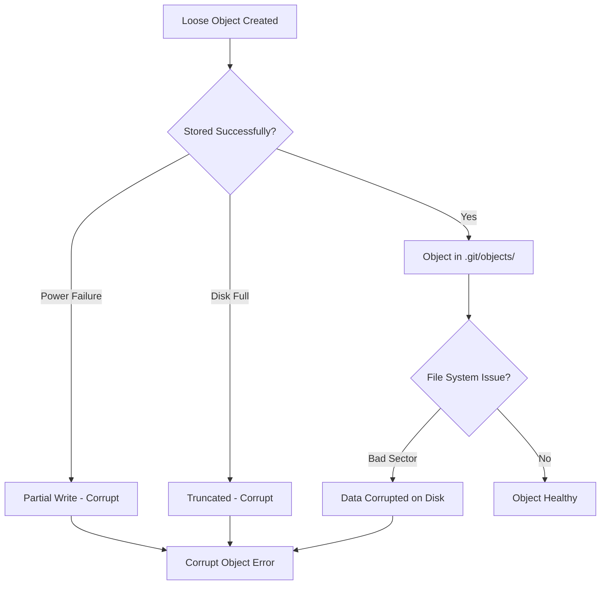
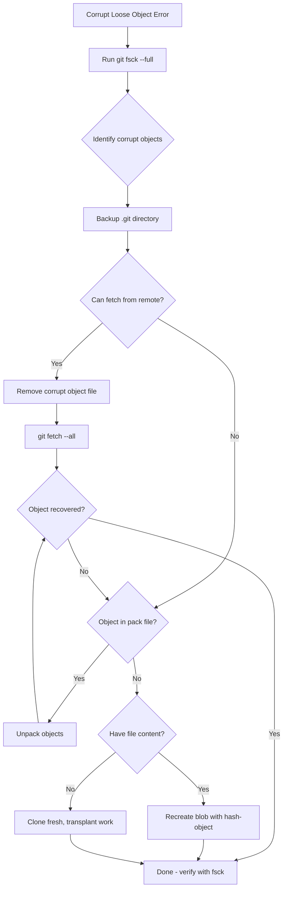

# How to Fix "Loose Object Is Corrupt" Errors

Author: [nawazdhandala](https://www.github.com/nawazdhandala)

Tags: Git, Troubleshooting, Repository Repair, Corruption, DevOps, Version Control

Description: Learn how to diagnose and repair Git repositories with corrupt loose objects caused by disk errors, interrupted operations, or system crashes.

---

A "loose object is corrupt" error means Git's internal database contains damaged files. This typically happens due to disk failures, power outages during write operations, or filesystem issues. Unlike missing objects, corrupt objects exist but contain invalid data, making recovery more challenging.

---

## Understanding the Error

When Git encounters a corrupt loose object, you'll see errors like these:

```bash
# Typical corrupt object errors
error: object file .git/objects/ab/cdef1234567890... is corrupted
fatal: loose object abcdef1234567890... (stored in .git/objects/ab/cdef1234567890...) is corrupt

# During operations
error: inflate: data stream error (incorrect data check)
fatal: packed object abc123 (stored in .git/objects/pack/pack-xxx.pack) is corrupt

# When trying to read corrupted object
error: unable to unpack abc123def456... header
fatal: loose object abc123def456... is corrupt
```

---

## How Loose Objects Become Corrupt

Understanding causes helps prevent future corruption:



Common causes:
- System crash or power loss during git operations
- Disk hardware failures or bad sectors
- Full disk causing truncated writes
- Filesystem corruption
- Antivirus software modifying Git files
- Network storage issues (NFS, CIFS)

---

## Step 1: Identify Corrupt Objects

First, find exactly what's corrupted:

```bash
# Run full filesystem check
git fsck --full 2>&1 | tee fsck-output.txt

# Look for corruption messages
grep -E "(corrupt|bad|missing|broken)" fsck-output.txt

# Sample output:
# error: inflate: data stream error (incorrect data check)
# error: corrupt loose object 'abc123def456789012345678901234567890abcd'
# error: unable to read sha1 file of path/to/file

# Get detailed information about specific corrupt object
git cat-file -t abc123def456  # Fails if corrupt
# fatal: git cat-file: could not get object info
```

List all corrupt objects for systematic repair:

```bash
# Find all corrupt loose objects
find .git/objects -type f | while read obj; do
    # Extract hash from path
    hash=$(echo "$obj" | sed 's|.git/objects/||' | tr -d '/')
    if ! git cat-file -t "$hash" >/dev/null 2>&1; then
        echo "Corrupt: $hash ($obj)"
    fi
done
```

---

## Step 2: Backup Before Repair

Always backup before attempting repairs:

```bash
# Create a complete backup of the .git directory
cp -r .git .git-backup-$(date +%Y%m%d-%H%M%S)

# Also backup any uncommitted work
git stash list > stash-backup.txt
git diff > uncommitted-changes.patch 2>/dev/null || true
git diff --staged > staged-changes.patch 2>/dev/null || true

# List all local branches
git branch -a > branches-backup.txt
```

---

## Step 3: Try Simple Repairs First

Some corruption can be fixed with basic commands:

```bash
# Remove corrupt object and let Git refetch if possible
# First, identify the object file path
CORRUPT_HASH="abc123def456789012345678901234567890abcd"
OBJECT_PATH=".git/objects/${CORRUPT_HASH:0:2}/${CORRUPT_HASH:2}"

# Remove the corrupt file
rm "$OBJECT_PATH"

# Try to recover from remote
git fetch --all

# Check if the object is recovered
git cat-file -t "$CORRUPT_HASH"
```

If the object is a blob (file content), Git might regenerate it:

```bash
# Re-add files to regenerate blobs
git checkout HEAD -- .

# For specific files
git checkout HEAD -- path/to/file.txt
```

---

## Step 4: Recover from Pack Files

Sometimes the object exists in a pack file and can be extracted:

```bash
# List all pack files
ls -la .git/objects/pack/

# Search for the object in pack files
git verify-pack -v .git/objects/pack/pack-*.idx | grep "$CORRUPT_HASH"

# If found in a pack, unpack all objects
cd .git/objects/pack
for pack in *.pack; do
    git unpack-objects < "$pack"
done

# Move corrupted loose object aside
mkdir -p ../corrupt-backup
mv "$OBJECT_PATH" ../corrupt-backup/

# Git will now use the unpacked version
```

---

## Step 5: Recover from Remote Repository

If you have a remote with the same history:

```bash
# Fetch all objects from remote
git fetch origin --refetch

# Fetch specific refs that might have the object
git fetch origin refs/heads/*:refs/remotes/origin/*
git fetch origin refs/tags/*:refs/tags/*

# Try fetching with full history
git fetch --unshallow origin  # If shallow clone

# Clone the repository to a separate location
git clone --mirror git@github.com:user/repo.git /tmp/repo-mirror

# Copy missing objects from mirror
cp /tmp/repo-mirror/objects/pack/* .git/objects/pack/
```

---

## Step 6: Rebuild from Known Good State

When objects can't be recovered, rebuild from a working point:

```bash
# Find the last good commit
git reflog
# abc1234 HEAD@{0}: commit: Latest (might be corrupt)
# def5678 HEAD@{1}: commit: Previous (try this)
# ghi9012 HEAD@{2}: commit: Earlier (likely good)

# Try checking out earlier commits
git checkout ghi9012

# If that works, create a recovery branch
git checkout -b recovery ghi9012

# Cherry-pick good commits, skipping corrupt ones
git cherry-pick def5678  # Test each commit
```

---

## Step 7: Clone and Transplant

For severe corruption, clone fresh and transplant local work:

```bash
# Save local-only branches
git branch --list | grep -v "^*" > local-branches.txt

# Clone fresh
cd ..
git clone git@github.com:user/repo.git repo-fresh

# Copy local branches from corrupted repo
cd repo-fresh
git remote add corrupted ../repo-corrupted

# Try to fetch local branches (might fail on corrupt ones)
git fetch corrupted 2>&1 | tee fetch-errors.txt

# For branches that fail, manually recreate
git checkout -b feature-branch
cp -r ../repo-corrupted/src/* src/  # Copy working files
git add -A
git commit -m "Recovered from corrupted repository"
```

---

## Step 8: Repair Specific Object Types

Different object types require different approaches:

### Corrupt Blob (File Content)

```bash
# If you have the original file content
echo "file content here" | git hash-object -w --stdin
# This creates a new blob with same hash if content matches

# Or recreate from working directory
git add path/to/file.txt
# Git will create a new blob for the file

# Verify the blob exists now
git cat-file -p abc123def456
```

### Corrupt Tree (Directory Structure)

```bash
# Trees are harder to repair manually
# Best approach: recreate from a known good commit

# Find a good commit that has the tree
git log --oneline --all | head -20

# Check out that commit's tree
git read-tree <good-commit>

# Create a new tree object
git write-tree
# Returns: new tree hash

# Update references to use new tree
git commit-tree <new-tree-hash> -p <parent-commit> -m "Repaired tree"
```

### Corrupt Commit

```bash
# Create a new commit with same content
# Find parent commit
git rev-parse abc123^

# Get tree from commit (if tree is intact)
git rev-parse abc123^{tree}

# Create new commit
git commit-tree <tree-hash> -p <parent-hash> -m "Commit message"

# Update branch to point to new commit
git update-ref refs/heads/branch-name <new-commit-hash>
```

---

## Preventing Future Corruption

Configure Git and your system to minimize corruption risk:

```bash
# Enable filesystem checks during operations
git config --global transfer.fsckObjects true
git config --global fetch.fsckObjects true
git config --global receive.fsckObjects true

# Use more robust compression
git config --global core.compression 9

# Disable auto gc during critical operations
# (run gc manually instead)
git config --global gc.auto 0
```

Add filesystem protection:

```bash
# Sync writes immediately (slower but safer)
git config --global core.fsyncObjectFiles true

# For important repos, add a pre-commit hook
cat > .git/hooks/pre-commit << 'EOF'
#!/bin/bash
# Verify repository integrity before committing
if ! git fsck --connectivity-only --quiet; then
    echo "Repository integrity check failed!"
    exit 1
fi
EOF
chmod +x .git/hooks/pre-commit
```

---

## Automated Repair Script

```bash
#!/bin/bash
# repair-git.sh - Attempt automatic repair of corrupt repository

echo "Git Repository Repair Script"
echo "============================="

# Backup first
BACKUP_DIR=".git-backup-$(date +%Y%m%d-%H%M%S)"
echo "Creating backup: $BACKUP_DIR"
cp -r .git "$BACKUP_DIR"

# Find corrupt objects
echo ""
echo "Scanning for corrupt objects..."
CORRUPT_OBJECTS=$(git fsck --full 2>&1 | grep -oP '(?<=corrupt loose object ).+' | sort -u)

if [ -z "$CORRUPT_OBJECTS" ]; then
    echo "No corrupt loose objects found."
    exit 0
fi

echo "Found corrupt objects:"
echo "$CORRUPT_OBJECTS"

# Attempt repair for each
echo ""
echo "Attempting repairs..."

for hash in $CORRUPT_OBJECTS; do
    echo ""
    echo "Processing: $hash"

    # Calculate object path
    OBJECT_PATH=".git/objects/${hash:0:2}/${hash:2}"

    # Remove corrupt object
    if [ -f "$OBJECT_PATH" ]; then
        echo "  Removing corrupt file: $OBJECT_PATH"
        rm "$OBJECT_PATH"
    fi

    # Try to fetch from remote
    echo "  Attempting fetch from origin..."
    git fetch origin 2>/dev/null

    # Check if recovered
    if git cat-file -t "$hash" >/dev/null 2>&1; then
        echo "  SUCCESS: Object recovered"
    else
        echo "  FAILED: Object still missing"
        echo "  Manual recovery may be required"
    fi
done

# Final check
echo ""
echo "Running final integrity check..."
if git fsck --full 2>&1 | grep -q "corrupt"; then
    echo "WARNING: Some corruption remains. See above for details."
    exit 1
else
    echo "SUCCESS: Repository integrity verified"
fi
```

---

## Recovery Decision Tree



---

## Summary

"Loose object is corrupt" errors require systematic diagnosis and repair:

1. **Identify**: Run `git fsck --full` to find all corrupt objects
2. **Backup**: Always backup `.git` before attempting repairs
3. **Simple fix**: Remove corrupt file and `git fetch --all`
4. **Pack recovery**: Extract objects from pack files if available
5. **Remote recovery**: Fetch from remote repositories
6. **Rebuild**: Clone fresh and transplant local work for severe corruption
7. **Prevent**: Enable `fsckObjects` and regular integrity checks

The key is to work methodically, always maintain backups, and know when a fresh clone is the most practical solution. Most corruption can be recovered if you have a remote repository or recent backups.
