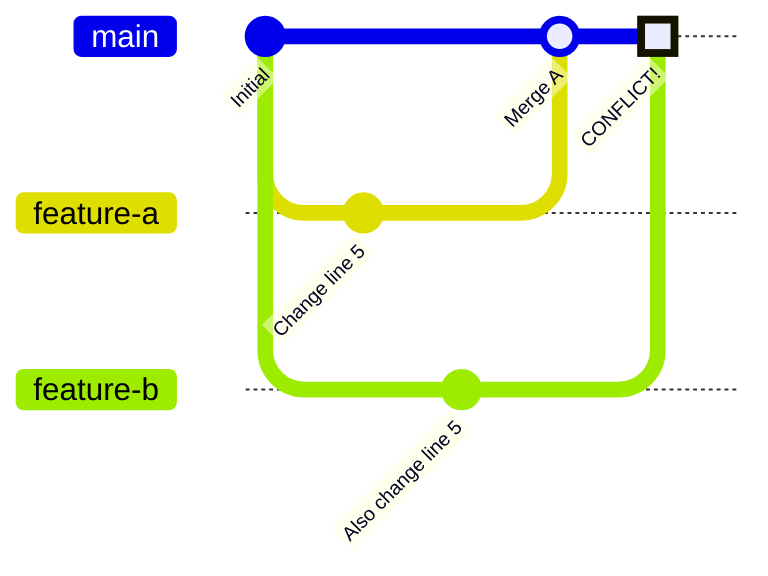

# How to Fix 'Merge Conflict' Errors in Git

Author: [nawazdhandala](https://github.com/nawazdhandala)

Tags: Git, Version Control, DevOps, Collaboration, Troubleshooting

Description: Learn how to understand, resolve, and prevent Git merge conflicts with practical examples and best practices for team collaboration.

---

Merge conflicts are one of the most common frustrations developers face when working with Git. They occur when Git cannot automatically reconcile changes between two branches. While they might seem intimidating at first, understanding how conflicts happen and how to resolve them makes you a more effective collaborator.

## Why Merge Conflicts Happen

Merge conflicts occur when two branches have modified the same part of a file in different ways. Git is smart enough to merge changes to different parts of a file automatically, but when changes overlap, it needs human intervention to decide which version to keep.



## Common Scenarios That Cause Conflicts

| Scenario | Description | Prevention |
|----------|-------------|------------|
| **Same line edits** | Two developers edit the same line | Coordinate work areas |
| **File renaming** | One branch renames, another edits | Communicate changes |
| **Deleted files** | One branch deletes, another modifies | Check before deleting |
| **Binary files** | Images or compiled files changed | Use Git LFS |
| **Whitespace changes** | Formatting differs | Use consistent formatting tools |

## Anatomy of a Merge Conflict

When Git encounters a conflict, it marks the file with conflict markers. Understanding these markers is the first step to resolving conflicts.

```bash
# Attempt to merge and encounter conflict
git merge feature-branch

# Git output shows the conflict
Auto-merging src/config.js
CONFLICT (content): Merge conflict in src/config.js
Automatic merge failed; fix conflicts and then commit the result.
```

The conflicted file will contain markers like this:

```javascript
// src/config.js
const config = {
  appName: 'MyApp',
<<<<<<< HEAD
  timeout: 5000,
  retries: 3,
=======
  timeout: 10000,
  retries: 5,
>>>>>>> feature-branch
  debug: false,
};
```

The markers mean:
- `<<<<<<< HEAD` - Start of your current branch changes
- `=======` - Separator between the two versions
- `>>>>>>> feature-branch` - End of incoming branch changes

## Step-by-Step Conflict Resolution

### Step 1: Identify Conflicted Files

```bash
# Check which files have conflicts
git status

# Output shows conflicted files
On branch main
You have unmerged paths.
  (fix conflicts and run "git commit")

Unmerged paths:
  (use "git add <file>..." to mark resolution)
        both modified:   src/config.js
        both modified:   src/utils.js
```

### Step 2: Understand the Changes

Before editing, understand what each branch was trying to accomplish.

```bash
# See what HEAD (your branch) changed
git diff --ours src/config.js

# See what the incoming branch changed
git diff --theirs src/config.js

# See the common ancestor
git diff --base src/config.js

# View the full conflict with context
git diff src/config.js
```

### Step 3: Resolve the Conflict

Edit the file to combine the changes appropriately. Remove the conflict markers and keep the code you want.

```javascript
// src/config.js - After resolution
const config = {
  appName: 'MyApp',
  timeout: 10000,  // Keep longer timeout from feature branch
  retries: 3,      // Keep conservative retries from main
  debug: false,
};
```

### Step 4: Mark as Resolved and Commit

```bash
# Stage the resolved file
git add src/config.js

# Continue the merge
git commit -m "Merge feature-branch, resolve config timeout conflict"

# Or if using rebase
git rebase --continue
```

## Using Git Merge Tools

Manual conflict resolution works, but merge tools provide a visual interface that makes complex conflicts easier to handle.

```bash
# Configure a merge tool (VS Code example)
git config --global merge.tool vscode
git config --global mergetool.vscode.cmd 'code --wait $MERGED'

# Configure for vimdiff
git config --global merge.tool vimdiff

# Launch merge tool for conflicted files
git mergetool

# This opens each conflicted file in your configured tool
# Save and close when done with each file
```

### Popular Merge Tools

| Tool | Platform | Command |
|------|----------|---------|
| VS Code | All | `code --wait` |
| IntelliJ IDEA | All | Built-in |
| Meld | Linux/Windows | `meld` |
| Kaleidoscope | macOS | `ksdiff` |
| P4Merge | All | `p4merge` |

## Conflict Resolution Strategies

### Strategy 1: Accept One Side Completely

When you know one version is entirely correct:

```bash
# Accept all changes from your current branch
git checkout --ours src/config.js

# Accept all changes from the incoming branch
git checkout --theirs src/config.js

# Mark as resolved
git add src/config.js
```

### Strategy 2: Interactive Staging

For complex files, stage specific hunks:

```bash
# Interactively choose which changes to stage
git add -p src/config.js

# Git will prompt for each change:
# y - stage this hunk
# n - skip this hunk
# s - split into smaller hunks
# e - manually edit the hunk
```

### Strategy 3: Abort and Start Over

When conflicts become too complex:

```bash
# Abort the merge and return to pre-merge state
git merge --abort

# For rebase conflicts
git rebase --abort

# Now you can try a different approach
# or coordinate with teammates
```

## Preventing Merge Conflicts

Prevention is better than resolution. These practices reduce conflict frequency.

### Pull Before Push

```bash
# Always update before starting work
git pull origin main

# Or fetch and rebase for cleaner history
git fetch origin
git rebase origin/main
```

### Keep Branches Short-Lived


Long-running branches accumulate differences and increase conflict likelihood. Merge frequently or use feature flags for incomplete features.

### Use Pre-Commit Hooks for Formatting

Consistent formatting eliminates whitespace conflicts:

```bash
# .pre-commit-config.yaml
repos:
  - repo: https://github.com/pre-commit/pre-commit-hooks
    rev: v4.5.0
    hooks:
      - id: trailing-whitespace
      - id: end-of-file-fixer
  - repo: https://github.com/psf/black
    rev: 24.1.0
    hooks:
      - id: black
```

### Divide Work by File or Module

When multiple developers work on the same codebase, divide work to minimize overlap:

```bash
# Project structure that reduces conflicts
src/
  ├── features/
  │   ├── auth/          # Developer A
  │   ├── dashboard/     # Developer B
  │   └── settings/      # Developer C
  ├── shared/            # Coordinate changes
  └── utils/             # Coordinate changes
```

## Handling Complex Conflicts

### Conflict in Generated Files

Lock files and generated files often conflict. Regenerate instead of manually merging.

```bash
# For package-lock.json conflicts
git checkout --theirs package-lock.json
npm install

# For yarn.lock conflicts
git checkout --theirs yarn.lock
yarn install

# Stage the regenerated file
git add package-lock.json
```

### Merge Conflict in a Rebase

Rebase conflicts require resolving the same conflict multiple times as each commit is replayed.

```bash
# During rebase, conflict occurs
git rebase main

# Resolve the conflict
# Edit files, remove markers

# Continue with the rebase
git add src/config.js
git rebase --continue

# If the same conflict appears again
# Git rerere can help (described below)
```

### Enable Git Rerere

Rerere (reuse recorded resolution) remembers how you resolved conflicts and applies the same resolution automatically in the future.

```bash
# Enable rerere globally
git config --global rerere.enabled true

# When you resolve a conflict, Git records it
# Next time the same conflict occurs, Git resolves it automatically

# View recorded resolutions
ls .git/rr-cache/

# Forget a recorded resolution
git rerere forget src/config.js
```

## Conflict Resolution Checklist

When facing a merge conflict, follow this checklist:

```bash
# 1. Understand the situation
git status
git log --oneline --graph -10

# 2. See what changed on each side
git diff --ours <file>
git diff --theirs <file>

# 3. Resolve conflicts
# Edit files manually or use mergetool
git mergetool

# 4. Verify resolution
git diff --staged

# 5. Complete the merge
git add <resolved-files>
git commit

# 6. Clean up mergetool backup files
find . -name "*.orig" -delete
```

## Summary

| Action | Command |
|--------|---------|
| Check conflict status | `git status` |
| See your changes | `git diff --ours <file>` |
| See their changes | `git diff --theirs <file>` |
| Accept yours | `git checkout --ours <file>` |
| Accept theirs | `git checkout --theirs <file>` |
| Launch merge tool | `git mergetool` |
| Abort merge | `git merge --abort` |
| Mark resolved | `git add <file>` |
| Enable rerere | `git config --global rerere.enabled true` |

Merge conflicts are a normal part of collaborative development. With practice, resolving them becomes routine. The key is understanding what each branch intended, communicating with your team, and using tools that make the process visual and manageable.
