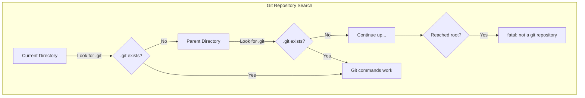

# How to Fix "Fatal: Not a Git Repository" Errors

Author: [nawazdhandala](https://www.github.com/nawazdhandala)

Tags: Git, Version Control, Troubleshooting, DevOps, Git Errors

Description: Learn how to diagnose and fix the "fatal: not a git repository" error including missing .git folders, wrong directories, and corrupted repositories.

---

The error "fatal: not a git repository (or any of the parent directories): .git" is one of the most common Git errors. It means Git cannot find a `.git` directory in your current location or any parent directory. This guide covers all the causes and their solutions.

## Understanding the Error

When you run any Git command, Git looks for a `.git` directory. It starts in your current directory and searches upward through parent directories until it finds one or reaches the filesystem root.



## Common Causes and Solutions

### Cause 1: Not Inside a Git Repository

The simplest cause is running Git commands in a directory that was never initialized as a repository.

```bash
# Check if you're in a git repository
ls -la | grep .git
# If no output, there's no .git directory

# Solution: Initialize a new repository
git init
# Initialized empty Git repository in /path/to/project/.git/

# Or if you meant to clone a repository
git clone https://github.com/user/repo.git
cd repo
```

### Cause 2: Wrong Directory

You might be in a subdirectory that is outside your repository, or simply in the wrong folder.

```bash
# Check your current location
pwd
# /home/user/random-folder

# List directories to find your project
ls ~/projects/

# Navigate to your actual repository
cd ~/projects/my-app

# Verify it's a git repository
git status
# On branch main
# nothing to commit, working tree clean
```

### Cause 3: Missing or Deleted .git Directory

The `.git` directory might have been accidentally deleted or excluded during a copy operation.

```bash
# Check if .git exists
ls -la .git
# ls: cannot access '.git': No such file or directory

# If you have a remote, you can re-clone
cd ..
rm -rf my-project
git clone https://github.com/user/my-project.git

# If you don't have a remote but have backup
# Restore from backup or reinitialize
git init
git remote add origin https://github.com/user/my-project.git
git fetch origin
git reset --hard origin/main
```

### Cause 4: Corrupted .git Directory

The `.git` directory exists but is corrupted or incomplete.

```bash
# Check the .git directory structure
ls -la .git/
# Should contain: HEAD, config, objects/, refs/, etc.

# Check for obvious corruption
cat .git/HEAD
# ref: refs/heads/main

# If HEAD file is corrupted or empty, fix it
echo "ref: refs/heads/main" > .git/HEAD

# Run Git's built-in consistency check
git fsck --full
# Checking object directories: 100% done.
# Checking objects: 100% done.
```

#### Recovering from Corruption

```bash
# If objects are corrupted but you have a remote
git fetch origin

# Try to recover the branch
git branch -f main origin/main

# If local corruption is severe, re-clone
cd ..
mv my-project my-project-broken
git clone https://github.com/user/my-project.git

# Copy any uncommitted work from broken copy
cp my-project-broken/src/new-file.js my-project/src/
```

### Cause 5: Running Git Commands Outside Repository (CI/CD)

In CI/CD pipelines, the checkout location might differ from where your scripts run.

```yaml
# GitHub Actions example - incorrect working directory
jobs:
  build:
    runs-on: ubuntu-latest
    steps:
      - uses: actions/checkout@v4

      - name: Run script
        run: |
          cd /tmp  # Wrong! Left the repository
          git status  # fatal: not a git repository
```

```yaml
# Correct approach - stay in repository or use working-directory
jobs:
  build:
    runs-on: ubuntu-latest
    steps:
      - uses: actions/checkout@v4

      - name: Run script
        working-directory: ${{ github.workspace }}
        run: git status  # Works correctly
```

### Cause 6: Git Submodule Not Initialized

In repositories with submodules, the submodule directories exist but are not git repositories until initialized.

```bash
# Check for submodules
cat .gitmodules
# [submodule "vendor/library"]
#   path = vendor/library
#   url = https://github.com/user/library.git

# The submodule directory exists but is empty
ls vendor/library/
# (empty)

# Initialize and update submodules
git submodule init
git submodule update

# Or do both in one command
git submodule update --init --recursive
```

### Cause 7: Bare Repository Confusion

Bare repositories (used for remotes) do not have a working directory and behave differently.

```bash
# In a bare repository
cd /path/to/repo.git
git status
# fatal: this operation must be run in a work tree

# Bare repositories are for pushing/pulling, not working
# Clone it to get a working copy
git clone /path/to/repo.git my-working-copy
cd my-working-copy
git status
```

## Diagnosing the Problem

Use these commands to understand why Git cannot find a repository.

```bash
# Show the root of the current repository (if any)
git rev-parse --show-toplevel
# fatal: not a git repository (or any of the parent directories): .git

# Check if you're inside a git directory
git rev-parse --is-inside-work-tree
# fatal: not a git repository...

# Find .git directories in current location
find . -name ".git" -type d 2>/dev/null
# (no output means no .git directory found)

# Search parent directories manually
pwd
ls -la ../.git
ls -la ../../.git
```

## Special Cases

### Git Worktrees

If you are using git worktrees, each worktree has a `.git` file (not directory) pointing to the main repository.

```bash
# In a worktree, .git is a file not a directory
cat .git
# gitdir: /path/to/main-repo/.git/worktrees/my-worktree

# If this file is corrupted, the worktree breaks
# Remove and recreate the worktree
cd ..
rm -rf my-worktree
git worktree add my-worktree branch-name
```

### Docker Containers

Volumes or copy operations might not include the `.git` directory.

```dockerfile
# This copies files but may exclude .git
COPY . /app
WORKDIR /app
RUN git status  # May fail

# Include .git explicitly if needed
COPY .git /app/.git
COPY . /app

# Or better: don't run git commands in the container
# Use build args to pass git info
ARG GIT_COMMIT
ENV GIT_COMMIT=$GIT_COMMIT
```

```bash
# Build with git info
docker build --build-arg GIT_COMMIT=$(git rev-parse HEAD) -t myapp .
```

### Case-Sensitive Filesystems

On some systems (especially Windows or macOS), filesystem case sensitivity can cause issues.

```bash
# Check for case issues
ls -la | grep -i git
# .GIT  # Wrong case!

# Rename to correct case
mv .GIT .git

# On Windows, you might need
git config --global core.ignorecase false
```

## Preventive Measures

### Check Before Running Git Commands

Add checks to scripts that use Git.

```bash
#!/bin/bash
# check-git.sh

# Verify we're in a git repository before proceeding
if ! git rev-parse --git-dir > /dev/null 2>&1; then
    echo "Error: Not a git repository"
    echo "Please run this script from within a git repository"
    exit 1
fi

# Safe to run git commands now
git status
```

### Makefile Git Check

```makefile
# Check for git repository in Makefile
.PHONY: check-git
check-git:
	@git rev-parse --git-dir > /dev/null 2>&1 || (echo "Not a git repository" && exit 1)

deploy: check-git
	@echo "Deploying from commit: $$(git rev-parse --short HEAD)"
	./deploy.sh
```

### Handle Missing Repository in Scripts

```bash
#!/bin/bash
# Gracefully handle missing git repository

get_version() {
    if git rev-parse --git-dir > /dev/null 2>&1; then
        git describe --tags --always
    else
        echo "unknown"  # Fallback when not in git repo
    fi
}

VERSION=$(get_version)
echo "Building version: $VERSION"
```

## Quick Reference

```bash
# Check if in a git repository
git rev-parse --git-dir

# Find repository root
git rev-parse --show-toplevel

# Initialize new repository
git init

# Clone existing repository
git clone <url>

# Check .git directory health
git fsck --full

# Reinitialize corrupted repository
git init
git fetch origin
git reset --hard origin/main

# Initialize submodules
git submodule update --init --recursive
```

## Summary

The "fatal: not a git repository" error has several common causes:

1. **Not in a repository**: Run `git init` or `cd` to the right directory
2. **Wrong directory**: Navigate to your actual project folder
3. **Missing .git**: Re-clone or restore from backup
4. **Corrupted .git**: Run `git fsck` and repair or re-clone
5. **CI/CD issues**: Ensure scripts run in the checkout directory
6. **Submodules**: Run `git submodule update --init`

The fix depends on the cause, but in most cases either initializing a new repository, navigating to the correct directory, or re-cloning from a remote will solve the problem. Always verify you are in the right directory before troubleshooting further.
