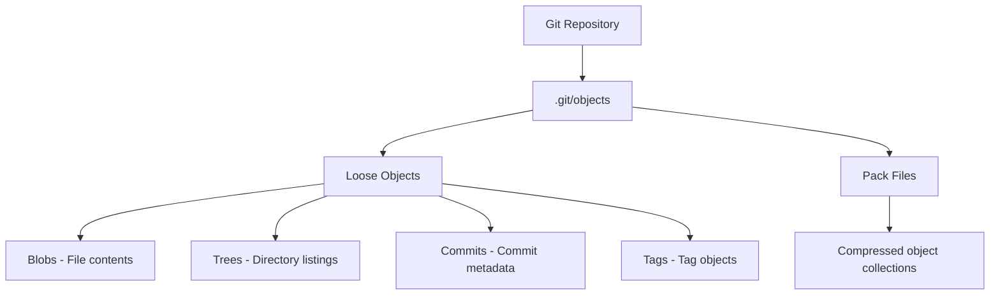
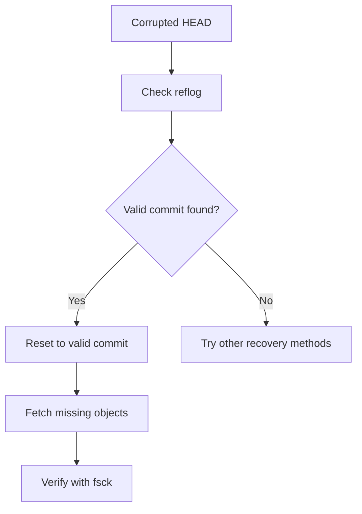
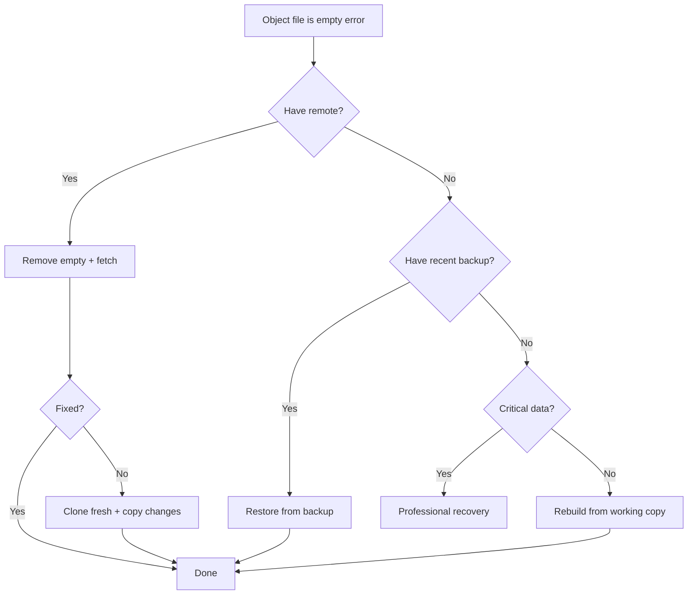

# How to Fix "Object File Is Empty" Corruption Errors

Author: [nawazdhandala](https://www.github.com/nawazdhandala)

Tags: Git, Corruption, Recovery, Troubleshooting, DevOps, Data Recovery, Git Objects

Description: Learn how to diagnose and recover from Git repository corruption when you encounter "object file is empty" errors, with step-by-step recovery procedures.

---

The "object file is empty" error indicates corruption in your Git repository's object database. This typically happens after system crashes, disk failures, or interrupted Git operations. While alarming, most corrupted repositories can be recovered. This guide provides systematic approaches from simple fixes to full recovery.

## Understanding Git Objects



Git stores everything as objects in `.git/objects/`. Each object is identified by a SHA-1 hash. When an object file becomes empty or corrupted, Git cannot read the data it references.

## Diagnosing the Problem

### Identify Corrupted Objects

```bash
# Full repository check
git fsck --full

# Example output:
# error: object file .git/objects/ab/cdef1234... is empty
# error: object file .git/objects/12/3456789a... is empty
# fatal: loose object abcdef1234... is corrupt
```

### Find All Empty Objects

```bash
# List all empty object files
find .git/objects -type f -empty

# Count empty objects
find .git/objects -type f -empty | wc -l

# List with sizes (empty files show 0)
find .git/objects -type f -exec ls -la {} \; | grep " 0 "
```

### Check Repository State

```bash
# See current HEAD
cat .git/HEAD

# Check if HEAD reference exists
git rev-parse HEAD

# List recent reflog entries
git reflog
```

## Recovery Methods

### Method 1: Remove Empty Objects and Fetch

The simplest fix when you have a remote:

```bash
# Remove empty object files
find .git/objects -type f -empty -delete

# Fetch missing objects from remote
git fetch origin

# Verify repository
git fsck --full
```

### Method 2: Reset to Remote

If local changes are not critical:

```bash
# Remove corrupted objects
find .git/objects -type f -empty -delete

# Reset to match remote exactly
git fetch origin
git reset --hard origin/main

# Pull all branches
git fetch --all
```

### Method 3: Clone and Recover Local Changes

When corruption is extensive:

```bash
# Rename corrupted repo
mv my-repo my-repo-corrupted

# Fresh clone
git clone https://github.com/user/my-repo.git

# Copy any uncommitted changes
# (Check my-repo-corrupted for files you need)
diff -rq my-repo-corrupted my-repo
```

### Method 4: Recover from Reflog



```bash
# View reflog to find valid commits
git reflog

# The reflog might show:
# abc1234 HEAD@{0}: commit: Latest work
# def5678 HEAD@{1}: commit: Previous work  <- Try this if abc is corrupt
# ghi9012 HEAD@{2}: commit: Earlier work

# Reset to a known good commit
git reset --hard def5678

# Fetch any missing objects
git fetch origin
```

### Method 5: Recover Individual Objects

If you know which objects are corrupted:

```bash
# Identify the corrupted object
git fsck --full 2>&1 | grep "empty\|corrupt"
# error: object file .git/objects/ab/cdef123456... is empty

# The full hash is the directory + filename
# ab + cdef123456... = abcdef123456...

# Try to find this object in a pack file
git unpack-objects < .git/objects/pack/*.pack

# Or fetch the specific object from remote
git fetch origin
```

### Method 6: Rebuild from Pack Files

If loose objects are corrupted but packs are intact:

```bash
# Move corrupted loose objects
mkdir -p .git/objects-backup
find .git/objects -type f -empty -exec mv {} .git/objects-backup/ \;

# Unpack all pack files
cd .git/objects/pack
for pack in *.pack; do
    git unpack-objects < "$pack"
done
cd ../../..

# Verify
git fsck --full
```

### Method 7: Manual Object Recovery

For recovering specific files:

```bash
# If you know the file content, recreate the blob
echo "file content" | git hash-object -w --stdin

# Find what the corrupt object should be
git log --all --full-history -- path/to/file

# Check out specific file from a known good commit
git checkout abc1234 -- path/to/file
```

## Complete Recovery Procedure

Here is a systematic approach:

```bash
#!/bin/bash
# Git repository recovery script

echo "Step 1: Backup the corrupted repository"
cp -r .git .git-backup

echo "Step 2: Identify corruption"
git fsck --full 2>&1 | tee fsck-report.txt

echo "Step 3: Remove empty objects"
find .git/objects -type f -empty -delete

echo "Step 4: Try to fetch from remote"
git fetch origin --all

echo "Step 5: Verify fix"
git fsck --full

echo "Step 6: Check branches"
git branch -a

echo "Step 7: Test checkout"
git checkout main
```

## Handling Specific Scenarios

### Corrupted HEAD

```bash
# Check HEAD reference
cat .git/HEAD
# ref: refs/heads/main

# Check if the reference exists and is valid
cat .git/refs/heads/main
# Shows commit hash or error

# If corrupted, find valid commit from reflog
git reflog show main
# abc1234 main@{0}: commit: message

# Manually fix the reference
echo "abc1234" > .git/refs/heads/main
```

### Corrupted Index

```bash
# Remove corrupted index
rm .git/index

# Rebuild index from HEAD
git reset

# Or rebuild from specific commit
git read-tree HEAD
```

### Corrupted Pack Files

```bash
# Check pack file integrity
git verify-pack -v .git/objects/pack/*.pack

# If pack is corrupted, try to recover what you can
git unpack-objects < .git/objects/pack/pack-abc123.pack

# Remove corrupted pack
rm .git/objects/pack/pack-abc123.*

# Repack remaining objects
git repack -a -d
```

## Prevention Strategies

### Regular Maintenance

```bash
# Run garbage collection regularly
git gc --auto

# Full repository verification
git fsck --full

# Prune unreachable objects
git prune
```

### Safe Shutdown Practices

```bash
# Before system shutdown, ensure Git is idle
git status  # Check for in-progress operations

# If mid-rebase or mid-merge, complete or abort
git rebase --abort  # or --continue
git merge --abort   # or complete the merge
```

### Backup Strategies

```bash
# Clone with all branches as backup
git clone --mirror https://github.com/user/repo.git repo-backup.git

# Regular push to multiple remotes
git remote add backup git@backup-server:repo.git
git push backup --all
git push backup --tags
```

### Use Filesystem with Journaling

Git corruption often comes from filesystem issues. Use journaling filesystems (ext4, APFS, NTFS) and avoid interrupting disk operations.

## Diagnostic Commands Reference

```bash
# Full integrity check
git fsck --full --strict

# Check specific object
git cat-file -t <hash>  # Type
git cat-file -p <hash>  # Content

# List all objects
git rev-list --all --objects

# Verify pack files
git verify-pack -v .git/objects/pack/*.pack

# Show object location
git cat-file --batch-check --batch-all-objects

# Check reflog integrity
git reflog expire --expire=now --all --dry-run
```

## Recovery Decision Tree



## Quick Reference

| Problem | Solution |
|---------|----------|
| Empty object files | `find .git/objects -type f -empty -delete && git fetch` |
| Corrupted HEAD | Check reflog, reset to valid commit |
| Corrupted index | `rm .git/index && git reset` |
| Multiple corruptions | Clone fresh, copy uncommitted work |
| Pack file corruption | Unpack, remove bad pack, repack |
| Check integrity | `git fsck --full` |
| Backup before repair | `cp -r .git .git-backup` |

## When to Start Fresh

Sometimes recovery is not worth the effort:

- Most work is pushed to remote
- Corruption is extensive
- No critical uncommitted changes
- Recovery attempts are failing

In these cases:

```bash
# Backup what you can
cp -r my-repo my-repo-corrupted

# Fresh clone
git clone https://github.com/user/my-repo.git

# Manually check corrupted repo for any files to recover
```

---

Git repository corruption is recoverable in most cases, especially when you have a remote to fetch from. The key is to act methodically: backup first, diagnose the extent of corruption, try simple fixes before complex ones, and verify your recovery with `git fsck`. Keep regular backups and push frequently to minimize the impact of any future corruption.
