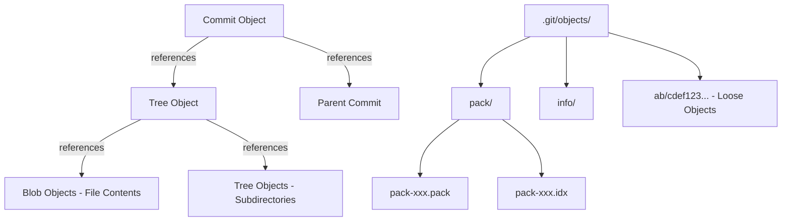
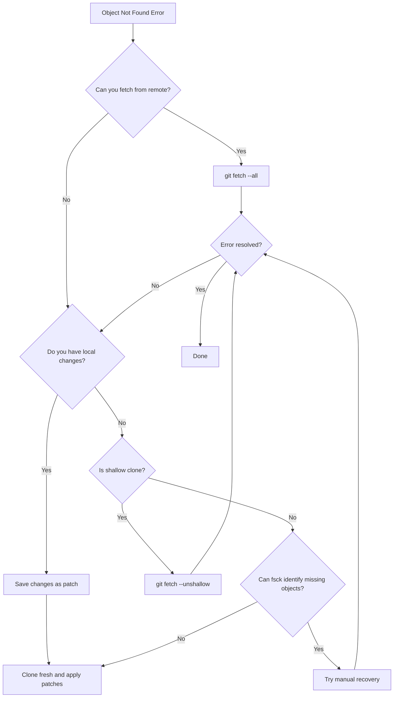

# How to Fix 'Object Not Found' Errors in Git

Author: [nawazdhandala](https://www.github.com/nawazdhandala)

Tags: Git, Troubleshooting, Errors, Repository Repair, Version Control, DevOps

Description: Learn how to diagnose and fix Git 'object not found' errors caused by missing commits, corrupted repositories, or incomplete clones.

---

The "object not found" error in Git is frustrating because it means your repository is in an inconsistent state. Commits reference objects that don't exist, and Git operations fail with cryptic error messages. This guide covers the causes, diagnosis, and solutions for these errors.

---

## Understanding Git Objects

Git stores everything as objects in the `.git/objects` directory. Understanding this structure helps diagnose issues:



When Git reports "object not found," one of these objects is missing or corrupted.

---

## Common Error Messages

These are the typical error patterns you'll encounter:

```bash
# Missing blob (file content)
error: object file .git/objects/ab/cdef1234567890 is missing

# Missing tree (directory structure)
fatal: bad tree object abc123

# Missing commit
fatal: bad object HEAD
fatal: Could not parse object 'abc123def456'

# During fetch or pull
error: Could not read abc123def456789
fatal: revision walk setup failed

# During clone
fatal: did not receive expected object abc123
fatal: index-pack failed
```

---

## Diagnosing the Problem

Start by running Git's built-in consistency checker:

```bash
# Run filesystem consistency check
# This scans all objects and reports problems
git fsck --full

# Output examples:
# missing blob abc123def456789012345678901234567890abcd
# dangling commit def456789012345678901234567890abcdef12
# broken link from tree abc123 to blob def456

# Check for unreachable objects too
git fsck --full --unreachable

# Just check connectivity without fixing
git fsck --connectivity-only
```

Identify which objects are missing:

```bash
# Check if a specific object exists
git cat-file -t abc123def456  # Returns object type or error

# Try to read the object content
git cat-file -p abc123def456  # Prints content or error

# Find what references the missing object
git log --all --oneline | head -20
# Then check specific commits
git cat-file -p <commit-hash>
```

---

## Fix 1: Fetch Missing Objects from Remote

The most common cause is an incomplete clone or fetch. Try fetching again:

```bash
# Fetch all objects from remote
git fetch --all

# Fetch with full depth if you have a shallow clone
git fetch --unshallow

# Fetch specific missing objects by re-fetching everything
git fetch origin --refetch

# If the object belongs to a specific branch
git fetch origin problematic-branch
```

For shallow clones that are missing history:

```bash
# Check if repository is shallow
git rev-parse --is-shallow-repository
# true = shallow clone, might be missing objects

# Convert shallow clone to full clone
git fetch --unshallow origin

# Or deepen the history incrementally
git fetch --deepen=100
```

---

## Fix 2: Clone Fresh and Preserve Local Changes

When the repository is severely corrupted, cloning fresh is often fastest:

```bash
# Save your local changes first
cd corrupted-repo
git stash  # If this works
git diff > ~/my-changes.patch  # Backup unstaged changes
git diff --staged > ~/my-staged-changes.patch  # Backup staged changes

# Clone fresh copy
cd ..
mv corrupted-repo corrupted-repo-backup
git clone git@github.com:user/repo.git

# Apply your changes to the fresh clone
cd repo
git apply ~/my-changes.patch
git apply ~/my-staged-changes.patch
```

If you can't even create patches:

```bash
# Copy modified files manually before re-cloning
# First, list modified files (if git status works)
git status --porcelain | grep "^ M" | cut -c4-

# If git commands fail, compare directories after fresh clone
diff -rq corrupted-repo-backup repo | grep "differ"
```

---

## Fix 3: Recover Objects from Reflog

Git's reflog might reference commits that can help recover missing objects:

```bash
# View reflog entries
git reflog

# The reflog shows recent HEAD positions
# abc1234 HEAD@{0}: commit: Latest commit
# def5678 HEAD@{1}: commit: Previous commit
# ghi9012 HEAD@{2}: pull: Fast-forward

# Try checking out known good commits
git checkout HEAD@{5}

# If an object exists in reflog but not in history
git fsck --unreachable | grep commit
# Then cherry-pick or reset to recover
```

---

## Fix 4: Recover from Backup or Stash

Check if the missing object exists in stash or other refs:

```bash
# List all stashes
git stash list

# Check if stash contains missing objects
git stash show -p stash@{0}

# List all references that might have the object
git for-each-ref --format='%(refname)' | while read ref; do
    if git rev-list "$ref" 2>/dev/null | grep -q "abc123"; then
        echo "Found in: $ref"
    fi
done
```

---

## Fix 5: Rebuild from Pack Files

Sometimes objects exist in pack files but the index is corrupted:

```bash
# List pack files
ls -la .git/objects/pack/

# Verify pack file integrity
git verify-pack -v .git/objects/pack/pack-*.idx

# If pack is good but index is bad, rebuild the index
cd .git/objects/pack
rm pack-*.idx
git index-pack pack-*.pack
```

For severely corrupted packs:

```bash
# Extract objects from pack file
mkdir recovered-objects
cd .git/objects/pack
git unpack-objects < pack-*.pack

# Move recovered objects to proper location
# Objects are extracted as loose objects
```

---

## Fix 6: Reset to a Known Good State

If you know when the repository was last working:

```bash
# Find a commit before the corruption
git log --oneline --all | head -50

# Hard reset to that commit (WARNING: loses newer commits)
git reset --hard <known-good-commit>

# Or create a new branch from the good commit
git checkout -b recovery-branch <known-good-commit>

# Fetch to try getting missing objects for newer commits
git fetch origin
git merge origin/main  # Might work now
```

---

## Fix 7: Manual Object Recovery

For advanced recovery when you have partial data:

```bash
# If you have the file content, recreate the blob
echo "file content here" | git hash-object -w --stdin
# Returns: abc123def456... (the blob hash)

# If you know what a tree should look like
# Create a tree object manually
git mktree <<EOF
100644 blob abc123def456789012345678901234567890abcd    filename.txt
040000 tree def456789012345678901234567890abcdef12    subdirectory
EOF

# Verify the recreated object
git cat-file -p <new-hash>
```

---

## Fix 8: Clone with Different Protocols

Sometimes protocol-specific issues cause incomplete transfers:

```bash
# If HTTPS clone failed, try SSH
git clone git@github.com:user/repo.git

# If SSH failed, try HTTPS
git clone https://github.com/user/repo.git

# Try with verbose output to see what's failing
GIT_TRACE=1 GIT_TRANSFER_TRACE=1 git clone git@github.com:user/repo.git

# Use a different Git protocol version
git -c protocol.version=2 clone git@github.com:user/repo.git
```

---

## Preventing Object Not Found Errors

Configure Git to catch problems early:

```bash
# Enable transfer verification
git config --global transfer.fsckObjects true

# Enable fetch verification
git config --global fetch.fsckObjects true

# Enable receive verification (for servers)
git config --global receive.fsckObjects true

# Run periodic maintenance
git maintenance start
# This schedules regular gc and integrity checks
```

Set up a pre-push hook to verify integrity:

```bash
#!/bin/bash
# .git/hooks/pre-push
# Verify repository integrity before pushing

echo "Verifying repository integrity..."
if ! git fsck --connectivity-only --quiet; then
    echo "Repository integrity check failed!"
    echo "Run 'git fsck --full' for details"
    exit 1
fi
```

---

## Special Case: Submodule Objects Missing

Submodules can have their own missing object issues:

```bash
# Check submodule status
git submodule status

# Reinitialize submodules
git submodule deinit -f .
git submodule update --init --recursive

# If submodule objects are missing
cd path/to/submodule
git fetch --all
git checkout <expected-commit>
cd ../..
git submodule update
```

---

## Special Case: Large File Storage (LFS) Issues

Missing objects might actually be LFS pointers:

```bash
# Check if LFS is involved
git lfs ls-files

# Fetch LFS objects
git lfs fetch --all

# Pull LFS objects for current branch
git lfs pull

# If LFS objects are missing from server
# Check the pointer file content
git show HEAD:path/to/large/file
# Output shows: version https://git-lfs.github.com/spec/v1
# oid sha256:abc123...
# size 12345
```

---

## Diagnostic Commands Reference

```bash
# Complete integrity check
git fsck --full --strict

# Check specific commit
git cat-file -t <hash>  # Type: commit, tree, blob, tag
git cat-file -p <hash>  # Pretty print content
git cat-file -s <hash>  # Size in bytes

# Find which packs contain an object
git verify-pack -v .git/objects/pack/pack-*.idx | grep <partial-hash>

# List all objects in repository
git rev-list --objects --all

# Count objects by type
git count-objects -v

# Check remote for object
git ls-remote origin | grep <hash>
```

---

## Recovery Decision Tree



---

## Summary

"Object not found" errors indicate Git's internal database is incomplete. The recovery approach depends on the cause:

1. For incomplete fetches: `git fetch --all` or `git fetch --unshallow`
2. For corrupted clones: Clone fresh and restore local changes
3. For pack file issues: Verify and rebuild pack indexes
4. For submodule problems: Reinitialize with `git submodule update --init`
5. For LFS issues: Run `git lfs fetch --all`

Always run `git fsck --full` first to understand what's missing. When in doubt, clone fresh and preserve your local work. Enable `transfer.fsckObjects` to prevent future issues by catching problems during fetch operations.
