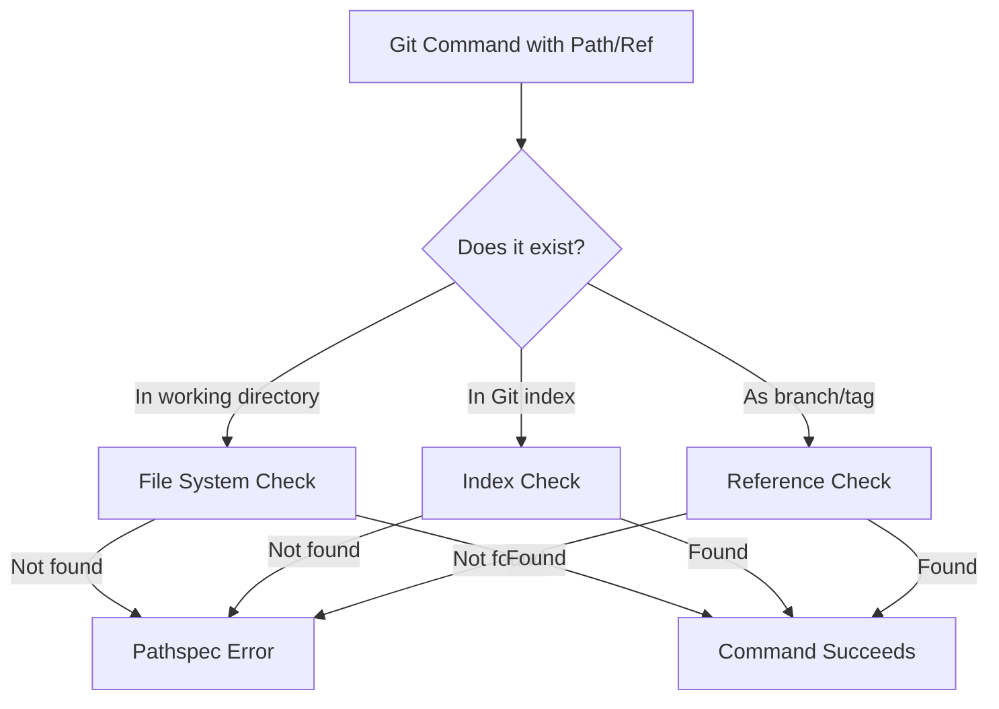
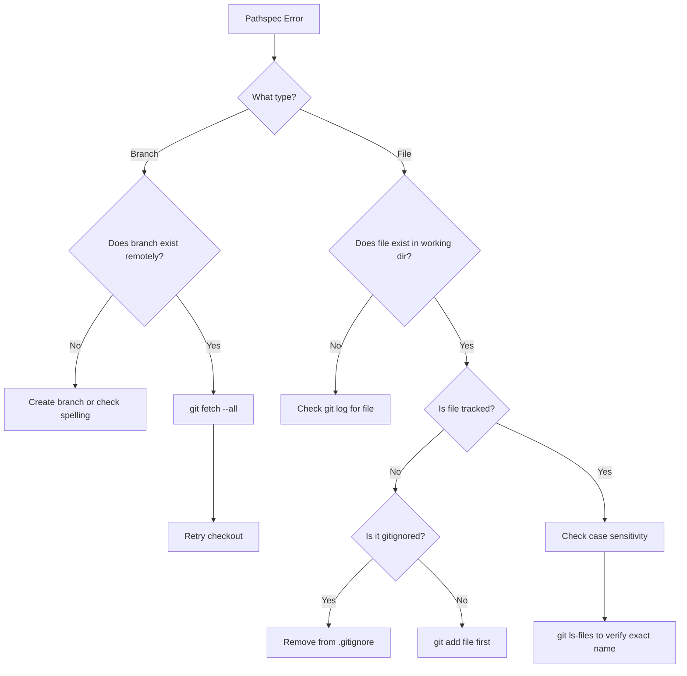

# How to Fix "Pathspec Did Not Match" Errors

Author: [nawazdhandala](https://www.github.com/nawazdhandala)

Tags: Git, Troubleshooting, Errors, Version Control, DevOps, Development

Description: Learn how to diagnose and fix the common "pathspec did not match any file(s) known to git" error with practical solutions for various scenarios.

---

The "pathspec did not match any file(s) known to git" error is one of the most common Git errors developers encounter. It occurs when Git cannot find the file, branch, or path you specified. This guide covers all the causes and solutions for this frustrating error.

## Understanding the Error

When you see this error, Git is telling you it cannot find what you are looking for in its index or history.

```bash
$ git checkout feature-branch
error: pathspec 'feature-branch' did not match any file(s) known to git

$ git add src/newfile.js
error: pathspec 'src/newfile.js' did not match any file(s) known to git
```



## Common Causes and Solutions

### Cause 1: Branch Does Not Exist Locally

The most common cause is trying to checkout a remote branch that has not been fetched.

```bash
# This fails if the branch only exists on remote
git checkout feature-xyz
# error: pathspec 'feature-xyz' did not match any file(s) known to git
```

**Solution: Fetch from remote first**

```bash
# Fetch all remote branches
git fetch --all

# Now checkout works
git checkout feature-xyz

# Or explicitly checkout from origin
git checkout -b feature-xyz origin/feature-xyz
```

**Verify remote branches exist:**

```bash
# List all remote branches
git branch -r

# List all branches (local and remote)
git branch -a

# Search for a specific branch
git branch -a | grep feature
```

### Cause 2: Typo in Branch or File Name

Simple typos are a frequent cause of this error.

```bash
# Typo in branch name
git checkout featrue-login  # Should be "feature-login"

# Typo in file path
git add src/componenets/Button.js  # Should be "components"
```

**Solution: Check the correct spelling**

```bash
# List files matching a pattern
git ls-files | grep -i button

# List branches matching a pattern
git branch -a | grep -i login

# Use tab completion to avoid typos
git checkout feat<TAB>
```

### Cause 3: File Not Tracked by Git

Git cannot operate on files it does not know about.

```bash
# File exists but is not tracked
git checkout -- newfile.js
# error: pathspec 'newfile.js' did not match any file(s) known to git
```

**Solution: Add the file first or check if it is gitignored**

```bash
# Check if file is ignored
git check-ignore -v newfile.js

# Check gitignore rules
cat .gitignore

# If not ignored, add it
git add newfile.js
```

### Cause 4: File Path Has Changed

The file might have been moved or renamed in a different commit.

```bash
# File was renamed in another branch
git checkout main -- old-path/file.js
# error: pathspec 'old-path/file.js' did not match any file(s) known to git
```

**Solution: Find the current path**

```bash
# Search for the file in the repository
git ls-files | grep file.js

# Check file history to find renames
git log --follow --name-status -- "**/file.js"

# Use the correct current path
git checkout main -- new-path/file.js
```

### Cause 5: Case Sensitivity Issues

This is especially common when working across different operating systems (macOS/Windows vs Linux).

```bash
# Linux is case-sensitive, macOS/Windows are not
git checkout -- README.md  # Fails if file is readme.md on Linux
```

**Solution: Match the exact case**

```bash
# List files to see exact names
git ls-files | grep -i readme

# Use the exact case
git checkout -- readme.md

# Fix case sensitivity issues in repository
git mv readme.md README.md.tmp
git mv README.md.tmp README.md
```

### Cause 6: Working in Wrong Directory

The path is relative to your current working directory.

```bash
# You're in /project/src but file is in /project/tests
git add tests/test_file.py
# error: pathspec 'tests/test_file.py' did not match any file(s) known to git
```

**Solution: Use correct relative or absolute path**

```bash
# Check current directory
pwd

# Use path relative to repository root
git add ../tests/test_file.py

# Or change to repository root
cd $(git rev-parse --show-toplevel)
git add tests/test_file.py
```

### Cause 7: Corrupted Git Index

Sometimes the Git index becomes corrupted.

```bash
# Multiple operations fail with pathspec errors
git status
# Shows clean but git add fails
```

**Solution: Rebuild the index**

```bash
# Remove and rebuild index
rm .git/index
git reset

# Or use git read-tree
git read-tree HEAD
```

### Cause 8: Sparse Checkout Filtering

If you are using sparse checkout, some paths might be excluded.

```bash
# File exists in repo but not checked out
git checkout -- docs/internal/secret.md
# error: pathspec 'docs/internal/secret.md' did not match any file(s) known to git
```

**Solution: Check sparse checkout configuration**

```bash
# Check if sparse checkout is enabled
git config core.sparseCheckout

# View sparse checkout patterns
cat .git/info/sparse-checkout

# Add the path to sparse checkout
echo "docs/internal/*" >> .git/info/sparse-checkout
git read-tree -mu HEAD
```

## Diagnostic Commands

When you encounter the pathspec error, use these commands to diagnose the issue:

```bash
# Check if it's a branch issue
git branch -a | grep "branch-name"

# Check if it's a file issue
git ls-files | grep "filename"

# Check current repository state
git status

# Check if file exists in working directory
ls -la path/to/file

# Check file in specific commit
git ls-tree -r HEAD --name-only | grep "filename"

# Check if path is ignored
git check-ignore -v path/to/file
```

## Flowchart for Troubleshooting



## Advanced Solutions

### Using Git Log to Find Files

```bash
# Find all commits that touched a file (even if deleted)
git log --all --full-history -- "**/filename.js"

# Find the commit where a file was deleted
git log --all --full-history --diff-filter=D -- "**/filename.js"

# Restore a deleted file
git checkout $(git rev-list -n 1 HEAD -- "path/to/file")^ -- "path/to/file"
```

### Handling Submodules

```bash
# Pathspec error might occur if file is in submodule
git submodule status

# Initialize and update submodules
git submodule update --init --recursive

# Then access files in submodule
cd submodule-dir
git checkout -- file.js
```

### Working with Worktrees

```bash
# Check if you're in the right worktree
git worktree list

# Switch to correct worktree
cd /path/to/correct/worktree
```

## Prevention Tips

1. **Use tab completion**: Let your shell complete branch and file names
2. **Fetch regularly**: Run `git fetch --all` before checking out remote branches
3. **Verify paths**: Use `git ls-files` to confirm file paths before operations
4. **Mind the case**: Be consistent with file naming, especially in cross-platform teams
5. **Check your location**: Use `pwd` and `git rev-parse --show-toplevel` to confirm location

```bash
# Create helpful aliases
git config --global alias.branches 'branch -a'
git config --global alias.find '!git ls-files | grep -i'

# Usage
git branches | grep feature
git find button
```

## Quick Reference Table

| Error Context | Likely Cause | Solution |
|---------------|--------------|----------|
| `git checkout branch` | Branch not fetched | `git fetch --all` |
| `git checkout -- file` | File not tracked | `git add file` first or check .gitignore |
| `git add file` | File does not exist | Check path and spelling |
| `git checkout -- file` | Wrong directory | Navigate to correct path |
| Multiple failures | Corrupted index | `rm .git/index && git reset` |

## Summary

The "pathspec did not match" error means Git cannot find what you specified. The solution depends on whether you are working with branches, files, or both. Start by verifying the exact name exists using `git branch -a` for branches or `git ls-files` for files. Most cases are resolved by fetching remote branches, checking spelling, or verifying the file is tracked by Git.

When in doubt, use diagnostic commands to understand the state of your repository before attempting fixes.
