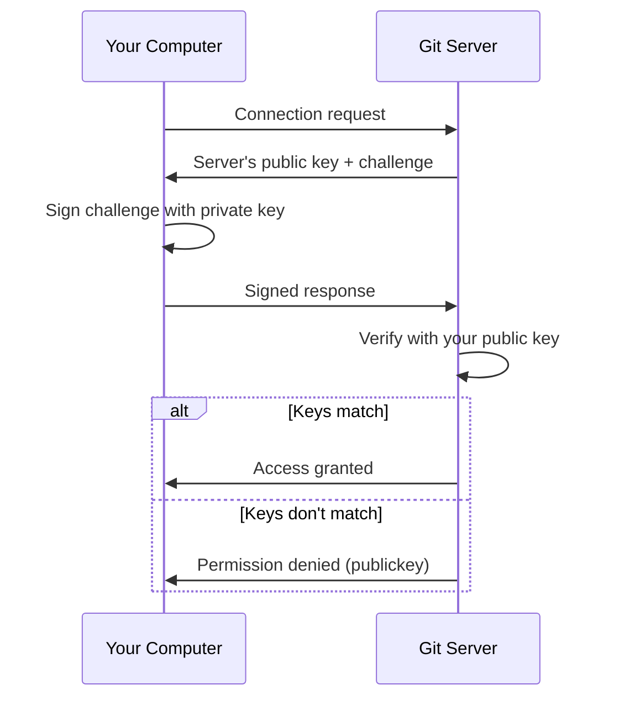
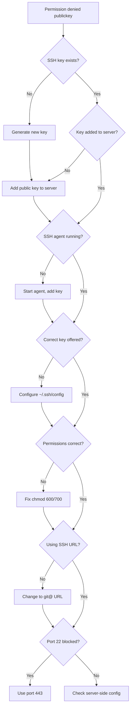

# How to Fix 'Permission Denied (publickey)' Errors

Author: [nawazdhandala](https://www.github.com/nawazdhandala)

Tags: Git, SSH, Authentication, Security, DevOps, GitHub, GitLab, Troubleshooting

Description: A comprehensive guide to diagnosing and fixing SSH 'Permission denied (publickey)' errors when connecting to Git hosting services like GitHub, GitLab, and Bitbucket.

---

The "Permission denied (publickey)" error is one of the most frustrating Git errors. It means the remote server rejected your SSH connection because it could not verify your identity. This guide walks through systematic troubleshooting to get you connected.

## Understanding SSH Authentication



SSH authentication uses a key pair. Your private key stays on your computer, and your public key is uploaded to the Git server. When connecting, the server verifies you possess the private key that matches the public key on file.

## Quick Diagnosis

### Step 1: Test Your Connection

```bash
# For GitHub
ssh -T git@github.com

# For GitLab
ssh -T git@gitlab.com

# For Bitbucket
ssh -T git@bitbucket.org

# For self-hosted servers
ssh -T git@your-server.com
```

Successful response:
```
Hi username! You've successfully authenticated, but GitHub does not provide shell access.
```

Failed response:
```
git@github.com: Permission denied (publickey).
```

### Step 2: Verbose Connection Test

```bash
# Get detailed output
ssh -vT git@github.com
```

Look for these key lines:
```
debug1: Offering public key: /Users/you/.ssh/id_ed25519
debug1: Server accepts key: /Users/you/.ssh/id_ed25519
```

Or failure indicators:
```
debug1: No more authentication methods to try.
Permission denied (publickey).
```

## Common Causes and Solutions

### Cause 1: No SSH Key Exists

Check if you have an SSH key:

```bash
# List SSH keys
ls -la ~/.ssh/

# You should see files like:
# id_ed25519 (private key)
# id_ed25519.pub (public key)
# or
# id_rsa (private key)
# id_rsa.pub (public key)
```

If no keys exist, create one:

```bash
# Create a new Ed25519 key (recommended)
ssh-keygen -t ed25519 -C "your_email@example.com"

# Or RSA if Ed25519 is not supported
ssh-keygen -t rsa -b 4096 -C "your_email@example.com"
```

Follow the prompts:
```
Enter file in which to save the key (/Users/you/.ssh/id_ed25519): [Press Enter]
Enter passphrase (empty for no passphrase): [Type a passphrase]
Enter same passphrase again: [Confirm passphrase]
```

### Cause 2: Public Key Not Added to Server

Get your public key:

```bash
# Display public key
cat ~/.ssh/id_ed25519.pub

# Or copy to clipboard
# macOS
pbcopy < ~/.ssh/id_ed25519.pub

# Linux (requires xclip)
xclip -selection clipboard < ~/.ssh/id_ed25519.pub

# Windows (Git Bash)
clip < ~/.ssh/id_ed25519.pub
```

Add the key to your Git hosting service:

**GitHub:**
1. Go to Settings > SSH and GPG keys
2. Click "New SSH key"
3. Paste your public key
4. Click "Add SSH key"

**GitLab:**
1. Go to Preferences > SSH Keys
2. Paste your public key
3. Set an optional expiry date
4. Click "Add key"

**Bitbucket:**
1. Go to Personal settings > SSH keys
2. Click "Add key"
3. Paste your public key
4. Click "Add key"

### Cause 3: SSH Agent Not Running

The SSH agent holds your keys in memory:

```bash
# Check if agent is running
echo $SSH_AUTH_SOCK

# Start the agent
eval "$(ssh-agent -s)"
# Output: Agent pid 12345

# Add your key to the agent
ssh-add ~/.ssh/id_ed25519

# Verify key is loaded
ssh-add -l
```

For persistent agent on macOS:

```bash
# Add to ~/.ssh/config
Host *
    AddKeysToAgent yes
    UseKeychain yes
    IdentityFile ~/.ssh/id_ed25519
```

### Cause 4: Wrong Key Being Used

If you have multiple keys, SSH might offer the wrong one:

```bash
# See which keys are offered
ssh -vT git@github.com 2>&1 | grep "Offering"
```

Create or update `~/.ssh/config`:

```
# GitHub
Host github.com
    HostName github.com
    User git
    IdentityFile ~/.ssh/id_ed25519_github
    IdentitiesOnly yes

# GitLab
Host gitlab.com
    HostName gitlab.com
    User git
    IdentityFile ~/.ssh/id_ed25519_gitlab
    IdentitiesOnly yes

# Work server
Host work-git
    HostName git.company.com
    User git
    IdentityFile ~/.ssh/id_ed25519_work
    IdentitiesOnly yes
```

### Cause 5: Key File Permissions

SSH requires strict permissions on key files:

```bash
# Check permissions
ls -la ~/.ssh/

# Fix directory permissions
chmod 700 ~/.ssh

# Fix private key permissions
chmod 600 ~/.ssh/id_ed25519

# Fix public key permissions
chmod 644 ~/.ssh/id_ed25519.pub

# Fix config permissions
chmod 600 ~/.ssh/config
```

### Cause 6: Using HTTPS URL Instead of SSH

Check your remote URL:

```bash
git remote -v
# origin  https://github.com/user/repo.git (fetch)  <- HTTPS
# origin  git@github.com:user/repo.git (fetch)      <- SSH
```

Switch to SSH:

```bash
# Change remote URL to SSH
git remote set-url origin git@github.com:user/repo.git

# Verify
git remote -v
```

### Cause 7: Firewall or Network Blocking SSH

Some networks block port 22. Use HTTPS port 443 instead:

```bash
# Test port 443
ssh -T -p 443 git@ssh.github.com
```

Configure SSH to use port 443 for GitHub:

```
# ~/.ssh/config
Host github.com
    HostName ssh.github.com
    Port 443
    User git
```

### Cause 8: Key Not Matching Server Records

Verify your key fingerprint:

```bash
# Get your key's fingerprint
ssh-keygen -lf ~/.ssh/id_ed25519.pub
# SHA256:AbCdEfGhIjKlMnOpQrStUvWxYz1234567890 your_email@example.com
```

Compare with what is registered on GitHub/GitLab. If they do not match, re-upload the correct public key.

## Complete Troubleshooting Workflow



## Platform-Specific Notes

### macOS Keychain Integration

```bash
# Add key to macOS keychain
ssh-add --apple-use-keychain ~/.ssh/id_ed25519

# Verify keychain is used
ssh-add -l
```

### Windows with OpenSSH

```powershell
# Start OpenSSH Authentication Agent
Get-Service ssh-agent | Set-Service -StartupType Automatic
Start-Service ssh-agent

# Add key
ssh-add $env:USERPROFILE\.ssh\id_ed25519
```

### WSL (Windows Subsystem for Linux)

```bash
# Keys in Windows are not accessible from WSL by default
# Generate new keys in WSL or copy them

# Copy from Windows (adjust permissions after)
cp /mnt/c/Users/YourName/.ssh/id_ed25519* ~/.ssh/
chmod 600 ~/.ssh/id_ed25519
chmod 644 ~/.ssh/id_ed25519.pub
```

## Deploy Keys vs User Keys

For automated systems, use deploy keys instead of personal SSH keys:

```bash
# Generate a deploy key
ssh-keygen -t ed25519 -C "deploy-key-server-name" -f ~/.ssh/deploy_key

# Add to repository settings (not user settings)
# Deploy keys are repository-specific
```

Configure for the specific repository:

```
# ~/.ssh/config
Host github-deploy
    HostName github.com
    User git
    IdentityFile ~/.ssh/deploy_key
    IdentitiesOnly yes
```

Clone using the alias:

```bash
git clone git@github-deploy:user/repo.git
```

## Security Best Practices

1. **Always use a passphrase** - Protects your key if the file is compromised
2. **Use Ed25519 keys** - More secure and faster than RSA
3. **Rotate keys periodically** - Replace old keys yearly
4. **Use separate keys** - Different keys for work/personal/servers
5. **Never share private keys** - Generate new keys per device

## Quick Reference

| Issue | Command |
|-------|---------|
| Test connection | `ssh -T git@github.com` |
| Verbose test | `ssh -vT git@github.com` |
| List keys | `ls -la ~/.ssh/` |
| Generate key | `ssh-keygen -t ed25519 -C "email"` |
| View public key | `cat ~/.ssh/id_ed25519.pub` |
| Start agent | `eval "$(ssh-agent -s)"` |
| Add key to agent | `ssh-add ~/.ssh/id_ed25519` |
| List loaded keys | `ssh-add -l` |
| Fix permissions | `chmod 600 ~/.ssh/id_ed25519` |
| Change to SSH URL | `git remote set-url origin git@github.com:user/repo.git` |

---

The "Permission denied (publickey)" error usually comes down to one of a few issues: missing keys, keys not added to the server, agent not running, or wrong key being used. Work through the troubleshooting steps systematically, and you will identify the problem. Once your SSH authentication is properly configured, Git operations become seamless and secure.
