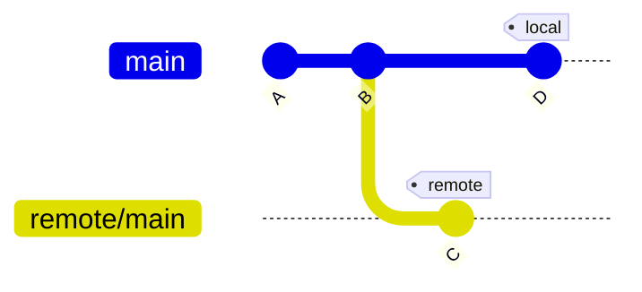
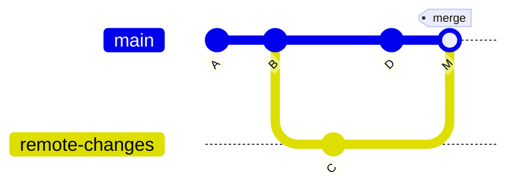
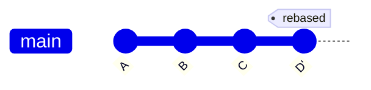
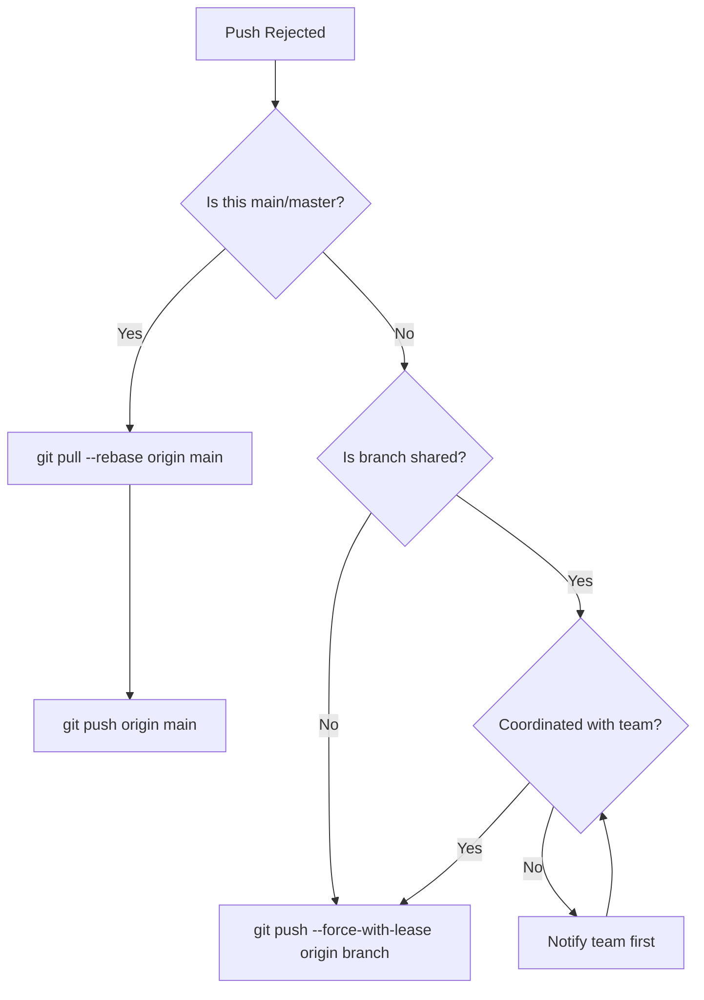

# How to Fix "Push Rejected" Non-Fast-Forward Errors

Author: [nawazdhandala](https://github.com/nawazdhandala)

Tags: Git, Version Control, DevOps, Troubleshooting, Collaboration

Description: Learn why Git rejects non-fast-forward pushes, how to resolve them safely, and when force pushing is appropriate.

---

You try to push your changes and Git responds with "rejected - non-fast-forward." This error stops many developers in their tracks, but it is Git protecting you and your team from data loss. This guide explains why this happens and how to resolve it safely.

## Understanding the Error

The non-fast-forward error occurs when your local branch has diverged from the remote branch. The remote has commits that you do not have locally.

```bash
# Attempt to push
git push origin main

# Error message
To github.com:user/repo.git
 ! [rejected]        main -> main (non-fast-forward)
error: failed to push some refs to 'github.com:user/repo.git'
hint: Updates were rejected because the tip of your current branch is behind
hint: its remote counterpart. Integrate the remote changes (e.g.
hint: 'git pull ...') before pushing again.
```



Your local branch has commit D, but the remote has commit C. Git cannot simply add D on top of C without potentially losing C.

## The Safe Solution: Pull Then Push

The standard fix is to integrate remote changes before pushing.

### Option 1: Pull with Merge

```bash
# Fetch and merge remote changes
git pull origin main

# This creates a merge commit
# Resolve any conflicts if they occur

# Now push includes both histories
git push origin main
```



### Option 2: Pull with Rebase

```bash
# Fetch and rebase your changes on top
git pull --rebase origin main

# Your commits are replayed after remote commits
# Resolve conflicts if they occur for each commit

# Push the linear history
git push origin main
```



## Common Scenarios and Solutions

### Scenario 1: Someone Else Pushed First

The most common cause - another team member pushed changes while you were working.

```bash
# Check what changed on remote
git fetch origin
git log HEAD..origin/main --oneline

# See the commits you are missing
# a1b2c3d Fix bug in login
# e4f5g6h Update dependencies

# Integrate their changes
git pull --rebase origin main

# Push your work
git push origin main
```

### Scenario 2: You Amended a Pushed Commit

Amending rewrites history, creating a new commit that diverges from the pushed version.

```bash
# You pushed commit A
git push origin feature

# Then you amended it
git commit --amend -m "Better message"

# Now your local A' differs from remote A
# Push is rejected

# If no one else uses this branch, force push
git push --force-with-lease origin feature

# If others use this branch, coordinate first
# They will need to reset their local copies
```

### Scenario 3: You Rebased a Pushed Branch

Rebasing rewrites all rebased commits, changing their hashes.

```bash
# You rebased your feature branch on main
git checkout feature
git rebase main

# All your commits now have new hashes
# Push is rejected because remote has old hashes

# For your own feature branch
git push --force-with-lease origin feature

# Never force push shared branches without coordination
```

### Scenario 4: Conflicting Local and Remote Changes

You and a colleague modified the same files.

```bash
# Pull and handle merge conflicts
git pull origin main

# Git shows conflicts
Auto-merging src/app.js
CONFLICT (content): Merge conflict in src/app.js

# Edit the file to resolve conflicts
# Remove conflict markers, keep correct code

# Mark resolved and complete merge
git add src/app.js
git commit -m "Merge remote changes, resolve conflict in app.js"

# Push the merged result
git push origin main
```

## Force Pushing: When and How

Force pushing overwrites the remote branch with your local version. This is dangerous but sometimes necessary.

### Safe Force Push with Lease

```bash
# Force push only if remote has not changed since you fetched
git push --force-with-lease origin feature

# This fails if someone else pushed in the meantime
# Protecting their work from being overwritten
```

### Regular Force Push (Dangerous)

```bash
# Overwrites remote regardless of its state
git push --force origin feature

# Only use when you are absolutely certain
# and have coordinated with your team
```

### When Force Push is Acceptable

| Situation | Force Push OK? | Notes |
|-----------|----------------|-------|
| Your own feature branch | Yes | Use `--force-with-lease` |
| After interactive rebase | Yes | On your own branch only |
| Removing sensitive data | Yes | Coordinate with team |
| main/master branch | NO | Use merge/revert instead |
| Shared feature branch | Coordinate | Warn teammates first |

## Preventing Non-Fast-Forward Errors

### Practice 1: Pull Before You Push

```bash
# Make this a habit
git pull --rebase origin main
git push origin main

# Or configure Git to always rebase on pull
git config --global pull.rebase true
```

### Practice 2: Push Frequently

Small, frequent pushes reduce divergence.

```bash
# Commit and push small changes
git add feature.js
git commit -m "Add feature skeleton"
git push origin feature

# Continue working
git add feature.js
git commit -m "Implement feature logic"
git push origin feature
```

### Practice 3: Use Short-Lived Branches

Long-running branches accumulate more divergence.


### Practice 4: Communicate with Your Team

```bash
# Before force pushing a shared branch
# 1. Notify team on Slack/Teams
# 2. Have them push their changes first
# 3. Force push
# 4. Team members reset:
git fetch origin
git reset --hard origin/feature
```

## Recovering from Force Push Mistakes

### If You Accidentally Force Pushed

```bash
# Find the commit that was overwritten
git reflog origin/main

# Output shows previous positions
# a1b2c3d origin/main@{1}: fetch: forced-update
# x1y2z3w origin/main@{2}: update by push

# If you have the lost commits locally
git push --force origin x1y2z3w:main

# If commits are truly lost, check with teammates
# or contact your Git hosting provider
```

### If Someone Else Force Pushed Your Branch

```bash
# Fetch the new state
git fetch origin

# Save your local work
git branch backup-feature feature

# Reset to remote state
git checkout feature
git reset --hard origin/feature

# Cherry-pick your lost commits from backup
git cherry-pick <commit-hashes>
```

## Branch Protection Rules

Prevent force push issues with repository settings.

### GitHub Branch Protection

```yaml
# In repository settings -> Branches -> Add rule
Branch name pattern: main

Protect matching branches:
  [x] Require pull request before merging
  [x] Require status checks to pass
  [x] Require branches to be up to date
  [x] Do not allow force pushes
  [x] Do not allow deletions
```

### GitLab Protected Branches

```yaml
# Settings -> Repository -> Protected Branches
Branch: main
Allowed to merge: Maintainers
Allowed to push: No one
Allowed to force push: No
```

## Quick Reference

| Situation | Command |
|-----------|---------|
| Standard fix | `git pull --rebase origin main && git push` |
| See remote changes | `git fetch origin && git log HEAD..origin/main` |
| Safe force push | `git push --force-with-lease origin feature` |
| Reset to remote | `git fetch origin && git reset --hard origin/main` |
| Recover lost commits | `git reflog` then `git cherry-pick` |

## Decision Flowchart



## Summary

The non-fast-forward error is Git preventing you from accidentally overwriting commits on the remote. The safe path is always to pull first, integrate remote changes, then push. Force pushing has its place for personal branches and after rebasing, but should never be done on shared branches without coordination.

Key takeaways:
- Pull before push to avoid the error
- Use `git pull --rebase` for cleaner history
- Use `--force-with-lease` instead of `--force`
- Never force push to main/master
- Set up branch protection rules to prevent accidents
- Communicate with your team before rewriting shared history
