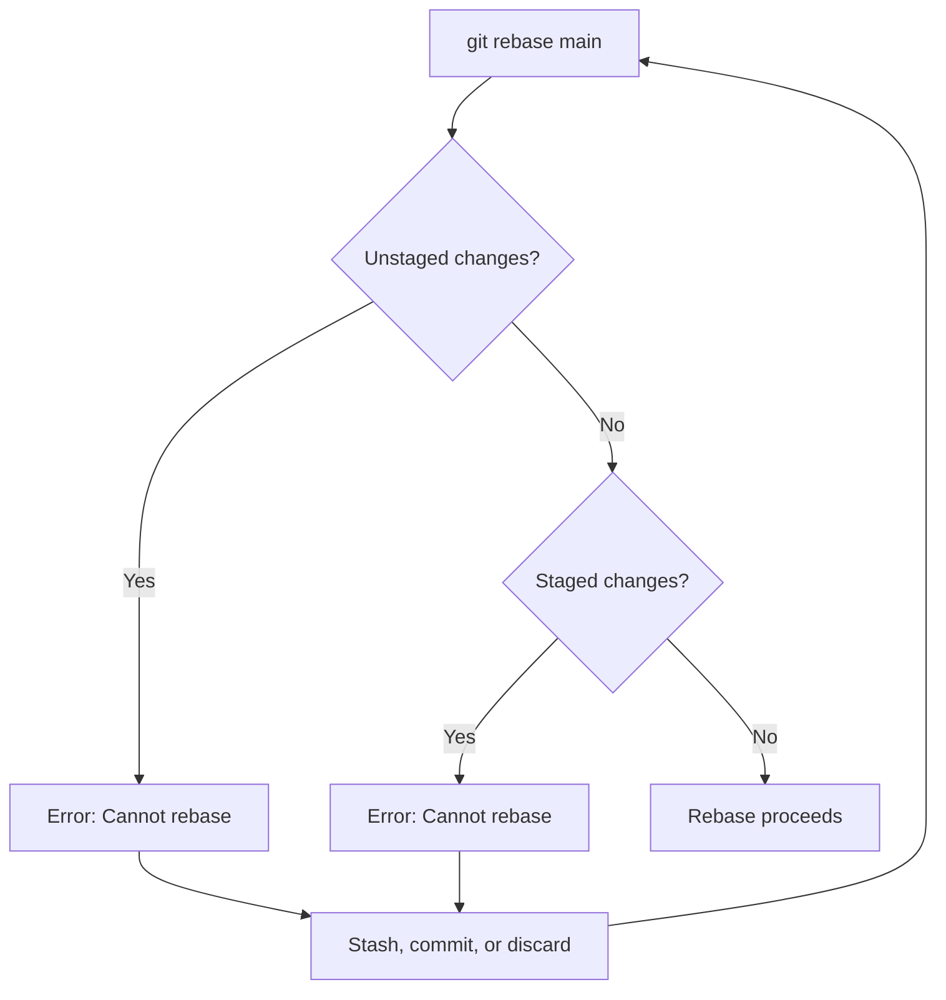
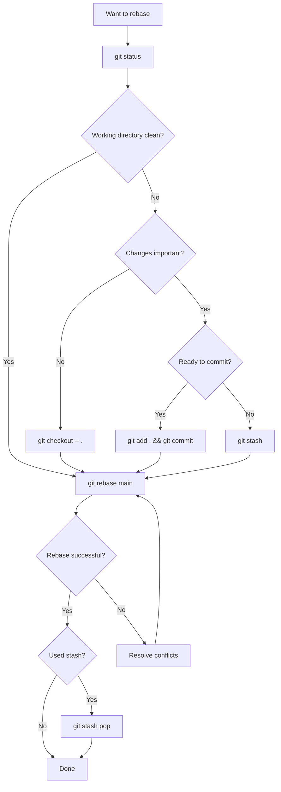

# How to Fix 'Cannot Rebase: Unstaged Changes' Errors

Author: [nawazdhandala](https://www.github.com/nawazdhandala)

Tags: Git, Rebase, Troubleshooting, Version Control, DevOps

Description: Learn how to resolve Git rebase errors caused by unstaged changes, including automatic stashing, manual resolution, and prevention strategies.

---

You are in the middle of work when you try to rebase and Git stops you cold: "Cannot rebase: You have unstaged changes." This error protects your work from being lost, but it can be frustrating when you just want to update your branch. Here is how to handle every variation of this error.

## Understanding the Error

Git rebase rewrites commit history by replaying your commits on top of another branch. This process modifies your working directory, and Git refuses to do this if you have uncommitted changes that might be overwritten.

```bash
# The error you see
git rebase main
error: cannot rebase: You have unstaged changes.
error: Please commit or stash them.
```



## Quick Solutions

### Solution 1: Use Autostash

The simplest solution is to let Git handle it automatically.

```bash
# Rebase with automatic stashing
git rebase --autostash main

# Git will:
# 1. Stash your changes
# 2. Perform the rebase
# 3. Pop the stash automatically
```

Make this the default behavior:

```bash
# Enable autostash globally
git config --global rebase.autoStash true

# Now regular rebase will autostash
git rebase main
# Created autostash: abc1234
# ... rebase proceeds ...
# Applied autostash.
```

### Solution 2: Manual Stash

```bash
# Stash your changes
git stash

# Perform the rebase
git rebase main

# Restore your changes
git stash pop
```

If you have untracked files too:

```bash
# Stash including untracked files
git stash -u

# Or stash everything including ignored files
git stash -a

git rebase main
git stash pop
```

### Solution 3: Commit Your Changes

If your changes are ready to be committed:

```bash
# Stage and commit
git add .
git commit -m "WIP: work in progress"

# Now rebase
git rebase main

# Optionally, undo the WIP commit but keep changes
git reset --soft HEAD~1
```

### Solution 4: Discard Changes (Use Carefully)

If you do not need the changes:

```bash
# Discard unstaged changes to tracked files
git checkout -- .

# Or using restore (Git 2.23+)
git restore .

# Also remove untracked files if needed
git clean -fd

# Now rebase works
git rebase main
```

## Handling Specific Scenarios

### Scenario 1: Unstaged Changes Only

```bash
# Check what you have
git status
# Changes not staged for commit:
#   modified: src/app.js

# Option A: Stash
git stash
git rebase main
git stash pop

# Option B: Add to staging (still need to commit or stash)
git add src/app.js
git stash
git rebase main
git stash pop
```

### Scenario 2: Both Staged and Unstaged Changes

```bash
git status
# Changes to be committed:
#   modified: src/config.js
# Changes not staged for commit:
#   modified: src/app.js

# Stash handles both
git stash
git rebase main
git stash pop

# Your staged changes return to staged state
```

### Scenario 3: Changes Conflict with Rebase

Sometimes your stashed changes conflict with the rebased code.

```bash
git stash
git rebase main
git stash pop
# Auto-merging src/app.js
# CONFLICT (content): Merge conflict in src/app.js

# Resolve the conflict manually
vim src/app.js  # Edit and resolve

# Mark as resolved
git add src/app.js

# Continue with your work (no commit needed for stash conflicts)
```

### Scenario 4: Interactive Rebase with Changes

```bash
# Interactive rebase also requires clean state
git rebase -i HEAD~5
# error: cannot rebase: You have unstaged changes.

# Same solutions apply
git stash
git rebase -i HEAD~5
# ... make your changes in the editor ...
git stash pop
```

## Advanced Techniques

### Partial Stashing

Stash only specific files:

```bash
# Stash specific files
git stash push -m "partial stash" src/app.js src/config.js

git rebase main

git stash pop
```

Or stash interactively:

```bash
# Choose what to stash interactively
git stash -p

# Git will prompt for each hunk:
# Stash this hunk [y,n,q,a,d,j,J,g,/,e,?]?
```

### Keep Index Option

Stash but keep staged changes:

```bash
# Stash unstaged changes only
git stash --keep-index

git rebase main

git stash pop
```

### Creating a Temporary Commit

For complex situations, a temporary commit gives you more control:

```bash
# Commit everything temporarily
git add -A
git commit -m "TEMP: Will be removed"

# Rebase
git rebase main

# Undo the temp commit but keep changes staged
git reset --soft HEAD~1

# Or undo and unstage
git reset HEAD~1
```

## Understanding Related Errors

### "Cannot Rebase: Your Index Contains Uncommitted Changes"

This means you have staged but uncommitted changes.

```bash
git status
# Changes to be committed:
#   modified: src/app.js

# Same solutions: stash or commit
git stash
git rebase main
git stash pop
```

### "Cannot Pull with Rebase: You Have Unstaged Changes"

This is the same error during `git pull --rebase`.

```bash
git pull --rebase
# error: cannot pull with rebase: You have unstaged changes.

# Solutions
git pull --rebase --autostash

# Or
git stash
git pull --rebase
git stash pop
```

### "Untracked Files Would Be Overwritten"

Different error, but related. Untracked files conflict with incoming changes.

```bash
git rebase main
# error: The following untracked working tree files would be overwritten by checkout:
#   src/newfile.js

# Option 1: Remove or move the file
rm src/newfile.js  # or mv src/newfile.js src/newfile.js.bak

# Option 2: Stash untracked files too
git stash -u
git rebase main
git stash pop
```

## Workflow Diagram



## Prevention Strategies

### 1. Always Check Status First

```bash
# Before any rebase operation
git status

# Quick check
git status -s
```

### 2. Configure Autostash Globally

```bash
# One-time setup
git config --global rebase.autoStash true
git config --global pull.rebase true

# Now both rebase and pull will autostash
```

### 3. Use Git Hooks

Create a pre-rebase hook to warn about uncommitted changes:

```bash
#!/bin/bash
# .git/hooks/pre-rebase

if ! git diff-index --quiet HEAD --; then
    echo "Warning: You have uncommitted changes."
    echo "Consider committing or stashing before rebase."
    # Uncomment to block rebase:
    # exit 1
fi
```

### 4. Commit Frequently

The best prevention is committing often:

```bash
# Quick WIP commits
git add -A && git commit -m "WIP"

# Squash later with interactive rebase
git rebase -i main
```

## Quick Reference

```bash
# Check status
git status

# Autostash solutions
git rebase --autostash main
git config --global rebase.autoStash true

# Manual stash
git stash                    # Stash tracked changes
git stash -u                 # Include untracked files
git stash -a                 # Include ignored files too
git stash pop                # Restore stashed changes

# Discard changes (careful!)
git checkout -- .            # Discard unstaged changes
git restore .                # Git 2.23+ equivalent
git clean -fd                # Remove untracked files

# Temporary commit approach
git add -A && git commit -m "TEMP"
git rebase main
git reset --soft HEAD~1      # Undo commit, keep staged
```

---

The "unstaged changes" error during rebase is Git protecting your work. With autostash configured globally, you will rarely see this error again. When you do encounter it, you now have multiple strategies to handle it quickly and get back to your work. Remember that `git stash` is your friend for temporarily putting aside work, while committing is better for changes you want to keep in your history.
