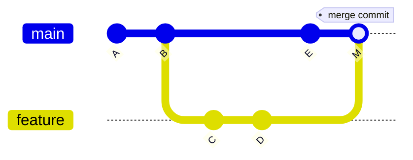
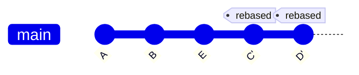
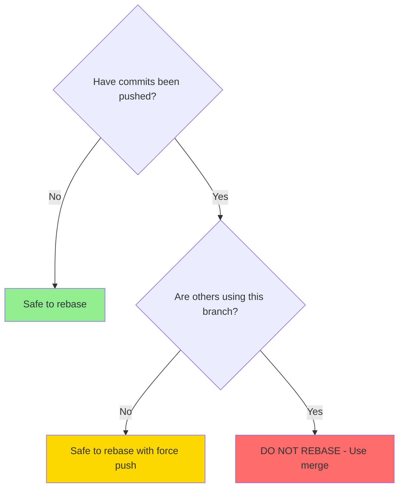

# How to Handle Git Rebase vs Merge Strategies

Author: [nawazdhandala](https://github.com/nawazdhandala)

Tags: Git, Version Control, DevOps, Workflow, Best Practices

Description: Understand the differences between Git rebase and merge strategies, when to use each, and how to implement them effectively in your workflow.

---

The rebase vs merge debate is one of the most discussed topics in Git workflows. Both strategies integrate changes from one branch into another, but they do so in fundamentally different ways. Understanding when to use each approach helps you maintain a clean, readable project history while avoiding common pitfalls.

## How Merge Works

Merge creates a new commit that combines changes from two branches. It preserves the complete history of both branches, including the order in which commits were made.



```bash
# Standard merge workflow
git checkout main
git merge feature-branch

# Creates a merge commit that combines histories
# Both branches' commits remain in their original order
```

## How Rebase Works

Rebase rewrites history by moving your branch's commits to start from a new base commit. This creates a linear history that appears as if you started your work after the latest main branch changes.



```bash
# Standard rebase workflow
git checkout feature-branch
git rebase main

# Your commits C and D are "replayed" on top of E
# New commit hashes are created (C' and D')
```

## Comparison Table

| Aspect | Merge | Rebase |
|--------|-------|--------|
| **History** | Non-linear, shows branches | Linear, single line |
| **Commit hashes** | Preserved | Changed |
| **Merge commits** | Created | None |
| **Conflict resolution** | Once | Per commit |
| **Safe for shared branches** | Yes | No |
| **Shows when work happened** | Yes | No |

## When to Use Merge

### Scenario 1: Integrating Shared Branches

Always use merge when integrating changes that others depend on.

```bash
# Merging a release branch into main
git checkout main
git merge release-v2.0

# This preserves the release branch history
# and creates a clear integration point
```

### Scenario 2: Preserving Feature History

When the feature branch history tells a story worth keeping:

```bash
# Feature with meaningful commit progression
git log --oneline feature-auth
# a1b2c3d Add user model
# e4f5g6h Implement login endpoint
# i7j8k9l Add password hashing
# m1n2o3p Write authentication tests

# Merge preserves this progression
git checkout main
git merge --no-ff feature-auth
```

The `--no-ff` flag forces a merge commit even when fast-forward is possible, preserving the branch structure.

### Scenario 3: Team Collaboration on a Branch

When multiple developers work on the same feature branch:

```bash
# Developer A pushes to feature-branch
git push origin feature-branch

# Developer B pulls and merges their work
git pull origin feature-branch
# This creates merge commits but is safe

# Rebasing would rewrite commits Developer A already has
# causing confusion and potential data loss
```

## When to Use Rebase

### Scenario 1: Updating Your Feature Branch

Before opening a pull request, rebase to include the latest main changes:

```bash
# Update feature branch with latest main
git checkout feature-branch
git fetch origin
git rebase origin/main

# Your commits now apply on top of latest main
# Pull request will have no merge conflicts
```

### Scenario 2: Cleaning Up Local History

Before sharing your work, clean up work-in-progress commits:

```bash
# Interactive rebase to squash commits
git rebase -i HEAD~4

# In the editor:
pick a1b2c3d Add user authentication
squash e4f5g6h Fix typo
squash i7j8k9l WIP
pick m1n2o3p Add tests

# Result: clean history with meaningful commits
```

### Scenario 3: Linear Project History

Some teams prefer a linear history for easier navigation:

```bash
# Configure pull to rebase instead of merge
git config --global pull.rebase true

# Now git pull will rebase your local changes
git pull origin main

# Equivalent to:
git fetch origin
git rebase origin/main
```

## The Golden Rule of Rebasing

Never rebase commits that have been pushed to a shared repository and that others might have based their work on.



```bash
# BAD: Rebasing shared commits
git checkout main
git rebase feature  # Others have main checked out - DON'T DO THIS

# GOOD: Rebasing your own feature branch
git checkout my-feature
git rebase main     # Only you are working on my-feature - SAFE
```

## Handling Rebase Conflicts

Unlike merge, rebase may require you to resolve conflicts multiple times, once for each commit being replayed.

```bash
# Start rebase
git rebase main

# Conflict occurs
CONFLICT (content): Merge conflict in src/app.js
error: could not apply a1b2c3d... Add feature

# Fix the conflict
# Edit src/app.js, remove conflict markers

# Stage and continue
git add src/app.js
git rebase --continue

# Another conflict may occur for the next commit
# Repeat until rebase completes

# If things go wrong, abort
git rebase --abort
```

## Merge Strategies

Git offers different merge strategies for various situations.

### Recursive (Default)

The standard three-way merge:

```bash
git merge feature-branch
# Uses recursive strategy by default
```

### Ours Strategy

Keeps your version, ignoring incoming changes entirely:

```bash
# Keep main version, discard feature changes
git merge -s ours feature-branch

# Useful when you want to record that a merge happened
# but keep your current code
```

### Squash Merge

Combines all feature commits into one, then merges without a merge commit:

```bash
# Squash all feature commits into one
git merge --squash feature-branch

# This stages all changes but does not commit
# You must commit manually
git commit -m "Add feature X (squashed)"

# Result: single commit in main, no merge commit
```

## Rebase Strategies

### Standard Rebase

```bash
git rebase main
# Replays all commits on top of main
```

### Interactive Rebase

Allows reordering, squashing, and editing commits:

```bash
git rebase -i main

# Commands in interactive mode:
# pick   - use commit as is
# reword - change commit message
# edit   - stop to amend the commit
# squash - combine with previous commit
# fixup  - like squash but discard message
# drop   - remove commit entirely
```

### Onto Rebase

Rebase onto a specific commit, useful for moving branches:

```bash
# Move feature-b to branch off feature-a instead of main
git rebase --onto feature-a main feature-b

# Before:
# main: A - B - C
# feature-b: A - B - X - Y

# After:
# main: A - B - C
# feature-a: A - B - C - D - E
# feature-b: A - B - C - D - E - X' - Y'
```

## Team Workflow Recommendations

### Small Teams / Linear History

```bash
# .gitconfig for team members
[pull]
    rebase = true
[rebase]
    autoStash = true

# Workflow:
# 1. Create feature branch
git checkout -b feature/my-task

# 2. Work and commit
git commit -m "Implement feature"

# 3. Before PR, rebase on main
git fetch origin
git rebase origin/main

# 4. Force push if needed (your branch only)
git push --force-with-lease origin feature/my-task

# 5. Merge PR with squash
# Configured in GitHub/GitLab settings
```

### Large Teams / Preserve History

```bash
# Workflow:
# 1. Create feature branch
git checkout -b feature/my-task

# 2. Work and commit with meaningful messages
git commit -m "Add user model"
git commit -m "Implement authentication endpoint"

# 3. Keep up to date with merge
git fetch origin
git merge origin/main

# 4. Push normally
git push origin feature/my-task

# 5. Merge PR with merge commit
# Preserves all history
```

## Fixing Common Mistakes

### Accidentally Rebased Shared Branch

```bash
# If you rebased and force pushed a shared branch
# Tell teammates immediately

# Teammates should:
git fetch origin
git reset --hard origin/branch-name

# This discards their local version and uses the rebased one
```

### Merge When You Meant to Rebase

```bash
# Undo the merge (if not pushed)
git reset --hard HEAD~1

# Now rebase instead
git rebase origin/main
```

### Rebase When You Meant to Merge

```bash
# Use reflog to find pre-rebase state
git reflog

# Find the commit before rebase
# a1b2c3d HEAD@{2}: rebase (start): checkout main

# Reset to that point
git reset --hard HEAD@{3}

# Now merge instead
git merge main
```

## Configuring Git Defaults

```bash
# Set default pull behavior
git config --global pull.rebase true    # Rebase on pull
git config --global pull.rebase false   # Merge on pull (default)

# Auto-stash before rebase
git config --global rebase.autoStash true

# Use force-with-lease for safer force pushes
git config --global alias.pushf "push --force-with-lease"

# Helpful aliases
git config --global alias.rb "rebase"
git config --global alias.rbi "rebase -i"
git config --global alias.rbc "rebase --continue"
git config --global alias.rba "rebase --abort"
```

## Summary

| Situation | Recommendation |
|-----------|----------------|
| Integrating shared branches | Merge |
| Updating your feature branch | Rebase |
| Cleaning up commits before PR | Interactive rebase |
| Multiple developers on one branch | Merge |
| Want linear history | Rebase |
| Preserving feature development story | Merge with `--no-ff` |
| Quick single-commit features | Squash merge |

Both rebase and merge have their place in a healthy Git workflow. The key is understanding the tradeoffs and being consistent within your team. Many successful teams use a combination: rebase locally to keep branches updated, then merge (or squash merge) when integrating to main.
