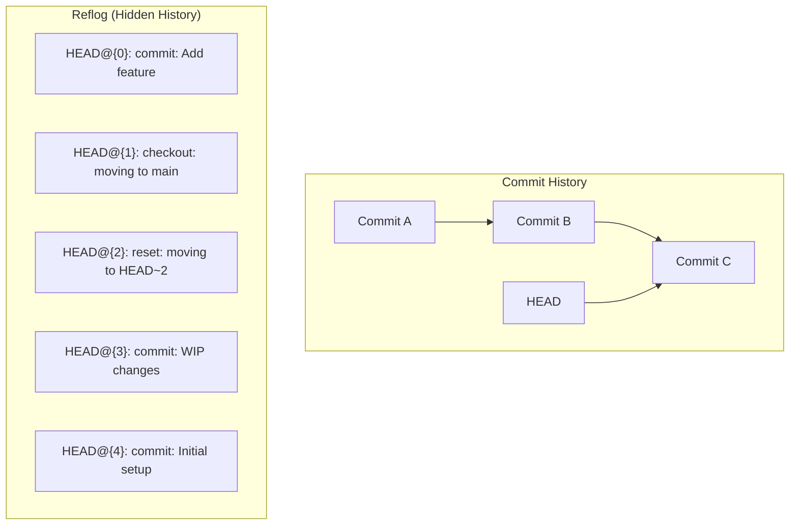

# How to Handle Git Reflog for Recovery

Author: [nawazdhandala](https://www.github.com/nawazdhandala)

Tags: Git, Recovery, Reflog, Version Control, DevOps, Development, Troubleshooting

Description: Learn how to use Git reflog to recover lost commits, branches, and changes after accidental resets, rebases, or other destructive operations.

---

Git reflog is your safety net when things go wrong. Accidentally deleted a branch? Did a hard reset and lost commits? Messed up a rebase? The reflog records every change to HEAD and branch tips, allowing you to recover from almost any mistake. This guide shows you how to use reflog effectively for recovery.

## Understanding Git Reflog

The reflog (reference log) is a local journal that records when branch tips and HEAD were updated. Unlike the commit history, reflog entries are not shared with remote repositories and are automatically pruned after 90 days (configurable).



Even if you reset, rebase, or delete branches, the original commits still exist in the repository until garbage collection runs. Reflog helps you find them.

## Viewing the Reflog

### Basic Reflog Commands

```bash
# View reflog for HEAD
git reflog

# View reflog for a specific branch
git reflog show main

# View reflog with dates
git reflog --date=iso

# View reflog with relative dates
git reflog --date=relative

# View detailed reflog
git reflog --all
```

### Understanding Reflog Output

```bash
$ git reflog
a1b2c3d HEAD@{0}: commit: Add user authentication
e4f5g6h HEAD@{1}: checkout: moving from feature to main
i7j8k9l HEAD@{2}: commit: Implement login form
m0n1o2p HEAD@{3}: reset: moving to HEAD~3
q3r4s5t HEAD@{4}: rebase (finish): returning to refs/heads/main
u6v7w8x HEAD@{5}: rebase (start): checkout origin/main
```

Each entry shows:
- **Commit hash**: The SHA at that point in time
- **Reference**: `HEAD@{n}` where n is how many moves ago
- **Action**: What operation was performed
- **Description**: Details about the operation

## Common Recovery Scenarios

### Scenario 1: Recover from Accidental Hard Reset

You ran `git reset --hard` and lost commits.

```bash
# You were here
git log --oneline
# a1b2c3d Add feature C
# e4f5g6h Add feature B
# i7j8k9l Add feature A

# You accidentally ran
git reset --hard HEAD~2

# Now you only have
git log --oneline
# i7j8k9l Add feature A

# Recovery: Check reflog
git reflog
# i7j8k9l HEAD@{0}: reset: moving to HEAD~2
# a1b2c3d HEAD@{1}: commit: Add feature C
# e4f5g6h HEAD@{2}: commit: Add feature B

# Recover by resetting to the commit before the reset
git reset --hard HEAD@{1}
# or
git reset --hard a1b2c3d
```

### Scenario 2: Recover a Deleted Branch

You deleted a branch that had unmerged commits.

```bash
# Delete branch
git branch -D feature-important
# Deleted branch feature-important (was a1b2c3d).

# Recovery: Find the commit in reflog
git reflog | grep feature-important
# or search for commits around that time
git reflog --date=relative

# Recreate the branch
git branch feature-important a1b2c3d

# Or checkout directly
git checkout -b feature-important a1b2c3d
```

### Scenario 3: Recover from Bad Rebase

Your interactive rebase went wrong and you want to undo it.

```bash
# You started a rebase
git rebase -i HEAD~5
# Made mistakes, conflicts, or wrong squashes

# Check reflog to find state before rebase
git reflog
# a1b2c3d HEAD@{0}: rebase (finish): returning to refs/heads/main
# e4f5g6h HEAD@{1}: rebase (pick): Commit message
# ...
# z9y8x7w HEAD@{10}: rebase (start): checkout origin/main
# m0n1o2p HEAD@{11}: commit: Your last good commit

# Reset to before rebase
git reset --hard HEAD@{11}
# or
git reset --hard m0n1o2p
```

### Scenario 4: Find Lost Stash Entries

Stashes that were dropped can sometimes be recovered.

```bash
# You dropped a stash
git stash drop

# Find orphaned stash commits
git fsck --unreachable | grep commit

# Or search reflog for stash operations
git reflog show stash

# Apply the lost stash by its SHA
git stash apply <SHA-from-fsck>
```

### Scenario 5: Recover After Force Push

You force pushed and need to restore the remote branch.

```bash
# Check your local reflog (if you still have the commits)
git reflog show origin/main
# Shows where origin/main pointed before you fetched

# If you have the commits locally
git push --force origin <good-commit>:main

# If someone else has the old commits
# They can push to restore:
git push --force origin main
```

## Advanced Reflog Techniques

### Search Reflog by Date

```bash
# Find commits from a specific time
git reflog --date=local | grep "Jan 15"

# Commits before a date
git log -g --before="2026-01-15" --oneline

# Commits in a date range
git reflog --since="2 days ago" --until="1 day ago"
```

### Search Reflog by Message

```bash
# Find specific operations
git reflog | grep "checkout"
git reflog | grep "reset"
git reflog | grep "rebase"

# Find commits with specific messages
git log -g --grep="authentication" --oneline
```

### Using ORIG_HEAD

Git sets `ORIG_HEAD` before destructive operations like merge, rebase, or reset.

```bash
# After a merge you want to undo
git reset --hard ORIG_HEAD

# After a rebase
git reset --hard ORIG_HEAD

# Note: ORIG_HEAD only stores the last operation
# For older operations, use reflog
```

### Branch-Specific Reflog

```bash
# View reflog for specific branch
git reflog show feature-branch

# Find where branch was before merge
git reflog show main | grep "merge"
```

## Recovery Decision Flowchart

```mermaid
flowchart TD
    START[Lost something?] --> WHAT{What did you lose?}

    WHAT -->|Commits| C1{How?}
    C1 -->|reset --hard| R1[git reflog<br/>git reset --hard HEAD@{n}]
    C1 -->|Bad rebase| R2[git reflog<br/>Find pre-rebase commit<br/>git reset --hard SHA]
    C1 -->|Amend mistake| R3[git reflog<br/>git reset --hard HEAD@{1}]

    WHAT -->|Branch| B1[Find last commit SHA]
    B1 --> B2[git reflog or<br/>git branch -D output]
    B2 --> B3[git branch name SHA]

    WHAT -->|Stash| S1[git fsck --unreachable]
    S1 --> S2[git stash apply SHA]

    WHAT -->|File changes| F1{Committed?}
    F1 -->|Yes| F2[git checkout SHA -- file]
    F1 -->|No| F3[Check IDE history<br/>or backups]
```

## Reflog Configuration

### Adjust Expiration Times

```bash
# Check current settings
git config gc.reflogExpire
git config gc.reflogExpireUnreachable

# Set longer retention (default is 90 days for reachable, 30 for unreachable)
git config --global gc.reflogExpire 180.days
git config --global gc.reflogExpireUnreachable 90.days

# Never expire (use with caution - grows indefinitely)
git config --global gc.reflogExpire never
```

### Disable Reflog (Not Recommended)

```bash
# Disable reflog for a repository
git config core.logAllRefUpdates false

# Re-enable
git config core.logAllRefUpdates true
```

## Reflog Best Practices

### Before Destructive Operations

```bash
# Create a backup branch
git branch backup-before-rebase

# Note current HEAD
git rev-parse HEAD
# Save this SHA somewhere safe

# Check reflog works
git reflog -1
```

### Recovery Script

Create a helper script for common recoveries:

```bash
#!/bin/bash
# git-recover.sh - Helper for git recovery

case "$1" in
  "show")
    # Show recent reflog with context
    git reflog --date=relative | head -20
    ;;
  "branches")
    # Find deleted branch commits
    git fsck --unreachable | grep commit | head -20
    ;;
  "reset")
    # Show recent resets
    git reflog | grep reset
    ;;
  "stash")
    # Find lost stashes
    git fsck --unreachable | grep commit | while read _ _ sha; do
      if git log -1 --format=%s $sha 2>/dev/null | grep -q "WIP on\|On "; then
        echo "Possible stash: $sha"
        git log -1 --format="%h %s" $sha
      fi
    done
    ;;
  *)
    echo "Usage: git-recover [show|branches|reset|stash]"
    ;;
esac
```

### Helpful Aliases

```ini
# Add to ~/.gitconfig
[alias]
    # Show reflog with better formatting
    rl = reflog --format='%C(yellow)%h%Creset %C(green)%gd%Creset %C(blue)%gs%Creset %C(white)%s%Creset'

    # Find lost commits
    lost = fsck --unreachable --no-reflogs

    # Undo last operation
    undo-last = reset --hard HEAD@{1}

    # Show what changed between reflog entries
    reflog-diff = "!f() { git diff HEAD@{$1}..HEAD@{$2}; }; f"
```

## What Reflog Cannot Recover

There are limits to what reflog can help with:

1. **Uncommitted changes**: If you never committed, reflog cannot help. Check your IDE's local history.

2. **After garbage collection**: Once `git gc` runs and prunes unreachable objects, they are gone.

```bash
# Check if objects still exist
git cat-file -e <SHA> && echo "exists" || echo "gone"
```

3. **Remote repository changes**: Reflog is local. If someone force pushes to remote, your reflog does not help them.

4. **Files not tracked**: Untracked files that were deleted are not in Git at all.

## Summary

The reflog is your time machine for Git. Key points to remember:

- `git reflog` shows all HEAD movements
- `HEAD@{n}` references the nth previous position
- `git reset --hard HEAD@{n}` restores to that state
- Reflog entries expire after 90 days by default
- Always check reflog before panicking about lost commits

When you think you have lost commits, stop and check the reflog before doing anything else. The commits are almost certainly still there, waiting to be recovered.

```bash
# The recovery mantra
git reflog           # Find what you need
git show HEAD@{n}    # Verify it's the right commit
git reset --hard HEAD@{n}  # Restore
```
