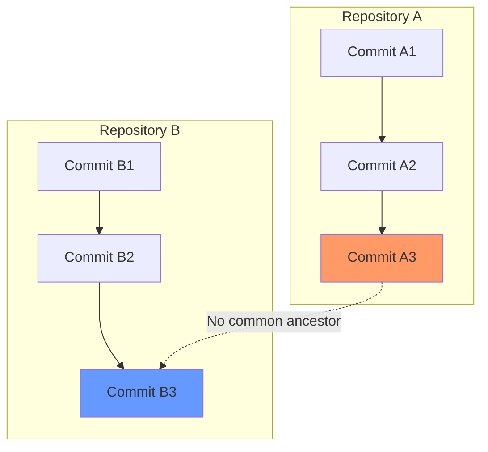
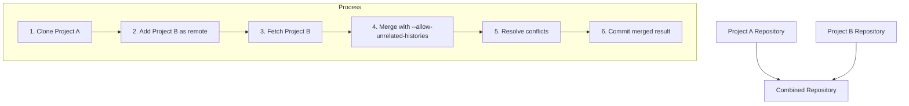

# How to Fix 'Fatal: refusing to merge unrelated histories'

Author: [nawazdhandala](https://www.github.com/nawazdhandala)

Tags: Git, Version Control, Troubleshooting, Merge, DevOps

Description: Learn why git refuses to merge unrelated histories and how to safely combine repositories that do not share a common ancestor.

---

You try to pull from a remote or merge a branch and git stops you with "fatal: refusing to merge unrelated histories". This error appears when you attempt to combine two branches that have no common commit ancestor. Git is protecting you from accidentally merging completely separate projects, but sometimes merging unrelated histories is exactly what you need to do.

## Understanding the Error

Git tracks project history through a chain of commits. Each commit points to its parent, forming a tree. When you merge, git finds the common ancestor and combines the changes since that point. If there is no common ancestor, git cannot determine how to merge.



The two histories are completely separate. Git refuses to merge because it cannot find where they diverged.

---

## When This Error Occurs

### Scenario 1: New Local Repository Pulling from Remote

You create a local repository with an initial commit, then try to connect it to an existing remote.

```bash
# Create local repo with initial commit
mkdir my-project
cd my-project
git init
echo "# My Project" > README.md
git add README.md
git commit -m "Initial commit"

# Add remote that already has commits
git remote add origin https://github.com/user/existing-repo.git

# Try to pull
git pull origin main
# fatal: refusing to merge unrelated histories
```

The remote has its own history starting from a different initial commit.

### Scenario 2: Combining Two Separate Projects

You want to merge two independent repositories into one.

```bash
# Clone first repo
git clone https://github.com/user/frontend.git combined-project
cd combined-project

# Add second repo as remote
git remote add backend https://github.com/user/backend.git
git fetch backend

# Try to merge
git merge backend/main
# fatal: refusing to merge unrelated histories
```

### Scenario 3: Repository Recreation

The remote repository was deleted and recreated, losing the shared history.

```bash
# You had a local clone
cd existing-local-clone

# Someone deleted and recreated the remote repo
git pull
# fatal: refusing to merge unrelated histories

# The new remote has completely new commits
```

---

## The Solution: Allow Unrelated Histories

Use the `--allow-unrelated-histories` flag to force the merge.

```bash
# Pull with unrelated histories allowed
git pull origin main --allow-unrelated-histories

# Or merge a branch
git merge other-branch --allow-unrelated-histories
```

Git will attempt to merge the two histories. Since there is no common base, all files from both histories need to be combined.

---

## Handling Merge Conflicts

When merging unrelated histories, conflicts are common if both repositories have files with the same name.

```bash
git pull origin main --allow-unrelated-histories
# Auto-merging README.md
# CONFLICT (add/add): Merge conflict in README.md
# Automatic merge failed; fix conflicts and then commit the result.
```

The conflict marker shows both versions.

```markdown
<<<<<<< HEAD
# My Local Project
This is my local README.
=======
# Remote Project
This is the remote README.
>>>>>>> origin/main
```

Resolve by editing the file to combine or choose the content you want.

```bash
# Edit the conflicted file
vim README.md

# Stage the resolved file
git add README.md

# Complete the merge
git commit -m "Merge remote history into local project"
```

---

## Safe Merging Strategies

### Strategy 1: Keep Both Sets of Files

When combining two projects that have different files, keep everything.

```bash
# Fetch the remote
git fetch origin

# Merge allowing unrelated histories
git merge origin/main --allow-unrelated-histories

# If no file name conflicts, merge completes automatically
# Both sets of files now exist in your repo
```

### Strategy 2: Use Subdirectories

Move one project into a subdirectory before merging to avoid conflicts.

```bash
# Clone the second repository
git clone https://github.com/user/backend.git
cd backend

# Move all files into a subdirectory
mkdir backend-files
git mv $(ls -A | grep -v backend-files | grep -v .git) backend-files/
git commit -m "Move backend into subdirectory"

# Now merge into the main project
cd ../frontend
git remote add backend ../backend
git fetch backend
git merge backend/main --allow-unrelated-histories
```

### Strategy 3: Rebase Onto New History

If you want one history to appear as if it was based on the other.

```bash
# Your local commits will be replayed onto the remote history
git fetch origin

# Rebase your commits onto the remote
git rebase origin/main
# This will fail with unrelated histories

# For unrelated histories, you need to use --onto
git rebase --onto origin/main --root

# This replays all your commits from root onto origin/main
```

This rewrites your commit history, so use only if you have not pushed your commits yet.

---

## Combining Repositories Properly

When merging two independent projects, here is a structured approach.



```bash
# Start with project A as base
git clone https://github.com/user/project-a.git combined
cd combined

# Add project B
git remote add project-b https://github.com/user/project-b.git
git fetch project-b

# Create a branch for the merge
git checkout -b merge-projects

# Merge project B
git merge project-b/main --allow-unrelated-histories

# Resolve any conflicts
git add .
git commit -m "Merge project-b into combined repository"

# Merge back to main
git checkout main
git merge merge-projects

# Clean up
git remote remove project-b
git branch -d merge-projects
```

---

## Preserving Both Histories

After merging, both commit histories are preserved. You can view the combined history.

```bash
# View combined history graph
git log --oneline --graph --all

# Output shows both histories joined at merge commit:
# *   abc1234 Merge project-b into combined repository
# |\
# | * def5678 Last commit from project B
# | * ghi9012 Earlier commit from project B
# | * jkl3456 Initial commit from project B
# * mno7890 Last commit from project A
# * pqr1234 Earlier commit from project A
# * stu5678 Initial commit from project A
```

The merge commit has two parents, connecting the previously separate histories.

---

## Preventing Future Issues

### Initialize with Remote Clone

Instead of creating a local repo first, clone the remote.

```bash
# Instead of:
git init
git remote add origin <url>
git pull  # fails with unrelated histories

# Do this:
git clone <url>
# Now local and remote share history
```

### Use --allow-unrelated-histories Cautiously

Only use this flag when you understand why the histories are unrelated. Common legitimate cases:

- Combining separate projects intentionally
- Connecting a new local repo to an existing remote
- Recovering from repository recreation

Do not use it when:

- You accidentally pulled from the wrong remote
- You are unsure why the error occurred

```bash
# Verify you have the right remote before forcing
git remote -v
git fetch origin
git log origin/main --oneline  # Look at what you're merging
```

---

## Alternative: Start Fresh

Sometimes the cleanest solution is to start over rather than merge.

```bash
# If your local changes are minimal, copy them aside
cp -r my-local-changes /tmp/

# Clone the remote fresh
rm -rf my-project
git clone https://github.com/user/repo.git my-project
cd my-project

# Manually add your changes back
cp /tmp/my-local-changes/* .
git add .
git commit -m "Add my changes"
```

This approach is simpler when you have few local changes and complex remote history.

---

## Quick Reference

```bash
# Pull with unrelated histories
git pull origin main --allow-unrelated-histories

# Merge with unrelated histories
git merge branch-name --allow-unrelated-histories

# Fetch first to inspect before merging
git fetch origin
git log origin/main --oneline
git merge origin/main --allow-unrelated-histories

# View combined history after merge
git log --oneline --graph --all

# Abort merge if something goes wrong
git merge --abort
```

---

## Summary

The "refusing to merge unrelated histories" error protects you from accidentally combining separate projects. When you intentionally need to merge unrelated histories, use the `--allow-unrelated-histories` flag. Be prepared to resolve conflicts, especially for files that exist in both histories. For combining repositories, consider moving files into subdirectories first to avoid conflicts. Always verify you are merging the correct remote before forcing the merge. When in doubt, clone fresh and manually port your changes.
