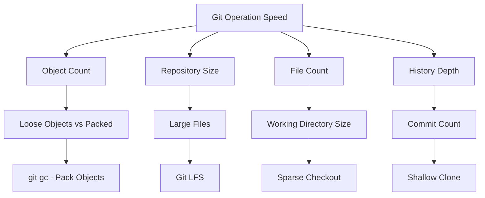

# How to Optimize Git Repository Performance

Author: [nawazdhandala](https://www.github.com/nawazdhandala)

Tags: Git, Performance, Optimization, DevOps, Large Repositories, Version Control

Description: Learn techniques to speed up Git operations on large repositories including garbage collection, sparse checkout, partial clones, and repository maintenance.

---

As repositories grow, Git operations slow down. Clone times stretch from seconds to hours. Simple commands like `git status` take noticeable time. This guide covers practical techniques to optimize Git performance for repositories of any size.

---

## Understanding Git Performance

Git performance depends on several factors:



---

## Quick Wins: Basic Optimization

Start with these simple commands for immediate improvement:

```bash
# Run garbage collection to pack loose objects
git gc

# Aggressive garbage collection (slower but more thorough)
git gc --aggressive

# Prune unreachable objects
git gc --prune=now

# Check repository size before and after
du -sh .git
# Before: 2.1G
# After: 850M
```

---

## Enable Git Maintenance

Git 2.30 introduced automatic maintenance:

```bash
# Enable background maintenance
git maintenance start

# This schedules regular tasks:
# - Hourly: prefetch from remotes
# - Daily: gc and commit-graph updates
# - Weekly: repack for optimal compression

# Check maintenance status
git maintenance run --task=gc --dry-run

# Run specific tasks manually
git maintenance run --task=commit-graph
git maintenance run --task=prefetch
git maintenance run --task=loose-objects
git maintenance run --task=incremental-repack
```

Configure maintenance schedule:

```bash
# View current maintenance configuration
git config --get-regexp maintenance

# Customize maintenance schedule
git config maintenance.auto true
git config maintenance.strategy incremental
```

---

## Optimize with Commit Graph

The commit graph caches commit metadata for faster traversal:

```bash
# Generate commit graph file
git commit-graph write --reachable

# Include all refs and update incrementally
git commit-graph write --reachable --changed-paths

# Verify commit graph
git commit-graph verify

# Check if commit graph is being used
GIT_TRACE=1 git log --oneline -10 2>&1 | grep commit-graph
```

Configure automatic commit graph updates:

```bash
# Enable commit graph on fetch
git config --global fetch.writeCommitGraph true

# Enable commit graph on gc
git config --global gc.writeCommitGraph true
```

---

## Faster Clone with Partial Clone

Partial clones download only what you need:

```bash
# Clone without blob data (download on demand)
git clone --filter=blob:none git@github.com:user/large-repo.git

# Clone without blobs over 1MB
git clone --filter=blob:limit=1m git@github.com:user/large-repo.git

# Clone without trees (very minimal)
git clone --filter=tree:0 git@github.com:user/large-repo.git

# Check what's been downloaded
git rev-list --objects --all | wc -l
```

Work with partial clones:

```bash
# Blobs are fetched automatically when needed
git checkout main
# Git fetches blobs for files in working directory

# Prefetch blobs for offline work
git fetch --filter=blob:none origin
git sparse-checkout set src/
```

---

## Shallow Clones for CI/CD

Shallow clones include limited history:

```bash
# Clone with only the latest commit
git clone --depth=1 git@github.com:user/repo.git

# Clone with last 10 commits
git clone --depth=10 git@github.com:user/repo.git

# Clone specific branch shallowly
git clone --depth=1 --branch=release-2.0 git@github.com:user/repo.git

# Fetch more history if needed later
git fetch --deepen=50

# Convert to full clone
git fetch --unshallow
```

Shallow clone limitations:

```bash
# These operations need more history
git log --all        # Limited to fetched commits
git blame file.txt   # May show incomplete history
git bisect          # Needs commits to bisect between

# Fetch specific commits when needed
git fetch origin <commit-hash>
```

---

## Sparse Checkout for Large Monorepos

Only checkout the directories you need:

```bash
# Enable sparse checkout
git sparse-checkout init --cone

# Checkout specific directories
git sparse-checkout set src/frontend src/shared

# Add more directories
git sparse-checkout add docs/

# View current sparse checkout patterns
git sparse-checkout list

# Disable sparse checkout (get everything)
git sparse-checkout disable
```

Sparse checkout patterns:

```bash
# Set patterns directly
git sparse-checkout set '/*' '!/large-assets/' '!/test-fixtures/'

# Exclude specific large directories
git sparse-checkout set --no-cone
echo "/*" > .git/info/sparse-checkout
echo "!/node_modules/" >> .git/info/sparse-checkout
echo "!/vendor/" >> .git/info/sparse-checkout
git read-tree -mu HEAD
```

---

## Git LFS for Large Files

Move large files out of Git history:

```bash
# Install Git LFS
git lfs install

# Track large file types
git lfs track "*.psd"
git lfs track "*.zip"
git lfs track "*.mp4"

# Track files over a certain size in a directory
git lfs track "assets/**/*.png"

# View tracked patterns
git lfs track

# View LFS files in repository
git lfs ls-files
```

Migrate existing large files to LFS:

```bash
# Migrate specific file types (rewrites history!)
git lfs migrate import --include="*.psd,*.zip" --everything

# Migrate files over 10MB
git lfs migrate import --above=10mb --everything

# Check what would be migrated without doing it
git lfs migrate info --everything --above=5mb
```

---

## Optimize Fetching

Speed up fetch operations:

```bash
# Fetch only specific branches
git fetch origin main

# Use SSH multiplexing for faster connections
# Add to ~/.ssh/config:
# Host github.com
#     ControlMaster auto
#     ControlPath ~/.ssh/sockets/%r@%h-%p
#     ControlPersist 600

# Parallel fetching for multiple remotes
git fetch --all --jobs=4

# Prefetch in background for faster pulls
git maintenance run --task=prefetch
```

Configure fetch optimization:

```bash
# Enable parallel fetching
git config --global fetch.parallel 4

# Only fetch configured remote tracking branches
git config --global fetch.prune true

# Use protocol version 2 (faster)
git config --global protocol.version 2
```

---

## Speed Up Git Status

Git status can be slow with many files:

```bash
# Check status performance
time git status

# Enable filesystem monitor for faster status
git config core.fsmonitor true
git config core.untrackedCache true

# On Windows, use built-in FSMonitor
git config core.fsmonitor true

# On macOS/Linux, use watchman
# Install watchman first, then:
git config core.fsmonitor "watchman"
```

Index optimization:

```bash
# Update the index format for faster operations
git update-index --index-version 4

# Split index for large repos
git config core.splitIndex true

# Verify index
git fsck --cache
```

---

## Repository-Specific Configuration

Add these to `.git/config` for repository-specific optimizations:

```bash
[core]
    # Enable filesystem monitor
    fsmonitor = true
    # Cache untracked files
    untrackedCache = true
    # Preload index for faster status
    preloadIndex = true

[pack]
    # Use more memory for better compression
    windowMemory = 1g
    packSizeLimit = 2g
    threads = 4

[gc]
    # Increase gc thresholds for large repos
    auto = 6700
    autoPackLimit = 50

[index]
    # Skip expensive worktree check
    skipHash = false

[feature]
    # Enable experimental performance features
    manyFiles = true
```

---

## Repack for Optimal Compression

Aggressive repacking reduces repository size:

```bash
# Standard repack
git repack -a -d

# Aggressive repack with better compression
git repack -a -d -f --depth=300 --window=300

# Repack with bitmap index for faster clones
git repack -a -d -b

# Check compression stats
git count-objects -vH
# count: 0
# size: 0 bytes
# in-pack: 285634
# packs: 1
# size-pack: 847.23 MiB
# prune-packable: 0
# garbage: 0
# size-garbage: 0 bytes
```

---

## Performance Monitoring

Measure Git performance:

```bash
# Enable trace output
GIT_TRACE=1 git status

# Measure specific operation
GIT_TRACE_PERFORMANCE=1 git status

# Trace pack operations
GIT_TRACE_PACK_ACCESS=1 git log --oneline -100

# Generate performance report
hyperfine --warmup 3 'git status' 'git log --oneline -100'
```

Create a benchmark script:

```bash
#!/bin/bash
# git-bench.sh - Benchmark common Git operations

echo "Git Performance Benchmark"
echo "========================="
echo ""

echo "Repository stats:"
git count-objects -vH
echo ""

echo "Operation timings:"
echo "------------------"

echo -n "git status:        "
time git status > /dev/null 2>&1

echo -n "git log -100:      "
time git log --oneline -100 > /dev/null 2>&1

echo -n "git blame (1 file):"
time git blame README.md > /dev/null 2>&1

echo -n "git diff HEAD~10:  "
time git diff HEAD~10 --stat > /dev/null 2>&1

echo -n "git branch -a:     "
time git branch -a > /dev/null 2>&1
```

---

## Server-Side Optimization

For self-hosted Git servers:

```bash
# Enable bitmap indices for faster clones
git config pack.writeBitmaps true
git repack -a -d -b

# Configure alternates for related repositories
echo "/path/to/shared/repo/.git/objects" >> .git/objects/info/alternates

# Enable server-side delta reuse
git config pack.useSparse true
git config uploadpack.allowFilter true
```

---

## Quick Reference

| Problem | Solution |
|---------|----------|
| Slow clone | `--filter=blob:none` or `--depth=1` |
| Slow status | Enable `core.fsmonitor` and `core.untrackedCache` |
| Large .git directory | `git gc --aggressive` and `git repack -a -d` |
| Large files in history | Migrate to Git LFS |
| Slow in monorepo | Use sparse checkout |
| Slow fetch | Enable parallel fetch and prefetch |
| Slow log/blame | Generate commit graph |

---

## Summary

Git performance optimization involves multiple strategies:

1. **Basic**: Run `git gc` and enable automatic maintenance
2. **Commit graph**: Generate with `git commit-graph write --reachable`
3. **Partial clones**: Use `--filter=blob:none` for large repos
4. **Shallow clones**: Use `--depth=1` for CI/CD pipelines
5. **Sparse checkout**: Check out only needed directories
6. **Git LFS**: Move large binary files out of Git history
7. **Filesystem monitor**: Enable for faster status operations
8. **Aggressive repack**: Run periodically for optimal compression

Start with `git maintenance start` for automatic optimization, then apply specific techniques based on your repository's characteristics and your workflow needs.
