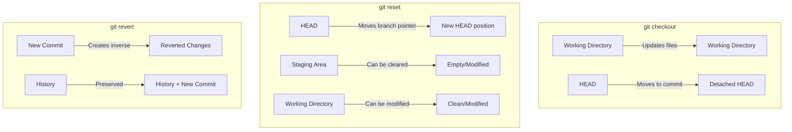
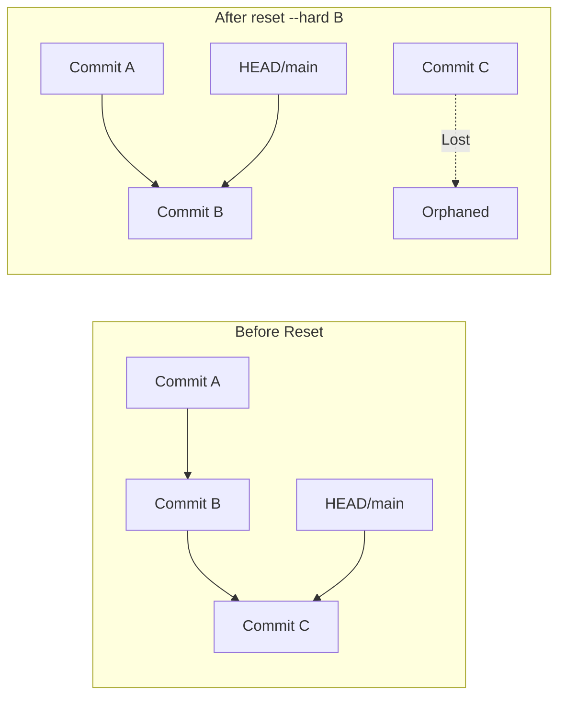
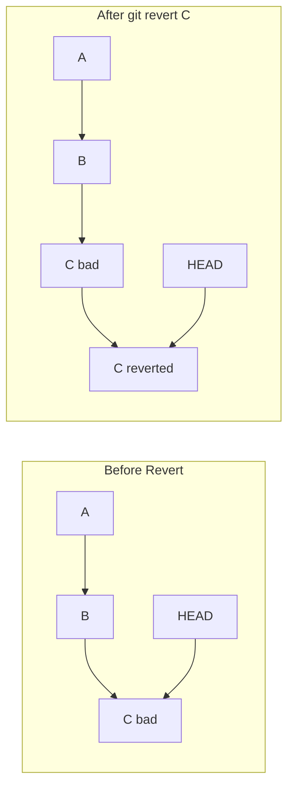
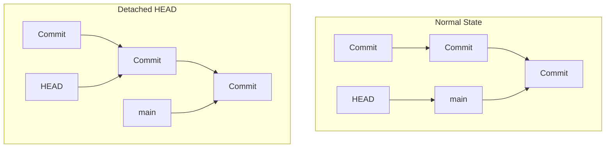
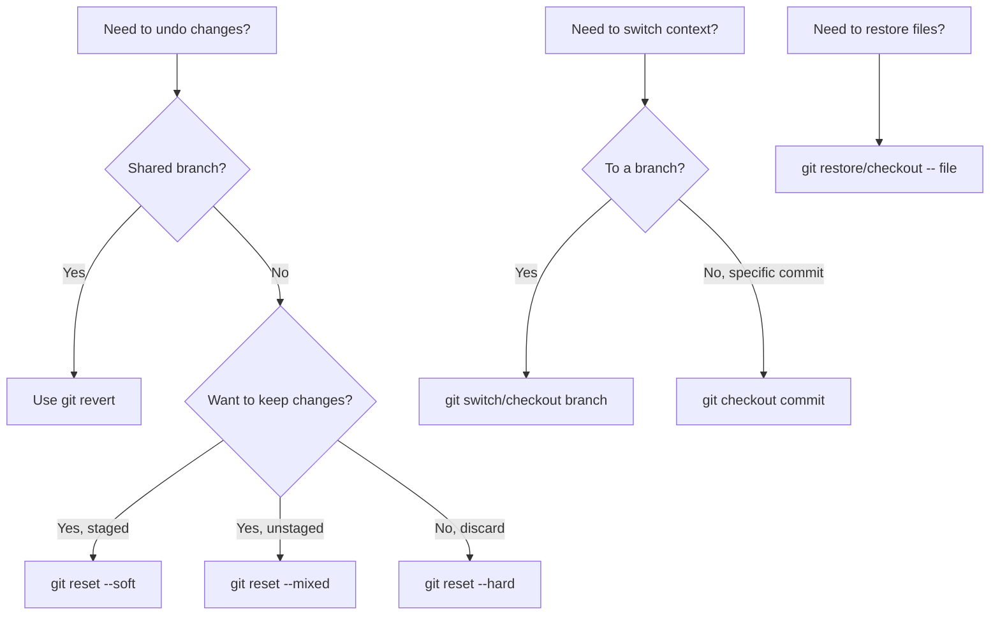

# How to Handle Git Reset vs Revert vs Checkout

Author: [nawazdhandala](https://www.github.com/nawazdhandala)

Tags: Git, Version Control, Reset, Revert, Checkout, DevOps, Development

Description: Learn the differences between git reset, revert, and checkout commands, when to use each one, and how to safely undo changes in your Git repositories.

---

Understanding the difference between `git reset`, `git revert`, and `git checkout` is fundamental to mastering Git. These three commands all deal with undoing changes, but they work in completely different ways and have different implications for your repository history.

## The Core Differences

Before diving into details, here is a quick overview of what each command does:



| Command | Modifies History | Safe for Shared Branches | Use Case |
|---------|-----------------|-------------------------|----------|
| `reset` | Yes | No | Local cleanup |
| `revert` | No (adds commit) | Yes | Undo published changes |
| `checkout` | No | Yes | Switch branches, view files |

## Understanding Git Reset

The `reset` command moves the current branch pointer to a different commit. It has three modes that determine what happens to your staging area and working directory.

### The Three Reset Modes



### Soft Reset

Soft reset moves HEAD but keeps your staging area and working directory intact.

```bash
# Move HEAD back one commit, keep all changes staged
git reset --soft HEAD~1

# Check what happened
git status
# Changes to be committed:
#   modified: file.txt
```

Use soft reset when you want to recommit with different options or combine commits.

```bash
# Example: Combine last 3 commits into one
git reset --soft HEAD~3
git commit -m "Combined feature implementation"
```

### Mixed Reset (Default)

Mixed reset moves HEAD and unstages changes, but keeps them in your working directory.

```bash
# Move HEAD back, unstage changes but keep files modified
git reset HEAD~1
# or explicitly
git reset --mixed HEAD~1

# Check status
git status
# Changes not staged for commit:
#   modified: file.txt
```

Use mixed reset when you want to re-stage changes selectively.

```bash
# Unstage all files but keep changes
git reset HEAD

# Unstage a specific file
git reset HEAD -- src/config.js
```

### Hard Reset

Hard reset moves HEAD and discards all changes in staging and working directory. This is destructive.

```bash
# WARNING: This destroys uncommitted changes
git reset --hard HEAD~1

# Reset to a specific commit
git reset --hard abc1234

# Reset to match remote exactly
git reset --hard origin/main
```

Use hard reset when you want to completely discard local changes.

```bash
# Discard all local changes and match remote
git fetch origin
git reset --hard origin/main
```

### Reset Safety Table

| Mode | HEAD | Staging Area | Working Directory |
|------|------|--------------|-------------------|
| `--soft` | Moved | Unchanged | Unchanged |
| `--mixed` | Moved | Reset | Unchanged |
| `--hard` | Moved | Reset | Reset |

## Understanding Git Revert

The `revert` command creates a new commit that undoes the changes from a previous commit. Unlike reset, it does not rewrite history.



### Basic Revert

```bash
# Revert the most recent commit
git revert HEAD

# Revert a specific commit by hash
git revert abc1234

# Revert without auto-commit (useful for combining reverts)
git revert --no-commit abc1234
```

### Reverting Multiple Commits

```bash
# Revert a range of commits (exclusive of first, inclusive of last)
git revert HEAD~3..HEAD

# Revert multiple specific commits
git revert abc1234 def5678 ghi9012

# Revert without committing each one
git revert --no-commit HEAD~3..HEAD
git commit -m "Revert last 3 commits"
```

### Handling Revert Conflicts

When reverting introduces conflicts, Git pauses for you to resolve them.

```bash
# Start revert
git revert abc1234

# If conflicts occur, resolve them
# Edit conflicted files
git add resolved-file.txt

# Continue the revert
git revert --continue

# Or abort the revert
git revert --abort
```

### Reverting Merge Commits

Merge commits require special handling because they have multiple parents.

```bash
# Revert a merge commit, keeping changes from main (parent 1)
git revert -m 1 merge-commit-hash

# Revert a merge commit, keeping changes from feature branch (parent 2)
git revert -m 2 merge-commit-hash
```

## Understanding Git Checkout

The `checkout` command is versatile. It can switch branches, restore files, or create a detached HEAD state.

### Switching Branches

```bash
# Switch to existing branch
git checkout feature-branch

# Create and switch to new branch
git checkout -b new-feature

# Switch to previous branch
git checkout -
```

### Restoring Files

```bash
# Restore a file from the last commit (discard working directory changes)
git checkout -- filename.txt

# Restore a file from a specific commit
git checkout abc1234 -- filename.txt

# Restore all files from a commit
git checkout abc1234 -- .
```

### Detached HEAD State

When you checkout a commit directly (not a branch), you enter detached HEAD state.

```bash
# Checkout a specific commit
git checkout abc1234

# Git warns you:
# You are in 'detached HEAD' state...

# To save work from detached HEAD, create a branch
git checkout -b save-my-work
```



## Modern Alternatives: Git Restore and Switch

Git 2.23 introduced `git restore` and `git switch` to make the interface clearer.

```bash
# Instead of: git checkout branch-name
git switch branch-name

# Instead of: git checkout -b new-branch
git switch -c new-branch

# Instead of: git checkout -- filename
git restore filename

# Instead of: git checkout abc1234 -- filename
git restore --source=abc1234 filename
```

## Decision Guide: Which Command to Use



## Common Scenarios

### Scenario 1: Undo Last Commit, Keep Changes

```bash
# Keep changes staged
git reset --soft HEAD~1

# Keep changes unstaged
git reset HEAD~1
```

### Scenario 2: Completely Undo Last Commit

```bash
# If not pushed
git reset --hard HEAD~1

# If already pushed
git revert HEAD
git push
```

### Scenario 3: Discard Uncommitted Changes

```bash
# Discard changes in specific file
git checkout -- filename.txt
# or
git restore filename.txt

# Discard all uncommitted changes
git reset --hard HEAD
# or
git checkout -- .
```

### Scenario 4: Undo a Commit from History

```bash
# Revert preserves history (safe for shared branches)
git revert abc1234
git push
```

### Scenario 5: Go Back in Time to Debug

```bash
# Enter detached HEAD to explore
git checkout abc1234

# Run tests, investigate
npm test

# Return to your branch
git checkout main
```

## Best Practices

1. **Never reset shared branches**: Use revert instead to maintain history integrity
2. **Use soft reset for commit message fixes**: Redo the commit with the right message
3. **Prefer restore/switch over checkout**: More explicit and less error-prone
4. **Always check status before reset --hard**: You cannot recover uncommitted changes
5. **Use reflog as safety net**: Even after hard reset, commits are recoverable for ~30 days

```bash
# Check reflog before destructive operations
git reflog

# Recover from accidental hard reset
git reset --hard HEAD@{2}
```

## Summary

- **git reset**: Moves branch pointer, can modify staging/working directory. Use locally.
- **git revert**: Creates new commit undoing changes. Safe for shared branches.
- **git checkout**: Switches branches or restores files. Use switch/restore for clarity.

Choose the right tool based on whether you need to rewrite history (reset), preserve history (revert), or simply navigate your repository (checkout).
