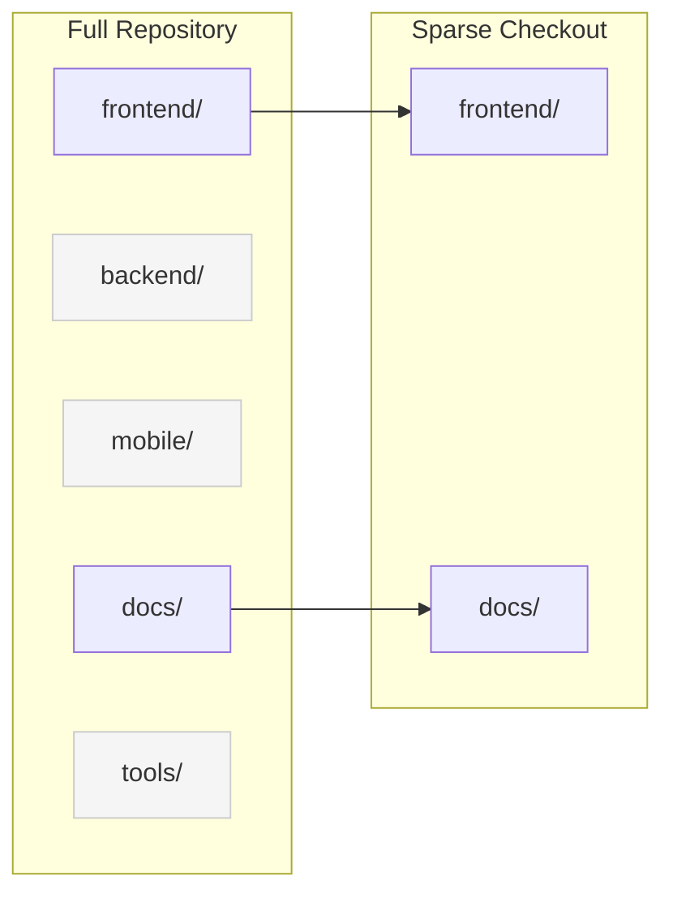
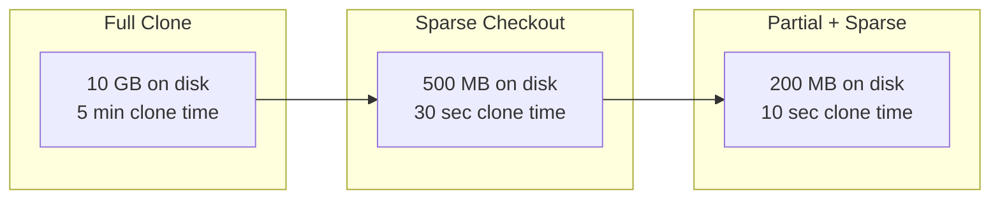

# How to Configure Git Sparse Checkout

Author: [nawazdhandala](https://www.github.com/nawazdhandala)

Tags: Git, Sparse Checkout, Monorepo, Version Control, Performance, DevOps

Description: Learn how to use Git sparse checkout to clone only the directories you need from large repositories, saving disk space and clone time.

---

Working with large monorepos can be painful. Cloning takes forever, and your disk fills up with code you never touch. Git sparse checkout lets you check out only the directories you need while still having access to the full repository history. This is especially valuable for monorepos where you only work on a small portion of the codebase.

## What Is Sparse Checkout?

Sparse checkout tells Git to only populate your working directory with specific files and directories. The full repository history is still available, but only the paths you specify appear on disk.



## Setting Up Sparse Checkout

### Modern Method (Git 2.25+)

Git 2.25 introduced cone mode, which is the recommended approach for sparse checkout.

```bash
# Clone with no checkout
git clone --no-checkout https://github.com/company/monorepo.git
cd monorepo

# Initialize sparse checkout in cone mode
git sparse-checkout init --cone

# Specify directories you want
git sparse-checkout set frontend docs

# Now checkout
git checkout main
```

### One-Command Clone (Git 2.25+)

```bash
# Clone with sparse checkout in one command
git clone --filter=blob:none --sparse https://github.com/company/monorepo.git
cd monorepo

# Set the directories you want
git sparse-checkout set frontend backend/api
```

The `--filter=blob:none` option enables partial clone, which does not download file contents until needed. Combined with sparse checkout, this dramatically reduces initial clone time.

### Legacy Method (Pre-Git 2.25)

```bash
# Clone normally
git clone https://github.com/company/monorepo.git
cd monorepo

# Enable sparse checkout
git config core.sparseCheckout true

# Edit sparse-checkout file manually
echo "frontend/*" >> .git/info/sparse-checkout
echo "docs/*" >> .git/info/sparse-checkout

# Update working directory
git read-tree -mu HEAD
```

## Cone Mode vs Non-Cone Mode

### Cone Mode (Recommended)

Cone mode only allows directory-based patterns, which is faster and simpler.

```bash
git sparse-checkout init --cone
git sparse-checkout set frontend backend/api

# You can only specify directories
# These patterns work:
#   frontend
#   backend/api
#   tools/scripts

# These patterns do NOT work in cone mode:
#   *.js
#   frontend/*.ts
#   !frontend/tests
```

### Non-Cone Mode

Non-cone mode supports full gitignore-style patterns but is slower.

```bash
git sparse-checkout init --no-cone

# Now you can use patterns
git sparse-checkout set '/*' '!backend/' 'backend/api/'

# Pattern examples:
#   /*            - All root files
#   /frontend/    - frontend directory
#   *.md          - All markdown files
#   !tests/       - Exclude tests directory
```

## Common Sparse Checkout Operations

### View Current Configuration

```bash
# List sparse checkout patterns
git sparse-checkout list

# Check if sparse checkout is enabled
git config core.sparseCheckout
```

### Add More Directories

```bash
# Add to existing sparse checkout
git sparse-checkout add backend/models tools/cli

# This adds to, not replaces, existing patterns
```

### Change Directories

```bash
# Replace all patterns
git sparse-checkout set frontend docs tools

# Previous patterns are removed
```

### Disable Sparse Checkout

```bash
# Restore full working directory
git sparse-checkout disable

# This checks out all files
```

### Reapply Sparse Checkout

```bash
# If working directory gets out of sync
git sparse-checkout reapply
```

## Practical Workflows

### Workflow 1: Frontend Developer in a Monorepo

```bash
# Initial setup
git clone --filter=blob:none --sparse https://github.com/company/monorepo.git
cd monorepo
git sparse-checkout set frontend shared package.json

# Later, need to check something in backend
git sparse-checkout add backend/api

# Done with backend, remove it
git sparse-checkout set frontend shared package.json
```

### Workflow 2: Documentation Writer

```bash
# Only need docs and examples
git clone --filter=blob:none --sparse https://github.com/company/monorepo.git
cd monorepo
git sparse-checkout set docs examples README.md
```

### Workflow 3: CI/CD Pipeline

```yaml
# .github/workflows/frontend.yml
name: Frontend CI
on:
  push:
    paths:
      - 'frontend/**'
jobs:
  build:
    runs-on: ubuntu-latest
    steps:
      - uses: actions/checkout@v4
        with:
          sparse-checkout: |
            frontend
            shared
          sparse-checkout-cone-mode: true
      - run: cd frontend && npm install && npm test
```

### Workflow 4: Partial Clone with Sparse Checkout

Combine partial clone with sparse checkout for maximum efficiency.

```bash
# Partial clone: Don't download blobs until needed
git clone --filter=blob:none https://github.com/company/huge-repo.git
cd huge-repo

# Sparse checkout: Only populate specific directories
git sparse-checkout init --cone
git sparse-checkout set my-project

# Now you have:
# - Full commit history
# - Only my-project files on disk
# - Other blobs fetched on-demand
```

## Working with Branches

Sparse checkout patterns persist across branch switches.

```bash
# Set up sparse checkout on main
git sparse-checkout set frontend docs

# Switch to feature branch
git checkout feature-branch
# Still only frontend and docs are checked out

# If feature branch has new directories you need:
git sparse-checkout add backend/new-feature
```

## Size Comparison Example



## Troubleshooting

### Files Not Appearing

```bash
# Check if sparse checkout is enabled
git config core.sparseCheckout
# Should output: true

# Check patterns
git sparse-checkout list

# Reapply patterns
git sparse-checkout reapply
```

### Unwanted Files Appearing

```bash
# In cone mode, root files always appear
# To exclude them in non-cone mode:
git sparse-checkout init --no-cone
git sparse-checkout set '!/.*' '/frontend/'
```

### Conflicts During Operations

```bash
# If checkout fails due to conflicts
git stash
git sparse-checkout reapply
git stash pop
```

### Performance Issues

```bash
# Enable sparse index for better performance
git config index.sparse true

# Use cone mode (faster than non-cone)
git sparse-checkout init --cone
```

## Best Practices

1. **Use cone mode** - It is faster and less error-prone than non-cone mode
2. **Combine with partial clone** - Use `--filter=blob:none` to avoid downloading unnecessary blobs
3. **Include shared dependencies** - Do not forget shared libraries your code depends on
4. **Document team patterns** - Share common sparse checkout configurations with your team
5. **Consider monorepo structure** - Design directory structure with sparse checkout in mind

## Team Configuration Sharing

Create a script for team members:

```bash
#!/bin/bash
# setup-frontend-dev.sh

# Clone with optimal settings
git clone --filter=blob:none --sparse https://github.com/company/monorepo.git
cd monorepo

# Set up for frontend development
git sparse-checkout set \
    frontend \
    shared \
    tools/frontend-cli \
    package.json \
    tsconfig.json

echo "Setup complete. Run 'cd monorepo && npm install' to get started."
```

Or use a configuration file:

```bash
# .sparse-checkout-frontend
frontend
shared
tools/frontend-cli
package.json
tsconfig.json

# Team members run:
git clone --filter=blob:none --sparse https://github.com/company/monorepo.git
cd monorepo
git sparse-checkout set $(cat .sparse-checkout-frontend)
```

## Quick Reference

```bash
# Initial setup
git clone --filter=blob:none --sparse <url>
git sparse-checkout init --cone
git sparse-checkout set dir1 dir2

# Modify patterns
git sparse-checkout add dir3          # Add directory
git sparse-checkout set dir1 dir2     # Replace all patterns
git sparse-checkout list              # Show current patterns

# Management
git sparse-checkout reapply           # Reapply patterns
git sparse-checkout disable           # Return to full checkout

# Configuration
git config index.sparse true          # Enable sparse index
git config core.sparseCheckout        # Check if enabled
```

---

Git sparse checkout transforms how you work with large repositories. By checking out only what you need, you save disk space, reduce clone times, and simplify your working directory. For monorepo users, this feature is essential. Combine it with partial clone for the best experience, and share your team's common configurations to streamline onboarding for new developers.
