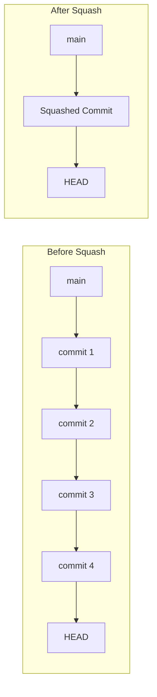
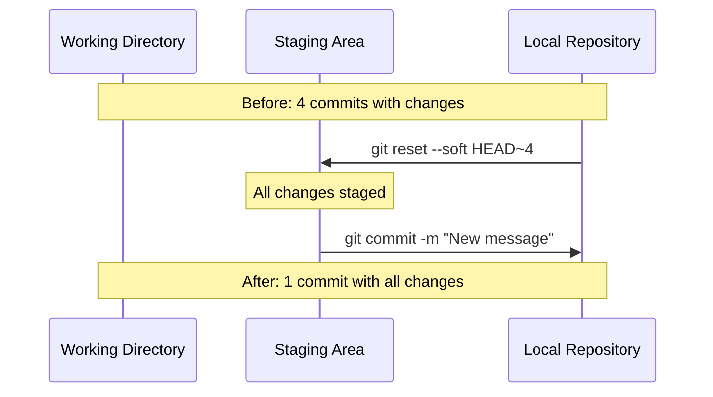

# How to Handle Git Squash Commits

Author: [nawazdhandala](https://www.github.com/nawazdhandala)

Tags: Git, Version Control, Rebase, Commit History, DevOps, Best Practices

Description: Learn how to squash Git commits to create a clean, readable commit history using interactive rebase, merge squashing, and soft reset techniques.

---

A clean Git history makes it easier to understand changes, revert problems, and review code. Squashing commits combines multiple commits into one, turning a messy trail of "WIP", "fix typo", and "oops" commits into a single, meaningful commit. This guide covers several methods to squash commits and when to use each one.

## Why Squash Commits

Before squashing, your feature branch might look like this:

```bash
git log --oneline feature-branch
# d4e5f6g (HEAD -> feature-branch) Fix linting errors
# c3d4e5f Add missing test case
# b2c3d4e Oops, forgot to save file
# a1b2c3d WIP: user authentication
# 9z8y7x6 Initial attempt at login
# 8w7v6u5 (main) Previous stable commit
```

After squashing, it becomes:

```bash
git log --oneline feature-branch
# f7g8h9i (HEAD -> feature-branch) Add user authentication with tests
# 8w7v6u5 (main) Previous stable commit
```



## Method 1: Interactive Rebase

Interactive rebase is the most flexible method for squashing. It lets you choose exactly which commits to combine and how to combine them.

### Basic Interactive Rebase

```bash
# Squash the last 4 commits
git rebase -i HEAD~4

# Or rebase onto a specific commit
git rebase -i abc1234

# Or rebase onto the branch you forked from
git rebase -i main
```

This opens your editor with something like:

```bash
# The commit list shows oldest first (bottom = most recent)
pick a1b2c3d WIP: user authentication
pick b2c3d4e Oops, forgot to save file
pick c3d4e5f Add missing test case
pick d4e5f6g Fix linting errors

# Rebase 8w7v6u5..d4e5f6g onto 8w7v6u5 (4 commands)
#
# Commands:
# p, pick = use commit
# r, reword = use commit, but edit the commit message
# e, edit = use commit, but stop for amending
# s, squash = use commit, but meld into previous commit
# f, fixup = like "squash", but discard this commit's log message
# d, drop = remove commit
```

### Squashing All Into One

Change `pick` to `squash` (or `s`) for commits you want to combine. The first commit must remain `pick`.

```bash
# Keep first commit, squash the rest into it
pick a1b2c3d WIP: user authentication
squash b2c3d4e Oops, forgot to save file
squash c3d4e5f Add missing test case
squash d4e5f6g Fix linting errors
```

Save and close. Git then opens another editor for you to write the combined commit message.

```bash
# This is a combination of 4 commits.
# This is the 1st commit message:

WIP: user authentication

# This is the commit message #2:

Oops, forgot to save file

# This is the commit message #3:

Add missing test case

# This is the commit message #4:

Fix linting errors

# Please enter the commit message for your changes.
```

Replace all of this with your new clean message:

```bash
Add user authentication with tests

- Implement login and logout functionality
- Add session management
- Include comprehensive test coverage
- Fix linting issues
```

### Using Fixup for Silent Squashing

Use `fixup` instead of `squash` when you want to discard commit messages entirely.

```bash
# Keep first commit message, silently squash the rest
pick a1b2c3d Implement user authentication
fixup b2c3d4e Oops, forgot to save file
fixup c3d4e5f Add missing test case
fixup d4e5f6g Fix linting errors
```

This skips the message editing step entirely.

## Method 2: Soft Reset

Soft reset is a quick way to squash all commits since a certain point. It preserves all your changes but removes the commits.

```bash
# Reset to 4 commits ago, keeping all changes staged
git reset --soft HEAD~4

# Or reset to a specific commit
git reset --soft main

# All changes are now staged, ready for a new commit
git status
# Changes to be committed:
#   modified:   src/auth.js
#   new file:   src/auth.test.js
#   modified:   src/index.js

# Create a single new commit with all the changes
git commit -m "Add user authentication with tests"
```



### When to Use Soft Reset

Soft reset is ideal when:
- You want to squash ALL commits into one
- You do not need to keep any individual commit messages
- You are squashing before the first push

## Method 3: Merge with Squash

When merging a feature branch, you can squash all commits at merge time.

```bash
# On main branch
git checkout main

# Merge feature branch, squashing all its commits
git merge --squash feature-branch

# Git stages all changes but does not commit
git status
# All changes from feature-branch are staged

# Create a single commit
git commit -m "Add user authentication feature (#123)"
```

This is commonly used in pull request workflows where you want to keep a clean main branch history.

### Comparing Merge Strategies

```bash
# Regular merge: preserves all commits and creates merge commit
git merge feature-branch
# History shows all individual commits plus merge commit

# Squash merge: combines all commits into one
git merge --squash feature-branch
git commit -m "Feature description"
# History shows single commit, no merge commit

# Rebase and merge: preserves commits but rewrites them on top of main
git rebase main feature-branch
git checkout main
git merge feature-branch
# History shows individual commits, no merge commit
```

## Method 4: Autosquash with Fixup Commits

Git has a special workflow for commits you know you will squash later. Mark them with `--fixup` when committing.

```bash
# Make your main commit
git commit -m "Add user authentication"

# Later, fixing a bug in that feature
git add src/auth.js
git commit --fixup HEAD
# Creates: fixup! Add user authentication

# Or fix a specific older commit
git commit --fixup abc1234
# Creates: fixup! <message of abc1234>

# When ready, autosquash combines them automatically
git rebase -i --autosquash main
```

The `--autosquash` flag automatically reorders and marks fixup commits:

```bash
# Git automatically sets this up for you:
pick a1b2c3d Add user authentication
fixup b2c3d4e fixup! Add user authentication
pick c3d4e5f Add password reset feature
```

### Enable Autosquash by Default

```bash
# Always use autosquash during interactive rebase
git config --global rebase.autosquash true
```

## Squashing in Different Scenarios

### Before Pushing (Safest)

Squashing commits you have not pushed is completely safe.

```bash
# Check what has not been pushed
git log origin/main..HEAD --oneline

# Squash unpushed commits
git rebase -i origin/main
```

### After Pushing (Requires Force Push)

Squashing changes history, so pushed commits need a force push.

```bash
# Squash your commits
git rebase -i main

# Force push to update remote (use with caution!)
git push --force-with-lease origin feature-branch

# --force-with-lease is safer than --force
# It fails if someone else pushed to the branch
```

### In a Pull Request

Many teams squash at merge time. GitHub and GitLab offer a "Squash and merge" button that does this automatically.

```bash
# GitHub CLI squash merge
gh pr merge 123 --squash

# GitLab CLI
glab mr merge 123 --squash
```

## Handling Conflicts During Squash

Sometimes squashing leads to conflicts, especially when rebasing.

```bash
git rebase -i main
# CONFLICT: Merge conflict in src/auth.js

# Fix the conflict in your editor
code src/auth.js

# Stage the resolved file
git add src/auth.js

# Continue the rebase
git rebase --continue

# If things go wrong, abort and start over
git rebase --abort
```

## Best Practices

### Write Good Squashed Commit Messages

After squashing, write a meaningful commit message that explains the entire change.

```bash
# Bad: too vague
git commit -m "Updates"

# Bad: describes what you did, not why
git commit -m "Changed auth.js"

# Good: explains the feature and context
git commit -m "Add user authentication with JWT tokens

- Implement login and logout endpoints
- Add middleware for protected routes
- Store refresh tokens in httpOnly cookies
- Include unit and integration tests

Closes #123"
```

### Squash Before Review, Not After

Squash your commits before asking for code review, not after. This makes the review easier to follow.

```bash
# Before creating PR
git rebase -i main
# Squash/organize commits

# Now create the PR
gh pr create --title "Add authentication" --body "..."
```

### Keep Logical Commits Separate

Not everything should be squashed into one commit. Keep logically separate changes in separate commits.

```bash
# These could stay as separate commits:
# 1. Add database migration for users table
# 2. Implement user model and validation
# 3. Add authentication API endpoints
# 4. Add authentication tests

# These should be squashed:
# 1. WIP auth
# 2. fix typo
# 3. forgot console.log
# 4. actually fix it this time
```

## Quick Reference

```bash
# Interactive rebase last N commits
git rebase -i HEAD~N

# Soft reset and recommit
git reset --soft HEAD~N && git commit -m "Message"

# Squash merge a branch
git merge --squash feature-branch && git commit

# Create fixup commit for autosquash
git commit --fixup HEAD

# Autosquash during rebase
git rebase -i --autosquash main

# Force push after squashing (carefully!)
git push --force-with-lease origin branch-name

# Abort a failed rebase
git rebase --abort
```

## Summary

Squashing commits creates a cleaner, more readable Git history. Choose the right method based on your situation:

- **Interactive rebase**: Most flexible, choose exactly what to squash
- **Soft reset**: Quickest for squashing everything into one commit
- **Merge squash**: Clean up during merge, common in PR workflows
- **Autosquash**: Plan ahead for commits you know you will squash

Remember that squashing rewrites history. For commits you have already pushed, you will need to force push, which can cause problems for collaborators. When in doubt, squash before pushing or use squash merge at PR merge time.
