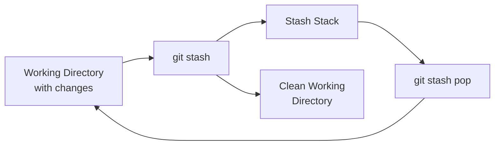
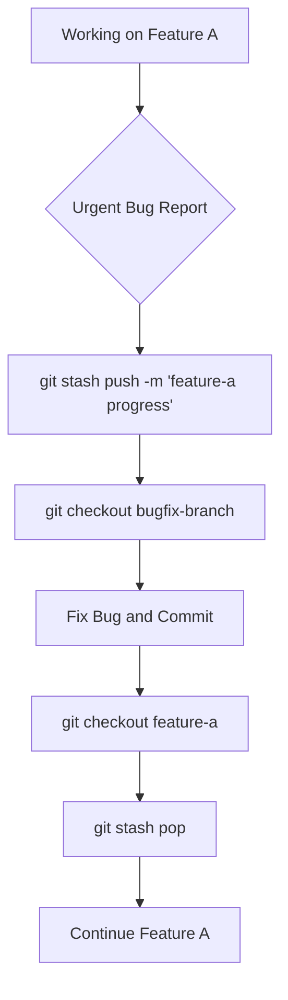

# How to Handle Git Stash Effectively

Author: [nawazdhandala](https://www.github.com/nawazdhandala)

Tags: Git, Version Control, DevOps, Workflow, Productivity

Description: Learn how to use git stash to temporarily save uncommitted changes, manage multiple stashes, and integrate stashing into your development workflow.

---

You are working on a feature when an urgent bug report comes in. Your current changes are not ready to commit, but you need to switch branches immediately. This is exactly what git stash was designed for. It lets you save your work-in-progress without creating a commit, switch contexts, and then return to exactly where you left off.

## Understanding Git Stash

Git stash takes your modified tracked files and staged changes, saves them on a stack, and reverts your working directory to match the HEAD commit. Think of it as a clipboard for your uncommitted work.



The stash operates as a Last In, First Out (LIFO) stack. The most recent stash is always at the top, and when you pop without specifying an index, you get the most recent one.

---

## Basic Stash Operations

### Stashing Your Changes

The simplest stash command saves all modified tracked files and staged changes.

```bash
# Save current changes to the stash
git stash

# Output: Saved working directory and index state WIP on main: abc1234 Last commit message
```

By default, git stash does not include untracked files. Your newly created files that have never been added to git will remain in the working directory.

### Viewing Your Stashes

List all stashes in your stack to see what you have saved.

```bash
# List all stashes with their reference numbers
git stash list

# Output:
# stash@{0}: WIP on main: abc1234 Add user authentication
# stash@{1}: WIP on feature: def5678 Update database schema
# stash@{2}: WIP on main: ghi9012 Initial commit
```

Each stash has an index number in curly braces. The index 0 is always the most recent stash.

### Restoring Stashed Changes

There are two ways to restore stashed changes: pop and apply.

```bash
# Remove the most recent stash and apply it to working directory
git stash pop

# Apply the most recent stash but keep it in the stack
git stash apply

# Apply a specific stash by index
git stash apply stash@{2}
```

Use `pop` when you want to restore and remove the stash in one step. Use `apply` when you want to keep the stash for potential use elsewhere, such as applying the same changes to multiple branches.

---

## Advanced Stash Techniques

### Stashing Untracked Files

To include untracked files in your stash, use the `-u` or `--include-untracked` flag.

```bash
# Stash tracked changes AND untracked files
git stash -u

# Stash everything including ignored files
git stash -a
```

The `-a` flag is useful when you need to completely clean your working directory, but use it carefully as it will stash files that are normally ignored.

### Creating Named Stashes

Instead of generic "WIP" messages, give your stashes descriptive names.

```bash
# Create a stash with a descriptive message
git stash push -m "WIP: user login validation logic"

# List shows your custom message
git stash list
# stash@{0}: On main: WIP: user login validation logic
```

Named stashes make it much easier to find specific work later, especially when you accumulate multiple stashes over days or weeks.

### Stashing Specific Files

You can stash only certain files instead of everything.

```bash
# Stash only specific files
git stash push -m "auth changes" src/auth.js src/middleware/auth.js

# Stash files matching a pattern
git stash push -m "test updates" -- "*.test.js"
```

This is helpful when you want to isolate changes for one feature while keeping unrelated work in your working directory.

### Interactive Stashing

For fine-grained control, use the patch mode to select which hunks to stash.

```bash
# Interactively select which changes to stash
git stash -p

# Git will show each change and ask:
# Stash this hunk [y,n,q,a,d,/,e,?]?
# y - stash this hunk
# n - do not stash this hunk
# q - quit, do not stash remaining hunks
# a - stash this and all remaining hunks
# s - split the hunk into smaller hunks
```

Patch mode gives you the same power as `git add -p`, allowing you to separate intermingled changes into different stashes.

---

## Inspecting Stash Contents

Before applying a stash, you might want to see what it contains.

```bash
# Show a summary of changes in the most recent stash
git stash show

# Output:
#  src/auth.js     | 15 +++++++++------
#  src/database.js |  8 +++++---
#  2 files changed, 14 insertions(+), 9 deletions(-)

# Show the full diff of changes in a stash
git stash show -p stash@{1}

# Show changes including untracked files
git stash show -u stash@{0}
```

The `-p` flag shows the actual diff, which helps you understand exactly what changes you will be applying.

---

## Managing Stashes

### Deleting Stashes

Remove stashes you no longer need to keep your stack clean.

```bash
# Delete a specific stash
git stash drop stash@{2}

# Clear all stashes (use with caution)
git stash clear
```

Be careful with `git stash clear` as it permanently removes all stashes with no way to recover them.

### Creating a Branch from a Stash

If your stashed changes have diverged significantly from the current branch, create a new branch from the stash.

```bash
# Create a new branch from a stash and apply the changes
git stash branch new-feature-branch stash@{0}

# This is equivalent to:
# git checkout -b new-feature-branch <commit-where-stash-was-created>
# git stash pop
```

This command creates a branch from the commit where the stash was originally created, applies the stash, and then drops it. It is useful when applying a stash would cause conflicts with current branch changes.

---

## Handling Stash Conflicts

When applying a stash, you might encounter merge conflicts if the same files have been modified.

```bash
# Apply stash and encounter conflicts
git stash pop
# error: Your local changes to the following files would be overwritten by merge:
#         src/auth.js
# Please commit your changes or stash them before you merge.

# Or after applying:
# Auto-merging src/auth.js
# CONFLICT (content): Merge conflict in src/auth.js
```

When conflicts occur during `git stash pop`, the stash is not automatically dropped. Resolve the conflicts manually, then drop the stash.

```bash
# Resolve conflicts in your editor, then stage the resolved files
git add src/auth.js

# The stash was not dropped due to conflicts, so drop it manually
git stash drop stash@{0}
```

---

## Stash Workflow Patterns

### Context Switching Pattern

Use stash when you need to quickly switch tasks.



```bash
# Save current work
git stash push -m "feature: add user dashboard"

# Switch to fix the bug
git checkout -b hotfix/login-error
# ... make fixes and commit ...
git checkout main
git merge hotfix/login-error

# Return to feature work
git checkout feature/user-dashboard
git stash pop
```

### Pulling with Local Changes

Stash is useful when you need to pull remote changes but have uncommitted local work.

```bash
# Cannot pull with local changes
git pull
# error: Your local changes would be overwritten by merge

# Solution: stash, pull, then pop
git stash
git pull
git stash pop
```

Some developers prefer this over committing half-finished work just to pull updates.

### Carrying Changes Between Branches

Apply the same changes to multiple branches using `apply` instead of `pop`.

```bash
# Stash changes on current branch
git stash push -m "shared configuration update"

# Apply to development branch
git checkout development
git stash apply

# Apply to staging branch
git checkout staging
git stash apply

# Clean up when done
git stash drop
```

---

## Best Practices

### Keep Stashes Short-Lived

Stashes are meant to be temporary. Long-lived stashes often become outdated and cause merge conflicts.

```bash
# Regularly review your stash stack
git stash list

# If a stash is older than a few days, consider:
# 1. Applying it and creating a proper commit or branch
# 2. Dropping it if no longer needed
```

### Use Descriptive Messages

Always use meaningful stash messages to avoid confusion later.

```bash
# Bad: generic message
git stash

# Good: descriptive message
git stash push -m "WIP: payment gateway integration - API calls working, UI incomplete"
```

### Prefer Branches for Longer Work

If you expect to leave work for more than a day, create a branch instead of stashing.

```bash
# Instead of stashing long-term work
git stash push -m "big refactor"

# Create a WIP branch
git checkout -b wip/refactor-auth-module
git add -A
git commit -m "WIP: auth module refactor in progress"
```

Branches are more visible, can be pushed to remote for backup, and work better with pull requests.

---

## Quick Reference

```bash
# Basic operations
git stash                           # Stash tracked changes
git stash -u                        # Include untracked files
git stash list                      # List all stashes
git stash pop                       # Apply and remove top stash
git stash apply                     # Apply but keep stash
git stash drop stash@{n}            # Delete a specific stash
git stash clear                     # Delete all stashes

# Advanced operations
git stash push -m "message"         # Stash with description
git stash push file1 file2          # Stash specific files
git stash -p                        # Interactive/patch mode
git stash show -p stash@{n}         # View stash diff
git stash branch new-branch         # Create branch from stash
```

---

## Summary

Git stash is a powerful tool for managing work-in-progress changes without creating commits. Use it for quick context switches, pulling with local changes, or temporarily setting aside experimental work. Keep stashes short-lived and well-documented. For longer-term work, prefer proper branches. Mastering stash will make you more flexible in handling the unpredictable demands of software development.
