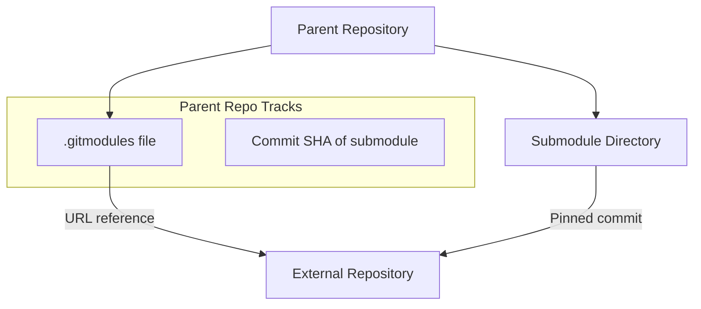
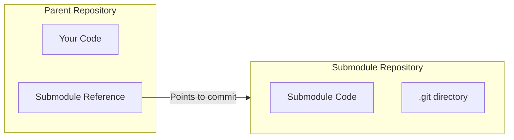

# How to Configure Git Submodules

Author: [nawazdhandala](https://www.github.com/nawazdhandala)

Tags: Git, Submodules, Version Control, Monorepo, Dependencies, DevOps

Description: Learn how to add, update, and manage git submodules for including external repositories as dependencies in your project.

---

Your project depends on a shared library that lives in its own repository. You could copy the code, but then you lose the ability to pull upstream updates. You could use a package manager, but maybe the library is not published. Git submodules solve this by embedding one repository inside another while keeping them independently versioned.

## What Are Git Submodules?

A submodule is a git repository nested inside another git repository. The parent repository tracks a specific commit of the submodule, not the files themselves. This allows you to include external code at a pinned version while maintaining the ability to update it.



The parent repository stores the submodule URL in `.gitmodules` and the specific commit SHA in its tree. The actual submodule content is cloned separately.

---

## Adding a Submodule

Use `git submodule add` to include an external repository.

```bash
# Add a submodule at a specific path
git submodule add https://github.com/example/shared-lib.git libs/shared-lib

# Output:
# Cloning into '/path/to/project/libs/shared-lib'...
# remote: Enumerating objects: 150, done.
# remote: Total 150 (delta 0), reused 0 (delta 0)
# Receiving objects: 100% (150/150), done.
```

This command creates two changes in your repository.

```bash
# Check what was added
git status

# Output:
# Changes to be committed:
#   new file:   .gitmodules
#   new file:   libs/shared-lib
```

The `.gitmodules` file contains the submodule configuration.

```ini
# .gitmodules - submodule configuration file
[submodule "libs/shared-lib"]
    path = libs/shared-lib
    url = https://github.com/example/shared-lib.git
```

Commit these changes to record the submodule in your repository.

```bash
# Commit the submodule addition
git add .gitmodules libs/shared-lib
git commit -m "Add shared-lib as submodule"
```

---

## Cloning a Repository with Submodules

When you clone a repository that contains submodules, the submodule directories are empty by default.

```bash
# Clone without initializing submodules
git clone https://github.com/example/main-project.git
cd main-project
ls libs/shared-lib/
# (empty directory)

# Initialize and fetch submodule content
git submodule init
git submodule update

# Or do both in one command
git submodule update --init
```

For repositories with nested submodules (submodules that contain submodules), use the recursive flag.

```bash
# Clone and initialize all submodules recursively
git clone --recurse-submodules https://github.com/example/main-project.git

# Or if already cloned
git submodule update --init --recursive
```

The `--recursive` flag ensures all levels of nested submodules are initialized.

---

## Updating Submodules

### Updating to the Latest Commit

By default, a submodule is pinned to a specific commit. To update it to the latest commit on its tracked branch:

```bash
# Enter the submodule directory and pull
cd libs/shared-lib
git fetch
git checkout main
git pull origin main
cd ../..

# The parent repo now shows the submodule has changed
git status
# modified:   libs/shared-lib (new commits)

# Commit the updated reference
git add libs/shared-lib
git commit -m "Update shared-lib to latest version"
```

### Updating All Submodules at Once

Use the `--remote` flag to update all submodules to their latest remote commits.

```bash
# Fetch and update all submodules to their remote tracking branch
git submodule update --remote

# Update all submodules recursively
git submodule update --remote --recursive

# Check what changed
git diff --submodule

# Commit the updates
git add -A
git commit -m "Update all submodules to latest versions"
```

### Specifying a Branch to Track

By default, submodules track no branch (detached HEAD). Configure a branch to make updates easier.

```bash
# Set the branch to track for a submodule
git config -f .gitmodules submodule.libs/shared-lib.branch main

# Or edit .gitmodules directly
```

```ini
# .gitmodules with branch tracking
[submodule "libs/shared-lib"]
    path = libs/shared-lib
    url = https://github.com/example/shared-lib.git
    branch = main
```

Now `git submodule update --remote` will fetch the latest from the specified branch.

---

## Working Inside Submodules

When you make changes inside a submodule, you are working in a separate git repository.



```bash
# Enter the submodule
cd libs/shared-lib

# Make changes
echo "new feature" >> feature.txt
git add feature.txt
git commit -m "Add new feature"

# Push to the submodule remote
git push origin main

# Return to parent and update reference
cd ../..
git add libs/shared-lib
git commit -m "Update shared-lib with new feature"
```

Always push submodule changes before pushing the parent. Otherwise, others who pull your changes will not be able to fetch the submodule commit you referenced.

---

## Submodule Configuration Options

### Changing Submodule URL

If the submodule remote URL changes, update it in `.gitmodules`.

```bash
# Update the URL in .gitmodules
git config -f .gitmodules submodule.libs/shared-lib.url https://new-url.com/shared-lib.git

# Sync the change to your local config
git submodule sync

# Re-fetch from the new URL
git submodule update --init --remote
```

### Shallow Submodules

For large repositories, clone submodules with limited history to save space.

```bash
# Add a submodule with shallow clone (depth 1)
git submodule add --depth 1 https://github.com/large/repo.git libs/large-repo

# Update existing submodules with shallow fetch
git submodule update --init --depth 1
```

Configure shallow clones by default in `.gitmodules`.

```ini
# .gitmodules with shallow clone configuration
[submodule "libs/large-repo"]
    path = libs/large-repo
    url = https://github.com/large/repo.git
    shallow = true
```

---

## Removing a Submodule

Removing a submodule requires several steps.

```bash
# 1. Deinitialize the submodule
git submodule deinit -f libs/shared-lib

# 2. Remove the submodule directory from git
git rm -f libs/shared-lib

# 3. Remove the submodule entry from .git/config (if exists)
rm -rf .git/modules/libs/shared-lib

# 4. Commit the removal
git commit -m "Remove shared-lib submodule"
```

The `git submodule deinit` command removes the submodule from `.git/config` and clears the working directory. The `git rm` command removes it from the index and `.gitmodules`.

---

## Common Workflows

### Keeping Submodules in Sync

Create a script to ensure submodules are always up to date after pulling.

```bash
#!/bin/bash
# post-merge hook: .git/hooks/post-merge

# Update submodules after merge/pull
git submodule update --init --recursive
```

Make it executable:

```bash
chmod +x .git/hooks/post-merge
```

### CI/CD Pipeline Configuration

In CI pipelines, always initialize submodules during checkout.

```yaml
# GitHub Actions example
steps:
  - name: Checkout with submodules
    uses: actions/checkout@v4
    with:
      submodules: recursive  # Fetch all submodules
      fetch-depth: 0         # Full history (or use 1 for shallow)

# GitLab CI example
variables:
  GIT_SUBMODULE_STRATEGY: recursive

# Jenkins Pipeline example
checkout([
    $class: 'GitSCM',
    extensions: [[$class: 'SubmoduleOption', recursiveSubmodules: true]],
    userRemoteConfigs: [[url: 'https://github.com/example/repo.git']]
])
```

### Foreach Command

Run a command in all submodules at once.

```bash
# Run git status in all submodules
git submodule foreach 'git status'

# Checkout main branch in all submodules
git submodule foreach 'git checkout main'

# Pull latest in all submodules
git submodule foreach 'git pull origin main'

# Custom script in all submodules
git submodule foreach 'echo "Submodule: $name at $path"'
```

The `foreach` command sets useful environment variables: `$name`, `$path`, `$sha1`, and `$toplevel`.

---

## Troubleshooting Common Issues

### Detached HEAD in Submodule

Submodules are often in detached HEAD state, which is normal.

```bash
cd libs/shared-lib
git status
# HEAD detached at abc1234

# To work on changes, checkout a branch first
git checkout main
# Now you can commit and push normally
```

### Dirty Submodule on Status

Parent repository shows submodule as modified when it has local changes.

```bash
git status
# modified:   libs/shared-lib (modified content)

# Ignore untracked content in submodule status
git config --global diff.ignoreSubmodules dirty

# Or in .gitmodules
[submodule "libs/shared-lib"]
    path = libs/shared-lib
    url = https://github.com/example/shared-lib.git
    ignore = dirty
```

### Submodule Commit Not Found

When someone pushes a parent commit referencing a submodule commit that was not pushed.

```bash
git submodule update
# fatal: reference is not a tree: abc1234
# Unable to checkout 'abc1234' in submodule path 'libs/shared-lib'

# The submodule commit does not exist on remote
# Ask the person who made the commit to push the submodule first
```

---

## Quick Reference

```bash
# Adding submodules
git submodule add <url> <path>              # Add new submodule
git submodule add -b <branch> <url> <path>  # Add with branch tracking

# Initializing submodules
git submodule init                           # Initialize config
git submodule update                         # Fetch content
git submodule update --init                  # Both at once
git submodule update --init --recursive      # Include nested submodules
git clone --recurse-submodules <url>         # Clone with submodules

# Updating submodules
git submodule update --remote                # Update to latest remote commit
git submodule foreach 'git pull'             # Pull in all submodules

# Removing submodules
git submodule deinit -f <path>               # Deinitialize
git rm -f <path>                             # Remove from index

# Inspection
git submodule status                         # Show submodule commits
git submodule foreach '<command>'            # Run command in all submodules
```

---

## Summary

Git submodules let you include external repositories as versioned dependencies. Add them with `git submodule add`, clone them with `--recurse-submodules`, and update them with `git submodule update --remote`. Remember that submodules are separate repositories, so changes must be committed and pushed independently. Configure branch tracking in `.gitmodules` for easier updates. While submodules add complexity, they provide precise version control over external dependencies that package managers cannot match.
