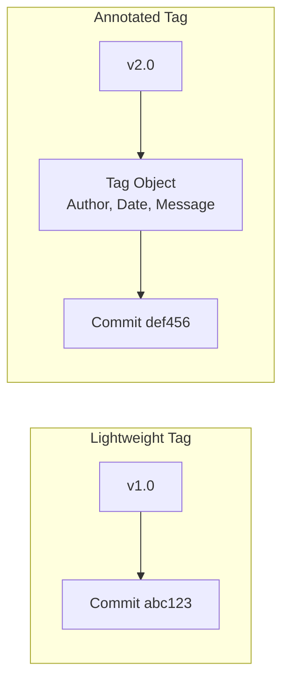
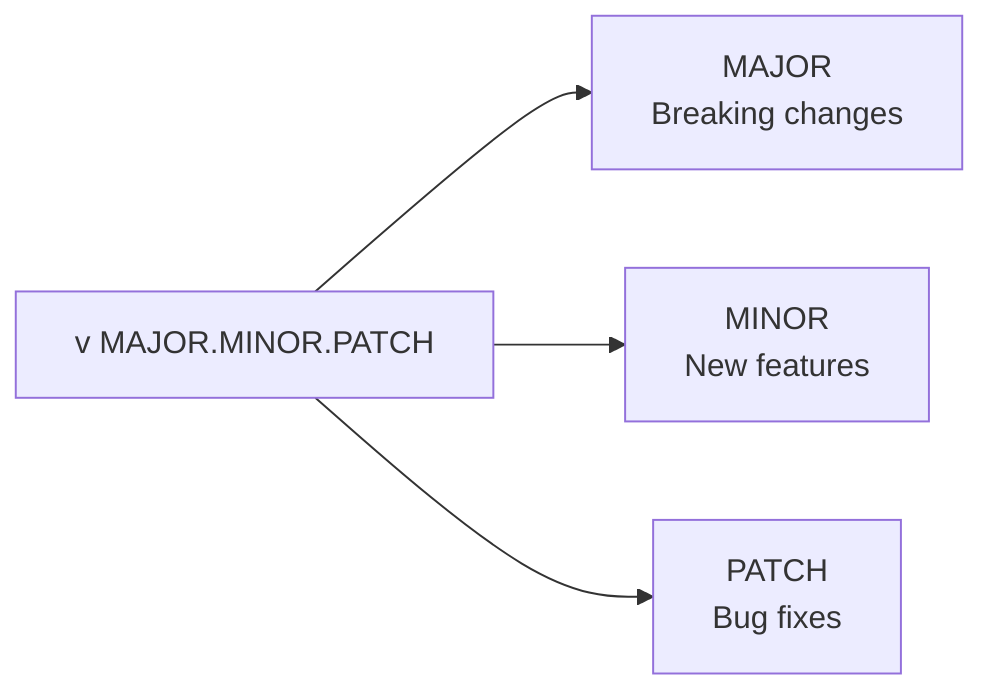

# How to Handle Git Tag Management

Author: [nawazdhandala](https://www.github.com/nawazdhandala)

Tags: Git, Version Control, DevOps, Release Management, Tags, CI/CD, Versioning

Description: Learn how to create, list, push, delete, and manage Git tags for release versioning and deployment workflows.

---

Git tags mark specific points in your repository history, typically used for release versions. Unlike branches that move forward with new commits, tags are fixed references to specific commits. This guide covers everything you need to know about creating, managing, and using Git tags effectively.

## Understanding Git Tags

Tags come in two types:



**Lightweight tags** are just pointers to commits, similar to branches that do not move.

**Annotated tags** are full Git objects with metadata including the tagger name, email, date, and a message. Use annotated tags for releases.

## Creating Tags

**Create an annotated tag (recommended for releases):**

```bash
# Tag the current commit
git tag -a v1.0.0 -m "Release version 1.0.0"

# Tag with a longer message
git tag -a v1.0.0 -m "Release version 1.0.0

- Added user authentication
- Fixed payment processing bug
- Updated dependencies"

# Tag a specific commit
git tag -a v1.0.0 -m "Release version 1.0.0" abc1234
```

**Create a lightweight tag:**

```bash
# Simple pointer to current commit
git tag v1.0.0-beta

# Tag a specific commit
git tag v1.0.0-beta abc1234
```

**Sign a tag with GPG:**

```bash
# Create a signed tag (requires GPG setup)
git tag -s v1.0.0 -m "Signed release 1.0.0"

# Verify a signed tag
git tag -v v1.0.0
```

## Listing Tags

```bash
# List all tags
git tag

# List tags matching a pattern
git tag -l "v1.*"
git tag -l "v2.0.*"

# List tags with their messages
git tag -n

# List tags with more context
git tag -n1  # First line of message
git tag -n5  # First 5 lines of message

# Show tag details
git show v1.0.0

# List tags sorted by version (semantic versioning)
git tag -l --sort=version:refname "v*"

# List tags sorted by date (newest first)
git tag -l --sort=-creatordate
```

## Pushing Tags to Remote

Tags are not pushed by default. You must explicitly push them:

```bash
# Push a specific tag
git push origin v1.0.0

# Push all tags
git push origin --tags

# Push only annotated tags (not lightweight)
git push origin --follow-tags
```

Configure Git to push tags with commits:

```bash
# Set push.followTags to always push annotated tags
git config --global push.followTags true

# Now git push will include annotated tags automatically
```

## Deleting Tags

**Delete a local tag:**

```bash
# Delete locally
git tag -d v1.0.0-beta

# Delete multiple tags
git tag -d v1.0.0-alpha v1.0.0-beta v1.0.0-rc1
```

**Delete a remote tag:**

```bash
# Method 1: Push empty reference
git push origin :refs/tags/v1.0.0-beta

# Method 2: Explicit delete
git push origin --delete v1.0.0-beta

# Delete multiple remote tags
git push origin --delete v1.0.0-alpha v1.0.0-beta
```

**Delete and recreate (move a tag):**

```bash
# Delete old tag
git tag -d v1.0.0
git push origin :refs/tags/v1.0.0

# Create new tag at different commit
git tag -a v1.0.0 -m "Release 1.0.0" new-commit-hash
git push origin v1.0.0
```

## Checking Out Tags

```bash
# View code at a specific tag (detached HEAD)
git checkout v1.0.0

# Create a branch from a tag
git checkout -b hotfix/v1.0.1 v1.0.0

# See which commit a tag points to
git rev-parse v1.0.0

# Compare two tags
git diff v1.0.0 v1.1.0

# Show commits between tags
git log v1.0.0..v1.1.0 --oneline
```

## Semantic Versioning

Follow semantic versioning for release tags:



**Examples:**

```bash
# Initial release
git tag -a v1.0.0 -m "Initial release"

# Bug fix release
git tag -a v1.0.1 -m "Fix login timeout issue"

# New feature release
git tag -a v1.1.0 -m "Add password reset feature"

# Breaking change release
git tag -a v2.0.0 -m "New API version - breaking changes

BREAKING CHANGES:
- Removed deprecated /api/v1 endpoints
- Changed authentication flow"
```

**Pre-release tags:**

```bash
# Alpha versions
git tag -a v2.0.0-alpha.1 -m "Alpha release 1"
git tag -a v2.0.0-alpha.2 -m "Alpha release 2"

# Beta versions
git tag -a v2.0.0-beta.1 -m "Beta release 1"

# Release candidates
git tag -a v2.0.0-rc.1 -m "Release candidate 1"
git tag -a v2.0.0-rc.2 -m "Release candidate 2"

# Final release
git tag -a v2.0.0 -m "Version 2.0.0"
```

## Tag Workflows

**Release workflow:**

```bash
# 1. Ensure you are on the release branch
git checkout main
git pull

# 2. Verify the commit to tag
git log --oneline -5

# 3. Create annotated tag
git tag -a v1.2.0 -m "Release v1.2.0 - Feature X and Bug fixes"

# 4. Push the tag
git push origin v1.2.0

# 5. Create GitHub release (if using GitHub)
gh release create v1.2.0 --title "v1.2.0" --notes "Release notes here"
```

**CI/CD integration:**

```yaml
# GitHub Actions example - deploy on tag push
name: Release

on:
  push:
    tags:
      - 'v*'  # Trigger on tags starting with v

jobs:
  deploy:
    runs-on: ubuntu-latest
    steps:
      - uses: actions/checkout@v4

      - name: Get version from tag
        id: get_version
        run: echo "VERSION=${GITHUB_REF#refs/tags/v}" >> $GITHUB_OUTPUT

      - name: Build with version
        run: |
          echo "Building version ${{ steps.get_version.outputs.VERSION }}"
          # Your build commands here
```

## Finding Tags

```bash
# Find tag containing a specific commit
git tag --contains abc1234

# Find the most recent tag
git describe --tags --abbrev=0

# Find the most recent tag with distance from HEAD
git describe --tags
# Output: v1.2.0-5-g789abcd
# Meaning: 5 commits after v1.2.0, commit hash 789abcd

# Find tags on a specific branch
git tag --merged main

# Find tags not yet merged to main
git tag --no-merged main
```

## Best Practices

**1. Use annotated tags for releases:**

```bash
# Good - has metadata and message
git tag -a v1.0.0 -m "Production release with feature X"

# Avoid for releases - no metadata
git tag v1.0.0
```

**2. Write meaningful tag messages:**

```bash
# Good
git tag -a v1.5.0 -m "Version 1.5.0

New Features:
- User dashboard redesign
- API rate limiting

Bug Fixes:
- Fixed memory leak in worker process
- Corrected timezone handling

Breaking Changes: None"

# Not helpful
git tag -a v1.5.0 -m "v1.5.0"
```

**3. Protect release tags:**

```bash
# Do not delete or move release tags after pushing
# If you must fix a release, create a new patch version
git tag -a v1.0.1 -m "Hotfix for v1.0.0"
```

**4. Clean up pre-release tags:**

```bash
# After final release, optionally clean up
git push origin --delete v2.0.0-alpha.1 v2.0.0-alpha.2 v2.0.0-beta.1
git tag -d v2.0.0-alpha.1 v2.0.0-alpha.2 v2.0.0-beta.1
```

**5. Automate version extraction:**

```bash
# Script to get current version
CURRENT_VERSION=$(git describe --tags --abbrev=0 2>/dev/null || echo "v0.0.0")
echo "Current version: $CURRENT_VERSION"

# Increment patch version
MAJOR=$(echo $CURRENT_VERSION | cut -d. -f1 | tr -d v)
MINOR=$(echo $CURRENT_VERSION | cut -d. -f2)
PATCH=$(echo $CURRENT_VERSION | cut -d. -f3)
NEW_VERSION="v$MAJOR.$MINOR.$((PATCH + 1))"
echo "New version: $NEW_VERSION"
```

## Syncing Tags

**Fetch all tags from remote:**

```bash
# Fetch tags with commits
git fetch --tags

# Fetch tags and prune deleted ones
git fetch --tags --prune
```

**Keep local and remote tags in sync:**

```bash
# Remove local tags that no longer exist on remote
git fetch --prune origin "+refs/tags/*:refs/tags/*"

# Or manually sync
git tag -l | xargs git tag -d
git fetch --tags
```

## Quick Reference

| Task | Command |
|------|---------|
| Create annotated tag | `git tag -a v1.0.0 -m "message"` |
| Create lightweight tag | `git tag v1.0.0` |
| List all tags | `git tag` |
| Push single tag | `git push origin v1.0.0` |
| Push all tags | `git push origin --tags` |
| Delete local tag | `git tag -d v1.0.0` |
| Delete remote tag | `git push origin --delete v1.0.0` |
| Checkout tag | `git checkout v1.0.0` |
| Show tag info | `git show v1.0.0` |
| Latest tag | `git describe --tags --abbrev=0` |

Git tags are simple but essential for release management. Use annotated tags for releases, follow semantic versioning, and integrate tags into your CI/CD pipeline for automated deployments.
