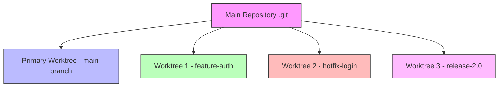
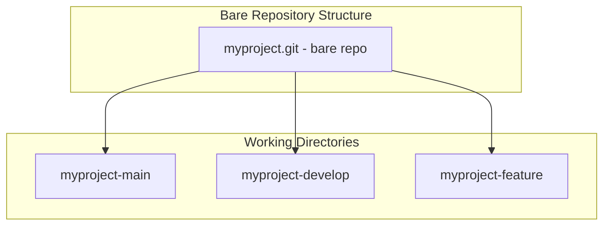

# How to Configure Git Worktrees

Author: [nawazdhandala](https://www.github.com/nawazdhandala)

Tags: Git, Version Control, Worktrees, Development Workflow, DevOps

Description: Learn how to use Git worktrees to work on multiple branches simultaneously without stashing or switching branches.

---

Ever needed to fix a critical bug on main while in the middle of a feature branch? Traditional Git workflows force you to stash changes, switch branches, do the work, switch back, and pop your stash. Git worktrees solve this problem elegantly by letting you have multiple working directories from a single repository.

## What Are Git Worktrees?

A Git worktree is an additional working directory linked to your repository. Each worktree has its own checked-out branch, but they all share the same Git history. This means you can work on multiple branches simultaneously without any stashing or branch switching.



## Why Use Worktrees?

1. **No more stashing** - Keep your work in progress untouched
2. **Parallel development** - Work on multiple features simultaneously
3. **Quick hotfixes** - Jump to production fixes without losing context
4. **Code reviews** - Check out PR branches without leaving your current work
5. **Build comparisons** - Build and test different versions side by side

## Basic Worktree Commands

### Creating a Worktree

```bash
# Create a worktree for an existing branch
git worktree add ../project-hotfix hotfix/login-bug

# Create a worktree with a new branch
git worktree add -b feature/new-auth ../project-auth main

# Create a worktree from a specific commit
git worktree add ../project-review abc123
```

### Listing Worktrees

```bash
# List all worktrees
git worktree list

# Example output:
# /home/user/myproject         abc1234 [main]
# /home/user/myproject-hotfix  def5678 [hotfix/login-bug]
# /home/user/myproject-auth    ghi9012 [feature/new-auth]
```

### Removing a Worktree

```bash
# Remove a worktree (must be clean)
git worktree remove ../project-hotfix

# Force remove a worktree with uncommitted changes
git worktree remove --force ../project-hotfix

# Or manually delete and then prune
rm -rf ../project-hotfix
git worktree prune
```

## Practical Workflow Examples

### Example 1: Emergency Hotfix While Working on a Feature

You are deep into a feature when a critical bug is reported in production.

```bash
# Your current situation
pwd
# /home/user/myproject (on feature/user-dashboard)

# Create a worktree for the hotfix
git worktree add ../myproject-hotfix main

# Navigate to the hotfix worktree
cd ../myproject-hotfix

# Create the hotfix branch
git checkout -b hotfix/critical-login-fix

# Make your fixes, commit, and push
vim src/auth/login.js
git add .
git commit -m "Fix critical login vulnerability"
git push origin hotfix/critical-login-fix

# Return to your feature work
cd ../myproject
# Your feature branch is exactly as you left it
```

### Example 2: Reviewing Pull Requests

Review PRs without losing your current work.

```bash
# Create a temporary worktree for PR review
git fetch origin pull/123/head:pr-123
git worktree add ../review-pr-123 pr-123

# Review the code
cd ../review-pr-123
npm install
npm test
npm run lint

# Clean up after review
cd ../myproject
git worktree remove ../review-pr-123
git branch -D pr-123
```

### Example 3: Building Multiple Versions

Compare builds between branches or commits.

```bash
# Create worktrees for different versions
git worktree add ../project-v1 v1.0.0
git worktree add ../project-v2 v2.0.0
git worktree add ../project-current main

# Build each version
cd ../project-v1 && npm run build
cd ../project-v2 && npm run build
cd ../project-current && npm run build

# Now you can compare builds side by side
```

## Worktree Directory Structure

A recommended structure for organizing worktrees:

```
~/projects/
    myproject/                  # Primary worktree (main branch)
        .git/                   # The actual repository
        src/
        package.json
    myproject-feature-auth/     # Feature worktree
        src/
        package.json
    myproject-hotfix/           # Hotfix worktree
        src/
        package.json
```

Alternatively, use a bare repository with linked worktrees:

```bash
# Clone as a bare repository
git clone --bare git@github.com:user/myproject.git myproject.git

# Create worktrees for each branch
cd myproject.git
git worktree add ../myproject-main main
git worktree add ../myproject-develop develop
```



## Advanced Configuration

### Setting Up Worktree-Specific Config

Each worktree can have its own config for certain settings.

```bash
# In a specific worktree
cd ../myproject-hotfix

# Set worktree-specific configuration
git config --worktree user.email "hotfix@example.com"

# Check worktree config
git config --worktree --list
```

### Locking Worktrees

Prevent accidental removal of important worktrees.

```bash
# Lock a worktree
git worktree lock ../myproject-release --reason "Release in progress"

# Check lock status
git worktree list --porcelain

# Unlock when done
git worktree unlock ../myproject-release
```

### Pruning Stale Worktrees

Clean up worktrees that were manually deleted.

```bash
# Show what would be pruned
git worktree prune --dry-run

# Actually prune
git worktree prune

# Prune with verbose output
git worktree prune --verbose
```

## Integration with IDEs

### VS Code

Open each worktree as a separate workspace:

```bash
# Open main project
code ../myproject

# Open feature worktree in new window
code ../myproject-feature
```

Or use VS Code's multi-root workspace:

```json
{
  "folders": [
    { "path": "../myproject", "name": "main" },
    { "path": "../myproject-feature", "name": "feature-auth" }
  ]
}
```

### JetBrains IDEs

Each worktree can be opened as a separate project. The IDE will recognize they share the same Git history.

## Common Pitfalls and Solutions

### Cannot Create Worktree for Checked-Out Branch

```bash
# Error: 'main' is already checked out
git worktree add ../new-main main

# Solution: Use a different branch or check out a different branch first
git worktree add ../new-main main~0  # Detached HEAD at main
```

### Worktree Path Already Exists

```bash
# Error: path already exists
git worktree add ../existing-dir feature

# Solution: Remove the directory or use --force
rm -rf ../existing-dir
git worktree add ../existing-dir feature
```

### Cleaning Up After Failed Operations

```bash
# If worktree creation failed mid-way
git worktree prune

# Repair worktree admin files
git worktree repair
```

## Best Practices

1. **Consistent naming** - Use a naming convention like `project-branch-purpose`
2. **Keep worktrees shallow** - Remove worktrees when done to avoid confusion
3. **Share dependencies carefully** - Node modules and other dependencies are not shared
4. **Lock production worktrees** - Prevent accidental deletion of important worktrees
5. **Prune regularly** - Clean up stale references with `git worktree prune`

## Worktrees vs Other Approaches

| Approach | Pros | Cons |
|----------|------|------|
| Git Worktrees | Parallel work, shared history | Disk space for each copy |
| Git Stash | Quick, no extra directories | Can only stash one context |
| Multiple Clones | Complete isolation | No shared history, slower |
| Branch Switching | Simple | Loses work context |

---

Git worktrees are a powerful feature that can significantly improve your development workflow. They eliminate the context-switching overhead of stashing and branch switching, letting you maintain multiple streams of work simultaneously. Start with simple use cases like hotfix branches and gradually incorporate worktrees into more complex workflows as you become comfortable with the concept.
