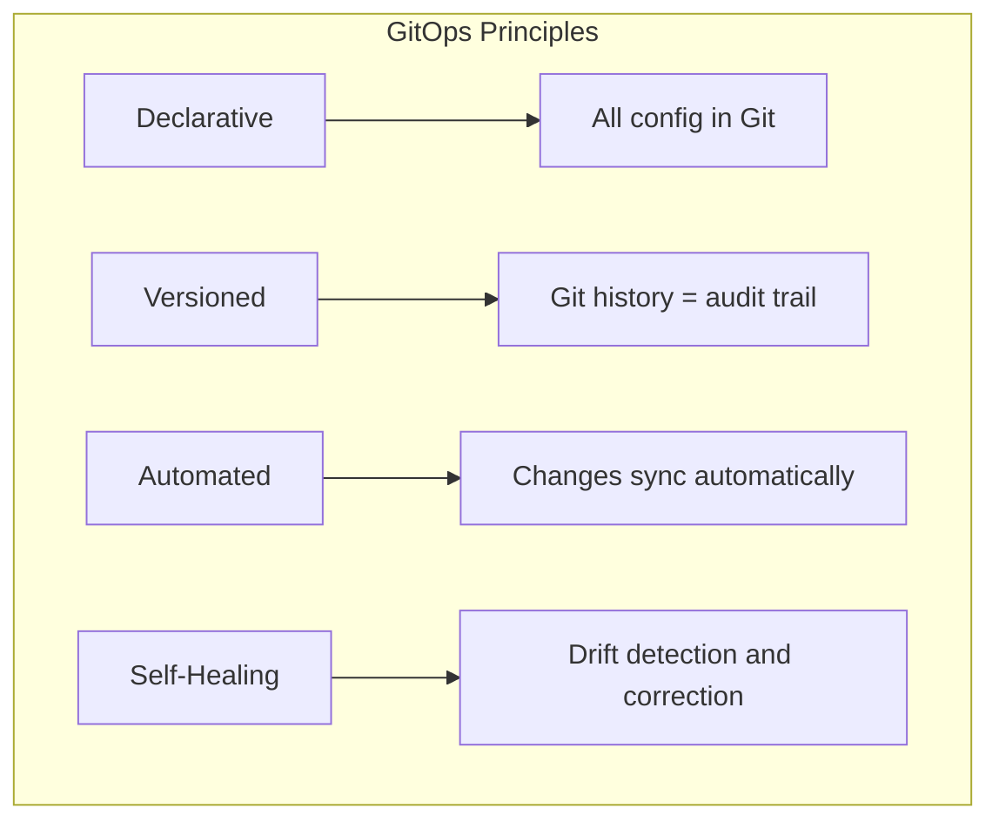

# How to Handle GitOps Workflows

Author: [nawazdhandala](https://www.github.com/nawazdhandala)

Tags: GitOps, Kubernetes, CI/CD, DevOps, ArgoCD, Flux, Git, Automation

Description: A practical guide to implementing and managing GitOps workflows for Kubernetes deployments, covering repository structure, branching strategies, and reconciliation patterns.

---

GitOps treats Git as the single source of truth for your infrastructure and applications. Instead of running kubectl commands or clicking through dashboards, you commit changes to Git and let automation handle the rest. This approach brings version control, audit trails, and collaboration to your deployment process.

## Understanding GitOps Principles

GitOps is built on four core principles that guide how you structure and manage your workflows.



The declarative approach means you describe the desired state, not the steps to get there. Your Git repository becomes the authoritative source, and any manual changes to the cluster are automatically reverted.

## Setting Up Your Repository Structure

A well-organized repository structure makes GitOps workflows manageable as your team grows. Here is a recommended layout that separates concerns while keeping related configurations together.

```bash
# Recommended monorepo structure for GitOps
gitops-repo/
├── apps/                          # Application configurations
│   ├── production/
│   │   ├── frontend/
│   │   │   ├── kustomization.yaml
│   │   │   └── deployment.yaml
│   │   └── backend/
│   │       ├── kustomization.yaml
│   │       └── deployment.yaml
│   └── staging/
│       ├── frontend/
│       └── backend/
├── infrastructure/                 # Cluster-wide resources
│   ├── base/
│   │   ├── namespaces.yaml
│   │   ├── network-policies.yaml
│   │   └── resource-quotas.yaml
│   └── overlays/
│       ├── production/
│       └── staging/
├── clusters/                       # Cluster-specific configs
│   ├── production/
│   │   └── flux-system/
│   └── staging/
│       └── flux-system/
└── scripts/                        # Helper scripts
    ├── validate.sh
    └── bootstrap.sh
```

The separation between apps and infrastructure allows different teams to manage their domains independently. The clusters directory contains the GitOps operator configurations specific to each environment.

## Implementing Branch-Based Workflows

Your branching strategy directly affects how changes flow through environments. A common pattern uses environment branches where each branch represents a deployment target.

```mermaid
gitGraph
    commit id: "initial"
    branch staging
    commit id: "feature-a"
    branch production
    checkout staging
    commit id: "feature-b"
    checkout production
    merge staging id: "promote"
    checkout staging
    commit id: "feature-c"
```

Here is how to configure ArgoCD to watch specific branches for each environment:

```yaml
# argocd-application-staging.yaml
apiVersion: argoproj.io/v1alpha1
kind: Application
metadata:
  name: myapp-staging
  namespace: argocd
spec:
  project: default
  source:
    repoURL: https://github.com/myorg/gitops-repo.git
    # Watch the staging branch for this environment
    targetRevision: staging
    path: apps/staging/myapp
  destination:
    server: https://kubernetes.default.svc
    namespace: staging
  syncPolicy:
    automated:
      # Automatically prune resources removed from Git
      prune: true
      # Automatically sync when drift is detected
      selfHeal: true
    syncOptions:
      - CreateNamespace=true
```

For production, use a more controlled approach with manual sync:

```yaml
# argocd-application-production.yaml
apiVersion: argoproj.io/v1alpha1
kind: Application
metadata:
  name: myapp-production
  namespace: argocd
spec:
  project: default
  source:
    repoURL: https://github.com/myorg/gitops-repo.git
    # Production watches the main branch
    targetRevision: main
    path: apps/production/myapp
  destination:
    server: https://kubernetes.default.svc
    namespace: production
  syncPolicy:
    # No automated sync for production - require manual approval
    syncOptions:
      - CreateNamespace=true
```

## Handling Image Updates Automatically

When your CI pipeline builds a new container image, you need to update the GitOps repository. Tools like Flux Image Automation or ArgoCD Image Updater can handle this automatically.

```yaml
# flux-image-automation.yaml
apiVersion: image.toolkit.fluxcd.io/v1beta1
kind: ImageRepository
metadata:
  name: myapp
  namespace: flux-system
spec:
  # Where to check for new images
  image: registry.example.com/myapp
  interval: 1m0s
---
apiVersion: image.toolkit.fluxcd.io/v1beta1
kind: ImagePolicy
metadata:
  name: myapp
  namespace: flux-system
spec:
  imageRepositoryRef:
    name: myapp
  policy:
    # Use semantic versioning to select latest
    semver:
      range: ">=1.0.0"
---
apiVersion: image.toolkit.fluxcd.io/v1beta1
kind: ImageUpdateAutomation
metadata:
  name: myapp
  namespace: flux-system
spec:
  interval: 1m0s
  sourceRef:
    kind: GitRepository
    name: gitops-repo
  git:
    checkout:
      ref:
        branch: main
    commit:
      author:
        email: flux@example.com
        name: Flux Automation
      messageTemplate: |
        Update {{ .AutomationObject }} images

        Automation: {{ .AutomationObject }}
        Images: {{ range .Updated.Images }}{{ .String }}{{ end }}
    push:
      branch: main
  update:
    path: ./apps
    strategy: Setters
```

Mark your deployment files with comments that tell Flux where to update:

```yaml
# deployment.yaml
apiVersion: apps/v1
kind: Deployment
metadata:
  name: myapp
spec:
  template:
    spec:
      containers:
        - name: myapp
          # {"$imagepolicy": "flux-system:myapp"}
          image: registry.example.com/myapp:1.2.3
```

## Managing Multi-Cluster Deployments

When you have multiple clusters, ApplicationSets in ArgoCD help you manage deployments without duplicating configurations.

```yaml
# multi-cluster-appset.yaml
apiVersion: argoproj.io/v1alpha1
kind: ApplicationSet
metadata:
  name: myapp-all-clusters
  namespace: argocd
spec:
  generators:
    # Generate an Application for each cluster
    - clusters:
        selector:
          matchLabels:
            environment: production
  template:
    metadata:
      # Name includes cluster name for uniqueness
      name: 'myapp-{{name}}'
    spec:
      project: default
      source:
        repoURL: https://github.com/myorg/gitops-repo.git
        targetRevision: main
        # Path uses cluster metadata
        path: 'apps/{{metadata.labels.region}}/myapp'
      destination:
        # Deploy to the matched cluster
        server: '{{server}}'
        namespace: myapp
      syncPolicy:
        automated:
          prune: true
          selfHeal: true
```

Register clusters with appropriate labels:

```bash
# Add a cluster to ArgoCD with labels
argocd cluster add prod-us-east \
  --name prod-us-east \
  --label environment=production \
  --label region=us-east

argocd cluster add prod-eu-west \
  --name prod-eu-west \
  --label environment=production \
  --label region=eu-west
```

## Implementing Sync Waves and Dependencies

When resources depend on each other, use sync waves to control the order of creation.

```yaml
# Namespace created first (wave -1)
apiVersion: v1
kind: Namespace
metadata:
  name: myapp
  annotations:
    argocd.argoproj.io/sync-wave: "-1"
---
# ConfigMap created second (wave 0)
apiVersion: v1
kind: ConfigMap
metadata:
  name: myapp-config
  namespace: myapp
  annotations:
    argocd.argoproj.io/sync-wave: "0"
data:
  DATABASE_HOST: postgres.database.svc
---
# Database migration job runs third (wave 1)
apiVersion: batch/v1
kind: Job
metadata:
  name: db-migrate
  namespace: myapp
  annotations:
    argocd.argoproj.io/sync-wave: "1"
    argocd.argoproj.io/hook: PreSync
    argocd.argoproj.io/hook-delete-policy: HookSucceeded
spec:
  template:
    spec:
      containers:
        - name: migrate
          image: myapp:latest
          command: ["./migrate.sh"]
      restartPolicy: Never
---
# Deployment created last (wave 2)
apiVersion: apps/v1
kind: Deployment
metadata:
  name: myapp
  namespace: myapp
  annotations:
    argocd.argoproj.io/sync-wave: "2"
spec:
  replicas: 3
  selector:
    matchLabels:
      app: myapp
  template:
    metadata:
      labels:
        app: myapp
    spec:
      containers:
        - name: myapp
          image: myapp:latest
```

## Handling Rollbacks

GitOps makes rollbacks straightforward since every deployment is a Git commit. You can revert using standard Git commands.

```bash
# View deployment history
git log --oneline apps/production/myapp/

# Revert to a previous state
git revert HEAD
git push origin main

# Or reset to a specific commit (use with caution)
git checkout abc123 -- apps/production/myapp/
git commit -m "Rollback myapp to commit abc123"
git push origin main
```

ArgoCD also provides CLI commands for quick rollbacks:

```bash
# View application history
argocd app history myapp-production

# Rollback to a specific revision
argocd app rollback myapp-production 3

# Sync to a specific Git commit
argocd app sync myapp-production --revision abc123
```

## Best Practices for GitOps Workflows

Keep these practices in mind as you build your GitOps workflows:

**Separate application code from configuration** - Your application repository should build container images, while the GitOps repository manages deployments. This separation allows independent release cycles.

**Use pull requests for changes** - Require code reviews for all GitOps changes. This creates an audit trail and catches misconfigurations before they reach production.

**Implement validation in CI** - Run linting and policy checks on every pull request:

```bash
#!/bin/bash
# validate.sh - Run in CI before merging

# Validate Kubernetes manifests
kubectl apply --dry-run=server -f apps/ -R

# Check for security issues with kubesec
find . -name "*.yaml" -exec kubesec scan {} \;

# Validate against policies with conftest
conftest test apps/ --policy policies/
```

**Monitor sync status** - Set up alerts for sync failures and drift detection. Your GitOps operator should notify you when the cluster state diverges from Git.

GitOps workflows transform how teams deploy and manage Kubernetes applications. By treating Git as the source of truth, you gain version control, audit trails, and the ability to recover from any state by reverting commits. Start with a simple repository structure and expand as your needs grow.
