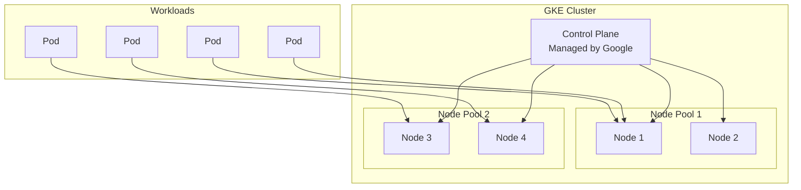
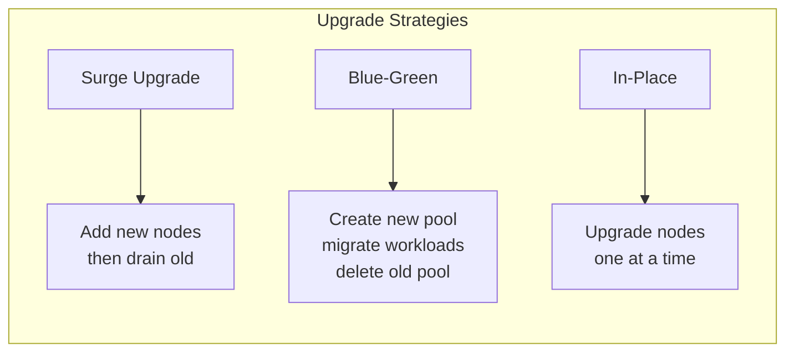
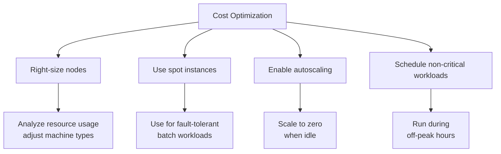

# How to Handle GKE Cluster Management

Author: [nawazdhandala](https://www.github.com/nawazdhandala)

Tags: GKE, Kubernetes, Google Cloud Platform, Container Orchestration, DevOps, Cloud Infrastructure

Description: Learn essential techniques for managing Google Kubernetes Engine clusters including scaling, upgrades, monitoring, and troubleshooting.

---

Google Kubernetes Engine (GKE) simplifies running Kubernetes clusters on Google Cloud Platform, but effective cluster management still requires understanding key concepts and best practices. This guide covers essential GKE cluster management tasks from initial setup to ongoing maintenance and troubleshooting.

## GKE Architecture Overview

Before diving into management tasks, let us understand the GKE architecture:



GKE manages the control plane for you, while you manage node pools and workloads. This shared responsibility model reduces operational burden while giving you control where it matters.

## Creating and Configuring Clusters

### Basic Cluster Creation

```bash
# Create a standard GKE cluster
gcloud container clusters create my-cluster \
    --zone us-central1-a \
    --num-nodes 3 \
    --machine-type e2-standard-4 \
    --enable-autoscaling \
    --min-nodes 1 \
    --max-nodes 10

# Create an Autopilot cluster (fully managed)
gcloud container clusters create-auto my-autopilot-cluster \
    --region us-central1
```

### Production-Ready Cluster Configuration

For production workloads, consider these settings:

```bash
# Create a production cluster with best practices
gcloud container clusters create production-cluster \
    --region us-central1 \
    --num-nodes 2 \
    --machine-type e2-standard-4 \
    --enable-autoscaling \
    --min-nodes 2 \
    --max-nodes 20 \
    --enable-autorepair \
    --enable-autoupgrade \
    --enable-ip-alias \
    --enable-network-policy \
    --enable-vertical-pod-autoscaling \
    --workload-pool=my-project.svc.id.goog \
    --release-channel regular \
    --enable-shielded-nodes \
    --shielded-secure-boot \
    --maintenance-window-start "2026-01-01T04:00:00Z" \
    --maintenance-window-end "2026-01-01T08:00:00Z" \
    --maintenance-window-recurrence "FREQ=WEEKLY;BYDAY=SA,SU"
```

## Node Pool Management

Node pools allow you to have different machine configurations within the same cluster.

### Creating Specialized Node Pools

```bash
# Create a node pool for CPU-intensive workloads
gcloud container node-pools create cpu-pool \
    --cluster my-cluster \
    --zone us-central1-a \
    --machine-type c2-standard-8 \
    --num-nodes 2 \
    --enable-autoscaling \
    --min-nodes 0 \
    --max-nodes 10 \
    --node-labels workload-type=cpu-intensive

# Create a node pool with GPUs for ML workloads
gcloud container node-pools create gpu-pool \
    --cluster my-cluster \
    --zone us-central1-a \
    --machine-type n1-standard-4 \
    --accelerator type=nvidia-tesla-t4,count=1 \
    --num-nodes 1 \
    --enable-autoscaling \
    --min-nodes 0 \
    --max-nodes 5 \
    --node-taints gpu=true:NoSchedule

# Create a spot instance node pool for cost savings
gcloud container node-pools create spot-pool \
    --cluster my-cluster \
    --zone us-central1-a \
    --machine-type e2-standard-4 \
    --spot \
    --num-nodes 3 \
    --enable-autoscaling \
    --min-nodes 0 \
    --max-nodes 20 \
    --node-taints cloud.google.com/gke-spot=true:NoSchedule
```

### Updating Node Pools

```bash
# Resize a node pool
gcloud container clusters resize my-cluster \
    --node-pool default-pool \
    --num-nodes 5 \
    --zone us-central1-a

# Update autoscaling settings
gcloud container clusters update my-cluster \
    --zone us-central1-a \
    --node-pool default-pool \
    --enable-autoscaling \
    --min-nodes 3 \
    --max-nodes 15

# Upgrade node pool to a specific version
gcloud container node-pools upgrade default-pool \
    --cluster my-cluster \
    --zone us-central1-a \
    --cluster-version 1.28.5-gke.1200
```

## Cluster Upgrades

GKE provides multiple upgrade strategies. Understanding them helps minimize downtime.



### Managing Upgrades

```bash
# Check available versions
gcloud container get-server-config --zone us-central1-a

# Upgrade control plane
gcloud container clusters upgrade my-cluster \
    --zone us-central1-a \
    --master \
    --cluster-version 1.28.5-gke.1200

# Upgrade node pools with surge settings
gcloud container node-pools upgrade default-pool \
    --cluster my-cluster \
    --zone us-central1-a \
    --max-surge-upgrade 2 \
    --max-unavailable-upgrade 0
```

### Setting Up Release Channels

```bash
# Switch to a release channel for automatic upgrades
gcloud container clusters update my-cluster \
    --zone us-central1-a \
    --release-channel stable

# Check current release channel
gcloud container clusters describe my-cluster \
    --zone us-central1-a \
    --format="value(releaseChannel.channel)"
```

## Monitoring and Observability

### Enabling GKE Monitoring

```bash
# Enable managed Prometheus
gcloud container clusters update my-cluster \
    --zone us-central1-a \
    --enable-managed-prometheus

# Enable Cloud Logging and Monitoring
gcloud container clusters update my-cluster \
    --zone us-central1-a \
    --logging=SYSTEM,WORKLOAD \
    --monitoring=SYSTEM,WORKLOAD
```

### Useful Monitoring Queries

```bash
# Get cluster resource usage
kubectl top nodes

# Check pod resource consumption
kubectl top pods --all-namespaces

# View cluster events
kubectl get events --sort-by='.lastTimestamp' -A

# Check node conditions
kubectl get nodes -o custom-columns=NAME:.metadata.name,STATUS:.status.conditions[-1].type,REASON:.status.conditions[-1].reason
```

### Creating Custom Metrics Dashboard

Deploy a monitoring configuration:

```yaml
# monitoring-config.yaml
apiVersion: monitoring.googleapis.com/v1
kind: PodMonitoring
metadata:
  name: app-metrics
  namespace: default
spec:
  selector:
    matchLabels:
      app: my-application
  endpoints:
  - port: metrics
    interval: 30s
    path: /metrics
```

## Troubleshooting Common Issues

### Node NotReady Status

```bash
# Check node status
kubectl describe node <node-name>

# Check for resource pressure
kubectl get nodes -o jsonpath='{range .items[*]}{.metadata.name}{"\t"}{.status.conditions[?(@.type=="MemoryPressure")].status}{"\t"}{.status.conditions[?(@.type=="DiskPressure")].status}{"\n"}{end}'

# Cordon and drain a problematic node
kubectl cordon <node-name>
kubectl drain <node-name> --ignore-daemonsets --delete-emptydir-data
```

### Pod Scheduling Issues

```bash
# Check why pods are pending
kubectl describe pod <pod-name> -n <namespace>

# View scheduler events
kubectl get events --field-selector reason=FailedScheduling

# Check resource requests vs available
kubectl describe nodes | grep -A 5 "Allocated resources"
```

### Network Connectivity Problems

```bash
# Test DNS resolution
kubectl run dns-test --image=busybox:1.28 --rm -it --restart=Never -- nslookup kubernetes

# Check network policies
kubectl get networkpolicies -A

# Verify service endpoints
kubectl get endpoints <service-name> -n <namespace>
```

## Security Best Practices

### Workload Identity Configuration

```bash
# Enable Workload Identity on cluster
gcloud container clusters update my-cluster \
    --zone us-central1-a \
    --workload-pool=my-project.svc.id.goog

# Create a Kubernetes service account
kubectl create serviceaccount my-ksa -n default

# Create a GCP service account
gcloud iam service-accounts create my-gsa \
    --display-name="GKE Workload Identity SA"

# Allow KSA to impersonate GSA
gcloud iam service-accounts add-iam-policy-binding my-gsa@my-project.iam.gserviceaccount.com \
    --role roles/iam.workloadIdentityUser \
    --member "serviceAccount:my-project.svc.id.goog[default/my-ksa]"

# Annotate the Kubernetes service account
kubectl annotate serviceaccount my-ksa \
    --namespace default \
    iam.gke.io/gcp-service-account=my-gsa@my-project.iam.gserviceaccount.com
```

### Network Security

```yaml
# network-policy.yaml - Restrict pod communication
apiVersion: networking.k8s.io/v1
kind: NetworkPolicy
metadata:
  name: default-deny-ingress
  namespace: production
spec:
  podSelector: {}
  policyTypes:
  - Ingress

---
# Allow traffic only from specific pods
apiVersion: networking.k8s.io/v1
kind: NetworkPolicy
metadata:
  name: allow-frontend-to-backend
  namespace: production
spec:
  podSelector:
    matchLabels:
      app: backend
  policyTypes:
  - Ingress
  ingress:
  - from:
    - podSelector:
        matchLabels:
          app: frontend
    ports:
    - protocol: TCP
      port: 8080
```

## Cost Optimization



### Implementing Cost Controls

```bash
# Set resource quotas per namespace
kubectl apply -f - <<EOF
apiVersion: v1
kind: ResourceQuota
metadata:
  name: compute-quota
  namespace: development
spec:
  hard:
    requests.cpu: "20"
    requests.memory: 40Gi
    limits.cpu: "40"
    limits.memory: 80Gi
    pods: "50"
EOF

# Enable cluster autoscaler with scale-down
gcloud container clusters update my-cluster \
    --zone us-central1-a \
    --enable-autoscaling \
    --autoscaling-profile optimize-utilization
```

## Backup and Disaster Recovery

### Using Backup for GKE

```bash
# Enable Backup for GKE API
gcloud services enable gkebackup.googleapis.com

# Create a backup plan
gcloud beta container backup-restore backup-plans create my-backup-plan \
    --project=my-project \
    --location=us-central1 \
    --cluster=projects/my-project/locations/us-central1-a/clusters/my-cluster \
    --all-namespaces \
    --cron-schedule="0 3 * * *" \
    --backup-retain-days=30

# Create a manual backup
gcloud beta container backup-restore backups create my-backup \
    --project=my-project \
    --location=us-central1 \
    --backup-plan=my-backup-plan
```

## Conclusion

Effective GKE cluster management requires attention to multiple areas: proper initial configuration, ongoing maintenance through upgrades and scaling, security hardening, and cost optimization. By following the practices outlined in this guide, you can run reliable, secure, and cost-effective Kubernetes workloads on GKE. Remember to regularly review your cluster configuration against GCP best practices and take advantage of GKE's managed features to reduce operational burden while maintaining control over your infrastructure.
