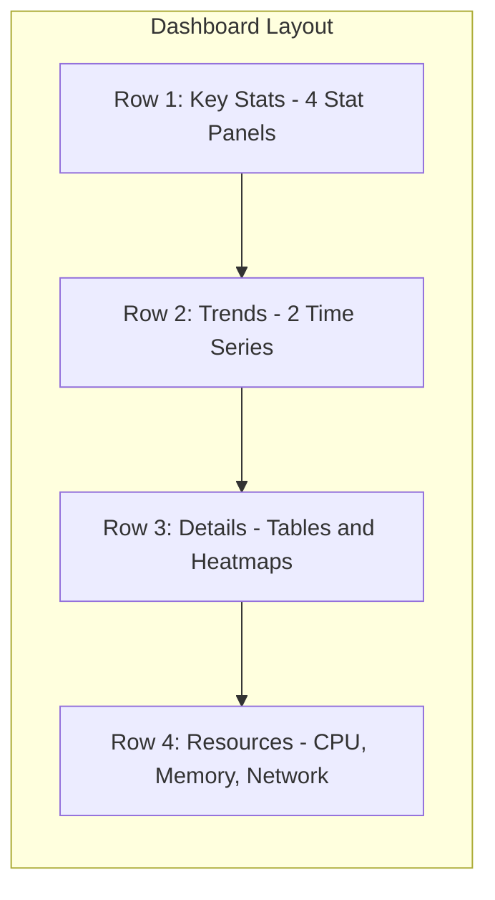

# How to Create Custom Dashboards in Grafana

Author: [nawazdhandala](https://www.github.com/nawazdhandala)

Tags: Grafana, Dashboards, Visualization, Monitoring, PromQL, Time Series

Description: Learn how to build custom Grafana dashboards from scratch, including panel configuration, query optimization, and layout techniques that make your data easy to understand.

---

Pre-built dashboards are a good starting point, but every team eventually needs custom dashboards tailored to their specific services and SLOs. This guide covers the full process of creating effective Grafana dashboards, from layout planning to query optimization.

## Planning Your Dashboard

Before opening Grafana, answer these questions:

1. Who will use this dashboard? (SRE on-call, developers, management)
2. What decisions will it help them make?
3. What time ranges matter? (Real-time, last hour, last day)
4. What is the primary metric viewers should see first?

A dashboard for on-call engineers needs different information than one for weekly reviews. Design for your audience.

## Creating a New Dashboard

Open Grafana and click the **+** icon in the left sidebar, then select **Dashboard**. You start with an empty canvas.

### Understanding the Dashboard Grid

Grafana uses a 24-column grid system. Panels can span any number of columns and rows. Common layouts:

- **Full width panels**: 24 columns, good for time series showing trends
- **Half width panels**: 12 columns, good for side-by-side comparisons
- **Stat panels**: 4-6 columns, good for key metrics at the top

## Adding Your First Panel

Click **Add a new panel**. The panel editor opens with three main sections:

1. **Query section**: Where you define data queries
2. **Visualization options**: Panel type and display settings
3. **Preview**: Live preview of your panel

### Example: HTTP Request Rate Panel

Let us create a panel showing HTTP request rates by status code. In the query editor:

```promql
# Sum of HTTP requests per second, grouped by status code
sum by (status_code) (
  rate(http_requests_total[5m])
)
```

Configure the visualization:
- **Panel type**: Time series
- **Title**: HTTP Requests by Status Code
- **Legend mode**: Table
- **Legend placement**: Bottom

Click **Apply** to save the panel.

## Panel Types and When to Use Them

Grafana offers many visualization types. Here is when to use each:

### Time Series
Best for: Metrics that change over time, trends, patterns

```promql
# CPU usage over time
rate(process_cpu_seconds_total[5m])
```

### Stat
Best for: Single current values, KPIs at the top of dashboards

```promql
# Current active connections
sum(active_connections)
```

Configure thresholds to show green/yellow/red based on values.

### Gauge
Best for: Values with known min/max, like disk usage or saturation

```promql
# Disk usage percentage
(node_filesystem_size_bytes - node_filesystem_avail_bytes)
/ node_filesystem_size_bytes * 100
```

### Table
Best for: Comparing multiple entities, detailed breakdowns

```promql
# Top 10 endpoints by request count
topk(10, sum by (endpoint) (increase(http_requests_total[1h])))
```

### Heatmap
Best for: Histograms, latency distributions

```promql
# Request latency distribution
sum by (le) (rate(http_request_duration_seconds_bucket[5m]))
```

## Building a Multi-Panel Dashboard

Let us build a complete service health dashboard with multiple panels.

### Row 1: Key Metrics (Stat Panels)

Create a row with four stat panels:

```promql
# Panel 1: Request Rate
sum(rate(http_requests_total[5m]))

# Panel 2: Error Rate
sum(rate(http_requests_total{status_code=~"5.."}[5m]))
/ sum(rate(http_requests_total[5m])) * 100

# Panel 3: P99 Latency
histogram_quantile(0.99, sum by (le) (rate(http_request_duration_seconds_bucket[5m])))

# Panel 4: Active Pods
count(kube_pod_status_phase{phase="Running", pod=~"myservice.*"})
```

Arrange these across the top row, each 6 columns wide.

### Row 2: Time Series

Add a row below with two time series panels:

```promql
# Panel 1: Request rate over time (12 columns)
sum by (status_code) (rate(http_requests_total[5m]))

# Panel 2: Latency percentiles over time (12 columns)
histogram_quantile(0.50, sum by (le) (rate(http_request_duration_seconds_bucket[5m])))
histogram_quantile(0.90, sum by (le) (rate(http_request_duration_seconds_bucket[5m])))
histogram_quantile(0.99, sum by (le) (rate(http_request_duration_seconds_bucket[5m])))
```

### Row 3: Detailed Breakdown

Add a table showing per-endpoint metrics:

```promql
# Request count and error rate by endpoint
sum by (endpoint) (increase(http_requests_total[1h]))
```

## Dashboard Organization



This layout follows the principle of progressive disclosure: start with summary, then details.

## Using Rows to Organize Content

Rows group related panels and can be collapsed. Add a row:

1. Click **Add** > **Row**
2. Enter a title like "Resource Usage"
3. Drag panels into the row

Collapsible rows help manage large dashboards. Users can expand sections relevant to their investigation.

## Query Optimization

Slow queries make dashboards frustrating to use. Follow these practices:

### Use Recording Rules

For frequently-used queries, create Prometheus recording rules:

```yaml
# prometheus-rules.yaml
groups:
  - name: service-metrics
    rules:
      - record: service:http_request_rate:5m
        expr: sum by (service) (rate(http_requests_total[5m]))
      - record: service:http_error_rate:5m
        expr: |
          sum by (service) (rate(http_requests_total{status_code=~"5.."}[5m]))
          / sum by (service) (rate(http_requests_total[5m]))
```

Then use the recorded metric in Grafana:

```promql
service:http_request_rate:5m{service="api"}
```

### Limit Label Cardinality

High cardinality queries are slow. Instead of:

```promql
# Bad: High cardinality
sum by (user_id) (http_requests_total)
```

Use:

```promql
# Good: Limited labels
sum by (endpoint, method) (http_requests_total)
```

### Set Appropriate Time Ranges

Match the query resolution to the time range:

```promql
# For 1-hour dashboards, use 1m intervals
rate(http_requests_total[1m])

# For 24-hour dashboards, use 5m intervals
rate(http_requests_total[5m])

# For 7-day dashboards, use 1h intervals
rate(http_requests_total[1h])
```

## Configuring Dashboard Settings

Click the gear icon to access dashboard settings:

### General
- **Name**: Descriptive name for the dashboard
- **Description**: Explain what this dashboard shows
- **Tags**: Add tags for easy searching
- **Folder**: Organize into folders by team or service

### Variables
Add variables for filtering (covered in detail in a separate post):

```
Name: namespace
Type: Query
Query: label_values(http_requests_total, namespace)
```

### Links
Add links to related dashboards or runbooks:

- Related dashboards (drill-down links)
- External documentation
- Incident runbooks

### Time Options
- **Timezone**: Set to UTC or local time
- **Auto refresh**: Set appropriate refresh interval
- **Time picker options**: Define quick ranges

## Annotations

Annotations mark events on time series panels. Add annotations for:

- Deployments
- Incidents
- Configuration changes

```yaml
# Annotation query showing deployments
tags: deployment
datasource: Prometheus
query: changes(kube_deployment_status_observed_generation{deployment="myservice"}[1m]) > 0
```

## Dashboard JSON Model

Every dashboard is stored as JSON. Export it for version control:

1. Dashboard Settings > JSON Model
2. Copy the JSON
3. Store in Git alongside your application code

Import from JSON:

1. Click **+** > **Import**
2. Paste JSON or upload file
3. Select data sources

## Best Practices

**Start with questions, not metrics**: What do operators need to know? Build panels that answer those questions.

**Use consistent colors**: Define a color scheme. Red for errors, green for success, yellow for warnings.

**Add descriptions to panels**: Click the panel title > Edit > add description. Explain what the metric means and what action to take if it looks wrong.

**Test with real incidents**: Review the dashboard during an actual incident. Did it help you find the problem? If not, adjust.

**Keep it focused**: A dashboard with 50 panels helps nobody. Create multiple focused dashboards instead of one mega-dashboard.

## Common Mistakes to Avoid

**Too many panels**: Cognitive overload makes dashboards useless. Limit to 10-15 panels per dashboard.

**Missing units**: Always set units (requests/sec, bytes, milliseconds). Raw numbers without context are meaningless.

**No thresholds**: Color-coded thresholds help viewers instantly identify problems.

**Hardcoded filters**: Use variables instead of hardcoding namespace or service names.

## Sharing Dashboards

Share dashboards with your team:

**Share link**: Click Share > Copy link. Viewers need Grafana access.

**Export JSON**: Dashboard Settings > JSON Model > Copy. Import in another Grafana instance.

**Publish to grafana.com**: Share with the community by publishing to the Grafana dashboard repository.

## Conclusion

Custom dashboards transform raw metrics into operational intelligence. Start with the questions you need answered, choose appropriate visualizations, and iterate based on real usage during incidents. A well-designed dashboard reduces mean time to detection and helps your team operate confidently.
