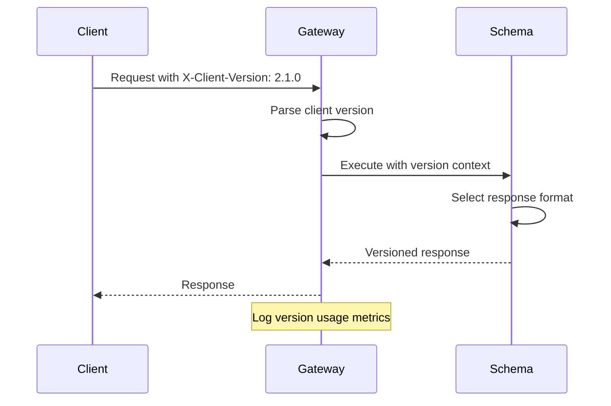
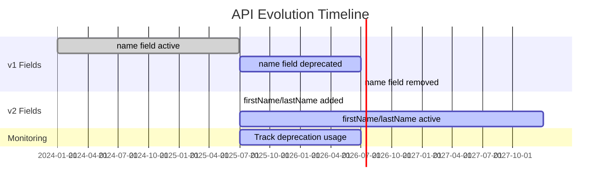

# How to Handle Versioning in GraphQL APIs

Author: [nawazdhandala](https://www.github.com/nawazdhandala)

Tags: GraphQL, API Design, Versioning, Schema Evolution, Deprecation, Backend

Description: Learn strategies for versioning GraphQL APIs including schema evolution, field deprecation, additive changes, and migration patterns without breaking clients.

---

GraphQL was designed to avoid the versioning problems common in REST APIs. Instead of maintaining multiple API versions, GraphQL encourages continuous schema evolution through additive changes and deprecation. This guide covers practical strategies for evolving your GraphQL API while maintaining backward compatibility.

## The GraphQL Philosophy on Versioning

Unlike REST APIs where `/v1/users` and `/v2/users` might coexist, GraphQL promotes a single evolving endpoint. The schema grows organically while deprecated fields continue working until clients migrate.

```mermaid
flowchart LR
    subgraph "REST Versioning"
        A1[/v1/users] --> B1[Version 1 Response]
        A2[/v2/users] --> B2[Version 2 Response]
        A3[/v3/users] --> B3[Version 3 Response]
    end

    subgraph "GraphQL Evolution"
        C[/graphql] --> D[Single Evolving Schema]
        D --> E[Deprecated Fields]
        D --> F[New Fields]
        D --> G[Active Fields]
    end
```

## Schema Evolution Strategies

### Strategy 1: Additive Changes

Add new fields without removing existing ones. This is the safest approach.

```graphql
# Original schema
type User {
  id: ID!
  name: String!
  email: String!
}

# Evolved schema - added new fields without breaking changes
type User {
  id: ID!
  name: String!              # Still works for existing clients
  email: String!             # Still works for existing clients

  # New fields - existing clients ignore these
  firstName: String
  lastName: String
  avatarUrl: String
  createdAt: DateTime!
  updatedAt: DateTime!
}
```

### Strategy 2: Field Deprecation

Mark fields as deprecated with migration guidance.

```graphql
type User {
  id: ID!

  # Deprecated field with reason and alternative
  name: String! @deprecated(reason: "Use firstName and lastName instead")

  # New fields that replace the deprecated one
  firstName: String!
  lastName: String!

  # Computed field for backward compatibility
  displayName: String!

  email: String!
}
```

### Resolver Implementation for Deprecated Fields

```javascript
// resolvers/user.js

const userResolvers = {
  User: {
    // Keep the deprecated field working
    // This ensures existing clients continue functioning
    name: (user) => {
      // Log deprecation usage for monitoring
      if (process.env.NODE_ENV === 'production') {
        deprecationTracker.track('User.name');
      }

      // Return the same data as before
      return `${user.firstName} ${user.lastName}`;
    },

    // New fields
    firstName: (user) => user.firstName,
    lastName: (user) => user.lastName,

    // Helper field for transition
    displayName: (user) => {
      return user.displayName || `${user.firstName} ${user.lastName}`;
    },
  },
};
```

## Handling Breaking Changes

Sometimes breaking changes are unavoidable. Handle them gracefully with these patterns.

### Pattern 1: Parallel Fields During Transition

```graphql
type Product {
  id: ID!

  # Original field - returns cents as integer
  price: Int! @deprecated(reason: "Use priceV2 for proper currency handling")

  # New field with better structure
  priceV2: Money!
}

type Money {
  amount: Float!
  currency: Currency!
  formatted: String!
}

enum Currency {
  USD
  EUR
  GBP
}
```

```javascript
// resolvers/product.js

const productResolvers = {
  Product: {
    // Original field - maintain for backward compatibility
    price: (product) => {
      // Convert from new format back to old format
      return Math.round(product.price.amount * 100);
    },

    // New field with full currency support
    priceV2: (product) => ({
      amount: product.price.amount,
      currency: product.price.currency,
      formatted: formatCurrency(product.price.amount, product.price.currency),
    }),
  },
};
```

### Pattern 2: Union Types for Gradual Migration

```graphql
# When you need to change a return type dramatically
type Query {
  # Returns either old or new format based on client capability
  searchResults(query: String!): SearchResultsResponse!
}

# Union allows different response shapes
union SearchResultsResponse = LegacySearchResults | ModernSearchResults

type LegacySearchResults {
  items: [SearchItem!]!
  total: Int!
}

type ModernSearchResults {
  edges: [SearchEdge!]!
  pageInfo: PageInfo!
  totalCount: Int!
  facets: [Facet!]!
}
```

```javascript
// resolvers/search.js

const searchResolvers = {
  Query: {
    searchResults: async (_, args, context) => {
      const results = await performSearch(args.query);

      // Check client version from context or header
      const clientVersion = context.clientVersion;

      if (clientVersion && semver.gte(clientVersion, '2.0.0')) {
        return {
          __typename: 'ModernSearchResults',
          edges: results.items.map((item, i) => ({
            node: item,
            cursor: encodeCursor(i),
          })),
          pageInfo: buildPageInfo(results),
          totalCount: results.total,
          facets: results.facets,
        };
      }

      // Legacy clients get the old format
      return {
        __typename: 'LegacySearchResults',
        items: results.items,
        total: results.total,
      };
    },
  },

  // Resolver for union type
  SearchResultsResponse: {
    __resolveType: (obj) => obj.__typename,
  },
};
```

## Client Version Negotiation

Track client versions to manage transitions and monitor deprecation usage.



```javascript
// context.js

async function createContext({ req }) {
  // Extract client version from header
  const clientVersion = req.headers['x-client-version'];
  const clientName = req.headers['x-client-name'];

  // Parse and validate version
  let parsedVersion = null;
  if (clientVersion) {
    try {
      parsedVersion = semver.parse(clientVersion);
    } catch (e) {
      console.warn(`Invalid client version: ${clientVersion}`);
    }
  }

  return {
    clientVersion: parsedVersion,
    clientName,
    // Helper for version checks
    supportsFeature: (featureVersion) => {
      if (!parsedVersion) return false;
      return semver.gte(parsedVersion, featureVersion);
    },
  };
}
```

```javascript
// Usage in resolvers
const resolvers = {
  Query: {
    users: (_, args, context) => {
      // New pagination for clients >= 2.0.0
      if (context.supportsFeature('2.0.0')) {
        return getUsersWithCursorPagination(args);
      }

      // Legacy offset pagination
      return getUsersWithOffsetPagination(args);
    },
  },
};
```

## Deprecation Monitoring

Track usage of deprecated fields to know when they can be safely removed.

```javascript
// plugins/deprecation-tracker.js

const deprecationUsage = new Map();

const deprecationTrackerPlugin = {
  async requestDidStart() {
    return {
      async executionDidStart() {
        return {
          willResolveField({ info }) {
            // Check if field is deprecated
            const field = info.parentType.getFields()[info.fieldName];

            if (field?.deprecationReason) {
              const key = `${info.parentType.name}.${info.fieldName}`;
              const count = deprecationUsage.get(key) || 0;
              deprecationUsage.set(key, count + 1);

              // Log for monitoring
              console.log(`Deprecated field accessed: ${key}`);
            }
          },
        };
      },
    };
  },
};

// Endpoint to check deprecation usage
app.get('/admin/deprecation-report', (req, res) => {
  const report = Array.from(deprecationUsage.entries())
    .map(([field, count]) => ({ field, count }))
    .sort((a, b) => b.count - a.count);

  res.json({
    generatedAt: new Date().toISOString(),
    totalDeprecatedCalls: report.reduce((sum, r) => sum + r.count, 0),
    fields: report,
  });
});
```

## Schema Registry for Version Management

Use a schema registry to track schema changes over time.

```javascript
// schema-registry.js

const { createHash } = require('crypto');
const { printSchema } = require('graphql');

class SchemaRegistry {
  constructor(storage) {
    this.storage = storage; // Redis, database, etc.
  }

  // Register a new schema version
  async registerSchema(schema, metadata = {}) {
    const schemaString = printSchema(schema);
    const hash = createHash('sha256').update(schemaString).digest('hex');

    const version = {
      hash,
      schema: schemaString,
      registeredAt: new Date().toISOString(),
      ...metadata,
    };

    await this.storage.set(`schema:${hash}`, JSON.stringify(version));
    await this.storage.lpush('schema:versions', hash);

    return version;
  }

  // Compare two schema versions
  async compareVersions(hash1, hash2) {
    const schema1 = await this.getSchema(hash1);
    const schema2 = await this.getSchema(hash2);

    // Use graphql-inspector or similar for diff
    const changes = findSchemaChanges(schema1, schema2);

    return {
      breaking: changes.filter((c) => c.breaking),
      nonBreaking: changes.filter((c) => !c.breaking),
      deprecated: changes.filter((c) => c.type === 'DEPRECATION'),
    };
  }

  // Get deprecation timeline
  async getDeprecationTimeline() {
    const versions = await this.storage.lrange('schema:versions', 0, -1);
    const timeline = [];

    for (const hash of versions) {
      const version = await this.getSchema(hash);
      const deprecated = extractDeprecatedFields(version.schema);

      timeline.push({
        hash,
        date: version.registeredAt,
        deprecatedFields: deprecated,
      });
    }

    return timeline;
  }
}
```

## Migration Guides for Clients

Provide clear migration documentation in your schema.

```graphql
"""
User represents a registered user in the system.

## Migration Guide (v1 to v2)

### Deprecated Fields
- `name` - Use `firstName` and `lastName` instead
- `avatar` - Use `avatarUrl` for full URL

### New Fields in v2
- `firstName`, `lastName` - Split name fields
- `avatarUrl` - Full URL to avatar image
- `preferences` - User preference settings

### Example Migration

Before (v1):
```graphql
query {
  user(id: "123") {
    name
    avatar
  }
}
```

After (v2):
```graphql
query {
  user(id: "123") {
    firstName
    lastName
    avatarUrl
  }
}
```
"""
type User {
  id: ID!

  """
  @deprecated Use firstName and lastName instead.
  Will be removed in Q3 2026.
  """
  name: String! @deprecated(reason: "Use firstName and lastName. Removal: Q3 2026")

  firstName: String!
  lastName: String!

  """
  @deprecated Use avatarUrl for the complete URL.
  """
  avatar: String @deprecated(reason: "Use avatarUrl instead")

  avatarUrl: String

  email: String!
  preferences: UserPreferences
}
```

## Version Evolution Timeline



## Automated Schema Checks in CI

```yaml
# .github/workflows/schema-check.yml
name: Schema Compatibility Check

on:
  pull_request:
    paths:
      - 'src/schema/**'

jobs:
  check-breaking-changes:
    runs-on: ubuntu-latest
    steps:
      - uses: actions/checkout@v4
        with:
          fetch-depth: 0

      - name: Setup Node.js
        uses: actions/setup-node@v4
        with:
          node-version: '20'

      - name: Install dependencies
        run: npm ci

      - name: Check for breaking changes
        run: |
          # Get schema from main branch
          git show origin/main:src/schema/schema.graphql > schema-main.graphql

          # Compare with PR schema
          npx @graphql-inspector/cli diff \
            schema-main.graphql \
            src/schema/schema.graphql \
            --rule suppressRemovalOfDeprecatedField

      - name: Validate deprecations have dates
        run: |
          # Ensure all deprecations include removal timeline
          npm run validate:deprecations
```

## Summary

| Strategy | Use Case |
|----------|----------|
| **Additive Changes** | Adding new fields, types, or arguments |
| **Deprecation** | Phasing out old fields with migration guidance |
| **Parallel Fields** | Providing old and new versions simultaneously |
| **Union Types** | Returning different response shapes based on context |
| **Client Version Headers** | Negotiating response format per client |
| **Schema Registry** | Tracking schema evolution over time |
| **Deprecation Monitoring** | Tracking usage to plan removal |

GraphQL versioning is about evolution, not revolution. Add new capabilities without removing old ones, mark deprecated fields clearly with removal timelines, monitor usage to know when removal is safe, and provide clear migration documentation. This approach keeps your API stable for existing clients while allowing continuous improvement for new features.
