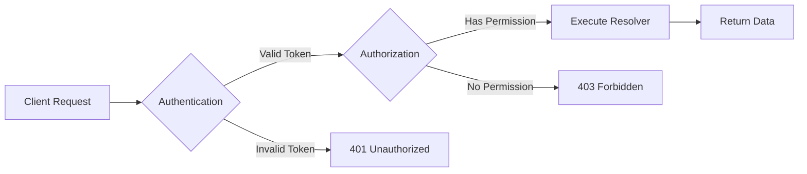
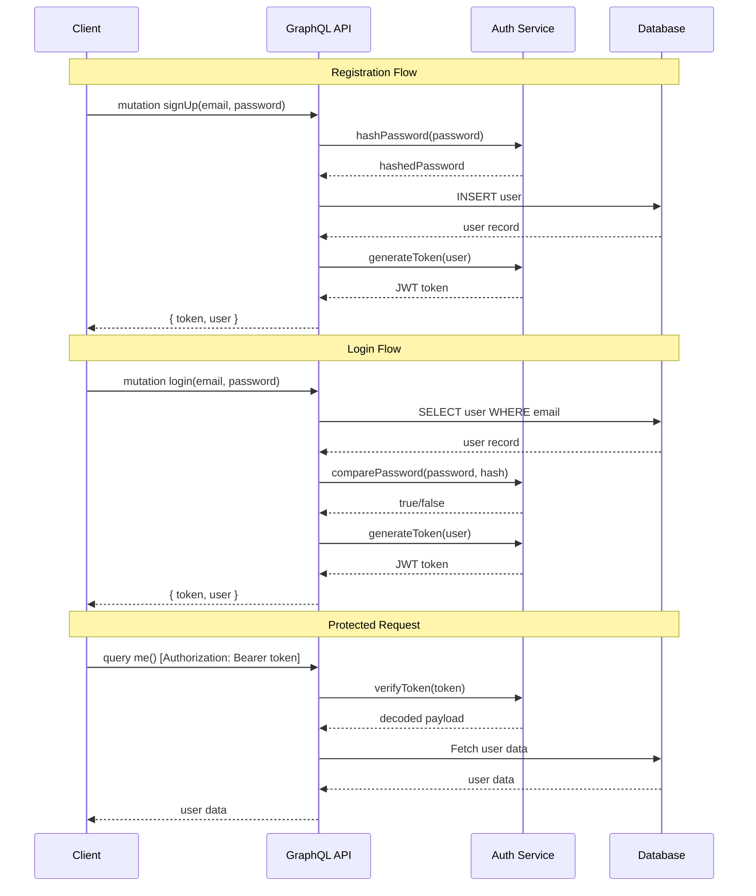
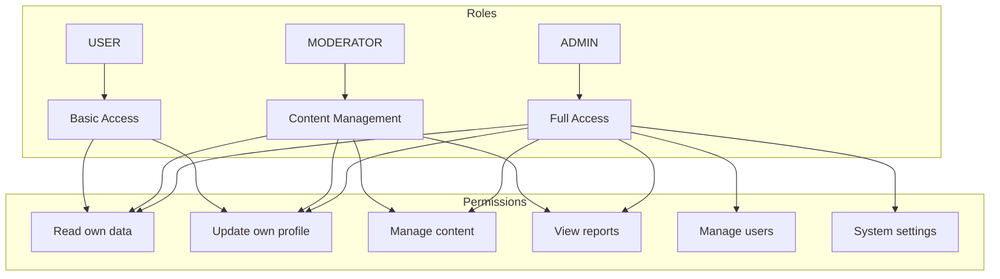

# How to Handle Authentication in GraphQL APIs

Author: [nawazdhandala](https://www.github.com/nawazdhandala)

Tags: GraphQL, Authentication, Security, API Development, JWT

Description: A comprehensive guide to implementing authentication in GraphQL APIs using JWT, sessions, and directive-based authorization.

---

Authentication in GraphQL requires a different approach than REST APIs since all requests typically go through a single endpoint. This guide covers multiple authentication strategies, from JWT tokens to session-based auth, and shows you how to implement proper authorization at the resolver level.

## Authentication vs Authorization

Before diving in, let's clarify the difference:

- **Authentication**: Verifying who the user is (login, tokens)
- **Authorization**: Determining what the user can access (permissions, roles)



## Setting Up JWT Authentication

JWT (JSON Web Tokens) is the most common authentication method for GraphQL APIs.

### Step 1: Create the Authentication Utilities

```javascript
// auth/jwt.js
// Utility functions for JWT token management

const jwt = require('jsonwebtoken');
const bcrypt = require('bcryptjs');

// Secret key for signing tokens - store in environment variables
const JWT_SECRET = process.env.JWT_SECRET || 'your-secret-key';
const JWT_EXPIRATION = '24h';

// Generate a JWT token for a user
function generateToken(user) {
  // Include only necessary user info in the token payload
  const payload = {
    userId: user.id,
    email: user.email,
    role: user.role
  };

  return jwt.sign(payload, JWT_SECRET, {
    expiresIn: JWT_EXPIRATION
  });
}

// Verify and decode a JWT token
function verifyToken(token) {
  try {
    return jwt.verify(token, JWT_SECRET);
  } catch (error) {
    // Token is invalid or expired
    return null;
  }
}

// Hash a password before storing in database
async function hashPassword(password) {
  const saltRounds = 12;
  return await bcrypt.hash(password, saltRounds);
}

// Compare password with stored hash
async function comparePassword(password, hash) {
  return await bcrypt.compare(password, hash);
}

module.exports = {
  generateToken,
  verifyToken,
  hashPassword,
  comparePassword
};
```

### Step 2: Create Authentication Context

```javascript
// context.js
// Extract user from request and attach to GraphQL context

const { verifyToken } = require('./auth/jwt');

// Create context function for Apollo Server
async function createContext({ req }) {
  // Get the authorization header
  const authHeader = req.headers.authorization || '';

  // Extract token from "Bearer <token>" format
  const token = authHeader.startsWith('Bearer ')
    ? authHeader.slice(7)
    : null;

  // Default context with null user
  const context = {
    user: null,
    isAuthenticated: false
  };

  if (token) {
    // Verify the token and extract user data
    const decoded = verifyToken(token);

    if (decoded) {
      // Optionally fetch full user from database
      // const user = await db.users.findById(decoded.userId);

      context.user = {
        id: decoded.userId,
        email: decoded.email,
        role: decoded.role
      };
      context.isAuthenticated = true;
    }
  }

  return context;
}

module.exports = { createContext };
```

### Step 3: Define GraphQL Schema with Auth

```graphql
# schema.graphql
# Define types for authentication

type User {
  id: ID!
  email: String!
  name: String!
  role: Role!
  createdAt: String!
}

enum Role {
  USER
  ADMIN
  MODERATOR
}

# Authentication response with token
type AuthPayload {
  token: String!
  user: User!
}

# Input types for auth mutations
input SignUpInput {
  email: String!
  password: String!
  name: String!
}

input LoginInput {
  email: String!
  password: String!
}

type Query {
  # Public query - no authentication required
  publicPosts: [Post!]!

  # Protected query - requires authentication
  me: User

  # Admin only query - requires admin role
  allUsers: [User!]!
}

type Mutation {
  # Public mutations for authentication
  signUp(input: SignUpInput!): AuthPayload!
  login(input: LoginInput!): AuthPayload!

  # Protected mutation - requires authentication
  updateProfile(name: String!): User!

  # Admin only mutation
  deleteUser(id: ID!): Boolean!
}
```

### Step 4: Implement Auth Resolvers

```javascript
// resolvers/auth.js
// Authentication resolvers for signup, login, and protected queries

const { AuthenticationError, ForbiddenError } = require('apollo-server');
const { generateToken, hashPassword, comparePassword } = require('../auth/jwt');

const authResolvers = {
  Query: {
    // Protected query - returns current user
    me: (parent, args, context) => {
      // Check if user is authenticated
      if (!context.isAuthenticated) {
        throw new AuthenticationError('You must be logged in');
      }

      return context.user;
    },

    // Admin-only query
    allUsers: async (parent, args, context) => {
      // Check authentication
      if (!context.isAuthenticated) {
        throw new AuthenticationError('You must be logged in');
      }

      // Check authorization (admin role required)
      if (context.user.role !== 'ADMIN') {
        throw new ForbiddenError('Admin access required');
      }

      return await context.db.users.findAll();
    }
  },

  Mutation: {
    // User registration
    signUp: async (parent, { input }, context) => {
      const { email, password, name } = input;

      // Check if user already exists
      const existingUser = await context.db.users.findByEmail(email);
      if (existingUser) {
        throw new Error('Email already registered');
      }

      // Hash password before storing
      const hashedPassword = await hashPassword(password);

      // Create new user in database
      const user = await context.db.users.create({
        email,
        password: hashedPassword,
        name,
        role: 'USER'
      });

      // Generate JWT token
      const token = generateToken(user);

      return {
        token,
        user
      };
    },

    // User login
    login: async (parent, { input }, context) => {
      const { email, password } = input;

      // Find user by email
      const user = await context.db.users.findByEmail(email);
      if (!user) {
        throw new AuthenticationError('Invalid email or password');
      }

      // Verify password
      const validPassword = await comparePassword(password, user.password);
      if (!validPassword) {
        throw new AuthenticationError('Invalid email or password');
      }

      // Generate JWT token
      const token = generateToken(user);

      return {
        token,
        user
      };
    },

    // Protected mutation - update user profile
    updateProfile: async (parent, { name }, context) => {
      if (!context.isAuthenticated) {
        throw new AuthenticationError('You must be logged in');
      }

      // Update user in database
      const updatedUser = await context.db.users.update(
        context.user.id,
        { name }
      );

      return updatedUser;
    }
  }
};

module.exports = authResolvers;
```

## Using Custom Directives for Authorization

Directives provide a declarative way to add authorization to your schema:

```graphql
# schema.graphql with auth directives

# Custom directive definitions
directive @auth on FIELD_DEFINITION
directive @hasRole(role: Role!) on FIELD_DEFINITION

type Query {
  # Public - no directive
  publicPosts: [Post!]!

  # Requires authentication
  me: User @auth

  # Requires specific role
  allUsers: [User!]! @auth @hasRole(role: ADMIN)

  # Requires either admin or moderator role
  flaggedContent: [Post!]! @auth @hasRole(role: MODERATOR)
}

type Mutation {
  updateProfile(name: String!): User! @auth
  deleteUser(id: ID!): Boolean! @auth @hasRole(role: ADMIN)
}
```

### Implementing Directive Transformers

```javascript
// directives/auth.js
// Custom directive implementations for authentication

const { mapSchema, getDirective, MapperKind } = require('@graphql-tools/utils');
const { defaultFieldResolver } = require('graphql');
const { AuthenticationError, ForbiddenError } = require('apollo-server');

// Transform schema to add @auth directive logic
function authDirectiveTransformer(schema) {
  return mapSchema(schema, {
    // Process each field in the schema
    [MapperKind.OBJECT_FIELD]: (fieldConfig) => {
      // Check if field has @auth directive
      const authDirective = getDirective(schema, fieldConfig, 'auth')?.[0];

      if (authDirective) {
        // Get the original resolver
        const { resolve = defaultFieldResolver } = fieldConfig;

        // Wrap resolver with auth check
        fieldConfig.resolve = async function (source, args, context, info) {
          // Check if user is authenticated
          if (!context.isAuthenticated) {
            throw new AuthenticationError(
              'You must be authenticated to access this resource'
            );
          }

          // Call the original resolver
          return resolve(source, args, context, info);
        };

        return fieldConfig;
      }
    }
  });
}

// Transform schema to add @hasRole directive logic
function hasRoleDirectiveTransformer(schema) {
  return mapSchema(schema, {
    [MapperKind.OBJECT_FIELD]: (fieldConfig) => {
      // Check if field has @hasRole directive
      const hasRoleDirective = getDirective(schema, fieldConfig, 'hasRole')?.[0];

      if (hasRoleDirective) {
        const { role: requiredRole } = hasRoleDirective;
        const { resolve = defaultFieldResolver } = fieldConfig;

        fieldConfig.resolve = async function (source, args, context, info) {
          // Check if user has required role
          if (!context.user || context.user.role !== requiredRole) {
            throw new ForbiddenError(
              `This action requires ${requiredRole} role`
            );
          }

          return resolve(source, args, context, info);
        };

        return fieldConfig;
      }
    }
  });
}

module.exports = {
  authDirectiveTransformer,
  hasRoleDirectiveTransformer
};
```

### Applying Directives to Schema

```javascript
// server.js
// Setting up Apollo Server with auth directives

const { ApolloServer } = require('apollo-server');
const { makeExecutableSchema } = require('@graphql-tools/schema');
const { createContext } = require('./context');
const typeDefs = require('./schema');
const resolvers = require('./resolvers');
const {
  authDirectiveTransformer,
  hasRoleDirectiveTransformer
} = require('./directives/auth');

// Create executable schema
let schema = makeExecutableSchema({
  typeDefs,
  resolvers
});

// Apply directive transformers in order
// Order matters - auth should run before hasRole
schema = authDirectiveTransformer(schema);
schema = hasRoleDirectiveTransformer(schema);

// Create and start server
const server = new ApolloServer({
  schema,
  context: createContext
});

server.listen().then(({ url }) => {
  console.log(`Server ready at ${url}`);
});
```

## Field-Level Authorization

Sometimes you need to restrict access to specific fields based on the user:

```javascript
// resolvers/user.js
// Field-level authorization in resolvers

const { ForbiddenError } = require('apollo-server');

const userResolvers = {
  User: {
    // Email is only visible to the user themselves or admins
    email: (parent, args, context) => {
      // Allow if user is viewing their own profile
      if (context.user?.id === parent.id) {
        return parent.email;
      }

      // Allow if user is admin
      if (context.user?.role === 'ADMIN') {
        return parent.email;
      }

      // Hide email for others
      return null;
    },

    // Private data only visible to the user themselves
    privateNotes: (parent, args, context) => {
      if (context.user?.id !== parent.id) {
        throw new ForbiddenError('You can only view your own private notes');
      }

      return parent.privateNotes;
    }
  }
};

module.exports = userResolvers;
```

## Authentication Flow Diagram



## Session-Based Authentication

For applications that prefer sessions over JWTs:

```javascript
// session-auth.js
// Session-based authentication setup

const session = require('express-session');
const RedisStore = require('connect-redis')(session);
const redis = require('redis');

// Create Redis client for session storage
const redisClient = redis.createClient({
  host: process.env.REDIS_HOST,
  port: process.env.REDIS_PORT
});

// Session middleware configuration
const sessionMiddleware = session({
  store: new RedisStore({ client: redisClient }),
  secret: process.env.SESSION_SECRET,
  resave: false,
  saveUninitialized: false,
  cookie: {
    secure: process.env.NODE_ENV === 'production', // HTTPS only in production
    httpOnly: true,  // Prevents XSS attacks
    maxAge: 24 * 60 * 60 * 1000  // 24 hours
  }
});

// GraphQL context for session auth
function createSessionContext({ req }) {
  return {
    user: req.session.user || null,
    isAuthenticated: !!req.session.user,
    session: req.session
  };
}

// Login resolver with session
const sessionResolvers = {
  Mutation: {
    login: async (parent, { input }, context) => {
      const { email, password } = input;

      // Verify credentials
      const user = await verifyCredentials(email, password);

      if (!user) {
        throw new AuthenticationError('Invalid credentials');
      }

      // Store user in session
      context.session.user = {
        id: user.id,
        email: user.email,
        role: user.role
      };

      return user;
    },

    logout: (parent, args, context) => {
      // Destroy session
      return new Promise((resolve, reject) => {
        context.session.destroy((err) => {
          if (err) {
            reject(new Error('Failed to logout'));
          }
          resolve(true);
        });
      });
    }
  }
};

module.exports = {
  sessionMiddleware,
  createSessionContext,
  sessionResolvers
};
```

## OAuth Integration

Integrating with OAuth providers like Google or GitHub:

```javascript
// oauth/google.js
// Google OAuth integration

const { OAuth2Client } = require('google-auth-library');

const googleClient = new OAuth2Client(process.env.GOOGLE_CLIENT_ID);

// Verify Google ID token
async function verifyGoogleToken(idToken) {
  try {
    const ticket = await googleClient.verifyIdToken({
      idToken,
      audience: process.env.GOOGLE_CLIENT_ID
    });

    const payload = ticket.getPayload();

    return {
      googleId: payload.sub,
      email: payload.email,
      name: payload.name,
      picture: payload.picture
    };
  } catch (error) {
    throw new Error('Invalid Google token');
  }
}

// GraphQL resolver for Google login
const oauthResolvers = {
  Mutation: {
    loginWithGoogle: async (parent, { idToken }, context) => {
      // Verify the Google token
      const googleUser = await verifyGoogleToken(idToken);

      // Find or create user in database
      let user = await context.db.users.findByGoogleId(googleUser.googleId);

      if (!user) {
        // Create new user from Google profile
        user = await context.db.users.create({
          email: googleUser.email,
          name: googleUser.name,
          googleId: googleUser.googleId,
          avatar: googleUser.picture,
          role: 'USER'
        });
      }

      // Generate JWT for the user
      const token = generateToken(user);

      return {
        token,
        user
      };
    }
  }
};

module.exports = oauthResolvers;
```

## Role-Based Access Control (RBAC)



Implementing RBAC:

```javascript
// rbac/permissions.js
// Role-based access control implementation

// Define permissions for each role
const rolePermissions = {
  USER: [
    'read:own_profile',
    'update:own_profile',
    'create:post',
    'update:own_post',
    'delete:own_post'
  ],
  MODERATOR: [
    'read:own_profile',
    'update:own_profile',
    'create:post',
    'update:own_post',
    'delete:own_post',
    'read:all_posts',
    'update:any_post',
    'delete:any_post',
    'read:reports'
  ],
  ADMIN: [
    'read:own_profile',
    'update:own_profile',
    'create:post',
    'update:own_post',
    'delete:own_post',
    'read:all_posts',
    'update:any_post',
    'delete:any_post',
    'read:reports',
    'manage:users',
    'manage:settings'
  ]
};

// Check if user has a specific permission
function hasPermission(user, permission) {
  if (!user || !user.role) {
    return false;
  }

  const permissions = rolePermissions[user.role] || [];
  return permissions.includes(permission);
}

// Authorization middleware for resolvers
function requirePermission(permission) {
  return (resolver) => {
    return async (parent, args, context, info) => {
      if (!hasPermission(context.user, permission)) {
        throw new ForbiddenError(
          `Missing required permission: ${permission}`
        );
      }

      return resolver(parent, args, context, info);
    };
  };
}

// Usage in resolvers
const resolvers = {
  Mutation: {
    deletePost: requirePermission('delete:any_post')(
      async (parent, { id }, context) => {
        return await context.db.posts.delete(id);
      }
    ),

    updateSettings: requirePermission('manage:settings')(
      async (parent, { settings }, context) => {
        return await context.db.settings.update(settings);
      }
    )
  }
};

module.exports = {
  hasPermission,
  requirePermission
};
```

## Security Best Practices

1. **Always use HTTPS** in production
2. **Store tokens securely** - use httpOnly cookies or secure storage
3. **Implement token refresh** for long-lived sessions
4. **Rate limit authentication endpoints** to prevent brute force attacks
5. **Log authentication events** for security monitoring

```javascript
// security/rate-limit.js
// Rate limiting for authentication

const rateLimit = require('express-rate-limit');

// Rate limiter for login attempts
const loginLimiter = rateLimit({
  windowMs: 15 * 60 * 1000, // 15 minutes
  max: 5, // 5 attempts per window
  message: 'Too many login attempts, please try again later',
  standardHeaders: true,
  legacyHeaders: false
});

// Apply to Express app before Apollo middleware
// app.use('/graphql', loginLimiter);

// GraphQL plugin for auth logging
const authLoggingPlugin = {
  requestDidStart() {
    return {
      didResolveOperation({ operationName, context }) {
        // Log authentication-related operations
        if (['login', 'signUp', 'logout'].includes(operationName)) {
          console.log(`Auth operation: ${operationName}`, {
            ip: context.req.ip,
            timestamp: new Date().toISOString(),
            userId: context.user?.id
          });
        }
      }
    };
  }
};

module.exports = {
  loginLimiter,
  authLoggingPlugin
};
```

## Conclusion

Implementing authentication in GraphQL requires careful consideration of where to validate credentials and how to propagate user context through your resolvers. Whether you choose JWT tokens, sessions, or OAuth, the key is to:

1. Extract authentication data in the context
2. Validate permissions in resolvers or directives
3. Handle errors gracefully with appropriate status codes
4. Follow security best practices for token storage and transmission

**Related Reading:**

- [How to Fix N+1 Query Problem in GraphQL](https://oneuptime.com/blog/post/2026-01-24-graphql-n-plus-one-query-problem/view)
- [How to Fix "Cannot Query Field" Errors in GraphQL](https://oneuptime.com/blog/post/2026-01-24-graphql-cannot-query-field-errors/view)
