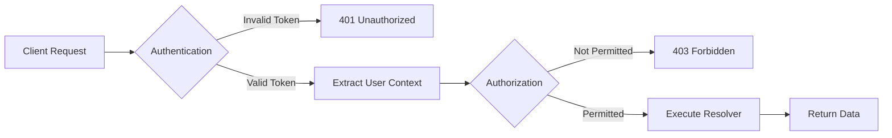
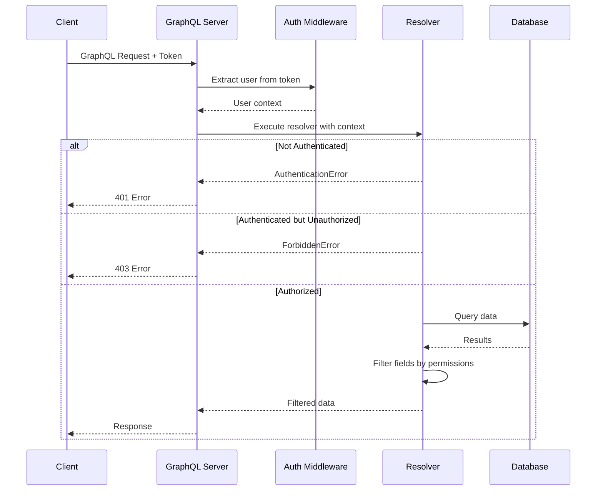

# How to Handle Authorization in GraphQL Resolvers

Author: [nawazdhandala](https://github.com/nawazdhandala)

Tags: GraphQL, Authorization, Security, API Development, Node.js, TypeScript

Description: Learn how to implement robust authorization patterns in GraphQL resolvers, including role-based access control, field-level permissions, and directive-based authorization.

---

Authorization in GraphQL requires a different approach than REST APIs. Since GraphQL allows clients to request any combination of fields and nested data, you need fine-grained control over what each user can access. This guide covers practical patterns for implementing authorization in your resolvers.

## Authentication vs Authorization



Authentication verifies who the user is. Authorization determines what they can do. This guide focuses on authorization, assuming you have already authenticated users and attached their identity to the request context.

## Setting Up the Context

First, establish a context that includes user information for all resolvers:

```typescript
// context.ts
import { Request } from 'express';
import { verifyToken } from './auth';

// Define the user type with roles and permissions
export interface User {
  id: string;
  email: string;
  roles: string[];
  permissions: string[];
  organizationId?: string;
}

// Context available to all resolvers
export interface Context {
  user: User | null;
  isAuthenticated: boolean;
}

export async function createContext({ req }: { req: Request }): Promise<Context> {
  const token = req.headers.authorization?.replace('Bearer ', '');

  if (!token) {
    return { user: null, isAuthenticated: false };
  }

  try {
    const user = await verifyToken(token);
    return { user, isAuthenticated: true };
  } catch (error) {
    return { user: null, isAuthenticated: false };
  }
}
```

```typescript
// server.ts
import { ApolloServer } from '@apollo/server';
import { expressMiddleware } from '@apollo/server/express4';
import { createContext } from './context';
import { schema } from './schema';

const server = new ApolloServer({ schema });

app.use(
  '/graphql',
  expressMiddleware(server, {
    context: createContext,
  })
);
```

## Pattern 1: Resolver-Level Authorization

The simplest approach is checking permissions directly in each resolver:

```typescript
// resolvers/user.ts
import { Context } from '../context';
import { AuthenticationError, ForbiddenError } from '../errors';

export const userResolvers = {
  Query: {
    // Public query - no auth required
    publicUsers: async (_: unknown, __: unknown, context: Context) => {
      return db.users.findMany({
        where: { isPublic: true },
        select: { id: true, name: true },
      });
    },

    // Requires authentication
    me: async (_: unknown, __: unknown, context: Context) => {
      if (!context.isAuthenticated) {
        throw new AuthenticationError('You must be logged in');
      }
      return db.users.findUnique({ where: { id: context.user.id } });
    },

    // Requires specific role
    user: async (_: unknown, args: { id: string }, context: Context) => {
      if (!context.isAuthenticated) {
        throw new AuthenticationError('You must be logged in');
      }

      // Users can view themselves
      if (args.id === context.user.id) {
        return db.users.findUnique({ where: { id: args.id } });
      }

      // Admins can view anyone
      if (!context.user.roles.includes('admin')) {
        throw new ForbiddenError('You can only view your own profile');
      }

      return db.users.findUnique({ where: { id: args.id } });
    },

    // Requires specific permission
    users: async (_: unknown, __: unknown, context: Context) => {
      if (!context.isAuthenticated) {
        throw new AuthenticationError('You must be logged in');
      }

      if (!context.user.permissions.includes('users:read')) {
        throw new ForbiddenError('Missing permission: users:read');
      }

      return db.users.findMany();
    },
  },

  Mutation: {
    updateUser: async (
      _: unknown,
      args: { id: string; input: UpdateUserInput },
      context: Context
    ) => {
      if (!context.isAuthenticated) {
        throw new AuthenticationError('You must be logged in');
      }

      // Users can update themselves, admins can update anyone
      const canUpdate =
        args.id === context.user.id ||
        context.user.roles.includes('admin');

      if (!canUpdate) {
        throw new ForbiddenError('You cannot update this user');
      }

      return db.users.update({
        where: { id: args.id },
        data: args.input,
      });
    },
  },
};
```

## Pattern 2: Authorization Helper Functions

Extract common authorization logic into reusable functions:

```typescript
// auth/guards.ts
import { Context } from '../context';
import { AuthenticationError, ForbiddenError } from '../errors';

// Ensure user is authenticated
export function requireAuth(context: Context): asserts context is Context & { user: NonNullable<Context['user']> } {
  if (!context.isAuthenticated || !context.user) {
    throw new AuthenticationError('You must be logged in');
  }
}

// Check for specific role
export function requireRole(context: Context, role: string): void {
  requireAuth(context);
  if (!context.user.roles.includes(role)) {
    throw new ForbiddenError(`Required role: ${role}`);
  }
}

// Check for any of the specified roles
export function requireAnyRole(context: Context, roles: string[]): void {
  requireAuth(context);
  const hasRole = roles.some((role) => context.user.roles.includes(role));
  if (!hasRole) {
    throw new ForbiddenError(`Required one of roles: ${roles.join(', ')}`);
  }
}

// Check for specific permission
export function requirePermission(context: Context, permission: string): void {
  requireAuth(context);
  if (!context.user.permissions.includes(permission)) {
    throw new ForbiddenError(`Required permission: ${permission}`);
  }
}

// Check resource ownership
export function requireOwnership(
  context: Context,
  resourceOwnerId: string,
  allowRoles: string[] = ['admin']
): void {
  requireAuth(context);

  const isOwner = context.user.id === resourceOwnerId;
  const hasOverrideRole = allowRoles.some((role) =>
    context.user.roles.includes(role)
  );

  if (!isOwner && !hasOverrideRole) {
    throw new ForbiddenError('You do not have access to this resource');
  }
}

// Check organization membership
export function requireOrganizationAccess(
  context: Context,
  organizationId: string
): void {
  requireAuth(context);

  if (context.user.organizationId !== organizationId) {
    throw new ForbiddenError('You do not have access to this organization');
  }
}
```

```typescript
// resolvers/order.ts
import { requireAuth, requireOwnership, requirePermission } from '../auth/guards';

export const orderResolvers = {
  Query: {
    order: async (_: unknown, args: { id: string }, context: Context) => {
      requireAuth(context);

      const order = await db.orders.findUnique({ where: { id: args.id } });
      if (!order) {
        throw new NotFoundError('Order not found');
      }

      // User must own the order or be an admin
      requireOwnership(context, order.userId);

      return order;
    },

    orders: async (_: unknown, __: unknown, context: Context) => {
      requirePermission(context, 'orders:read');

      return db.orders.findMany({
        where: { organizationId: context.user.organizationId },
      });
    },
  },
};
```

## Pattern 3: Field-Level Authorization

Some fields should only be visible to certain users:

```typescript
// resolvers/user.ts
export const userResolvers = {
  User: {
    // Email is only visible to the user themselves or admins
    email: (parent: User, _: unknown, context: Context) => {
      if (!context.isAuthenticated) {
        return null;
      }

      const canView =
        parent.id === context.user.id ||
        context.user.roles.includes('admin');

      return canView ? parent.email : null;
    },

    // Salary is only visible to HR and finance
    salary: (parent: User, _: unknown, context: Context) => {
      if (!context.isAuthenticated) {
        return null;
      }

      const canView = context.user.roles.some((role) =>
        ['hr', 'finance', 'admin'].includes(role)
      );

      return canView ? parent.salary : null;
    },

    // Phone number requires explicit permission
    phoneNumber: (parent: User, _: unknown, context: Context) => {
      if (!context.isAuthenticated) {
        return null;
      }

      if (!context.user.permissions.includes('pii:read')) {
        return null;
      }

      return parent.phoneNumber;
    },
  },
};
```

## Pattern 4: Custom Directives

GraphQL directives provide declarative authorization in your schema:

### Schema Definition

```graphql
# schema.graphql
directive @auth on FIELD_DEFINITION
directive @hasRole(role: String!) on FIELD_DEFINITION
directive @hasPermission(permission: String!) on FIELD_DEFINITION
directive @owner(field: String = "id") on FIELD_DEFINITION

type Query {
  # Public - no directive needed
  publicPosts: [Post!]!

  # Requires authentication
  me: User! @auth

  # Requires admin role
  users: [User!]! @hasRole(role: "admin")

  # Requires specific permission
  auditLogs: [AuditLog!]! @hasPermission(permission: "audit:read")
}

type User {
  id: ID!
  name: String!

  # Only visible to owner or admin
  email: String! @owner

  # Only visible to HR
  salary: Float @hasRole(role: "hr")
}

type Mutation {
  # Requires authentication
  updateProfile(input: UpdateProfileInput!): User! @auth

  # Requires admin role
  deleteUser(id: ID!): Boolean! @hasRole(role: "admin")
}
```

### Directive Implementation

```typescript
// directives/auth.ts
import { mapSchema, getDirective, MapperKind } from '@graphql-tools/utils';
import { GraphQLSchema, defaultFieldResolver } from 'graphql';
import { AuthenticationError, ForbiddenError } from '../errors';

export function authDirectiveTransformer(schema: GraphQLSchema): GraphQLSchema {
  return mapSchema(schema, {
    [MapperKind.OBJECT_FIELD]: (fieldConfig) => {
      // Check for @auth directive
      const authDirective = getDirective(schema, fieldConfig, 'auth')?.[0];
      if (authDirective) {
        const { resolve = defaultFieldResolver } = fieldConfig;
        fieldConfig.resolve = async function (source, args, context, info) {
          if (!context.isAuthenticated) {
            throw new AuthenticationError('You must be logged in');
          }
          return resolve(source, args, context, info);
        };
      }

      // Check for @hasRole directive
      const roleDirective = getDirective(schema, fieldConfig, 'hasRole')?.[0];
      if (roleDirective) {
        const { role } = roleDirective;
        const { resolve = defaultFieldResolver } = fieldConfig;
        fieldConfig.resolve = async function (source, args, context, info) {
          if (!context.isAuthenticated) {
            throw new AuthenticationError('You must be logged in');
          }
          if (!context.user.roles.includes(role)) {
            throw new ForbiddenError(`Required role: ${role}`);
          }
          return resolve(source, args, context, info);
        };
      }

      // Check for @hasPermission directive
      const permDirective = getDirective(schema, fieldConfig, 'hasPermission')?.[0];
      if (permDirective) {
        const { permission } = permDirective;
        const { resolve = defaultFieldResolver } = fieldConfig;
        fieldConfig.resolve = async function (source, args, context, info) {
          if (!context.isAuthenticated) {
            throw new AuthenticationError('You must be logged in');
          }
          if (!context.user.permissions.includes(permission)) {
            throw new ForbiddenError(`Required permission: ${permission}`);
          }
          return resolve(source, args, context, info);
        };
      }

      // Check for @owner directive
      const ownerDirective = getDirective(schema, fieldConfig, 'owner')?.[0];
      if (ownerDirective) {
        const { field = 'id' } = ownerDirective;
        const { resolve = defaultFieldResolver } = fieldConfig;
        fieldConfig.resolve = async function (source, args, context, info) {
          if (!context.isAuthenticated) {
            return null;
          }

          const resourceOwnerId = source[field] || source.userId || source.ownerId;
          const isOwner = context.user.id === resourceOwnerId;
          const isAdmin = context.user.roles.includes('admin');

          if (!isOwner && !isAdmin) {
            return null;
          }

          return resolve(source, args, context, info);
        };
      }

      return fieldConfig;
    },
  });
}
```

### Applying Directives

```typescript
// schema/index.ts
import { makeExecutableSchema } from '@graphql-tools/schema';
import { authDirectiveTransformer } from '../directives/auth';

let schema = makeExecutableSchema({
  typeDefs,
  resolvers,
});

// Apply directive transformers
schema = authDirectiveTransformer(schema);

export { schema };
```

## Pattern 5: GraphQL Shield

GraphQL Shield provides a permissions layer with caching and rule composition:

```typescript
// permissions/index.ts
import { shield, rule, and, or, not, allow, deny } from 'graphql-shield';
import { Context } from '../context';

// Define reusable rules
const isAuthenticated = rule({ cache: 'contextual' })(
  async (_parent, _args, context: Context) => {
    return context.isAuthenticated;
  }
);

const isAdmin = rule({ cache: 'contextual' })(
  async (_parent, _args, context: Context) => {
    return context.user?.roles.includes('admin') ?? false;
  }
);

const isOwner = rule({ cache: 'strict' })(
  async (parent, _args, context: Context) => {
    return parent.userId === context.user?.id || parent.id === context.user?.id;
  }
);

const hasPermission = (permission: string) =>
  rule({ cache: 'contextual' })(async (_parent, _args, context: Context) => {
    return context.user?.permissions.includes(permission) ?? false;
  });

const isSameOrganization = rule({ cache: 'strict' })(
  async (parent, _args, context: Context) => {
    return parent.organizationId === context.user?.organizationId;
  }
);

// Compose permissions
export const permissions = shield(
  {
    Query: {
      // Public queries
      publicPosts: allow,

      // Authenticated queries
      me: isAuthenticated,
      myOrders: isAuthenticated,

      // Admin only
      users: isAdmin,
      auditLogs: and(isAuthenticated, hasPermission('audit:read')),

      // Complex rules
      order: and(isAuthenticated, or(isOwner, isAdmin)),
    },

    Mutation: {
      // Authenticated mutations
      updateProfile: isAuthenticated,
      createOrder: isAuthenticated,

      // Ownership mutations
      updateOrder: and(isAuthenticated, or(isOwner, isAdmin)),
      deleteOrder: and(isAuthenticated, or(isOwner, isAdmin)),

      // Admin mutations
      deleteUser: isAdmin,
      updateUserRole: isAdmin,
    },

    // Field-level permissions
    User: {
      email: or(isOwner, isAdmin),
      salary: hasPermission('salary:read'),
      ssn: and(isAdmin, hasPermission('pii:read')),
    },

    Order: {
      '*': and(isAuthenticated, or(isOwner, isSameOrganization, isAdmin)),
    },
  },
  {
    // Return null for unauthorized fields instead of throwing
    allowExternalErrors: true,
    fallbackRule: allow,
    fallbackError: new ForbiddenError('Access denied'),
  }
);
```

```typescript
// server.ts
import { applyMiddleware } from 'graphql-middleware';
import { permissions } from './permissions';

const schemaWithPermissions = applyMiddleware(schema, permissions);

const server = new ApolloServer({
  schema: schemaWithPermissions,
});
```

## Pattern 6: TypeGraphQL Authorization

TypeGraphQL provides decorators for authorization:

```typescript
// auth/authChecker.ts
import { AuthChecker } from 'type-graphql';
import { Context } from '../context';

// Custom auth checker function
export const authChecker: AuthChecker<Context> = (
  { context },
  roles
) => {
  // Not authenticated
  if (!context.isAuthenticated || !context.user) {
    return false;
  }

  // No roles required - just need to be authenticated
  if (roles.length === 0) {
    return true;
  }

  // Check if user has any of the required roles
  return roles.some((role) => context.user.roles.includes(role));
};
```

```typescript
// schema/index.ts
import { buildSchema } from 'type-graphql';
import { authChecker } from '../auth/authChecker';

const schema = await buildSchema({
  resolvers: [UserResolver, OrderResolver],
  authChecker,
});
```

```typescript
// resolvers/UserResolver.ts
import { Resolver, Query, Mutation, Arg, Authorized, Ctx } from 'type-graphql';
import { User } from '../types/User';
import { Context } from '../context';

@Resolver(() => User)
export class UserResolver {
  // Public - no decorator
  @Query(() => [User])
  async publicUsers(): Promise<User[]> {
    return db.users.findMany({ where: { isPublic: true } });
  }

  // Requires authentication - empty @Authorized()
  @Authorized()
  @Query(() => User)
  async me(@Ctx() context: Context): Promise<User> {
    return db.users.findUnique({ where: { id: context.user.id } });
  }

  // Requires admin role
  @Authorized('admin')
  @Query(() => [User])
  async users(): Promise<User[]> {
    return db.users.findMany();
  }

  // Requires any of these roles
  @Authorized(['admin', 'moderator'])
  @Mutation(() => Boolean)
  async banUser(@Arg('id') id: string): Promise<boolean> {
    await db.users.update({
      where: { id },
      data: { banned: true },
    });
    return true;
  }
}
```

## Authorization Flow Diagram



## Best Practices

| Practice | Description |
|----------|-------------|
| **Deny by default** | Require explicit authorization for all operations |
| **Layer defenses** | Combine authentication, role checks, and business rules |
| **Audit sensitive operations** | Log all authorization decisions for security review |
| **Use consistent patterns** | Choose one approach (directives, middleware, or guards) |
| **Test authorization** | Write tests for every permission combination |
| **Hide unauthorized data** | Return null for unauthorized fields, not errors |

## Error Handling

```typescript
// errors.ts
import { GraphQLError } from 'graphql';

export class AuthenticationError extends GraphQLError {
  constructor(message = 'You must be logged in') {
    super(message, {
      extensions: {
        code: 'UNAUTHENTICATED',
        http: { status: 401 },
      },
    });
  }
}

export class ForbiddenError extends GraphQLError {
  constructor(message = 'Access denied') {
    super(message, {
      extensions: {
        code: 'FORBIDDEN',
        http: { status: 403 },
      },
    });
  }
}
```

Authorization in GraphQL requires more thought than REST APIs due to the flexible query nature. Choose the pattern that fits your team and codebase - whether that is explicit resolver checks, reusable guards, schema directives, or a permission middleware like GraphQL Shield. The key is consistency and ensuring every operation has appropriate access controls.
