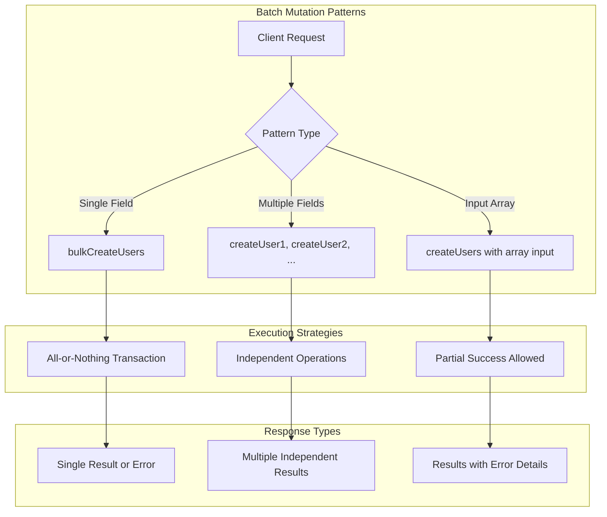
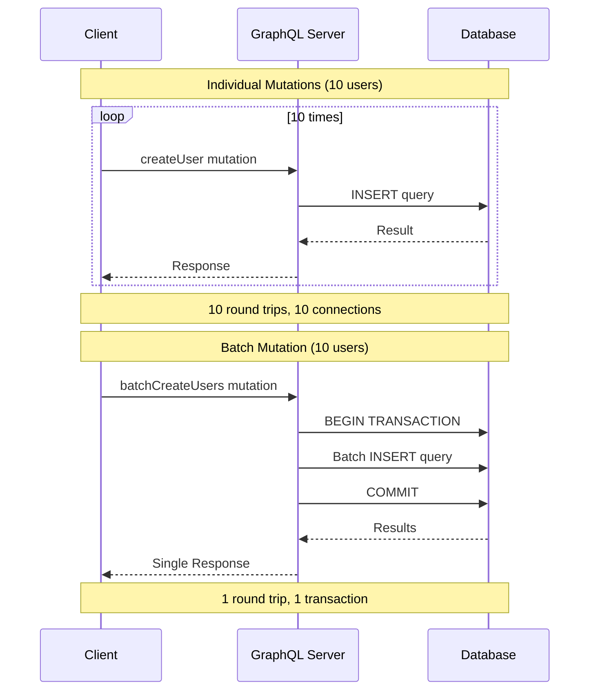

# How to Handle Batch Mutations in GraphQL

Author: [nawazdhandala](https://www.github.com/nawazdhandala)

Tags: GraphQL, Mutations, Batch Operations, Performance, DataLoader, Transactions

Description: Learn how to implement efficient batch mutations in GraphQL for bulk create, update, and delete operations while maintaining data consistency and performance.

---

Batch mutations allow clients to perform multiple write operations in a single request, reducing network overhead and enabling transactional consistency. However, implementing them correctly requires careful consideration of error handling, partial failures, and performance optimization.

This guide covers patterns for implementing batch mutations in GraphQL, including transactional operations, error handling strategies, and performance optimization techniques.

## Understanding Batch Mutation Patterns

There are several approaches to batch mutations, each with different trade-offs.



## Designing Batch Mutation Schema

Define your schema to support batch operations with clear result types.

```graphql
# Schema definition for batch mutations

# Input type for creating a single user
input CreateUserInput {
  email: String!
  name: String!
  role: UserRole = USER
}

# Input type for updating a user
input UpdateUserInput {
  id: ID!
  email: String
  name: String
  role: UserRole
}

# Result for a single operation in a batch
type BatchOperationResult {
  # Index of the item in the input array
  index: Int!
  # Whether this operation succeeded
  success: Boolean!
  # The created/updated entity (null if failed)
  user: User
  # Error details if operation failed
  error: BatchOperationError
}

# Error details for failed operations
type BatchOperationError {
  code: String!
  message: String!
  field: String
}

# Response type for batch create operations
type BatchCreateUsersResponse {
  # Number of successfully created users
  successCount: Int!
  # Number of failed operations
  failureCount: Int!
  # Individual results for each input item
  results: [BatchOperationResult!]!
  # All successfully created users
  users: [User!]!
}

type Mutation {
  # Create multiple users in a single request
  # Supports partial success - some users may be created even if others fail
  batchCreateUsers(
    inputs: [CreateUserInput!]!
    # If true, fail entire batch on any error (transactional)
    atomic: Boolean = false
  ): BatchCreateUsersResponse!

  # Update multiple users in a single request
  batchUpdateUsers(
    inputs: [UpdateUserInput!]!
    atomic: Boolean = false
  ): BatchUpdateUsersResponse!

  # Delete multiple users by ID
  batchDeleteUsers(
    ids: [ID!]!
    atomic: Boolean = false
  ): BatchDeleteUsersResponse!
}
```

## Implementing Batch Create Mutation

Here is a complete implementation of a batch create mutation with error handling.

```typescript
// resolvers/mutations/batchCreateUsers.ts
import { PrismaClient } from '@prisma/client';
import { GraphQLError } from 'graphql';

const prisma = new PrismaClient();

// Type definitions for the mutation
interface CreateUserInput {
  email: string;
  name: string;
  role?: 'USER' | 'ADMIN';
}

interface BatchOperationResult {
  index: number;
  success: boolean;
  user: any | null;
  error: { code: string; message: string; field?: string } | null;
}

// Validate a single user input
function validateUserInput(input: CreateUserInput, index: number): BatchOperationResult | null {
  // Check email format
  const emailRegex = /^[^\s@]+@[^\s@]+\.[^\s@]+$/;
  if (!emailRegex.test(input.email)) {
    return {
      index,
      success: false,
      user: null,
      error: {
        code: 'INVALID_EMAIL',
        message: `Invalid email format: ${input.email}`,
        field: 'email'
      }
    };
  }

  // Check name length
  if (input.name.length < 2 || input.name.length > 100) {
    return {
      index,
      success: false,
      user: null,
      error: {
        code: 'INVALID_NAME',
        message: 'Name must be between 2 and 100 characters',
        field: 'name'
      }
    };
  }

  // Validation passed
  return null;
}

// Resolver for batchCreateUsers mutation
export const batchCreateUsersResolver = async (
  _parent: any,
  args: { inputs: CreateUserInput[]; atomic: boolean },
  context: any
) => {
  const { inputs, atomic } = args;
  const results: BatchOperationResult[] = [];
  const createdUsers: any[] = [];

  // Enforce maximum batch size to prevent abuse
  const MAX_BATCH_SIZE = 100;
  if (inputs.length > MAX_BATCH_SIZE) {
    throw new GraphQLError(
      `Batch size ${inputs.length} exceeds maximum allowed (${MAX_BATCH_SIZE})`,
      { extensions: { code: 'BATCH_SIZE_EXCEEDED' } }
    );
  }

  // Validate all inputs first
  const validationErrors: BatchOperationResult[] = [];
  inputs.forEach((input, index) => {
    const error = validateUserInput(input, index);
    if (error) {
      validationErrors.push(error);
    }
  });

  // If atomic mode and there are validation errors, fail immediately
  if (atomic && validationErrors.length > 0) {
    throw new GraphQLError(
      `Validation failed for ${validationErrors.length} items`,
      {
        extensions: {
          code: 'VALIDATION_FAILED',
          errors: validationErrors
        }
      }
    );
  }

  // Check for duplicate emails in the input
  const emailSet = new Set<string>();
  const duplicateIndices = new Set<number>();
  inputs.forEach((input, index) => {
    const normalizedEmail = input.email.toLowerCase();
    if (emailSet.has(normalizedEmail)) {
      duplicateIndices.add(index);
    }
    emailSet.add(normalizedEmail);
  });

  if (atomic) {
    // Atomic mode: Use a transaction for all-or-nothing behavior
    try {
      const users = await prisma.$transaction(async (tx) => {
        const created = [];

        for (let i = 0; i < inputs.length; i++) {
          const input = inputs[i];

          // Check for existing email
          const existing = await tx.user.findUnique({
            where: { email: input.email.toLowerCase() }
          });

          if (existing) {
            throw new Error(`Email already exists: ${input.email}`);
          }

          // Create the user
          const user = await tx.user.create({
            data: {
              email: input.email.toLowerCase(),
              name: input.name,
              role: input.role || 'USER'
            }
          });

          created.push(user);
        }

        return created;
      });

      // All succeeded
      users.forEach((user, index) => {
        results.push({
          index,
          success: true,
          user,
          error: null
        });
        createdUsers.push(user);
      });
    } catch (error) {
      // Transaction failed - no users were created
      throw new GraphQLError(
        `Batch operation failed: ${error.message}`,
        { extensions: { code: 'TRANSACTION_FAILED' } }
      );
    }
  } else {
    // Non-atomic mode: Process each item independently
    for (let i = 0; i < inputs.length; i++) {
      const input = inputs[i];

      // Check if this item had a validation error
      const validationError = validationErrors.find(e => e.index === i);
      if (validationError) {
        results.push(validationError);
        continue;
      }

      // Check for duplicate in input
      if (duplicateIndices.has(i)) {
        results.push({
          index: i,
          success: false,
          user: null,
          error: {
            code: 'DUPLICATE_IN_BATCH',
            message: `Duplicate email in batch: ${input.email}`,
            field: 'email'
          }
        });
        continue;
      }

      try {
        // Attempt to create the user
        const user = await prisma.user.create({
          data: {
            email: input.email.toLowerCase(),
            name: input.name,
            role: input.role || 'USER'
          }
        });

        results.push({
          index: i,
          success: true,
          user,
          error: null
        });
        createdUsers.push(user);
      } catch (error) {
        // Handle specific database errors
        let errorResult: BatchOperationResult;

        if (error.code === 'P2002') {
          // Prisma unique constraint violation
          errorResult = {
            index: i,
            success: false,
            user: null,
            error: {
              code: 'DUPLICATE_EMAIL',
              message: `Email already exists: ${input.email}`,
              field: 'email'
            }
          };
        } else {
          errorResult = {
            index: i,
            success: false,
            user: null,
            error: {
              code: 'CREATE_FAILED',
              message: error.message
            }
          };
        }

        results.push(errorResult);
      }
    }
  }

  return {
    successCount: createdUsers.length,
    failureCount: results.filter(r => !r.success).length,
    results,
    users: createdUsers
  };
};
```

## Implementing Batch Update with DataLoader

Use DataLoader to optimize database access for batch updates.

```typescript
// dataloaders/userLoader.ts
import DataLoader from 'dataloader';
import { PrismaClient } from '@prisma/client';

const prisma = new PrismaClient();

// Create a DataLoader for batching user lookups
export function createUserLoader() {
  return new DataLoader<string, any>(async (ids) => {
    // Fetch all users in a single query
    const users = await prisma.user.findMany({
      where: { id: { in: ids as string[] } }
    });

    // Create a map for O(1) lookup
    const userMap = new Map(users.map(user => [user.id, user]));

    // Return users in the same order as the input IDs
    return ids.map(id => userMap.get(id) || null);
  });
}

// resolvers/mutations/batchUpdateUsers.ts
interface UpdateUserInput {
  id: string;
  email?: string;
  name?: string;
  role?: 'USER' | 'ADMIN';
}

export const batchUpdateUsersResolver = async (
  _parent: any,
  args: { inputs: UpdateUserInput[]; atomic: boolean },
  context: { userLoader: DataLoader<string, any> }
) => {
  const { inputs, atomic } = args;
  const results: BatchOperationResult[] = [];
  const updatedUsers: any[] = [];

  // First, batch load all users to check they exist
  const userIds = inputs.map(input => input.id);
  const existingUsers = await context.userLoader.loadMany(userIds);

  // Check for non-existent users
  const missingIndices: number[] = [];
  existingUsers.forEach((user, index) => {
    if (!user || user instanceof Error) {
      missingIndices.push(index);
    }
  });

  if (atomic && missingIndices.length > 0) {
    throw new GraphQLError(
      `Users not found at indices: ${missingIndices.join(', ')}`,
      { extensions: { code: 'USERS_NOT_FOUND' } }
    );
  }

  if (atomic) {
    // Use transaction for atomic updates
    try {
      const users = await prisma.$transaction(
        inputs.map(input =>
          prisma.user.update({
            where: { id: input.id },
            data: {
              ...(input.email && { email: input.email.toLowerCase() }),
              ...(input.name && { name: input.name }),
              ...(input.role && { role: input.role })
            }
          })
        )
      );

      users.forEach((user, index) => {
        results.push({ index, success: true, user, error: null });
        updatedUsers.push(user);
        // Clear the cache for updated users
        context.userLoader.clear(user.id);
      });
    } catch (error) {
      throw new GraphQLError(
        `Batch update failed: ${error.message}`,
        { extensions: { code: 'TRANSACTION_FAILED' } }
      );
    }
  } else {
    // Non-atomic: Process independently
    for (let i = 0; i < inputs.length; i++) {
      const input = inputs[i];

      if (missingIndices.includes(i)) {
        results.push({
          index: i,
          success: false,
          user: null,
          error: { code: 'NOT_FOUND', message: `User ${input.id} not found` }
        });
        continue;
      }

      try {
        const user = await prisma.user.update({
          where: { id: input.id },
          data: {
            ...(input.email && { email: input.email.toLowerCase() }),
            ...(input.name && { name: input.name }),
            ...(input.role && { role: input.role })
          }
        });

        results.push({ index: i, success: true, user, error: null });
        updatedUsers.push(user);
        context.userLoader.clear(user.id);
      } catch (error) {
        results.push({
          index: i,
          success: false,
          user: null,
          error: { code: 'UPDATE_FAILED', message: error.message }
        });
      }
    }
  }

  return {
    successCount: updatedUsers.length,
    failureCount: results.filter(r => !r.success).length,
    results,
    users: updatedUsers
  };
};
```

## Batch Delete with Soft Delete Support

Implement batch delete with optional soft delete functionality.

```typescript
// resolvers/mutations/batchDeleteUsers.ts

interface BatchDeleteResponse {
  successCount: number;
  failureCount: number;
  results: Array<{
    index: number;
    id: string;
    success: boolean;
    error: { code: string; message: string } | null;
  }>;
  deletedIds: string[];
}

export const batchDeleteUsersResolver = async (
  _parent: any,
  args: { ids: string[]; atomic: boolean; softDelete?: boolean },
  context: any
): Promise<BatchDeleteResponse> => {
  const { ids, atomic, softDelete = false } = args;
  const results: any[] = [];
  const deletedIds: string[] = [];

  // Remove duplicates while preserving original indices
  const uniqueIds = [...new Set(ids)];
  const duplicateIndices = ids.reduce((acc, id, index) => {
    if (ids.indexOf(id) !== index) {
      acc.push(index);
    }
    return acc;
  }, [] as number[]);

  // Check which users exist
  const existingUsers = await prisma.user.findMany({
    where: { id: { in: uniqueIds } },
    select: { id: true }
  });
  const existingIdSet = new Set(existingUsers.map(u => u.id));

  if (atomic) {
    // Check all users exist before proceeding
    const missingIds = uniqueIds.filter(id => !existingIdSet.has(id));
    if (missingIds.length > 0) {
      throw new GraphQLError(
        `Users not found: ${missingIds.join(', ')}`,
        { extensions: { code: 'USERS_NOT_FOUND' } }
      );
    }

    try {
      if (softDelete) {
        // Soft delete: Update deletedAt timestamp
        await prisma.user.updateMany({
          where: { id: { in: uniqueIds } },
          data: { deletedAt: new Date() }
        });
      } else {
        // Hard delete
        await prisma.user.deleteMany({
          where: { id: { in: uniqueIds } }
        });
      }

      // All succeeded
      ids.forEach((id, index) => {
        if (duplicateIndices.includes(index)) {
          results.push({
            index,
            id,
            success: false,
            error: { code: 'DUPLICATE_IN_BATCH', message: 'Duplicate ID in batch' }
          });
        } else {
          results.push({ index, id, success: true, error: null });
          if (!deletedIds.includes(id)) {
            deletedIds.push(id);
          }
        }
      });
    } catch (error) {
      throw new GraphQLError(
        `Batch delete failed: ${error.message}`,
        { extensions: { code: 'TRANSACTION_FAILED' } }
      );
    }
  } else {
    // Non-atomic: Process each delete independently
    for (let i = 0; i < ids.length; i++) {
      const id = ids[i];

      if (duplicateIndices.includes(i)) {
        results.push({
          index: i,
          id,
          success: false,
          error: { code: 'DUPLICATE_IN_BATCH', message: 'Duplicate ID in batch' }
        });
        continue;
      }

      if (!existingIdSet.has(id)) {
        results.push({
          index: i,
          id,
          success: false,
          error: { code: 'NOT_FOUND', message: `User ${id} not found` }
        });
        continue;
      }

      try {
        if (softDelete) {
          await prisma.user.update({
            where: { id },
            data: { deletedAt: new Date() }
          });
        } else {
          await prisma.user.delete({ where: { id } });
        }

        results.push({ index: i, id, success: true, error: null });
        deletedIds.push(id);
      } catch (error) {
        results.push({
          index: i,
          id,
          success: false,
          error: { code: 'DELETE_FAILED', message: error.message }
        });
      }
    }
  }

  return {
    successCount: deletedIds.length,
    failureCount: results.filter(r => !r.success).length,
    results,
    deletedIds
  };
};
```

## Optimizing Batch Mutations

Here is how batch mutations improve performance compared to individual requests.



## Client-Side Usage

Here is how to use batch mutations from the client side.

```typescript
// Apollo Client batch mutation example
import { gql, useMutation } from '@apollo/client';

// Define the mutation
const BATCH_CREATE_USERS = gql`
  mutation BatchCreateUsers($inputs: [CreateUserInput!]!, $atomic: Boolean) {
    batchCreateUsers(inputs: $inputs, atomic: $atomic) {
      successCount
      failureCount
      results {
        index
        success
        user {
          id
          email
          name
        }
        error {
          code
          message
          field
        }
      }
      users {
        id
        email
        name
      }
    }
  }
`;

// React component using the batch mutation
function CreateUsersForm() {
  const [createUsers, { loading, error }] = useMutation(BATCH_CREATE_USERS);

  const handleSubmit = async (usersData: CreateUserInput[]) => {
    try {
      const result = await createUsers({
        variables: {
          inputs: usersData,
          atomic: false // Allow partial success
        }
      });

      const { successCount, failureCount, results } = result.data.batchCreateUsers;

      if (failureCount > 0) {
        // Handle partial failures
        const failures = results.filter(r => !r.success);
        failures.forEach(failure => {
          console.error(`Failed at index ${failure.index}: ${failure.error.message}`);
        });
      }

      console.log(`Created ${successCount} users`);
    } catch (err) {
      // Handle complete failure (e.g., atomic mode transaction failed)
      console.error('Batch creation failed:', err.message);
    }
  };

  return (
    // Form implementation
  );
}
```

## Rate Limiting Batch Mutations

Implement rate limiting based on batch size and complexity.

```typescript
// plugins/rateLimitPlugin.ts

interface RateLimitConfig {
  // Maximum items per batch
  maxBatchSize: number;
  // Maximum batches per minute
  maxBatchesPerMinute: number;
  // Maximum total items per minute
  maxItemsPerMinute: number;
}

const defaultConfig: RateLimitConfig = {
  maxBatchSize: 100,
  maxBatchesPerMinute: 10,
  maxItemsPerMinute: 500
};

// In-memory rate limit tracker (use Redis in production)
const rateLimitStore = new Map<string, { batches: number; items: number; resetAt: number }>();

export const rateLimitPlugin = {
  async requestDidStart(context) {
    return {
      async didResolveOperation(opContext) {
        const operation = opContext.operation;

        // Only check mutations
        if (operation.operation !== 'mutation') {
          return;
        }

        // Check for batch mutations
        const batchFields = ['batchCreateUsers', 'batchUpdateUsers', 'batchDeleteUsers'];

        for (const selection of operation.selectionSet.selections) {
          if (selection.kind === 'Field' && batchFields.includes(selection.name.value)) {
            const userId = context.contextValue.userId || 'anonymous';
            await checkRateLimit(userId, opContext.request.variables);
          }
        }
      }
    };
  }
};

async function checkRateLimit(userId: string, variables: any) {
  const now = Date.now();
  const windowMs = 60000; // 1 minute window

  // Get or create rate limit entry
  let entry = rateLimitStore.get(userId);
  if (!entry || entry.resetAt < now) {
    entry = { batches: 0, items: 0, resetAt: now + windowMs };
    rateLimitStore.set(userId, entry);
  }

  // Count items in this batch
  const batchSize =
    variables.inputs?.length ||
    variables.ids?.length ||
    0;

  // Check batch size limit
  if (batchSize > defaultConfig.maxBatchSize) {
    throw new GraphQLError(
      `Batch size ${batchSize} exceeds limit of ${defaultConfig.maxBatchSize}`,
      { extensions: { code: 'RATE_LIMIT_EXCEEDED' } }
    );
  }

  // Check batches per minute
  if (entry.batches >= defaultConfig.maxBatchesPerMinute) {
    throw new GraphQLError(
      `Rate limit exceeded: max ${defaultConfig.maxBatchesPerMinute} batches per minute`,
      { extensions: { code: 'RATE_LIMIT_EXCEEDED' } }
    );
  }

  // Check total items per minute
  if (entry.items + batchSize > defaultConfig.maxItemsPerMinute) {
    throw new GraphQLError(
      `Rate limit exceeded: max ${defaultConfig.maxItemsPerMinute} items per minute`,
      { extensions: { code: 'RATE_LIMIT_EXCEEDED' } }
    );
  }

  // Update counters
  entry.batches++;
  entry.items += batchSize;
}
```

## Summary

Batch mutations in GraphQL provide significant benefits when implemented correctly:

1. **Define clear response types** that include both success and failure information
2. **Support atomic mode** for transactional requirements
3. **Handle partial failures** gracefully in non-atomic mode
4. **Use DataLoader** to optimize database access patterns
5. **Implement rate limiting** based on batch size and frequency
6. **Validate inputs** before processing to fail fast
7. **Provide detailed error information** for each failed item

With these patterns, your GraphQL API can efficiently handle bulk operations while maintaining data consistency and providing clear feedback to clients.
