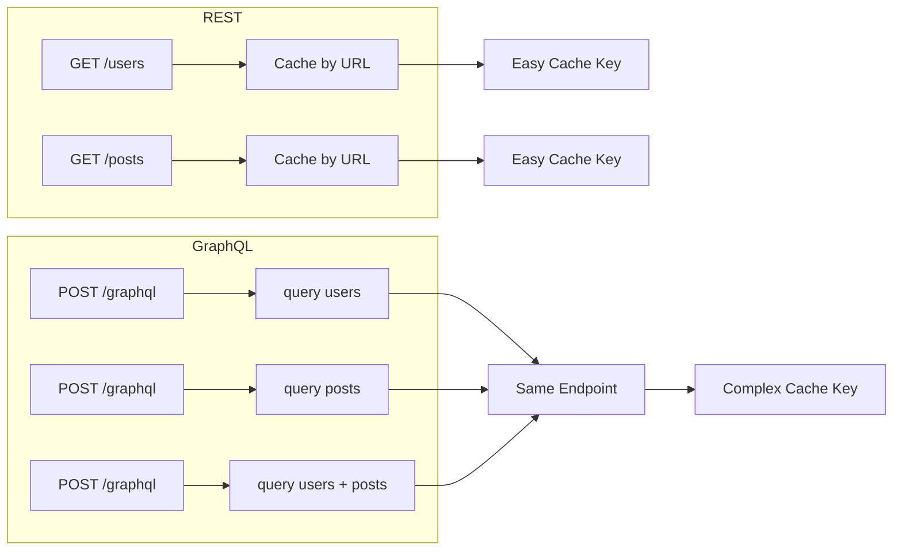
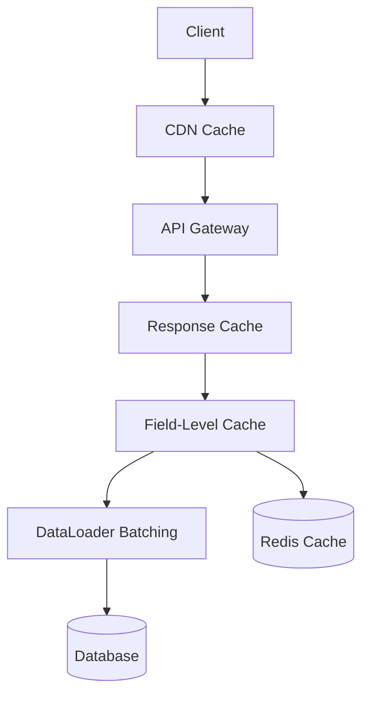
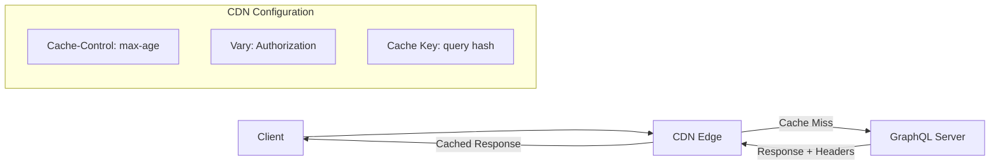

# How to Handle Caching in GraphQL APIs

Author: [nawazdhandala](https://www.github.com/nawazdhandala)

Tags: GraphQL, Caching, Performance, Redis, CDN, Apollo Server, Backend

Description: A complete guide to implementing caching strategies in GraphQL APIs including response caching, field-level caching, and CDN integration.

---

Caching is essential for building performant GraphQL APIs. Unlike REST APIs where each endpoint can have its own cache policy, GraphQL requires more sophisticated caching strategies because a single endpoint handles all requests. This guide covers multiple caching approaches from simple in-memory caching to distributed cache systems.

## Understanding GraphQL Caching Challenges

GraphQL presents unique caching challenges compared to REST.



Key challenges:
- All queries go to the same endpoint
- Query structure determines the response shape
- Nested data can have different cache requirements
- Mutations require cache invalidation

## Caching Strategy Overview



Different caching layers serve different purposes:
- **CDN Cache**: Cache responses at the edge for public data
- **Response Cache**: Cache entire GraphQL responses
- **Field-Level Cache**: Cache individual field resolutions
- **DataLoader**: Request-scoped batching and caching
- **Database Cache**: Query result caching

## Solution 1: In-Memory Response Caching

Start with simple in-memory caching for frequently requested queries.

```javascript
// Simple in-memory cache using LRU cache
import { LRUCache } from 'lru-cache';
import crypto from 'crypto';

// Configure LRU cache
// max: Maximum number of entries
// ttl: Time to live in milliseconds
const responseCache = new LRUCache({
  max: 500,
  ttl: 1000 * 60 * 5, // 5 minutes
  // Calculate size based on response size
  sizeCalculation: (value) => {
    return JSON.stringify(value).length;
  },
  maxSize: 50 * 1024 * 1024, // 50MB max
});

// Generate cache key from query and variables
function generateCacheKey(query, variables, context) {
  const normalized = JSON.stringify({
    query: query.replace(/\s+/g, ' ').trim(),
    variables: variables || {},
    // Include user ID for personalized data
    userId: context.user?.id || 'anonymous',
  });
  return crypto.createHash('sha256').update(normalized).digest('hex');
}

// Response caching plugin for Apollo Server
const responseCachePlugin = {
  async requestDidStart({ request, context }) {
    // Skip caching for mutations
    if (request.query?.includes('mutation')) {
      return {};
    }

    const cacheKey = generateCacheKey(
      request.query,
      request.variables,
      context
    );

    // Check cache before execution
    const cached = responseCache.get(cacheKey);
    if (cached) {
      console.log(`Cache hit: ${cacheKey.slice(0, 8)}...`);
      return {
        async willSendResponse({ response }) {
          // Replace response with cached data
          response.body = cached;
        },
      };
    }

    return {
      async willSendResponse({ response }) {
        // Cache successful responses only
        if (!response.body.errors) {
          responseCache.set(cacheKey, response.body);
          console.log(`Cached: ${cacheKey.slice(0, 8)}...`);
        }
      },
    };
  },
};
```

## Solution 2: Redis Distributed Cache

For production systems, use Redis for distributed caching across multiple server instances.

```javascript
// redis-cache.js
import Redis from 'ioredis';

// Create Redis client with connection pooling
const redis = new Redis({
  host: process.env.REDIS_HOST || 'localhost',
  port: process.env.REDIS_PORT || 6379,
  password: process.env.REDIS_PASSWORD,
  // Connection pool settings
  maxRetriesPerRequest: 3,
  retryStrategy: (times) => {
    if (times > 3) return null; // Stop retrying
    return Math.min(times * 100, 3000);
  },
});

// Cache wrapper with serialization
class GraphQLCache {
  constructor(redis, prefix = 'gql:') {
    this.redis = redis;
    this.prefix = prefix;
  }

  // Generate namespaced key
  key(id) {
    return `${this.prefix}${id}`;
  }

  // Get cached value
  async get(id) {
    const data = await this.redis.get(this.key(id));
    if (!data) return null;

    try {
      return JSON.parse(data);
    } catch (e) {
      console.error('Cache parse error:', e);
      return null;
    }
  }

  // Set value with TTL
  async set(id, value, ttl = 300) {
    const serialized = JSON.stringify(value);
    if (ttl) {
      await this.redis.setex(this.key(id), ttl, serialized);
    } else {
      await this.redis.set(this.key(id), serialized);
    }
  }

  // Delete cached value
  async delete(id) {
    await this.redis.del(this.key(id));
  }

  // Delete by pattern (for cache invalidation)
  async deletePattern(pattern) {
    const keys = await this.redis.keys(this.key(pattern));
    if (keys.length > 0) {
      await this.redis.del(...keys);
      console.log(`Invalidated ${keys.length} cache entries`);
    }
  }

  // Check if key exists
  async exists(id) {
    return await this.redis.exists(this.key(id));
  }
}

export const cache = new GraphQLCache(redis);
```

Use Redis cache in resolvers:

```javascript
// resolvers.js
import { cache } from './redis-cache.js';

const resolvers = {
  Query: {
    // Cache entire query result
    popularPosts: async () => {
      const cacheKey = 'popular-posts';

      // Check cache first
      const cached = await cache.get(cacheKey);
      if (cached) {
        return cached;
      }

      // Fetch from database
      const posts = await db.posts.findAll({
        order: [['views', 'DESC']],
        limit: 10,
      });

      // Cache for 5 minutes
      await cache.set(cacheKey, posts, 300);
      return posts;
    },

    // Cache with dynamic key
    user: async (_, { id }) => {
      const cacheKey = `user:${id}`;

      const cached = await cache.get(cacheKey);
      if (cached) {
        return cached;
      }

      const user = await db.users.findById(id);

      // Cache for 1 minute
      await cache.set(cacheKey, user, 60);
      return user;
    },
  },

  Mutation: {
    // Invalidate cache on mutation
    updateUser: async (_, { id, input }) => {
      const user = await db.users.update(id, input);

      // Invalidate user cache
      await cache.delete(`user:${id}`);

      // Invalidate related caches
      await cache.deletePattern(`user:${id}:*`);

      return user;
    },

    createPost: async (_, { input }, context) => {
      const post = await db.posts.create({
        ...input,
        authorId: context.user.id,
      });

      // Invalidate popular posts cache
      await cache.delete('popular-posts');

      // Invalidate user's posts cache
      await cache.deletePattern(`user:${context.user.id}:posts:*`);

      return post;
    },
  },
};
```

## Solution 3: Field-Level Cache Directives

Use GraphQL directives to declaratively specify cache behavior per field.

```javascript
// cache-directive.js
import { mapSchema, getDirective, MapperKind } from '@graphql-tools/utils';
import { defaultFieldResolver } from 'graphql';
import { cache } from './redis-cache.js';

// Schema with cache directive
const typeDefs = gql`
  # Cache directive for field-level caching
  directive @cache(
    maxAge: Int!        # TTL in seconds
    scope: CacheScope   # PUBLIC or PRIVATE
  ) on FIELD_DEFINITION

  enum CacheScope {
    PUBLIC   # Shared across all users
    PRIVATE  # Per-user cache
  }

  type Query {
    # Public data cached for 1 hour
    publicStats: Stats @cache(maxAge: 3600, scope: PUBLIC)

    # Per-user data cached for 5 minutes
    myProfile: User @cache(maxAge: 300, scope: PRIVATE)

    # Uncached data
    notifications: [Notification!]!
  }

  type User {
    id: ID!
    name: String!
    email: String!
    # Computed field cached for 10 minutes
    postCount: Int! @cache(maxAge: 600, scope: PUBLIC)
  }
`;

// Implement the cache directive
function cacheDirectiveTransformer(schema) {
  return mapSchema(schema, {
    [MapperKind.OBJECT_FIELD]: (fieldConfig, fieldName, typeName) => {
      const cacheDirective = getDirective(schema, fieldConfig, 'cache')?.[0];

      if (!cacheDirective) {
        return fieldConfig;
      }

      const { maxAge, scope } = cacheDirective;
      const originalResolver = fieldConfig.resolve || defaultFieldResolver;

      // Replace resolver with caching wrapper
      fieldConfig.resolve = async (source, args, context, info) => {
        // Build cache key
        const keyParts = [typeName, fieldName];

        // Add source ID for type fields
        if (source?.id) {
          keyParts.push(source.id);
        }

        // Add arguments
        if (Object.keys(args).length > 0) {
          keyParts.push(JSON.stringify(args));
        }

        // Add user ID for private scope
        if (scope === 'PRIVATE' && context.user?.id) {
          keyParts.push(context.user.id);
        }

        const cacheKey = keyParts.join(':');

        // Check cache
        const cached = await cache.get(cacheKey);
        if (cached !== null) {
          return cached;
        }

        // Execute resolver
        const result = await originalResolver(source, args, context, info);

        // Cache result
        await cache.set(cacheKey, result, maxAge);

        return result;
      };

      return fieldConfig;
    },
  });
}
```

## Solution 4: Apollo Server Cache Control

Apollo Server has built-in cache control that works with CDNs and the Apollo Client.

```javascript
// Apollo Server with cache control
import { ApolloServer } from '@apollo/server';
import { ApolloServerPluginCacheControl } from '@apollo/server/plugin/cacheControl';
import responseCachePlugin from '@apollo/server-plugin-response-cache';

const typeDefs = gql`
  type Query {
    # Cache for 1 hour, shared across users
    publicPosts: [Post!]! @cacheControl(maxAge: 3600)

    # Cache for 5 minutes, private per user
    myDashboard: Dashboard @cacheControl(maxAge: 300, scope: PRIVATE)

    # No caching
    currentTime: String @cacheControl(maxAge: 0)
  }

  # Default cache control for type
  type Post @cacheControl(maxAge: 600) {
    id: ID!
    title: String!
    content: String!
    # Override for specific field
    viewCount: Int! @cacheControl(maxAge: 60)
  }

  # Sensitive type - no caching
  type PrivateMessage @cacheControl(maxAge: 0, scope: PRIVATE) {
    id: ID!
    content: String!
  }
`;

const server = new ApolloServer({
  typeDefs,
  resolvers,
  plugins: [
    // Enable cache control headers
    ApolloServerPluginCacheControl({
      // Default max age for fields without directive
      defaultMaxAge: 0,
      // Calculate overall cache policy from field hints
      calculateHttpHeaders: true,
    }),
    // Full response caching
    responseCachePlugin({
      // Custom session ID for private caching
      sessionId: (context) => context.user?.id || null,
      // Custom cache key
      generateCacheKey: (context) => {
        const { query, variables } = context.request;
        return `${query}:${JSON.stringify(variables)}`;
      },
      // Don't cache errors
      shouldReadFromCache: (context) => !context.request.http?.headers.get('no-cache'),
      shouldWriteToCache: (context) => !context.response.errors,
    }),
  ],
});
```

## Solution 5: CDN Caching for GraphQL

Configure CDN caching for public GraphQL queries using persisted queries.



```javascript
// Enable CDN caching with persisted queries
import { ApolloServer } from '@apollo/server';
import { createHash } from 'crypto';

// Persisted query map
const persistedQueries = new Map();

// Generate query hash
function generateHash(query) {
  return createHash('sha256').update(query).digest('hex');
}

// Register persisted query
function registerQuery(query) {
  const hash = generateHash(query);
  persistedQueries.set(hash, query);
  return hash;
}

// CDN-friendly server configuration
const server = new ApolloServer({
  typeDefs,
  resolvers,
  // Enable persisted queries
  persistedQueries: {
    // Use Redis for distributed storage
    cache: new KeyValueCache(),
  },
  plugins: [
    {
      async requestDidStart({ request }) {
        return {
          async willSendResponse({ response }) {
            // Add CDN cache headers for public queries
            const cacheControl = response.http?.headers.get('cache-control');

            if (cacheControl && !cacheControl.includes('private')) {
              // Add CDN-specific headers
              response.http?.headers.set(
                'CDN-Cache-Control',
                cacheControl
              );
              // Surrogate key for cache invalidation
              response.http?.headers.set(
                'Surrogate-Key',
                'graphql-api'
              );
            }
          },
        };
      },
    },
  ],
});

// Express middleware to add cache headers
app.use('/graphql', (req, res, next) => {
  // Enable GET requests for CDN caching
  if (req.method === 'GET' && req.query.query) {
    // Public queries can be cached
    res.set('Cache-Control', 'public, max-age=60');
    res.set('Vary', 'Accept-Encoding');
  }
  next();
});
```

Client-side configuration for CDN caching:

```javascript
// Apollo Client with persisted queries
import { ApolloClient, InMemoryCache, HttpLink } from '@apollo/client';
import { createPersistedQueryLink } from '@apollo/client/link/persisted-queries';
import { sha256 } from 'crypto-hash';

const httpLink = new HttpLink({
  uri: 'https://api.example.com/graphql',
  // Enable GET for queries (cacheable by CDN)
  useGETForQueries: true,
});

const persistedQueryLink = createPersistedQueryLink({
  sha256,
  // Use GET for persisted queries
  useGETForHashedQueries: true,
});

const client = new ApolloClient({
  link: persistedQueryLink.concat(httpLink),
  cache: new InMemoryCache(),
});
```

## Solution 6: DataLoader for Request-Scoped Caching

DataLoader provides request-scoped caching and batching.

```javascript
// dataloader-setup.js
import DataLoader from 'dataloader';

// Factory function to create loaders per request
function createLoaders(db) {
  return {
    // User loader with caching
    userLoader: new DataLoader(
      async (ids) => {
        console.log(`Loading users: ${ids.join(', ')}`);
        const users = await db.users.findByIds(ids);
        const userMap = new Map(users.map(u => [u.id, u]));
        return ids.map(id => userMap.get(id) || null);
      },
      {
        // Enable caching within request
        cache: true,
        // Batch window in milliseconds
        batchScheduleFn: (callback) => setTimeout(callback, 10),
      }
    ),

    // Post loader
    postLoader: new DataLoader(async (ids) => {
      const posts = await db.posts.findByIds(ids);
      const postMap = new Map(posts.map(p => [p.id, p]));
      return ids.map(id => postMap.get(id) || null);
    }),

    // Posts by author loader (one-to-many relationship)
    postsByAuthorLoader: new DataLoader(async (authorIds) => {
      const posts = await db.posts.findByAuthorIds(authorIds);
      // Group posts by author
      const postsByAuthor = new Map();
      for (const post of posts) {
        const existing = postsByAuthor.get(post.authorId) || [];
        existing.push(post);
        postsByAuthor.set(post.authorId, existing);
      }
      return authorIds.map(id => postsByAuthor.get(id) || []);
    }),
  };
}

// Use in Apollo Server context
const server = new ApolloServer({
  typeDefs,
  resolvers,
});

startStandaloneServer(server, {
  context: async ({ req }) => ({
    // Create fresh loaders for each request
    // This prevents data leaking between requests
    loaders: createLoaders(db),
    user: await authenticateRequest(req),
  }),
});
```

## Solution 7: Automatic Cache Invalidation

Implement automatic cache invalidation when data changes.

```javascript
// cache-invalidation.js
import { cache } from './redis-cache.js';

// Track cache dependencies
class CacheInvalidator {
  constructor(cache) {
    this.cache = cache;
    this.dependencies = new Map();
  }

  // Register cache key with entity dependency
  async registerDependency(cacheKey, entityType, entityId) {
    const depKey = `${entityType}:${entityId}`;
    const existing = this.dependencies.get(depKey) || new Set();
    existing.add(cacheKey);
    this.dependencies.set(depKey, existing);

    // Also store in Redis for distributed invalidation
    await this.cache.redis.sadd(`deps:${depKey}`, cacheKey);
  }

  // Invalidate all caches dependent on entity
  async invalidateEntity(entityType, entityId) {
    const depKey = `${entityType}:${entityId}`;

    // Get dependent cache keys from Redis
    const keys = await this.cache.redis.smembers(`deps:${depKey}`);

    if (keys.length > 0) {
      // Delete all dependent caches
      await Promise.all(keys.map(key => this.cache.delete(key)));
      console.log(`Invalidated ${keys.length} caches for ${depKey}`);

      // Clear dependency tracking
      await this.cache.redis.del(`deps:${depKey}`);
    }
  }
}

const invalidator = new CacheInvalidator(cache);

// Enhanced resolver with dependency tracking
const resolvers = {
  Query: {
    user: async (_, { id }, context) => {
      const cacheKey = `user:${id}`;

      const cached = await cache.get(cacheKey);
      if (cached) return cached;

      const user = await db.users.findById(id);

      await cache.set(cacheKey, user, 300);
      // Track this cache depends on User entity
      await invalidator.registerDependency(cacheKey, 'User', id);

      return user;
    },

    postsByUser: async (_, { userId }) => {
      const cacheKey = `posts:author:${userId}`;

      const cached = await cache.get(cacheKey);
      if (cached) return cached;

      const posts = await db.posts.findByAuthor(userId);

      await cache.set(cacheKey, posts, 300);
      // Track dependency on User
      await invalidator.registerDependency(cacheKey, 'User', userId);
      // Track dependency on each Post
      for (const post of posts) {
        await invalidator.registerDependency(cacheKey, 'Post', post.id);
      }

      return posts;
    },
  },

  Mutation: {
    updateUser: async (_, { id, input }) => {
      const user = await db.users.update(id, input);

      // Invalidate all caches that depend on this user
      await invalidator.invalidateEntity('User', id);

      return user;
    },

    deletePost: async (_, { id }) => {
      const post = await db.posts.findById(id);
      await db.posts.delete(id);

      // Invalidate caches
      await invalidator.invalidateEntity('Post', id);
      await invalidator.invalidateEntity('User', post.authorId);

      return true;
    },
  },
};
```

## Cache Invalidation Patterns

```mermaid
flowchart TD
    M[Mutation] --> E{Entity Type}

    E -->|User Update| U[Invalidate User Caches]
    E -->|Post Create| P[Invalidate Post Lists]
    E -->|Comment Add| C[Invalidate Post Cache]

    U --> U1[user:{id}]
    U --> U2[user:{id}:*]
    U --> U3[popular-users]

    P --> P1[posts:author:{userId}]
    P --> P2[popular-posts]
    P --> P3[recent-posts]

    C --> C1[post:{postId}]
    C --> C2[post:{postId}:comments]
```

## Monitoring Cache Performance

```javascript
// Cache metrics tracking
class CacheMetrics {
  constructor() {
    this.hits = 0;
    this.misses = 0;
    this.errors = 0;
  }

  recordHit() { this.hits++; }
  recordMiss() { this.misses++; }
  recordError() { this.errors++; }

  getStats() {
    const total = this.hits + this.misses;
    return {
      hits: this.hits,
      misses: this.misses,
      errors: this.errors,
      hitRate: total > 0 ? (this.hits / total * 100).toFixed(2) + '%' : '0%',
    };
  }

  reset() {
    this.hits = 0;
    this.misses = 0;
    this.errors = 0;
  }
}

const metrics = new CacheMetrics();

// Log cache stats periodically
setInterval(() => {
  console.log('Cache stats:', metrics.getStats());
  metrics.reset();
}, 60000);

// Use in cache wrapper
async function cachedFetch(key, ttl, fetchFn) {
  try {
    const cached = await cache.get(key);
    if (cached) {
      metrics.recordHit();
      return cached;
    }

    metrics.recordMiss();
    const result = await fetchFn();
    await cache.set(key, result, ttl);
    return result;
  } catch (error) {
    metrics.recordError();
    throw error;
  }
}
```

## Best Practices Summary

| Strategy | Use Case | TTL Recommendation |
|----------|----------|-------------------|
| Response Cache | Frequently requested queries | 1-5 minutes |
| Field Cache | Computed or expensive fields | Based on volatility |
| DataLoader | Request batching | Per-request only |
| CDN Cache | Public, read-heavy data | 5-60 minutes |
| No Cache | Real-time data, mutations | N/A |

---

Effective GraphQL caching requires a layered approach. Start with DataLoader for request-scoped batching, add Redis caching for frequently accessed data, and implement proper invalidation strategies for mutations. Monitor your cache hit rates and adjust TTLs based on your data's volatility. With these patterns in place, your GraphQL API will handle significantly more traffic with lower latency.
