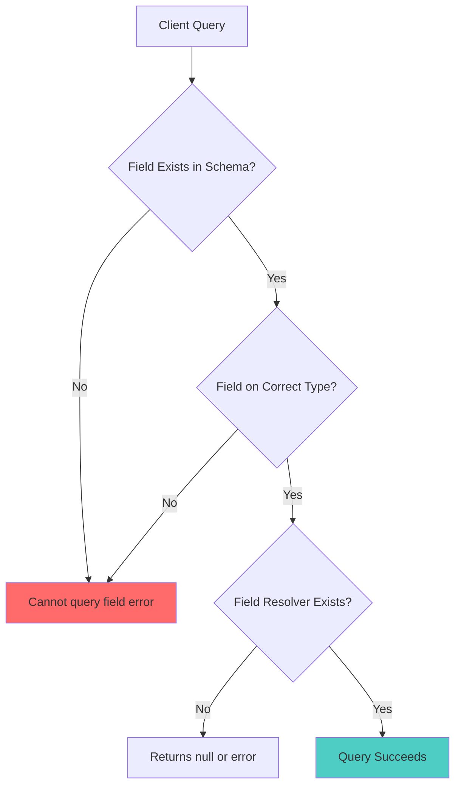
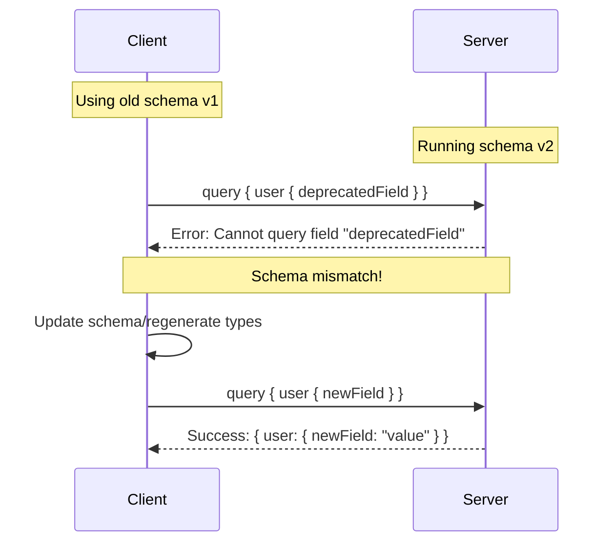

# How to Fix "Cannot Query Field" Errors in GraphQL

Author: [nawazdhandala](https://www.github.com/nawazdhandala)

Tags: GraphQL, Debugging, API Development, Schema, Troubleshooting

Description: Learn how to diagnose and fix "Cannot query field" errors in GraphQL by understanding schema definitions, type relationships, and common mistakes.

---

The "Cannot query field" error is one of the most common errors you will encounter when working with GraphQL. This error occurs when you try to query a field that does not exist in the schema or is not accessible in the current context. This guide will help you understand why these errors occur and how to fix them.

## Understanding the Error

When you see an error like:

```
Cannot query field "fieldName" on type "TypeName"
```

It means GraphQL cannot find the field you are trying to query. This can happen for several reasons, and understanding them will help you quickly diagnose and fix the issue.



## Common Causes and Solutions

### Cause 1: Typo in Field Name

The most common cause is simply a typo in the field name.

```graphql
# Schema definition
type User {
  id: ID!
  firstName: String!  # Note: camelCase
  lastName: String!
  email: String!
}
```

```graphql
# Incorrect query - typo in field name
query {
  user(id: "1") {
    firstname  # Error: Cannot query field "firstname" on type "User"
  }
}

# Correct query - matches schema exactly
query {
  user(id: "1") {
    firstName  # Correct: uses camelCase as defined in schema
  }
}
```

**Solution**: Check the exact field name in your schema. Field names are case-sensitive in GraphQL.

### Cause 2: Field Not Defined in Schema

You might be querying a field that exists in your database but was never added to the GraphQL schema.

```javascript
// Database model has more fields than GraphQL schema exposes
// Database: { id, firstName, lastName, email, passwordHash, createdAt }

// GraphQL Schema - missing some fields
const typeDefs = `
  type User {
    id: ID!
    firstName: String!
    lastName: String!
    email: String!
    # passwordHash intentionally not exposed
    # createdAt was forgotten
  }
`;
```

```graphql
# This query will fail because createdAt is not in the schema
query {
  user(id: "1") {
    firstName
    createdAt  # Error: Cannot query field "createdAt" on type "User"
  }
}
```

**Solution**: Add the missing field to your schema.

```javascript
// Updated schema with missing field
const typeDefs = `
  type User {
    id: ID!
    firstName: String!
    lastName: String!
    email: String!
    createdAt: String!  # Added the missing field
  }
`;
```

### Cause 3: Querying Field on Wrong Type

When using interfaces or unions, you might query a field on a type that does not have it.

```graphql
# Schema with interface
interface Node {
  id: ID!
}

type User implements Node {
  id: ID!
  name: String!
  email: String!
}

type Post implements Node {
  id: ID!
  title: String!
  content: String!
}

type Query {
  node(id: ID!): Node
}
```

```graphql
# Incorrect - querying User-specific field on Node interface
query {
  node(id: "user-1") {
    id
    email  # Error: Cannot query field "email" on type "Node"
  }
}

# Correct - use inline fragment for type-specific fields
query {
  node(id: "user-1") {
    id
    ... on User {
      email  # Now accessible through inline fragment
    }
  }
}
```

**Solution**: Use inline fragments or the `__typename` field to query type-specific fields.

### Cause 4: Fragment on Wrong Type

When using fragments, you must ensure they are defined on the correct type.

```graphql
# Schema
type User {
  id: ID!
  name: String!
}

type Post {
  id: ID!
  title: String!
  author: User!
}
```

```graphql
# Fragment defined on User type
fragment UserFields on User {
  id
  name
}

# Incorrect - trying to use User fragment on Post
query {
  posts {
    ...UserFields  # Error: Fragment "UserFields" cannot be spread here
  }
}

# Correct - use fragment on the right type
query {
  posts {
    id
    title
    author {
      ...UserFields  # Correct: User fragment on User field
    }
  }
}
```

### Cause 5: Nested Fields Without Parent Selection

You cannot query nested fields without first selecting the parent object.

```graphql
# Schema
type Query {
  user(id: ID!): User
}

type User {
  id: ID!
  name: String!
  address: Address!
}

type Address {
  street: String!
  city: String!
  country: String!
}
```

```graphql
# Incorrect - trying to query address fields directly
query {
  user(id: "1") {
    name
    street  # Error: Cannot query field "street" on type "User"
  }
}

# Correct - query through the address field
query {
  user(id: "1") {
    name
    address {
      street  # Correct: accessing street through address
    }
  }
}
```

### Cause 6: Schema Mismatch Between Client and Server

Your client might be using an outdated schema that includes fields that no longer exist.



**Solution**: Regenerate your client types or refetch the schema.

```bash
# For Apollo Client with codegen
npm run graphql-codegen

# For Relay
relay-compiler

# Fetch latest schema
npx get-graphql-schema http://localhost:4000/graphql > schema.graphql
```

### Cause 7: Conditional Fields Based on Arguments

Some fields might only be available with certain arguments.

```graphql
# Schema with directive limiting field access
type User {
  id: ID!
  name: String!
  email: String! @auth(requires: ADMIN)  # Only available to admins
}
```

```javascript
// Server-side directive implementation
const { mapSchema, getDirective, MapperKind } = require('@graphql-tools/utils');

function authDirective(schema) {
  return mapSchema(schema, {
    [MapperKind.OBJECT_FIELD]: (fieldConfig) => {
      const authDirective = getDirective(schema, fieldConfig, 'auth')?.[0];

      if (authDirective) {
        const { requires } = authDirective;
        const { resolve } = fieldConfig;

        fieldConfig.resolve = async (source, args, context, info) => {
          // Check user role
          if (context.user?.role !== requires) {
            // Return null or throw error for unauthorized access
            return null;
          }
          return resolve(source, args, context, info);
        };
      }
      return fieldConfig;
    }
  });
}
```

## Debugging Techniques

### 1. Use GraphQL Introspection

Query your schema to see what fields are available:

```graphql
# Introspection query to see all fields on a type
query {
  __type(name: "User") {
    name
    fields {
      name
      type {
        name
        kind
      }
    }
  }
}

# Response shows available fields
# {
#   "__type": {
#     "name": "User",
#     "fields": [
#       { "name": "id", "type": { "name": null, "kind": "NON_NULL" } },
#       { "name": "firstName", "type": { "name": null, "kind": "NON_NULL" } },
#       { "name": "email", "type": { "name": null, "kind": "NON_NULL" } }
#     ]
#   }
# }
```

### 2. Use GraphQL IDE Auto-Complete

Tools like GraphiQL, Apollo Studio, or GraphQL Playground provide auto-completion that shows available fields:

```javascript
// Apollo Server with GraphQL Playground enabled
const server = new ApolloServer({
  typeDefs,
  resolvers,
  introspection: true,  // Enable in development
  playground: true       // Enable GraphQL Playground
});
```

### 3. Check Schema Stitching or Federation

If you are using schema stitching or federation, the field might not be properly merged:

```javascript
// Schema stitching - ensure types are properly merged
const { stitchSchemas } = require('@graphql-tools/stitch');

const gatewaySchema = stitchSchemas({
  subschemas: [
    {
      schema: usersSchema,
      merge: {
        User: {
          // Specify how User type merges between schemas
          selectionSet: '{ id }',
          fieldName: 'user',
          args: (originalObject) => ({ id: originalObject.id })
        }
      }
    },
    {
      schema: postsSchema,
      merge: {
        User: {
          selectionSet: '{ id }',
          fieldName: 'user',
          args: (originalObject) => ({ id: originalObject.id })
        }
      }
    }
  ]
});
```

### 4. Validate Queries Before Execution

Use GraphQL validation to catch errors early:

```javascript
// Validate query against schema
const { validate, parse } = require('graphql');

function validateQuery(schema, queryString) {
  const documentAST = parse(queryString);
  const errors = validate(schema, documentAST);

  if (errors.length > 0) {
    console.error('Validation errors:');
    errors.forEach(error => {
      console.error(`- ${error.message}`);
      // Shows: Cannot query field "badField" on type "User"
    });
    return false;
  }

  return true;
}

// Usage
const query = `
  query {
    user(id: "1") {
      badField
    }
  }
`;

validateQuery(schema, query);
// Output: Validation errors:
// - Cannot query field "badField" on type "User"
```

## Common Patterns to Avoid Errors

### Pattern 1: Use TypeScript with Generated Types

```typescript
// Generated types ensure compile-time safety
import { useQuery, gql } from '@apollo/client';
import { GetUserQuery, GetUserQueryVariables } from './generated/graphql';

const GET_USER = gql`
  query GetUser($id: ID!) {
    user(id: $id) {
      id
      firstName
      lastName
      email
    }
  }
`;

function UserProfile({ userId }: { userId: string }) {
  // TypeScript will error if you try to access non-existent fields
  const { data } = useQuery<GetUserQuery, GetUserQueryVariables>(GET_USER, {
    variables: { id: userId }
  });

  // TypeScript knows exactly what fields are available
  return <div>{data?.user?.firstName}</div>;
}
```

### Pattern 2: Use Fragment Colocation

```typescript
// Define fragments close to components that use them
const USER_FRAGMENT = gql`
  fragment UserProfileFields on User {
    id
    firstName
    lastName
    avatar
  }
`;

const GET_USER = gql`
  ${USER_FRAGMENT}
  query GetUser($id: ID!) {
    user(id: $id) {
      ...UserProfileFields
      email  # Additional fields for this specific query
    }
  }
`;
```

### Pattern 3: Schema-First Development

```javascript
// Define schema first, then implement resolvers
// schema.graphql
const typeDefs = gql`
  """
  User represents a registered user in the system.
  """
  type User {
    """Unique identifier"""
    id: ID!

    """User's first name"""
    firstName: String!

    """User's last name"""
    lastName: String!

    """User's email address"""
    email: String!

    """Full name computed from firstName and lastName"""
    fullName: String!
  }
`;

// resolvers.js - implement all fields defined in schema
const resolvers = {
  User: {
    // Computed field resolver
    fullName: (parent) => `${parent.firstName} ${parent.lastName}`
  }
};
```

## Error Message Reference

Here are common variations of the error and their meanings:

| Error Message | Meaning |
|--------------|---------|
| `Cannot query field "x" on type "Y"` | Field "x" does not exist on type "Y" |
| `Field "x" of type "Y" must have a selection of subfields` | "x" is an object type; you must select fields from it |
| `Unknown argument "x" on field "Y.z"` | The argument "x" is not defined for the field |
| `Field "x" argument "y" of type "Z" is required` | Missing required argument |

## Conclusion

The "Cannot query field" error is your GraphQL server telling you that something in your query does not match the schema. By understanding the common causes:

1. Typos in field names
2. Missing fields in schema
3. Querying on wrong types
4. Fragment mismatches
5. Missing nested selections
6. Schema version mismatches

You can quickly identify and fix these errors. Use introspection, IDE tools, and TypeScript to prevent these errors before they happen.

**Related Reading:**

- [How to Fix "Validation Error" in GraphQL Queries](https://oneuptime.com/blog/post/2026-01-24-graphql-validation-errors/view)
- [How to Handle Authentication in GraphQL APIs](https://oneuptime.com/blog/post/2026-01-24-graphql-authentication/view)
