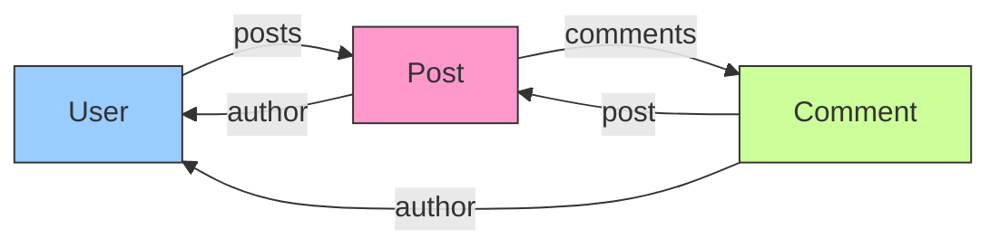
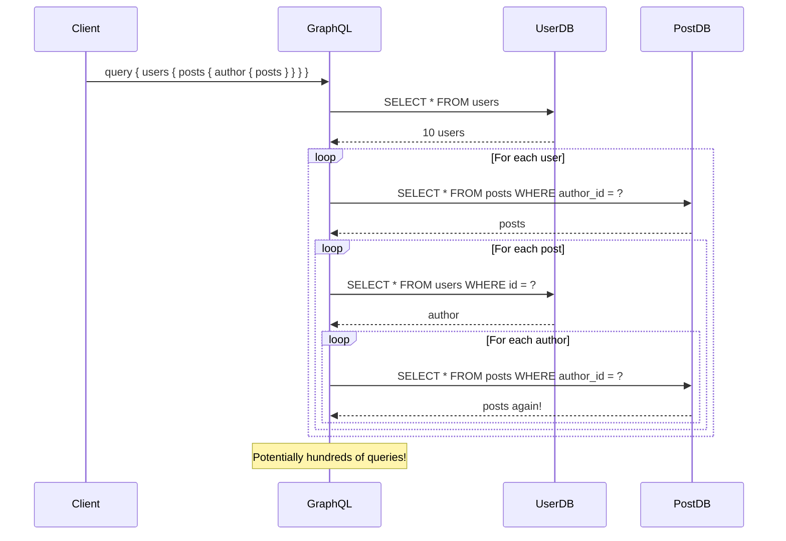
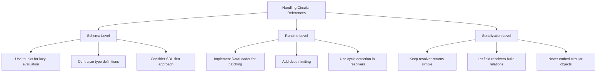

# How to Fix "Circular Reference" Errors in GraphQL

Author: [nawazdhandala](https://github.com/nawazdhandala)

Tags: GraphQL, Schema Design, Circular References, API Development, TypeScript, Node.js

Description: Learn how to identify, prevent, and resolve circular reference errors in GraphQL schemas and resolvers.

---

Circular references in GraphQL occur when types reference each other in a loop, either in the schema definition or during data resolution. While GraphQL schemas naturally support circular type references, improper implementation can lead to infinite loops, stack overflows, and performance issues. This guide will help you understand and fix circular reference problems in your GraphQL APIs.

## Understanding Circular References

Circular references happen when Type A references Type B, and Type B references Type A, creating a cycle. This is common in real-world data models where entities have bidirectional relationships.



## Schema-Level Circular References

### The Problem

When defining GraphQL schemas in JavaScript, circular references can cause module loading issues.

```javascript
// PROBLEMATIC: user.js
const { PostType } = require("./post"); // Imports Post, which imports User

const UserType = new GraphQLObjectType({
  name: "User",
  fields: {
    id: { type: GraphQLID },
    name: { type: GraphQLString },
    posts: {
      type: new GraphQLList(PostType) // Uses PostType
    }
  }
});

module.exports = { UserType };

// PROBLEMATIC: post.js
const { UserType } = require("./user"); // Circular import!

const PostType = new GraphQLObjectType({
  name: "Post",
  fields: {
    id: { type: GraphQLID },
    title: { type: GraphQLString },
    author: {
      type: UserType // Uses UserType - but it might be undefined!
    }
  }
});

module.exports = { PostType };
```

### Solution 1: Use Thunks (Lazy Evaluation)

GraphQL supports defining fields as functions that return the field configuration. This delays evaluation until all types are loaded.

```javascript
// user.js - FIXED with thunks
const {
  GraphQLObjectType,
  GraphQLID,
  GraphQLString,
  GraphQLList
} = require("graphql");

const UserType = new GraphQLObjectType({
  name: "User",
  // Fields as a function (thunk) - evaluated lazily
  fields: () => {
    // Import inside the thunk to avoid circular dependency at load time
    const { PostType } = require("./post");

    return {
      id: { type: GraphQLID },
      name: { type: GraphQLString },
      email: { type: GraphQLString },
      posts: {
        type: new GraphQLList(PostType),
        resolve: (user, args, context) => {
          return context.dataSources.posts.findByAuthorId(user.id);
        }
      }
    };
  }
});

module.exports = { UserType };

// post.js - FIXED with thunks
const {
  GraphQLObjectType,
  GraphQLID,
  GraphQLString
} = require("graphql");

const PostType = new GraphQLObjectType({
  name: "Post",
  // Fields as a function (thunk)
  fields: () => {
    const { UserType } = require("./user");
    const { CommentType } = require("./comment");

    return {
      id: { type: GraphQLID },
      title: { type: GraphQLString },
      content: { type: GraphQLString },
      author: {
        type: UserType,
        resolve: (post, args, context) => {
          return context.dataSources.users.findById(post.authorId);
        }
      },
      comments: {
        type: new GraphQLList(CommentType),
        resolve: (post, args, context) => {
          return context.dataSources.comments.findByPostId(post.id);
        }
      }
    };
  }
});

module.exports = { PostType };
```

### Solution 2: Centralized Type Registry

Create a single module that defines all types to avoid circular imports.

```javascript
// types/index.js - Centralized type registry
const {
  GraphQLObjectType,
  GraphQLID,
  GraphQLString,
  GraphQLList,
  GraphQLInt
} = require("graphql");

// Type registry to hold references
const types = {};

// Define all types in order, using the registry for references
types.User = new GraphQLObjectType({
  name: "User",
  fields: () => ({
    id: { type: GraphQLID },
    name: { type: GraphQLString },
    email: { type: GraphQLString },
    posts: {
      type: new GraphQLList(types.Post),
      args: {
        limit: { type: GraphQLInt, defaultValue: 10 }
      },
      resolve: (user, { limit }, context) => {
        return context.dataSources.posts.findByAuthorId(user.id, limit);
      }
    },
    comments: {
      type: new GraphQLList(types.Comment),
      resolve: (user, args, context) => {
        return context.dataSources.comments.findByAuthorId(user.id);
      }
    }
  })
});

types.Post = new GraphQLObjectType({
  name: "Post",
  fields: () => ({
    id: { type: GraphQLID },
    title: { type: GraphQLString },
    content: { type: GraphQLString },
    author: {
      type: types.User,
      resolve: (post, args, context) => {
        return context.dataSources.users.findById(post.authorId);
      }
    },
    comments: {
      type: new GraphQLList(types.Comment),
      resolve: (post, args, context) => {
        return context.dataSources.comments.findByPostId(post.id);
      }
    }
  })
});

types.Comment = new GraphQLObjectType({
  name: "Comment",
  fields: () => ({
    id: { type: GraphQLID },
    text: { type: GraphQLString },
    author: {
      type: types.User,
      resolve: (comment, args, context) => {
        return context.dataSources.users.findById(comment.authorId);
      }
    },
    post: {
      type: types.Post,
      resolve: (comment, args, context) => {
        return context.dataSources.posts.findById(comment.postId);
      }
    }
  })
});

module.exports = types;
```

### Solution 3: SDL-First Approach

Using SDL (Schema Definition Language) avoids JavaScript circular import issues entirely.

```graphql
# schema.graphql
# Types can freely reference each other in SDL

type User {
  id: ID!
  name: String!
  email: String!
  posts(limit: Int = 10): [Post!]!
  comments: [Comment!]!
  followers: [User!]!
  following: [User!]!
}

type Post {
  id: ID!
  title: String!
  content: String!
  author: User!
  comments: [Comment!]!
  likedBy: [User!]!
}

type Comment {
  id: ID!
  text: String!
  author: User!
  post: Post!
  replies: [Comment!]!
  parentComment: Comment
}

type Query {
  user(id: ID!): User
  post(id: ID!): Post
  users: [User!]!
  posts(limit: Int = 20): [Post!]!
}
```

```javascript
// resolvers.js - Separate resolvers file
const resolvers = {
  Query: {
    user: (_, { id }, context) => context.dataSources.users.findById(id),
    post: (_, { id }, context) => context.dataSources.posts.findById(id),
    users: (_, args, context) => context.dataSources.users.findAll(),
    posts: (_, { limit }, context) => context.dataSources.posts.findAll(limit)
  },

  User: {
    posts: (user, { limit }, context) => {
      return context.dataSources.posts.findByAuthorId(user.id, limit);
    },
    comments: (user, _, context) => {
      return context.dataSources.comments.findByAuthorId(user.id);
    },
    followers: (user, _, context) => {
      return context.dataSources.users.findFollowers(user.id);
    },
    following: (user, _, context) => {
      return context.dataSources.users.findFollowing(user.id);
    }
  },

  Post: {
    author: (post, _, context) => {
      return context.dataSources.users.findById(post.authorId);
    },
    comments: (post, _, context) => {
      return context.dataSources.comments.findByPostId(post.id);
    },
    likedBy: (post, _, context) => {
      return context.dataSources.users.findByLikedPost(post.id);
    }
  },

  Comment: {
    author: (comment, _, context) => {
      return context.dataSources.users.findById(comment.authorId);
    },
    post: (comment, _, context) => {
      return context.dataSources.posts.findById(comment.postId);
    },
    replies: (comment, _, context) => {
      return context.dataSources.comments.findReplies(comment.id);
    },
    parentComment: (comment, _, context) => {
      if (!comment.parentCommentId) return null;
      return context.dataSources.comments.findById(comment.parentCommentId);
    }
  }
};

module.exports = { resolvers };
```

## Runtime Circular Reference Issues

### The N+1 Problem with Circular References

Circular references can cause severe N+1 query problems when not handled properly.



### Solution: DataLoader for Batching

Use DataLoader to batch and cache database queries.

```javascript
// dataloaders.js
const DataLoader = require("dataloader");

// Create data loaders for each entity type
function createLoaders(database) {
  return {
    // User loader batches user fetches by ID
    userLoader: new DataLoader(async (userIds) => {
      console.log(`Batching ${userIds.length} user fetches`);

      const users = await database.query(
        "SELECT * FROM users WHERE id IN (?)",
        [userIds]
      );

      // Return users in the same order as requested IDs
      const userMap = new Map(users.map(user => [user.id, user]));
      return userIds.map(id => userMap.get(id) || null);
    }),

    // Post loader batches post fetches by ID
    postLoader: new DataLoader(async (postIds) => {
      console.log(`Batching ${postIds.length} post fetches`);

      const posts = await database.query(
        "SELECT * FROM posts WHERE id IN (?)",
        [postIds]
      );

      const postMap = new Map(posts.map(post => [post.id, post]));
      return postIds.map(id => postMap.get(id) || null);
    }),

    // Loader for posts by author ID
    postsByAuthorLoader: new DataLoader(async (authorIds) => {
      console.log(`Batching posts for ${authorIds.length} authors`);

      const posts = await database.query(
        "SELECT * FROM posts WHERE author_id IN (?)",
        [authorIds]
      );

      // Group posts by author ID
      const postsByAuthor = new Map();
      for (const post of posts) {
        if (!postsByAuthor.has(post.authorId)) {
          postsByAuthor.set(post.authorId, []);
        }
        postsByAuthor.get(post.authorId).push(post);
      }

      return authorIds.map(id => postsByAuthor.get(id) || []);
    }),

    // Comment loader
    commentLoader: new DataLoader(async (commentIds) => {
      const comments = await database.query(
        "SELECT * FROM comments WHERE id IN (?)",
        [commentIds]
      );

      const commentMap = new Map(comments.map(c => [c.id, c]));
      return commentIds.map(id => commentMap.get(id) || null);
    }),

    // Comments by post ID
    commentsByPostLoader: new DataLoader(async (postIds) => {
      const comments = await database.query(
        "SELECT * FROM comments WHERE post_id IN (?)",
        [postIds]
      );

      const commentsByPost = new Map();
      for (const comment of comments) {
        if (!commentsByPost.has(comment.postId)) {
          commentsByPost.set(comment.postId, []);
        }
        commentsByPost.get(comment.postId).push(comment);
      }

      return postIds.map(id => commentsByPost.get(id) || []);
    })
  };
}

module.exports = { createLoaders };
```

```javascript
// resolvers-with-dataloader.js
const resolvers = {
  Query: {
    user: (_, { id }, { loaders }) => loaders.userLoader.load(id),
    post: (_, { id }, { loaders }) => loaders.postLoader.load(id)
  },

  User: {
    posts: (user, args, { loaders }) => {
      return loaders.postsByAuthorLoader.load(user.id);
    }
  },

  Post: {
    author: (post, args, { loaders }) => {
      return loaders.userLoader.load(post.authorId);
    },
    comments: (post, args, { loaders }) => {
      return loaders.commentsByPostLoader.load(post.id);
    }
  },

  Comment: {
    author: (comment, args, { loaders }) => {
      return loaders.userLoader.load(comment.authorId);
    },
    post: (comment, args, { loaders }) => {
      return loaders.postLoader.load(comment.postId);
    }
  }
};
```

### Infinite Loop Prevention

Even with DataLoader, deeply nested queries can cause issues. Implement depth limiting.

```javascript
// depth-limiter.js
const depthLimit = require("graphql-depth-limit");

// Create validation rule that limits query depth
const depthLimitRule = depthLimit(
  5, // Maximum depth allowed
  { ignore: ["__schema", "__type"] }, // Ignore introspection
  (depths) => {
    // Callback with depth information
    console.log("Query depths:", depths);
  }
);

// Add to server configuration
const server = new ApolloServer({
  typeDefs,
  resolvers,
  validationRules: [depthLimitRule]
});
```

## Circular References in JSON Serialization

### The Problem

When resolvers return objects with circular references, JSON serialization fails.

```javascript
// PROBLEMATIC: Objects reference each other
const user = { id: "1", name: "Alice" };
const post = { id: "101", title: "Hello", author: user };
user.posts = [post]; // Circular reference!

// This will fail with "Converting circular structure to JSON"
JSON.stringify(user);
```

### Solution: Break Cycles During Resolution

```javascript
// resolvers-safe.js
const resolvers = {
  Query: {
    user: async (_, { id }, context) => {
      // Fetch user without nested objects
      const user = await context.db.users.findById(id);

      // Return plain data - let field resolvers handle nesting
      return {
        id: user.id,
        name: user.name,
        email: user.email
        // Do NOT include posts here - let the posts resolver handle it
      };
    }
  },

  User: {
    // Posts resolver handles the relationship
    posts: async (user, args, context) => {
      const posts = await context.db.posts.findByAuthorId(user.id);

      // Return posts without author - the author resolver handles that
      return posts.map(post => ({
        id: post.id,
        title: post.title,
        content: post.content,
        authorId: post.authorId // Keep ID for author resolver
        // Do NOT include author object here
      }));
    }
  },

  Post: {
    // Author resolver handles the back-reference
    author: async (post, args, context) => {
      return context.db.users.findById(post.authorId);
    }
  }
};
```

### Solution: Use GraphQL Response Path

Track the resolution path to detect and break cycles.

```javascript
// cycle-detector.js
class CycleDetector {
  constructor() {
    this.visitedPaths = new Set();
  }

  // Check if we are in a cycle and should stop
  shouldStop(info, maxDepth = 5) {
    const path = this.getPath(info);
    const typeChain = path.split(".").filter(p => !p.match(/^\d+$/));

    // Check depth
    if (typeChain.length > maxDepth) {
      console.warn(`Max depth reached at path: ${path}`);
      return true;
    }

    // Check for repeating patterns (cycles)
    const pattern = this.detectRepeatingPattern(typeChain);
    if (pattern) {
      console.warn(`Cycle detected: ${pattern} at path: ${path}`);
      return true;
    }

    return false;
  }

  getPath(info) {
    const segments = [];
    let current = info.path;

    while (current) {
      segments.unshift(current.key);
      current = current.prev;
    }

    return segments.join(".");
  }

  detectRepeatingPattern(chain) {
    // Look for patterns like [User, Post, User, Post]
    for (let patternLength = 2; patternLength <= chain.length / 2; patternLength++) {
      const pattern = chain.slice(-patternLength);
      const previousPattern = chain.slice(-patternLength * 2, -patternLength);

      if (JSON.stringify(pattern) === JSON.stringify(previousPattern)) {
        return pattern.join(" -> ");
      }
    }
    return null;
  }
}

// Usage in resolver
const resolvers = {
  User: {
    posts: async (user, args, context, info) => {
      const detector = new CycleDetector();

      if (detector.shouldStop(info)) {
        return []; // Return empty to break cycle
      }

      return context.loaders.postsByAuthorLoader.load(user.id);
    }
  },

  Post: {
    author: async (post, args, context, info) => {
      const detector = new CycleDetector();

      if (detector.shouldStop(info)) {
        // Return minimal author info to break cycle
        return {
          id: post.authorId,
          name: null,
          posts: [] // Explicitly empty
        };
      }

      return context.loaders.userLoader.load(post.authorId);
    }
  }
};
```

## TypeScript Solutions

### Using Type References

TypeScript can handle circular type references with proper configuration.

```typescript
// types.ts
// Forward declare types to handle circular references
export interface User {
  id: string;
  name: string;
  email: string;
  posts: Post[];
  followers: User[];
  following: User[];
}

export interface Post {
  id: string;
  title: string;
  content: string;
  author: User;
  comments: Comment[];
}

export interface Comment {
  id: string;
  text: string;
  author: User;
  post: Post;
  replies: Comment[];
  parentComment?: Comment;
}

// Database models (without circular refs for storage)
export interface UserRecord {
  id: string;
  name: string;
  email: string;
}

export interface PostRecord {
  id: string;
  title: string;
  content: string;
  authorId: string;
}

export interface CommentRecord {
  id: string;
  text: string;
  authorId: string;
  postId: string;
  parentCommentId?: string;
}
```

```typescript
// resolvers.ts
import { Resolvers } from "./generated/graphql";
import { GraphQLResolveInfo } from "graphql";

const resolvers: Resolvers = {
  Query: {
    user: async (_, { id }, context): Promise<User | null> => {
      return context.loaders.userLoader.load(id);
    }
  },

  User: {
    posts: async (
      parent: User,
      args: {},
      context,
      info: GraphQLResolveInfo
    ): Promise<Post[]> => {
      // Type-safe resolver
      return context.loaders.postsByAuthorLoader.load(parent.id);
    },

    followers: async (parent, _, context): Promise<User[]> => {
      return context.loaders.followersByUserLoader.load(parent.id);
    }
  },

  Post: {
    author: async (parent: Post, _, context): Promise<User> => {
      // TypeScript ensures we return a User
      const user = await context.loaders.userLoader.load(parent.authorId);
      if (!user) {
        throw new Error(`Author not found for post ${parent.id}`);
      }
      return user;
    }
  }
};

export default resolvers;
```

## Best Practices Summary



### Key Takeaways

1. **Use thunks**: Define fields as functions to enable lazy evaluation and avoid import order issues.

2. **Batch with DataLoader**: Always use DataLoader when resolving relationships to prevent N+1 queries.

3. **Limit query depth**: Implement depth limiting to prevent malicious or accidental infinite nesting.

4. **Keep resolvers simple**: Return IDs for relationships and let child resolvers fetch the actual data.

5. **Monitor query patterns**: Log and analyze queries to identify problematic circular patterns.

6. **Test edge cases**: Write tests for deeply nested queries to ensure your safeguards work.

## Conclusion

Circular references are a natural part of data modeling, and GraphQL handles them well when implemented correctly. The key is to use lazy evaluation for type definitions, DataLoader for efficient data fetching, and appropriate safeguards to prevent infinite loops.

By following the patterns in this guide, you can build GraphQL APIs that support complex, interconnected data models without falling into the circular reference traps that can cause performance issues or crashes.
