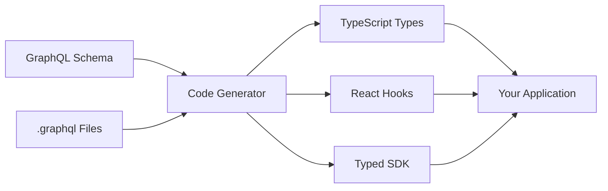
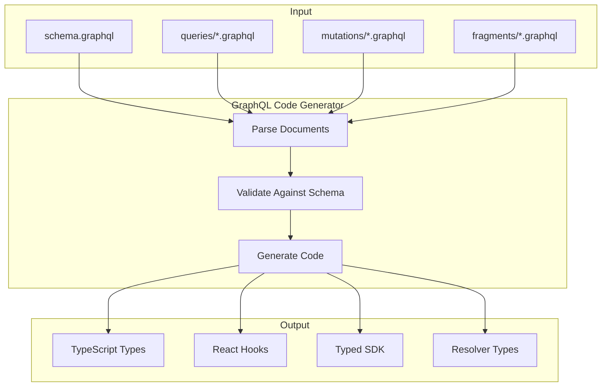

# How to Configure GraphQL Code Generation

Author: [nawazdhandala](https://www.github.com/nawazdhandala)

Tags: GraphQL, Code Generation, TypeScript, Apollo Client, React, Backend, Tooling

Description: A step-by-step guide to setting up GraphQL Code Generator for type-safe queries, mutations, and React hooks in your frontend and backend applications.

---

GraphQL Code Generator automatically creates TypeScript types, React hooks, and SDK code from your GraphQL schema and operations. This eliminates manual type definitions and ensures your code stays in sync with your API. This guide covers setup, configuration, and best practices for different use cases.

## Why Use GraphQL Code Generation



Benefits:
- Type-safe queries and mutations
- Auto-generated React hooks
- Compile-time error detection
- Better IDE autocompletion
- Reduced boilerplate code

## Step 1: Install Dependencies

Install the core packages and plugins for your stack.

```bash
# Core packages
npm install -D @graphql-codegen/cli @graphql-codegen/typescript

# For TypeScript operations (queries, mutations)
npm install -D @graphql-codegen/typescript-operations

# For React with Apollo Client
npm install -D @graphql-codegen/typescript-react-apollo

# For React Query/TanStack Query
npm install -D @graphql-codegen/typescript-react-query

# For typed document nodes (recommended)
npm install -D @graphql-codegen/typed-document-node

# For server-side resolvers
npm install -D @graphql-codegen/typescript-resolvers

# GraphQL tag for .graphql files
npm install graphql
```

## Step 2: Create Configuration File

Create a `codegen.ts` file in your project root.

```typescript
// codegen.ts
import type { CodegenConfig } from '@graphql-codegen/cli';

const config: CodegenConfig = {
  // Your GraphQL schema source
  // Can be a URL, local file, or glob pattern
  schema: 'http://localhost:4000/graphql',

  // GraphQL operations to generate types for
  documents: ['src/**/*.graphql', 'src/**/*.tsx'],

  // Ignore files
  ignoreNoDocuments: true,

  // Output configuration
  generates: {
    // Generate all types in a single file
    'src/generated/graphql.ts': {
      plugins: [
        'typescript',              // Base TypeScript types
        'typescript-operations',   // Types for operations
        'typescript-react-apollo', // React hooks
      ],
      config: {
        // Use TypeScript strict mode
        strictScalars: true,
        // Custom scalar mappings
        scalars: {
          DateTime: 'string',
          JSON: 'Record<string, unknown>',
          Upload: 'File',
        },
        // Generate React hooks
        withHooks: true,
        // Generate HOC components (optional)
        withHOC: false,
        // Generate render prop components (optional)
        withComponent: false,
      },
    },
  },
};

export default config;
```

## Step 3: Add Package Scripts

Update your `package.json` with code generation scripts.

```json
{
  "scripts": {
    "codegen": "graphql-codegen --config codegen.ts",
    "codegen:watch": "graphql-codegen --config codegen.ts --watch",
    "prebuild": "npm run codegen",
    "dev": "concurrently \"npm run codegen:watch\" \"npm run start\""
  }
}
```

## Step 4: Write GraphQL Operations

Create `.graphql` files for your operations.

```graphql
# src/graphql/queries/users.graphql

# Query to get a single user by ID
query GetUser($id: ID!) {
  user(id: $id) {
    id
    name
    email
    createdAt
  }
}

# Query to get paginated users
query GetUsers($first: Int!, $after: String) {
  users(first: $first, after: $after) {
    edges {
      cursor
      node {
        id
        name
        email
      }
    }
    pageInfo {
      hasNextPage
      endCursor
    }
    totalCount
  }
}

# Fragment for reusable user fields
fragment UserFields on User {
  id
  name
  email
  avatar
  role
}

# Query using fragment
query GetUserWithDetails($id: ID!) {
  user(id: $id) {
    ...UserFields
    posts {
      id
      title
    }
  }
}
```

```graphql
# src/graphql/mutations/users.graphql

# Mutation to create a new user
mutation CreateUser($input: CreateUserInput!) {
  createUser(input: $input) {
    id
    name
    email
  }
}

# Mutation to update a user
mutation UpdateUser($id: ID!, $input: UpdateUserInput!) {
  updateUser(id: $id, input: $input) {
    id
    name
    email
    updatedAt
  }
}

# Mutation to delete a user
mutation DeleteUser($id: ID!) {
  deleteUser(id: $id) {
    success
    message
  }
}
```

## Step 5: Run Code Generation

```bash
# Generate types once
npm run codegen

# Or watch for changes during development
npm run codegen:watch
```

The generator creates a file with all your types and hooks:

```typescript
// src/generated/graphql.ts (auto-generated)

// Scalar types
export type Scalars = {
  ID: string;
  String: string;
  Boolean: boolean;
  Int: number;
  Float: number;
  DateTime: string;
  JSON: Record<string, unknown>;
};

// Types from schema
export type User = {
  __typename?: 'User';
  id: Scalars['ID'];
  name: Scalars['String'];
  email: Scalars['String'];
  createdAt: Scalars['DateTime'];
  posts?: Maybe<Array<Post>>;
};

// Query types
export type GetUserQueryVariables = Exact<{
  id: Scalars['ID'];
}>;

export type GetUserQuery = {
  __typename?: 'Query';
  user?: Maybe<{
    __typename?: 'User';
    id: string;
    name: string;
    email: string;
    createdAt: string;
  }>;
};

// Generated React hook
export function useGetUserQuery(
  baseOptions: Apollo.QueryHookOptions<GetUserQuery, GetUserQueryVariables>
) {
  const options = { ...defaultOptions, ...baseOptions };
  return Apollo.useQuery<GetUserQuery, GetUserQueryVariables>(
    GetUserDocument,
    options
  );
}
```

## Step 6: Use Generated Code in React

```typescript
// src/components/UserProfile.tsx
import { useGetUserQuery, useUpdateUserMutation } from '../generated/graphql';

function UserProfile({ userId }: { userId: string }) {
  // Generated hook with full type safety
  const { data, loading, error } = useGetUserQuery({
    variables: { id: userId },
  });

  // Generated mutation hook
  const [updateUser, { loading: updating }] = useUpdateUserMutation();

  if (loading) return <div>Loading...</div>;
  if (error) return <div>Error: {error.message}</div>;
  if (!data?.user) return <div>User not found</div>;

  // TypeScript knows the exact shape of data.user
  const { name, email, createdAt } = data.user;

  const handleUpdate = async () => {
    await updateUser({
      variables: {
        id: userId,
        input: { name: 'New Name' }, // Type-checked!
      },
    });
  };

  return (
    <div>
      <h1>{name}</h1>
      <p>{email}</p>
      <p>Joined: {new Date(createdAt).toLocaleDateString()}</p>
      <button onClick={handleUpdate} disabled={updating}>
        Update Name
      </button>
    </div>
  );
}
```

## Advanced Configuration: Multiple Outputs

Generate different outputs for frontend and backend.

```typescript
// codegen.ts
import type { CodegenConfig } from '@graphql-codegen/cli';

const config: CodegenConfig = {
  schema: 'src/schema/**/*.graphql',

  generates: {
    // Frontend types and hooks
    'src/frontend/generated/graphql.ts': {
      documents: 'src/frontend/**/*.graphql',
      plugins: [
        'typescript',
        'typescript-operations',
        'typescript-react-apollo',
      ],
      config: {
        withHooks: true,
        scalars: {
          DateTime: 'string',
        },
      },
    },

    // Backend resolver types
    'src/backend/generated/resolvers-types.ts': {
      plugins: ['typescript', 'typescript-resolvers'],
      config: {
        // Use context type for resolver context
        contextType: '../context#MyContext',
        // Map custom scalars
        scalars: {
          DateTime: 'Date',
        },
        // Generate mapper types for database models
        mappers: {
          User: '../models/User#UserModel',
          Post: '../models/Post#PostModel',
        },
      },
    },

    // GraphQL schema file for documentation
    'schema.graphql': {
      plugins: ['schema-ast'],
    },

    // Introspection JSON for tooling
    'schema.json': {
      plugins: ['introspection'],
    },
  },
};

export default config;
```

## Configuration for Different Clients

### React Query / TanStack Query

```typescript
// codegen.ts
const config: CodegenConfig = {
  schema: 'http://localhost:4000/graphql',
  documents: 'src/**/*.graphql',
  generates: {
    'src/generated/graphql.ts': {
      plugins: [
        'typescript',
        'typescript-operations',
        'typescript-react-query',
      ],
      config: {
        fetcher: {
          // Custom fetcher function
          func: './fetcher#customFetcher',
          isReactHook: false,
        },
        // Expose query keys for cache invalidation
        exposeQueryKeys: true,
        // Expose mutation keys
        exposeMutationKeys: true,
        // Add suffix to hooks
        addSuspenseQuery: true,
      },
    },
  },
};
```

Use generated React Query hooks:

```typescript
// src/components/Users.tsx
import {
  useGetUsersQuery,
  useCreateUserMutation,
  getGetUsersQueryKey,
} from '../generated/graphql';
import { useQueryClient } from '@tanstack/react-query';

function Users() {
  const queryClient = useQueryClient();

  const { data, isLoading } = useGetUsersQuery({
    first: 10,
  });

  const createUserMutation = useCreateUserMutation({
    onSuccess: () => {
      // Invalidate and refetch
      queryClient.invalidateQueries({
        queryKey: getGetUsersQueryKey({ first: 10 }),
      });
    },
  });

  // ...
}
```

### urql Client

```typescript
// codegen.ts
const config: CodegenConfig = {
  schema: 'http://localhost:4000/graphql',
  documents: 'src/**/*.graphql',
  generates: {
    'src/generated/graphql.ts': {
      plugins: [
        'typescript',
        'typescript-operations',
        'typescript-urql',
      ],
      config: {
        withHooks: true,
        urqlImportFrom: '@urql/core',
      },
    },
  },
};
```

## Configuration for Server-Side

Generate typed resolvers for your GraphQL server.

```typescript
// codegen.ts
const config: CodegenConfig = {
  schema: 'src/schema/**/*.graphql',
  generates: {
    'src/generated/resolvers-types.ts': {
      plugins: ['typescript', 'typescript-resolvers'],
      config: {
        // Your context type
        contextType: '../context#Context',
        // Use interface instead of type
        useIndexSignature: true,
        // Optional fields are nullable
        optionalResolveType: true,
        // Map schema types to your models
        mappers: {
          User: '../models#UserModel',
          Post: '../models#PostModel',
          Comment: '../models#CommentModel',
        },
        // Enum values mapping
        enumValues: {
          UserRole: '../enums#UserRole',
        },
      },
    },
  },
};
```

Use generated resolver types:

```typescript
// src/resolvers/user.ts
import { Resolvers, UserResolvers } from '../generated/resolvers-types';
import { Context } from '../context';

// Fully typed resolver
export const userResolvers: Resolvers<Context> = {
  Query: {
    // TypeScript knows the return type must be User or null
    user: async (_, { id }, context) => {
      return context.db.users.findById(id);
    },

    // TypeScript enforces the correct argument types
    users: async (_, { first, after }, context) => {
      return context.db.users.findMany({ first, after });
    },
  },

  User: {
    // TypeScript knows 'parent' is UserModel from mappers config
    posts: async (parent, _, context) => {
      return context.db.posts.findByAuthor(parent.id);
    },

    // Computed field
    fullName: (parent) => {
      return `${parent.firstName} ${parent.lastName}`;
    },
  },

  Mutation: {
    createUser: async (_, { input }, context) => {
      // input is fully typed
      return context.db.users.create(input);
    },
  },
};
```

## Near-Operation File Generation

Generate types next to your GraphQL files for better organization.

```typescript
// codegen.ts
const config: CodegenConfig = {
  schema: 'http://localhost:4000/graphql',
  documents: 'src/**/*.graphql',
  generates: {
    // Generate types next to each .graphql file
    'src/': {
      preset: 'near-operation-file',
      presetConfig: {
        // Extension for generated files
        extension: '.generated.ts',
        // Base types location
        baseTypesPath: 'generated/base-types.ts',
      },
      plugins: ['typescript-operations', 'typescript-react-apollo'],
    },

    // Generate base types separately
    'src/generated/base-types.ts': {
      plugins: ['typescript'],
    },
  },
};
```

This creates:
```
src/
  graphql/
    queries/
      users.graphql
      users.generated.ts    # Generated types for users.graphql
    mutations/
      posts.graphql
      posts.generated.ts    # Generated types for posts.graphql
  generated/
    base-types.ts           # Shared schema types
```

## Fragment Handling

Use fragments for reusable field selections.

```graphql
# src/graphql/fragments/user.graphql

# Basic user fields
fragment UserBasic on User {
  id
  name
  email
}

# Extended user fields
fragment UserFull on User {
  ...UserBasic
  avatar
  role
  createdAt
  posts {
    id
    title
  }
}
```

```graphql
# src/graphql/queries/users.graphql

query GetUserProfile($id: ID!) {
  user(id: $id) {
    ...UserFull
  }
}

query GetUsersList {
  users {
    edges {
      node {
        ...UserBasic
      }
    }
  }
}
```

Configure fragment masking for better encapsulation:

```typescript
// codegen.ts
const config: CodegenConfig = {
  schema: 'http://localhost:4000/graphql',
  documents: 'src/**/*.graphql',
  generates: {
    'src/generated/': {
      preset: 'client',
      presetConfig: {
        // Enable fragment masking
        fragmentMasking: true,
      },
    },
  },
};
```

## Watch Mode Configuration

Configure which files trigger regeneration.

```typescript
// codegen.ts
const config: CodegenConfig = {
  schema: 'http://localhost:4000/graphql',
  documents: 'src/**/*.graphql',

  // Watch configuration
  watch: true,

  generates: {
    'src/generated/graphql.ts': {
      plugins: ['typescript', 'typescript-operations'],
    },
  },

  // Hooks for custom actions
  hooks: {
    // Run after generation
    afterAllFileWrite: ['prettier --write'],
    // Run before generation
    beforeAllFileWrite: ['echo "Generating..."'],
    // Run after a single file change in watch mode
    onWatchTriggered: ['echo "Change detected"'],
  },
};
```

## Schema Generation Flow



## Troubleshooting Common Issues

### Issue: Schema Cannot Be Fetched

```typescript
// codegen.ts
const config: CodegenConfig = {
  // Option 1: Use local schema file
  schema: 'src/schema.graphql',

  // Option 2: Use multiple schema files
  schema: ['src/schema/**/*.graphql'],

  // Option 3: Add headers for authenticated endpoints
  schema: [
    {
      'http://localhost:4000/graphql': {
        headers: {
          Authorization: `Bearer ${process.env.API_TOKEN}`,
        },
      },
    },
  ],

  // ...
};
```

### Issue: Missing Types for Custom Scalars

```typescript
// codegen.ts
const config: CodegenConfig = {
  schema: 'http://localhost:4000/graphql',
  generates: {
    'src/generated/graphql.ts': {
      plugins: ['typescript'],
      config: {
        // Map all custom scalars
        scalars: {
          DateTime: 'string',
          Date: 'string',
          Time: 'string',
          JSON: 'Record<string, any>',
          JSONObject: 'Record<string, any>',
          Upload: 'File',
          BigInt: 'bigint',
          UUID: 'string',
        },
      },
    },
  },
};
```

### Issue: Duplicate Identifier Errors

```typescript
// codegen.ts
const config: CodegenConfig = {
  generates: {
    'src/generated/graphql.ts': {
      plugins: ['typescript', 'typescript-operations'],
      config: {
        // Avoid naming collisions
        typesPrefix: 'Gql',
        // Or use suffix
        typesSuffix: 'Type',
        // Skip typename in responses
        skipTypename: true,
        // Dedupe fragments
        dedupeFragments: true,
      },
    },
  },
};
```

## Best Practices

### 1. Organize GraphQL Files

```
src/
  graphql/
    fragments/
      user.graphql
      post.graphql
    queries/
      users.graphql
      posts.graphql
    mutations/
      users.graphql
      posts.graphql
    subscriptions/
      notifications.graphql
```

### 2. Use Fragments Consistently

```graphql
# Define once, use everywhere
fragment PostCard on Post {
  id
  title
  excerpt
  author {
    ...UserBasic
  }
}
```

### 3. Name Operations Clearly

```graphql
# Good: Descriptive names that explain what the query does
query GetUserById($id: ID!)
query ListRecentPosts($limit: Int!)
mutation CreateNewUser($input: CreateUserInput!)
mutation UpdateUserProfile($id: ID!, $input: UpdateUserInput!)

# Bad: Vague or generic names
query User($id: ID!)
query Posts
mutation Create($input: CreateUserInput!)
```

### 4. Add to CI Pipeline

```yaml
# .github/workflows/ci.yml
jobs:
  build:
    steps:
      - uses: actions/checkout@v4

      - name: Install dependencies
        run: npm ci

      - name: Generate GraphQL types
        run: npm run codegen

      - name: Check for uncommitted changes
        run: |
          if [[ -n $(git status --porcelain src/generated) ]]; then
            echo "Generated files are out of date. Run 'npm run codegen' and commit."
            exit 1
          fi

      - name: Type check
        run: npm run type-check

      - name: Build
        run: npm run build
```

---

GraphQL Code Generator eliminates the gap between your schema and application code. By generating TypeScript types and React hooks automatically, you get compile-time safety, better IDE support, and fewer runtime errors. Start with basic type generation and gradually add hooks and resolver types as your project grows.
