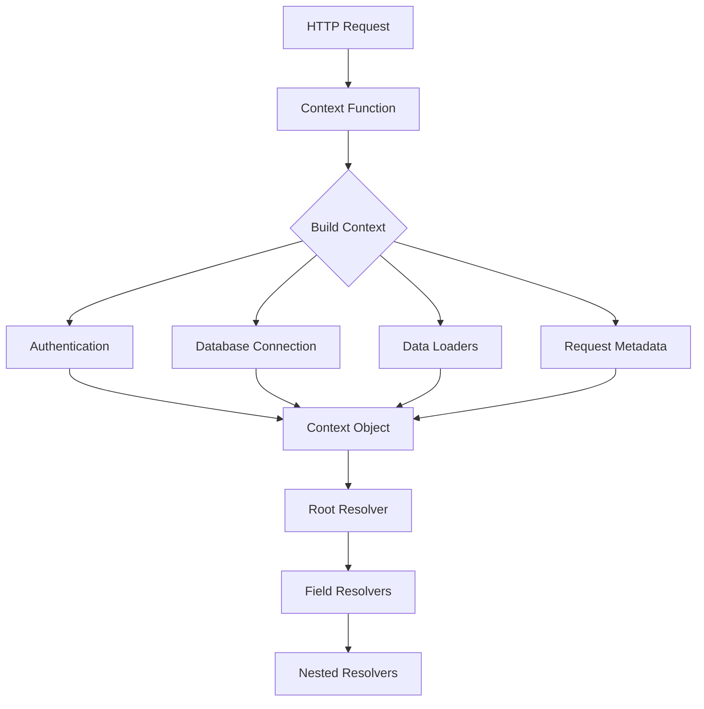
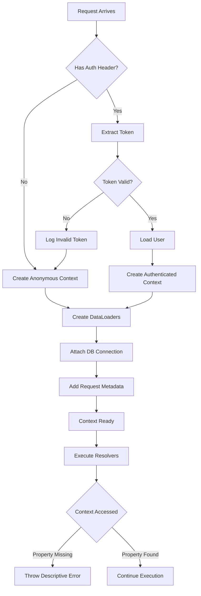

# How to Fix "Context Missing" Resolver Errors

Author: [nawazdhandala](https://www.github.com/nawazdhandala)

Tags: GraphQL, Resolvers, Apollo Server, Debugging, Authentication, Backend

Description: Learn how to diagnose and fix context missing errors in GraphQL resolvers, including proper context setup, authentication handling, and debugging techniques.

---

"Context missing" errors in GraphQL resolvers occur when expected data like authenticated users, database connections, or request information is not available. These errors are frustrating because they often manifest as cryptic `Cannot read property of undefined` messages deep in your resolver code.

## Understanding GraphQL Context

Context in GraphQL is an object shared across all resolvers for a single request. It typically contains authentication information, database connections, data loaders, and request metadata.



## Common Context Missing Scenarios

### Scenario 1: Context Function Not Returning Data

The most common cause is a context function that does not return the expected properties.

```javascript
// BROKEN: Context function returns nothing for unauthenticated users
const server = new ApolloServer({
  typeDefs,
  resolvers,
  context: ({ req }) => {
    const token = req.headers.authorization;

    if (token) {
      const user = verifyToken(token);
      return { user };
    }
    // BUG: Returns undefined when no token is present
    // This causes "Cannot read property 'user' of undefined"
  },
});

// FIXED: Always return a context object
const server = new ApolloServer({
  typeDefs,
  resolvers,
  context: ({ req }) => {
    const token = req.headers.authorization;

    // Always return an object, even if user is null
    if (token) {
      try {
        const user = verifyToken(token);
        return { user, isAuthenticated: true };
      } catch (error) {
        // Token verification failed
        return { user: null, isAuthenticated: false };
      }
    }

    // Unauthenticated request
    return { user: null, isAuthenticated: false };
  },
});
```

### Scenario 2: Async Context Without Await

Context can be async, but forgetting to await can cause issues.

```javascript
// BROKEN: Async context not properly handled
const server = new ApolloServer({
  typeDefs,
  resolvers,
  context: ({ req }) => {
    // This returns a Promise, not the resolved context
    return getUserFromToken(req.headers.authorization);
  },
});

// FIXED: Properly handle async context
const server = new ApolloServer({
  typeDefs,
  resolvers,
  // Use async/await for async context functions
  context: async ({ req }) => {
    try {
      const user = await getUserFromToken(req.headers.authorization);
      const db = await getDbConnection();

      return {
        user,
        db,
        requestId: req.headers['x-request-id'] || generateRequestId(),
      };
    } catch (error) {
      console.error('Context creation failed:', error);
      // Return minimal context on error
      return {
        user: null,
        db: null,
        requestId: generateRequestId(),
        contextError: error.message,
      };
    }
  },
});
```

### Scenario 3: Missing Context in Subscriptions

Subscriptions have a different context creation path.

```javascript
// BROKEN: Subscriptions use different context setup
const server = new ApolloServer({
  typeDefs,
  resolvers,
  // This only works for queries and mutations
  context: ({ req }) => {
    return { user: getUserFromRequest(req) };
  },
});

// FIXED: Handle both HTTP and WebSocket contexts
import { useServer } from 'graphql-ws/lib/use/ws';
import { WebSocketServer } from 'ws';

const httpServer = createServer(app);
const wsServer = new WebSocketServer({
  server: httpServer,
  path: '/graphql',
});

// Separate context for WebSocket subscriptions
useServer(
  {
    schema,
    // Context for subscription operations
    context: async (ctx, msg, args) => {
      // Extract authentication from connection params
      const token = ctx.connectionParams?.authToken;

      if (token) {
        try {
          const user = await verifyToken(token);
          return { user, isAuthenticated: true };
        } catch (error) {
          // Invalid token
          return { user: null, isAuthenticated: false };
        }
      }

      return { user: null, isAuthenticated: false };
    },
    // Called when client connects
    onConnect: async (ctx) => {
      console.log('Client connected for subscriptions');
      // Validate connection params here
      const token = ctx.connectionParams?.authToken;
      if (!token && requireAuth) {
        return false; // Reject connection
      }
      return true;
    },
  },
  wsServer
);

// HTTP context for queries and mutations
const server = new ApolloServer({
  schema,
  context: async ({ req }) => {
    const token = req.headers.authorization?.replace('Bearer ', '');

    if (token) {
      try {
        const user = await verifyToken(token);
        return { user, isAuthenticated: true };
      } catch (error) {
        return { user: null, isAuthenticated: false };
      }
    }

    return { user: null, isAuthenticated: false };
  },
});
```

## Defensive Resolver Patterns

Write resolvers that handle missing context gracefully.

```javascript
// resolvers.js

const resolvers = {
  Query: {
    // Pattern 1: Check context existence
    me: (parent, args, context) => {
      // Validate context has required properties
      if (!context) {
        throw new Error('Context is missing');
      }

      if (!context.user) {
        throw new AuthenticationError('You must be logged in');
      }

      return context.user;
    },

    // Pattern 2: Use default values
    publicPosts: (parent, args, context) => {
      // Use optional chaining and defaults
      const limit = args.limit || 10;
      const userId = context?.user?.id;

      // Query works with or without authenticated user
      return getPosts({
        limit,
        // Filter by user if authenticated
        authorId: userId || undefined,
        publicOnly: !userId,
      });
    },

    // Pattern 3: Context validation helper
    privateData: (parent, args, context) => {
      requireAuth(context);
      requireRole(context, ['ADMIN', 'MANAGER']);

      return getPrivateData();
    },
  },

  Mutation: {
    createPost: async (parent, args, context) => {
      // Combine multiple checks
      const user = requireAuth(context);
      const db = requireDb(context);

      return db.posts.create({
        ...args.input,
        authorId: user.id,
      });
    },
  },
};

// Helper functions for context validation
function requireAuth(context) {
  if (!context) {
    throw new Error('Context is undefined - check server configuration');
  }

  if (!context.user) {
    throw new AuthenticationError('Authentication required');
  }

  return context.user;
}

function requireRole(context, allowedRoles) {
  const user = requireAuth(context);

  if (!allowedRoles.includes(user.role)) {
    throw new ForbiddenError(
      `Insufficient permissions. Required roles: ${allowedRoles.join(', ')}`
    );
  }

  return user;
}

function requireDb(context) {
  if (!context?.db) {
    throw new Error(
      'Database connection missing from context - check context setup'
    );
  }

  return context.db;
}
```

## TypeScript Context Typing

Use TypeScript to catch context errors at compile time.

```typescript
// types/context.ts

// Define the structure of your context
export interface GraphQLContext {
  user: User | null;
  isAuthenticated: boolean;
  db: DatabaseConnection;
  dataloaders: DataLoaders;
  requestId: string;
}

// Authenticated context for resolvers that require auth
export interface AuthenticatedContext extends GraphQLContext {
  user: User;
  isAuthenticated: true;
}

// User type
export interface User {
  id: string;
  email: string;
  role: 'ADMIN' | 'USER' | 'GUEST';
}

// DataLoaders type
export interface DataLoaders {
  userLoader: DataLoader<string, User>;
  postLoader: DataLoader<string, Post>;
}
```

```typescript
// resolvers/user.ts
import { GraphQLContext, AuthenticatedContext } from '../types/context';
import { AuthenticationError } from 'apollo-server-errors';

// Type guard to narrow context type
function assertAuthenticated(
  context: GraphQLContext
): asserts context is AuthenticatedContext {
  if (!context.user) {
    throw new AuthenticationError('You must be logged in');
  }
}

const userResolvers = {
  Query: {
    // TypeScript knows context shape
    me: (
      _parent: unknown,
      _args: unknown,
      context: GraphQLContext
    ) => {
      // Type guard narrows context type
      assertAuthenticated(context);

      // Now TypeScript knows context.user is defined
      return context.user;
    },

    user: async (
      _parent: unknown,
      args: { id: string },
      context: GraphQLContext
    ) => {
      // Use optional chaining for optional context properties
      const requestingUserId = context.user?.id;

      // DataLoaders are typed
      const user = await context.dataloaders.userLoader.load(args.id);

      // Mask sensitive data for non-admin users
      if (context.user?.role !== 'ADMIN' && user.id !== requestingUserId) {
        return {
          ...user,
          email: null, // Hide email from other users
        };
      }

      return user;
    },
  },

  Mutation: {
    updateProfile: async (
      _parent: unknown,
      args: { input: UpdateProfileInput },
      context: GraphQLContext
    ) => {
      assertAuthenticated(context);

      // context.user is now typed as User, not User | null
      return context.db.users.update(context.user.id, args.input);
    },
  },
};

export default userResolvers;
```

## Debugging Context Issues

### Context Logging Plugin

```javascript
// plugins/context-debug.js

const contextDebugPlugin = {
  async requestDidStart(requestContext) {
    // Log context at request start
    const { context, request } = requestContext;

    // Only log in development
    if (process.env.NODE_ENV === 'development') {
      console.log('GraphQL Request:', {
        operationName: request.operationName,
        hasContext: !!context,
        contextKeys: context ? Object.keys(context) : [],
        isAuthenticated: context?.isAuthenticated || false,
        userId: context?.user?.id || null,
      });
    }

    return {
      async didEncounterErrors(ctx) {
        // Log context-related errors with full details
        const contextErrors = ctx.errors.filter(
          (err) =>
            err.message.includes('Cannot read property') ||
            err.message.includes('undefined') ||
            err.message.includes('context')
        );

        if (contextErrors.length > 0) {
          console.error('Potential Context Error Detected:', {
            errors: contextErrors.map((e) => ({
              message: e.message,
              path: e.path,
              locations: e.locations,
            })),
            contextSnapshot: {
              hasUser: !!ctx.context?.user,
              hasDb: !!ctx.context?.db,
              hasDataloaders: !!ctx.context?.dataloaders,
              keys: Object.keys(ctx.context || {}),
            },
          });
        }
      },
    };
  },
};

// Add to server
const server = new ApolloServer({
  typeDefs,
  resolvers,
  plugins: [contextDebugPlugin],
});
```

### Context Validation Middleware

```javascript
// middleware/validate-context.js

// Validate context before resolvers run
const validateContextPlugin = {
  async requestDidStart() {
    return {
      async didResolveOperation(requestContext) {
        const { context, operation } = requestContext;

        // Define required context properties per operation type
        const requirements = {
          mutation: ['user', 'db'],
          subscription: ['user'],
          query: ['db'],
        };

        const operationType = operation.operation;
        const required = requirements[operationType] || [];

        const missing = required.filter((key) => !context[key]);

        if (missing.length > 0) {
          console.warn(
            `Context validation warning: Missing ${missing.join(', ')} for ${operationType}`
          );

          // Optionally throw error for mutations
          if (operationType === 'mutation' && missing.includes('user')) {
            throw new AuthenticationError(
              'Authentication required for mutations'
            );
          }
        }
      },
    };
  },
};
```

## Testing Context Setup

```javascript
// __tests__/context.test.js
import { createTestClient } from 'apollo-server-testing';
import { ApolloServer } from 'apollo-server';
import { typeDefs, resolvers } from '../schema';
import { createContext } from '../context';

describe('Context Setup', () => {
  it('should create context with authenticated user', async () => {
    // Mock request with valid token
    const req = {
      headers: {
        authorization: 'Bearer valid-token',
      },
    };

    const context = await createContext({ req });

    expect(context).toBeDefined();
    expect(context.user).toBeDefined();
    expect(context.isAuthenticated).toBe(true);
    expect(context.db).toBeDefined();
  });

  it('should create context without user for unauthenticated request', async () => {
    const req = {
      headers: {},
    };

    const context = await createContext({ req });

    expect(context).toBeDefined();
    expect(context.user).toBeNull();
    expect(context.isAuthenticated).toBe(false);
    // DB should still be available
    expect(context.db).toBeDefined();
  });

  it('should handle invalid token gracefully', async () => {
    const req = {
      headers: {
        authorization: 'Bearer invalid-token',
      },
    };

    const context = await createContext({ req });

    expect(context).toBeDefined();
    expect(context.user).toBeNull();
    expect(context.isAuthenticated).toBe(false);
  });

  it('should protect authenticated resolvers', async () => {
    const server = new ApolloServer({
      typeDefs,
      resolvers,
      context: () => ({
        user: null,
        isAuthenticated: false,
        db: mockDb,
      }),
    });

    const { query } = createTestClient(server);

    const result = await query({
      query: `query { me { id } }`,
    });

    expect(result.errors).toBeDefined();
    expect(result.errors[0].message).toContain('logged in');
  });
});
```

## Context Flow Diagram



## Summary

| Issue | Solution |
|-------|----------|
| **Context undefined** | Always return an object from context function |
| **Async context issues** | Use async/await properly |
| **Subscription context** | Configure WebSocket context separately |
| **Missing properties** | Use defensive checks and default values |
| **Type safety** | Use TypeScript with proper context types |
| **Debugging** | Add context logging plugins |
| **Testing** | Write tests for context creation |

Context missing errors are preventable with proper setup and defensive coding practices. Always ensure your context function returns an object, handle authentication failures gracefully, use TypeScript for type safety, and add debugging plugins to catch issues early. The key is to fail fast with descriptive error messages rather than letting undefined values propagate through your resolver chain.
