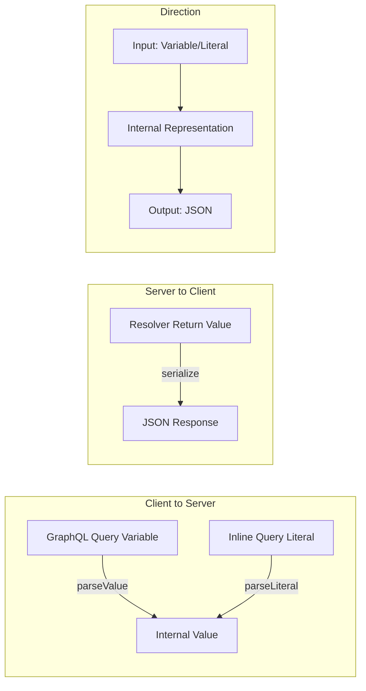
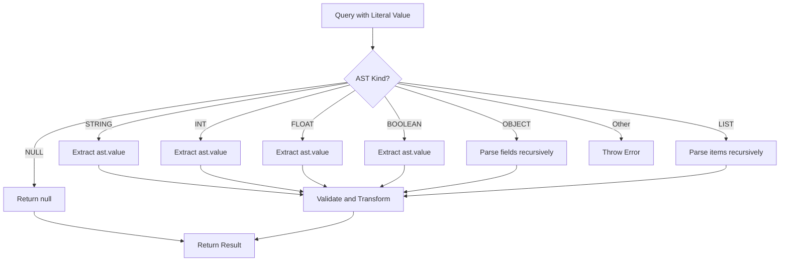

# How to Fix "Custom Scalar" Serialization Errors

Author: [nawazdhandala](https://www.github.com/nawazdhandala)

Tags: GraphQL, Custom Scalars, Serialization, Error Handling, TypeScript, Schema Design

Description: Learn how to diagnose and fix custom scalar serialization errors in GraphQL, including proper implementation of serialize, parseValue, and parseLiteral methods.

---

Custom scalars in GraphQL allow you to define domain-specific types like DateTime, Email, URL, or JSON. However, implementing them incorrectly often leads to confusing serialization errors. These errors occur when GraphQL cannot properly convert values between your application code and the GraphQL transport format.

This guide covers common custom scalar serialization errors, their root causes, and how to implement robust custom scalars that handle edge cases correctly.

## Understanding Scalar Serialization Flow

Custom scalars involve three transformation methods that convert data between different representations.



Each method serves a specific purpose:

- **serialize**: Converts internal values to JSON-compatible output for the response
- **parseValue**: Converts JSON input variables to internal representation
- **parseLiteral**: Converts inline literals in queries to internal representation

## Common Serialization Error Patterns

Here are the most frequent custom scalar errors and their solutions.

### Error 1: "Cannot serialize value"

This error occurs when the serialize method receives an unexpected type.

```typescript
// BAD: This scalar will throw errors for null or undefined values
const DateTimeScalar = new GraphQLScalarType({
  name: 'DateTime',
  description: 'A datetime string in ISO 8601 format',

  // This will crash if value is null, undefined, or not a Date
  serialize(value) {
    return value.toISOString();
  }
});

// Example error:
// "Cannot serialize value: Cannot read property 'toISOString' of null"
```

```typescript
// GOOD: Properly handle all possible input types
const DateTimeScalar = new GraphQLScalarType({
  name: 'DateTime',
  description: 'A datetime string in ISO 8601 format',

  serialize(value) {
    // Handle null/undefined explicitly
    if (value === null || value === undefined) {
      return null;
    }

    // Handle Date objects
    if (value instanceof Date) {
      // Check for invalid dates
      if (isNaN(value.getTime())) {
        throw new GraphQLError('DateTime cannot represent an invalid Date instance');
      }
      return value.toISOString();
    }

    // Handle string inputs (already serialized)
    if (typeof value === 'string') {
      const date = new Date(value);
      if (isNaN(date.getTime())) {
        throw new GraphQLError(`DateTime cannot represent invalid date string: ${value}`);
      }
      return date.toISOString();
    }

    // Handle numeric timestamps
    if (typeof value === 'number') {
      const date = new Date(value);
      if (isNaN(date.getTime())) {
        throw new GraphQLError(`DateTime cannot represent invalid timestamp: ${value}`);
      }
      return date.toISOString();
    }

    // Reject unexpected types with a helpful message
    throw new GraphQLError(
      `DateTime cannot represent value: ${JSON.stringify(value)} (type: ${typeof value})`
    );
  }
});
```

### Error 2: "Cannot parse value"

This error occurs when parseValue receives invalid input from query variables.

```typescript
// BAD: No validation of input format
const EmailScalar = new GraphQLScalarType({
  name: 'Email',
  description: 'A valid email address',

  parseValue(value) {
    // No validation - accepts any string
    return value;
  }
});
```

```typescript
// GOOD: Validate input and provide clear error messages
const EMAIL_REGEX = /^[a-zA-Z0-9._%+-]+@[a-zA-Z0-9.-]+\.[a-zA-Z]{2,}$/;

const EmailScalar = new GraphQLScalarType({
  name: 'Email',
  description: 'A valid email address',

  parseValue(value) {
    // Ensure we received a string
    if (typeof value !== 'string') {
      throw new GraphQLError(
        `Email must be a string, received: ${typeof value}`
      );
    }

    // Trim whitespace
    const trimmed = value.trim().toLowerCase();

    // Validate format
    if (!EMAIL_REGEX.test(trimmed)) {
      throw new GraphQLError(
        `Invalid email format: "${value}". Expected format: user@domain.com`
      );
    }

    // Check length limits
    if (trimmed.length > 254) {
      throw new GraphQLError(
        `Email too long: ${trimmed.length} characters (max 254)`
      );
    }

    return trimmed;
  },

  // serialize should match parseValue for consistency
  serialize(value) {
    if (typeof value !== 'string') {
      throw new GraphQLError(`Email cannot serialize non-string value`);
    }
    return value.toLowerCase();
  },

  // parseLiteral handles inline values in queries
  parseLiteral(ast) {
    if (ast.kind !== Kind.STRING) {
      throw new GraphQLError(
        `Email must be a string literal, received: ${ast.kind}`
      );
    }
    // Reuse parseValue logic for consistency
    return this.parseValue(ast.value);
  }
});
```

### Error 3: "parseLiteral missing or incorrect"

This error often occurs when parseLiteral is not implemented or does not handle the AST correctly.



```typescript
// Import AST kind constants
import { Kind, GraphQLScalarType, GraphQLError } from 'graphql';

// BAD: Incomplete parseLiteral implementation
const JSONScalar = new GraphQLScalarType({
  name: 'JSON',
  description: 'Arbitrary JSON value',

  parseLiteral(ast) {
    // Only handles objects - will fail for arrays, strings, etc.
    if (ast.kind === Kind.OBJECT) {
      return parseObject(ast);
    }
    throw new GraphQLError('JSON must be an object');
  }
});
```

```typescript
// GOOD: Complete parseLiteral handling all AST types
const JSONScalar = new GraphQLScalarType({
  name: 'JSON',
  description: 'Arbitrary JSON value',

  serialize(value) {
    // JSON can represent any value - pass through
    return value;
  },

  parseValue(value) {
    // Variables are already parsed JSON - pass through
    return value;
  },

  parseLiteral(ast, variables) {
    // Recursively parse the AST to build a JavaScript value
    return parseLiteralValue(ast, variables);
  }
});

// Helper function to parse any AST node type
function parseLiteralValue(ast, variables) {
  switch (ast.kind) {
    case Kind.STRING:
      return ast.value;

    case Kind.INT:
      // Parse as integer
      return parseInt(ast.value, 10);

    case Kind.FLOAT:
      // Parse as floating point
      return parseFloat(ast.value);

    case Kind.BOOLEAN:
      return ast.value;

    case Kind.NULL:
      return null;

    case Kind.LIST:
      // Recursively parse array items
      return ast.values.map(item => parseLiteralValue(item, variables));

    case Kind.OBJECT:
      // Build object from field nodes
      const obj = {};
      ast.fields.forEach(field => {
        obj[field.name.value] = parseLiteralValue(field.value, variables);
      });
      return obj;

    case Kind.VARIABLE:
      // Look up variable value if provided
      const varName = ast.name.value;
      if (variables && varName in variables) {
        return variables[varName];
      }
      throw new GraphQLError(`Variable $${varName} is not defined`);

    default:
      throw new GraphQLError(`Unexpected AST kind: ${ast.kind}`);
  }
}
```

## Implementing Robust Custom Scalars

Here is a complete example of a well-implemented custom scalar for URLs.

```typescript
import { GraphQLScalarType, GraphQLError, Kind } from 'graphql';

// URL scalar with comprehensive validation
export const URLScalar = new GraphQLScalarType({
  name: 'URL',
  description: 'A valid URL string. Supports http, https, and data URLs.',

  serialize(value) {
    // Handle null/undefined
    if (value == null) {
      return null;
    }

    // If already a URL object, convert to string
    if (value instanceof URL) {
      return value.toString();
    }

    // Validate string URLs
    if (typeof value === 'string') {
      try {
        // Use URL constructor for validation
        const url = new URL(value);

        // Optionally restrict protocols
        const allowedProtocols = ['http:', 'https:', 'data:'];
        if (!allowedProtocols.includes(url.protocol)) {
          throw new GraphQLError(
            `URL protocol "${url.protocol}" not allowed. Allowed: ${allowedProtocols.join(', ')}`
          );
        }

        return url.toString();
      } catch (error) {
        if (error instanceof GraphQLError) {
          throw error;
        }
        throw new GraphQLError(`Invalid URL: ${value}`);
      }
    }

    throw new GraphQLError(
      `URL cannot represent value: ${JSON.stringify(value)}`
    );
  },

  parseValue(value) {
    if (typeof value !== 'string') {
      throw new GraphQLError(`URL must be a string, received: ${typeof value}`);
    }

    try {
      const url = new URL(value);

      // Security: Block potentially dangerous URLs
      if (url.protocol === 'javascript:') {
        throw new GraphQLError('JavaScript URLs are not allowed');
      }

      return url.toString();
    } catch (error) {
      if (error instanceof GraphQLError) {
        throw error;
      }
      throw new GraphQLError(`Invalid URL format: ${value}`);
    }
  },

  parseLiteral(ast) {
    if (ast.kind !== Kind.STRING) {
      throw new GraphQLError(
        `URL must be a string literal, received: ${ast.kind}`,
        { nodes: ast }
      );
    }

    // Reuse parseValue for consistent validation
    return this.parseValue(ast.value);
  }
});
```

## Creating a Scalar Factory

For consistent scalar implementations, create a factory function.

```typescript
import { GraphQLScalarType, GraphQLError, Kind } from 'graphql';

// Configuration for creating string-based scalars
interface StringScalarConfig {
  name: string;
  description: string;
  // Validation function returns true if valid
  validate: (value: string) => boolean;
  // Error message for invalid values
  errorMessage: (value: string) => string;
  // Optional transformation
  transform?: (value: string) => string;
}

// Factory function for creating validated string scalars
function createStringScalar(config: StringScalarConfig): GraphQLScalarType {
  const { name, description, validate, errorMessage, transform } = config;

  // Internal validation and transformation
  const processValue = (value: unknown): string => {
    if (typeof value !== 'string') {
      throw new GraphQLError(
        `${name} must be a string, received: ${typeof value}`
      );
    }

    // Apply transformation if provided
    const processed = transform ? transform(value) : value;

    // Validate the value
    if (!validate(processed)) {
      throw new GraphQLError(errorMessage(value));
    }

    return processed;
  };

  return new GraphQLScalarType({
    name,
    description,

    serialize(value) {
      if (value == null) return null;
      return processValue(value);
    },

    parseValue(value) {
      return processValue(value);
    },

    parseLiteral(ast) {
      if (ast.kind !== Kind.STRING) {
        throw new GraphQLError(
          `${name} must be a string literal, received: ${ast.kind}`
        );
      }
      return processValue(ast.value);
    }
  });
}

// Create scalars using the factory
export const UUIDScalar = createStringScalar({
  name: 'UUID',
  description: 'A UUID string in format xxxxxxxx-xxxx-xxxx-xxxx-xxxxxxxxxxxx',
  validate: (value) =>
    /^[0-9a-f]{8}-[0-9a-f]{4}-[0-9a-f]{4}-[0-9a-f]{4}-[0-9a-f]{12}$/i.test(value),
  errorMessage: (value) => `Invalid UUID format: ${value}`,
  transform: (value) => value.toLowerCase()
});

export const HexColorScalar = createStringScalar({
  name: 'HexColor',
  description: 'A hex color code like #FF5733 or #F53',
  validate: (value) => /^#([0-9a-f]{3}|[0-9a-f]{6})$/i.test(value),
  errorMessage: (value) => `Invalid hex color: ${value}. Expected format: #RGB or #RRGGBB`,
  transform: (value) => value.toUpperCase()
});

export const SlugScalar = createStringScalar({
  name: 'Slug',
  description: 'A URL-friendly slug containing only lowercase letters, numbers, and hyphens',
  validate: (value) => /^[a-z0-9]+(?:-[a-z0-9]+)*$/.test(value) && value.length <= 100,
  errorMessage: (value) => `Invalid slug: ${value}. Use lowercase letters, numbers, and hyphens only.`,
  transform: (value) => value.toLowerCase().trim()
});
```

## Debugging Serialization Errors

When you encounter serialization errors, use these techniques to debug them.

```typescript
// Create a debugging wrapper for any scalar
function createDebugScalar(scalar: GraphQLScalarType): GraphQLScalarType {
  return new GraphQLScalarType({
    name: scalar.name,
    description: scalar.description,

    serialize(value) {
      console.log(`[${scalar.name}] serialize called with:`, {
        value,
        type: typeof value,
        constructor: value?.constructor?.name
      });

      try {
        const result = scalar.serialize(value);
        console.log(`[${scalar.name}] serialize returned:`, result);
        return result;
      } catch (error) {
        console.error(`[${scalar.name}] serialize error:`, error);
        throw error;
      }
    },

    parseValue(value) {
      console.log(`[${scalar.name}] parseValue called with:`, {
        value,
        type: typeof value
      });

      try {
        const result = scalar.parseValue(value);
        console.log(`[${scalar.name}] parseValue returned:`, result);
        return result;
      } catch (error) {
        console.error(`[${scalar.name}] parseValue error:`, error);
        throw error;
      }
    },

    parseLiteral(ast, variables) {
      console.log(`[${scalar.name}] parseLiteral called with:`, {
        kind: ast.kind,
        value: 'value' in ast ? ast.value : undefined
      });

      try {
        const result = scalar.parseLiteral(ast, variables);
        console.log(`[${scalar.name}] parseLiteral returned:`, result);
        return result;
      } catch (error) {
        console.error(`[${scalar.name}] parseLiteral error:`, error);
        throw error;
      }
    }
  });
}

// Use in development
const debuggableScalars = {
  DateTime: createDebugScalar(DateTimeScalar),
  Email: createDebugScalar(EmailScalar),
  URL: createDebugScalar(URLScalar)
};
```

## Testing Custom Scalars

Write comprehensive tests to catch serialization issues early.

```typescript
import { DateTimeScalar, EmailScalar, URLScalar } from './scalars';

describe('DateTimeScalar', () => {
  describe('serialize', () => {
    it('should serialize Date objects', () => {
      const date = new Date('2024-01-15T10:30:00Z');
      expect(DateTimeScalar.serialize(date)).toBe('2024-01-15T10:30:00.000Z');
    });

    it('should serialize ISO strings', () => {
      const isoString = '2024-01-15T10:30:00Z';
      expect(DateTimeScalar.serialize(isoString)).toBe('2024-01-15T10:30:00.000Z');
    });

    it('should serialize timestamps', () => {
      const timestamp = 1705315800000; // 2024-01-15T10:30:00Z
      expect(DateTimeScalar.serialize(timestamp)).toBe('2024-01-15T10:30:00.000Z');
    });

    it('should return null for null input', () => {
      expect(DateTimeScalar.serialize(null)).toBeNull();
    });

    it('should throw for invalid date strings', () => {
      expect(() => DateTimeScalar.serialize('not-a-date')).toThrow(GraphQLError);
    });

    it('should throw for invalid types', () => {
      expect(() => DateTimeScalar.serialize({ invalid: true })).toThrow(GraphQLError);
    });
  });

  describe('parseValue', () => {
    it('should parse ISO strings', () => {
      const result = DateTimeScalar.parseValue('2024-01-15T10:30:00Z');
      expect(result).toBeInstanceOf(Date);
      expect(result.toISOString()).toBe('2024-01-15T10:30:00.000Z');
    });

    it('should reject invalid strings', () => {
      expect(() => DateTimeScalar.parseValue('invalid')).toThrow(GraphQLError);
    });
  });

  describe('parseLiteral', () => {
    it('should parse string literals', () => {
      const ast = { kind: Kind.STRING, value: '2024-01-15T10:30:00Z' };
      const result = DateTimeScalar.parseLiteral(ast);
      expect(result.toISOString()).toBe('2024-01-15T10:30:00.000Z');
    });

    it('should reject non-string literals', () => {
      const ast = { kind: Kind.INT, value: '123' };
      expect(() => DateTimeScalar.parseLiteral(ast)).toThrow(GraphQLError);
    });
  });
});
```

## Registering Custom Scalars

Make sure your scalars are properly registered in your schema.

```typescript
import { makeExecutableSchema } from '@graphql-tools/schema';
import { DateTimeScalar, EmailScalar, URLScalar, JSONScalar } from './scalars';

const typeDefs = `
  # Declare custom scalars in your schema
  scalar DateTime
  scalar Email
  scalar URL
  scalar JSON

  type User {
    id: ID!
    email: Email!
    createdAt: DateTime!
    avatarUrl: URL
    metadata: JSON
  }

  type Query {
    user(id: ID!): User
    userByEmail(email: Email!): User
  }

  type Mutation {
    createUser(email: Email!, metadata: JSON): User!
  }
`;

const resolvers = {
  // Register scalar implementations
  DateTime: DateTimeScalar,
  Email: EmailScalar,
  URL: URLScalar,
  JSON: JSONScalar,

  Query: {
    user: (_, { id }) => getUserById(id),
    userByEmail: (_, { email }) => getUserByEmail(email)
  },

  Mutation: {
    createUser: (_, { email, metadata }) => createUser(email, metadata)
  }
};

// Create the executable schema
const schema = makeExecutableSchema({
  typeDefs,
  resolvers
});
```

## Summary

Custom scalar serialization errors typically stem from incomplete handling of edge cases. Follow these principles for robust implementations:

1. **Handle null and undefined** explicitly in all three methods
2. **Validate input types** before processing
3. **Provide clear error messages** that help developers understand what went wrong
4. **Implement all three methods** consistently for bidirectional operations
5. **Test edge cases** including invalid inputs and boundary conditions
6. **Use type guards** to safely handle different input types
7. **Consider using established libraries** like graphql-scalars for common types

With properly implemented custom scalars, your GraphQL API will handle data transformation reliably and provide helpful error messages when issues occur.
