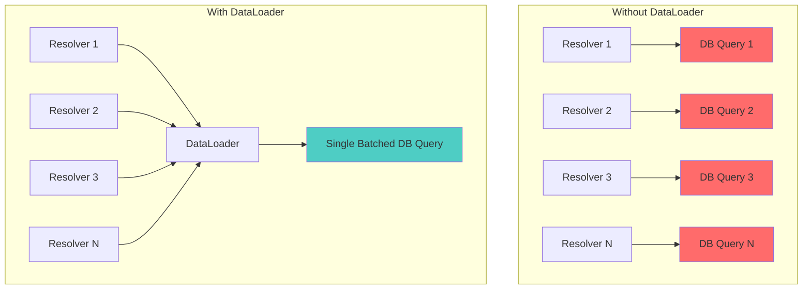
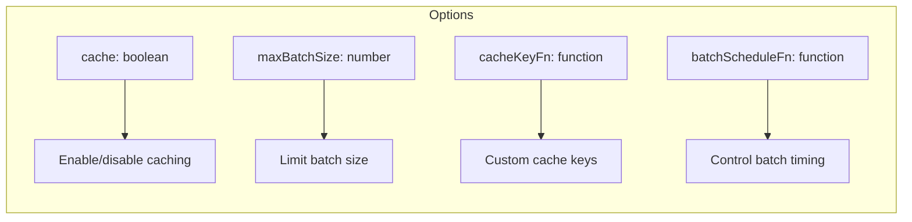

# How to Configure DataLoader for Batching in GraphQL

Author: [nawazdhandala](https://www.github.com/nawazdhandala)

Tags: GraphQL, DataLoader, Performance, Batching, Caching, API Development

Description: A comprehensive guide to configuring DataLoader for efficient batching and caching in GraphQL APIs to solve the N+1 query problem.

---

DataLoader is a utility library created by Facebook that provides batching and caching for data fetching operations. It is essential for building performant GraphQL APIs by solving the N+1 query problem. This guide covers everything from basic setup to advanced configuration patterns.

## What DataLoader Does

DataLoader collects all individual load requests made during a single frame of execution and batches them into a single request. It also provides request-level caching to avoid redundant fetches.



## Basic Setup

### Installation

```bash
# Install DataLoader
npm install dataloader

# If using TypeScript
npm install @types/dataloader --save-dev
```

### Creating Your First DataLoader

```javascript
// loaders/userLoader.js
const DataLoader = require('dataloader');

// The batch function receives an array of keys
// and must return a Promise that resolves to an array of values
// in the same order as the keys
async function batchUsers(userIds) {
  console.log('Batching users:', userIds);

  // Fetch all users in a single query
  const users = await db.query(
    'SELECT * FROM users WHERE id = ANY($1)',
    [userIds]
  );

  // IMPORTANT: Return results in the same order as input keys
  // Create a map for O(1) lookup
  const userMap = new Map(users.map(user => [user.id, user]));

  // Return users in the same order as the input keys
  return userIds.map(id => userMap.get(id) || null);
}

// Create the DataLoader instance
const userLoader = new DataLoader(batchUsers);

module.exports = userLoader;
```

### Integrating with Apollo Server

```javascript
// server.js
const { ApolloServer } = require('apollo-server');
const DataLoader = require('dataloader');

// Batch functions
const batchUsers = async (ids) => {
  const users = await db.users.findByIds(ids);
  const userMap = new Map(users.map(u => [u.id, u]));
  return ids.map(id => userMap.get(id));
};

const batchPosts = async (userIds) => {
  const posts = await db.posts.findByUserIds(userIds);
  // Group posts by userId
  return userIds.map(userId =>
    posts.filter(post => post.userId === userId)
  );
};

// Create loaders factory - called for each request
function createLoaders() {
  return {
    userLoader: new DataLoader(batchUsers),
    postsByUserLoader: new DataLoader(batchPosts)
  };
}

const server = new ApolloServer({
  typeDefs,
  resolvers,
  // Create fresh loaders for each request
  context: ({ req }) => ({
    loaders: createLoaders(),
    // Other context...
  })
});
```

### Using DataLoader in Resolvers

```javascript
// resolvers.js
const resolvers = {
  Query: {
    user: async (parent, { id }, context) => {
      // Uses the DataLoader from context
      return context.loaders.userLoader.load(id);
    },

    users: async (parent, { ids }, context) => {
      // Load multiple users at once
      return context.loaders.userLoader.loadMany(ids);
    }
  },

  Post: {
    // Resolver for post author - batched automatically
    author: async (parent, args, context) => {
      return context.loaders.userLoader.load(parent.authorId);
    }
  },

  User: {
    // Resolver for user posts - batched automatically
    posts: async (parent, args, context) => {
      return context.loaders.postsByUserLoader.load(parent.id);
    }
  }
};
```

## DataLoader Configuration Options

DataLoader accepts a second parameter with configuration options:

```javascript
const DataLoader = require('dataloader');

const userLoader = new DataLoader(batchUsers, {
  // Disable caching (useful for mutations)
  cache: true,

  // Custom cache key function
  cacheKeyFn: (key) => key.toString(),

  // Custom cache Map implementation
  cacheMap: new Map(),

  // Maximum batch size (default: Infinity)
  maxBatchSize: 100,

  // Batch scheduling function
  batchScheduleFn: (callback) => setTimeout(callback, 0),

  // Name for debugging
  name: 'UserLoader'
});
```

### Configuration Options Explained



## Advanced Patterns

### Pattern 1: Loaders with Parameters

Sometimes you need loaders that accept additional parameters:

```javascript
// Loader factory that accepts parameters
function createPostsLoader(filters) {
  return new DataLoader(async (userIds) => {
    // Include filters in the query
    const posts = await db.query(`
      SELECT * FROM posts
      WHERE user_id = ANY($1)
      AND status = $2
      AND created_at > $3
    `, [userIds, filters.status, filters.since]);

    return userIds.map(userId =>
      posts.filter(post => post.user_id === userId)
    );
  });
}

// Usage in resolver
const resolvers = {
  User: {
    // Create loader with specific filters
    publishedPosts: async (parent, args, context) => {
      // Create a new loader for this specific query
      const loader = createPostsLoader({
        status: 'published',
        since: args.since
      });
      return loader.load(parent.id);
    }
  }
};
```

### Pattern 2: Composite Keys

When you need to load data based on multiple values:

```javascript
// Loader with composite keys
const postCommentLoader = new DataLoader(
  async (keys) => {
    // Keys are objects like { postId, userId }
    // Extract unique postIds and userIds
    const postIds = [...new Set(keys.map(k => k.postId))];
    const userIds = [...new Set(keys.map(k => k.userId))];

    const comments = await db.query(`
      SELECT * FROM comments
      WHERE post_id = ANY($1) AND user_id = ANY($2)
    `, [postIds, userIds]);

    // Return comments matching each key
    return keys.map(key =>
      comments.filter(c =>
        c.post_id === key.postId && c.user_id === key.userId
      )
    );
  },
  {
    // Custom cache key for object keys
    cacheKeyFn: (key) => `${key.postId}:${key.userId}`
  }
);

// Usage
const userCommentsOnPost = await postCommentLoader.load({
  postId: '123',
  userId: '456'
});
```

### Pattern 3: Priming the Cache

Pre-populate the cache with data you already have:

```javascript
const resolvers = {
  Query: {
    users: async (parent, args, context) => {
      // Fetch users from database
      const users = await db.users.findAll();

      // Prime the loader cache with fetched users
      // This prevents redundant fetches when resolving relationships
      users.forEach(user => {
        context.loaders.userLoader.prime(user.id, user);
      });

      return users;
    }
  }
};
```

### Pattern 4: Clearing Cache on Mutations

```javascript
const resolvers = {
  Mutation: {
    updateUser: async (parent, { id, input }, context) => {
      // Update user in database
      const updatedUser = await db.users.update(id, input);

      // Clear the cached value for this user
      context.loaders.userLoader.clear(id);

      // Prime with new value
      context.loaders.userLoader.prime(id, updatedUser);

      return updatedUser;
    },

    deleteUser: async (parent, { id }, context) => {
      await db.users.delete(id);

      // Clear from cache
      context.loaders.userLoader.clear(id);

      // Also clear related loaders
      context.loaders.postsByUserLoader.clear(id);

      return true;
    }
  }
};
```

### Pattern 5: Error Handling

DataLoader can return errors for individual keys:

```javascript
const userLoader = new DataLoader(async (ids) => {
  const users = await db.users.findByIds(ids);
  const userMap = new Map(users.map(u => [u.id, u]));

  return ids.map(id => {
    const user = userMap.get(id);
    if (!user) {
      // Return an Error for this specific key
      return new Error(`User not found: ${id}`);
    }
    return user;
  });
});

// In resolver
const resolvers = {
  Query: {
    user: async (parent, { id }, context) => {
      try {
        return await context.loaders.userLoader.load(id);
      } catch (error) {
        // Handle individual load errors
        console.error('Failed to load user:', error.message);
        return null;
      }
    }
  }
};
```

## TypeScript Configuration

```typescript
// loaders/types.ts
import DataLoader from 'dataloader';

// Define types for your data
interface User {
  id: string;
  name: string;
  email: string;
}

interface Post {
  id: string;
  title: string;
  authorId: string;
}

// Define loader types
type UserLoader = DataLoader<string, User | null>;
type PostsByUserLoader = DataLoader<string, Post[]>;

// Context type with loaders
interface Context {
  loaders: {
    userLoader: UserLoader;
    postsByUserLoader: PostsByUserLoader;
  };
}

// Typed batch function
const batchUsers = async (ids: readonly string[]): Promise<(User | null)[]> => {
  const users = await db.users.findByIds([...ids]);
  const userMap = new Map(users.map(u => [u.id, u]));
  return ids.map(id => userMap.get(id) ?? null);
};

// Create typed loader
const createUserLoader = (): UserLoader => {
  return new DataLoader<string, User | null>(batchUsers);
};

export { createUserLoader, Context };
```

## Performance Monitoring

Track DataLoader performance with custom instrumentation:

```javascript
// instrumented-loader.js
const DataLoader = require('dataloader');

function createInstrumentedLoader(name, batchFn, options = {}) {
  const wrappedBatchFn = async (keys) => {
    const startTime = Date.now();

    console.log(`[${name}] Batch started with ${keys.length} keys`);

    try {
      const results = await batchFn(keys);

      const duration = Date.now() - startTime;
      console.log(`[${name}] Batch completed in ${duration}ms`);

      // Send metrics to monitoring service
      metrics.recordBatch({
        loader: name,
        batchSize: keys.length,
        duration,
        success: true
      });

      return results;
    } catch (error) {
      const duration = Date.now() - startTime;
      console.error(`[${name}] Batch failed in ${duration}ms:`, error);

      metrics.recordBatch({
        loader: name,
        batchSize: keys.length,
        duration,
        success: false,
        error: error.message
      });

      throw error;
    }
  };

  return new DataLoader(wrappedBatchFn, {
    ...options,
    name
  });
}

// Usage
const userLoader = createInstrumentedLoader(
  'UserLoader',
  batchUsers,
  { maxBatchSize: 100 }
);
```

## Common Pitfalls and Solutions

### Pitfall 1: Creating Loaders Outside Request Context

```javascript
// WRONG: Single loader instance shared across requests
const userLoader = new DataLoader(batchUsers);

const server = new ApolloServer({
  context: () => ({
    loaders: { userLoader }  // Same instance for all requests!
  })
});

// CORRECT: Create new loaders for each request
const server = new ApolloServer({
  context: () => ({
    loaders: {
      userLoader: new DataLoader(batchUsers)  // Fresh instance
    }
  })
});
```

### Pitfall 2: Wrong Order of Results

```javascript
// WRONG: Results not in same order as keys
async function batchUsers(ids) {
  const users = await db.query('SELECT * FROM users WHERE id IN (?)', [ids]);
  return users;  // Order not guaranteed!
}

// CORRECT: Map results to match input key order
async function batchUsers(ids) {
  const users = await db.query('SELECT * FROM users WHERE id IN (?)', [ids]);
  const userMap = new Map(users.map(u => [u.id, u]));
  return ids.map(id => userMap.get(id) || null);  // Correct order
}
```

### Pitfall 3: Inconsistent Cache Keys

```javascript
// WRONG: Inconsistent key types
userLoader.load(123);        // Number
userLoader.load('123');      // String - different cache entry!

// CORRECT: Use cacheKeyFn to normalize keys
const userLoader = new DataLoader(batchUsers, {
  cacheKeyFn: (key) => String(key)
});

// Now both resolve to same cache entry
userLoader.load(123);
userLoader.load('123');
```

## DataLoader with Different Databases

### PostgreSQL

```javascript
const { Pool } = require('pg');
const pool = new Pool();

const batchUsers = async (ids) => {
  // Use ANY($1) for array parameter in PostgreSQL
  const { rows } = await pool.query(
    'SELECT * FROM users WHERE id = ANY($1)',
    [ids]
  );

  const userMap = new Map(rows.map(u => [u.id, u]));
  return ids.map(id => userMap.get(id) || null);
};
```

### MongoDB

```javascript
const { MongoClient, ObjectId } = require('mongodb');

const batchUsers = async (ids) => {
  // Convert string IDs to ObjectId
  const objectIds = ids.map(id => new ObjectId(id));

  const users = await db.collection('users')
    .find({ _id: { $in: objectIds } })
    .toArray();

  const userMap = new Map(users.map(u => [u._id.toString(), u]));
  return ids.map(id => userMap.get(id) || null);
};
```

### Redis (for caching layer)

```javascript
const Redis = require('ioredis');
const redis = new Redis();

const batchUsers = async (ids) => {
  // Try Redis cache first
  const cacheKeys = ids.map(id => `user:${id}`);
  const cachedUsers = await redis.mget(cacheKeys);

  // Find missing users
  const missingIds = ids.filter((id, index) => !cachedUsers[index]);

  let fetchedUsers = [];
  if (missingIds.length > 0) {
    // Fetch missing from database
    fetchedUsers = await db.users.findByIds(missingIds);

    // Cache the fetched users
    const pipeline = redis.pipeline();
    fetchedUsers.forEach(user => {
      pipeline.setex(`user:${user.id}`, 3600, JSON.stringify(user));
    });
    await pipeline.exec();
  }

  // Combine cached and fetched results
  const fetchedMap = new Map(fetchedUsers.map(u => [u.id, u]));

  return ids.map((id, index) => {
    if (cachedUsers[index]) {
      return JSON.parse(cachedUsers[index]);
    }
    return fetchedMap.get(id) || null;
  });
};
```

## Complete Example

```javascript
// loaders/index.js
const DataLoader = require('dataloader');

// Batch functions
const batchFunctions = {
  users: async (ids, db) => {
    const users = await db.query(
      'SELECT * FROM users WHERE id = ANY($1)',
      [ids]
    );
    const map = new Map(users.map(u => [u.id, u]));
    return ids.map(id => map.get(id) || null);
  },

  postsByUser: async (userIds, db) => {
    const posts = await db.query(
      'SELECT * FROM posts WHERE author_id = ANY($1)',
      [userIds]
    );
    return userIds.map(userId =>
      posts.filter(post => post.author_id === userId)
    );
  },

  commentsByPost: async (postIds, db) => {
    const comments = await db.query(
      'SELECT * FROM comments WHERE post_id = ANY($1)',
      [postIds]
    );
    return postIds.map(postId =>
      comments.filter(comment => comment.post_id === postId)
    );
  }
};

// Factory function to create all loaders
function createLoaders(db) {
  return {
    userLoader: new DataLoader(
      (ids) => batchFunctions.users(ids, db),
      { maxBatchSize: 100 }
    ),
    postsByUserLoader: new DataLoader(
      (ids) => batchFunctions.postsByUser(ids, db),
      { maxBatchSize: 50 }
    ),
    commentsByPostLoader: new DataLoader(
      (ids) => batchFunctions.commentsByPost(ids, db),
      { maxBatchSize: 50 }
    )
  };
}

module.exports = { createLoaders };
```

## Conclusion

DataLoader is an essential tool for building performant GraphQL APIs. Key takeaways:

1. **Always create new loader instances per request** to ensure proper caching isolation
2. **Return results in the same order as input keys** in your batch function
3. **Use cacheKeyFn** when keys are not strings or need normalization
4. **Prime the cache** when you have data from other sources
5. **Clear cache on mutations** to prevent stale data
6. **Monitor batch sizes** to ensure batching is working correctly

With proper DataLoader configuration, you can reduce hundreds of database queries to just a handful, dramatically improving your API performance.

**Related Reading:**

- [How to Fix N+1 Query Problem in GraphQL](https://oneuptime.com/blog/post/2026-01-24-graphql-n-plus-one-query-problem/view)
- [How to Handle Authentication in GraphQL APIs](https://oneuptime.com/blog/post/2026-01-24-graphql-authentication/view)
