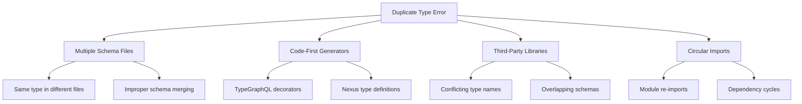
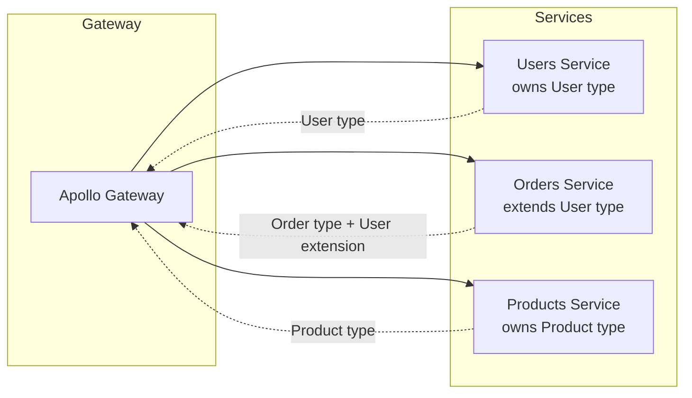

# How to Fix 'Duplicate Type' Errors in GraphQL Schema

Author: [nawazdhandala](https://github.com/nawazdhandala)

Tags: GraphQL, API Development, Schema Design, Debugging, Node.js, TypeScript

Description: Learn how to identify and resolve duplicate type definition errors in GraphQL schemas, including strategies for schema merging, modular design, and naming conventions.

---

Duplicate type errors in GraphQL occur when the same type name is defined more than once during schema construction. This commonly happens when merging multiple schema files, using code-first approaches with multiple modules, or when dependencies define conflicting types.

## Understanding the Error

When GraphQL encounters duplicate types, you will see errors like:

```
Error: Schema must contain uniquely named types but contains multiple types named "User".
```

Or with Apollo Server:

```
Error: Type "Product" was defined more than once.
```

These errors prevent your server from starting and must be resolved before your API can function.

## Common Causes



## Solution 1: Schema Merging with graphql-tools

When combining multiple schema files, use `mergeTypeDefs` from `@graphql-tools/merge` to properly handle type definitions.

### Incorrect Approach

```javascript
// This causes duplicate type errors if types overlap
const { makeExecutableSchema } = require('@graphql-tools/schema');

// Each file might define the same Query or Mutation type
const typeDefs = [
  require('./user.graphql'),
  require('./product.graphql'),
  require('./order.graphql'),
];

// Error: Query type defined multiple times
const schema = makeExecutableSchema({ typeDefs });
```

### Correct Approach

```javascript
const { makeExecutableSchema } = require('@graphql-tools/schema');
const { mergeTypeDefs, mergeResolvers } = require('@graphql-tools/merge');
const { loadFilesSync } = require('@graphql-tools/load-files');
const path = require('path');

// Load all .graphql files from the schema directory
const typeDefsArray = loadFilesSync(
  path.join(__dirname, './schemas/**/*.graphql')
);

// Merge type definitions - this combines Query, Mutation, and Subscription
// types automatically and detects true duplicates
const mergedTypeDefs = mergeTypeDefs(typeDefsArray);

// Load and merge resolvers
const resolversArray = loadFilesSync(
  path.join(__dirname, './resolvers/**/*.js')
);
const mergedResolvers = mergeResolvers(resolversArray);

const schema = makeExecutableSchema({
  typeDefs: mergedTypeDefs,
  resolvers: mergedResolvers,
});

module.exports = schema;
```

## Solution 2: Extend Types Instead of Redefining

GraphQL allows you to extend existing types rather than redefining them. This is the proper way to add fields to Query, Mutation, or custom types across multiple files.

### Base Schema File

```graphql
# schemas/base.graphql
# Define the root types once
type Query {
  _empty: String
}

type Mutation {
  _empty: String
}

type Subscription {
  _empty: String
}
```

### User Module Schema

```graphql
# schemas/user.graphql
# Extend the root types - do not redefine them
extend type Query {
  user(id: ID!): User
  users(limit: Int, offset: Int): [User!]!
}

extend type Mutation {
  createUser(input: CreateUserInput!): User!
  updateUser(id: ID!, input: UpdateUserInput!): User
  deleteUser(id: ID!): Boolean!
}

# Define module-specific types
type User {
  id: ID!
  email: String!
  name: String!
  createdAt: DateTime!
}

input CreateUserInput {
  email: String!
  name: String!
  password: String!
}

input UpdateUserInput {
  email: String
  name: String
}
```

### Product Module Schema

```graphql
# schemas/product.graphql
extend type Query {
  product(id: ID!): Product
  products(category: String): [Product!]!
}

extend type Mutation {
  createProduct(input: CreateProductInput!): Product!
  updateProduct(id: ID!, input: UpdateProductInput!): Product
}

type Product {
  id: ID!
  name: String!
  price: Float!
  category: String!
}

input CreateProductInput {
  name: String!
  price: Float!
  category: String!
}

input UpdateProductInput {
  name: String
  price: Float
  category: String
}
```

## Solution 3: Code-First with TypeGraphQL

When using TypeGraphQL, duplicate types often occur from importing the same class in multiple places or defining resolvers incorrectly.

### Problematic Code

```typescript
// resolvers/UserResolver.ts
import { Resolver, Query, ObjectType, Field, ID } from 'type-graphql';

// Defining User type in the resolver file
@ObjectType()
class User {
  @Field(() => ID)
  id: string;

  @Field()
  email: string;
}

@Resolver()
export class UserResolver {
  @Query(() => [User])
  async users() {
    return [];
  }
}
```

```typescript
// resolvers/OrderResolver.ts
import { Resolver, Query, ObjectType, Field, ID } from 'type-graphql';

// Defining User AGAIN - this causes duplicate type error
@ObjectType()
class User {
  @Field(() => ID)
  id: string;

  @Field()
  email: string;
}

@ObjectType()
class Order {
  @Field(() => ID)
  id: string;

  @Field(() => User)
  user: User;
}

@Resolver()
export class OrderResolver {
  @Query(() => [Order])
  async orders() {
    return [];
  }
}
```

### Correct Approach - Shared Type Definitions

```typescript
// types/User.ts
import { ObjectType, Field, ID } from 'type-graphql';

// Define each type in its own file - single source of truth
@ObjectType({ description: 'User account information' })
export class User {
  @Field(() => ID)
  id: string;

  @Field()
  email: string;

  @Field()
  name: string;

  @Field()
  createdAt: Date;
}
```

```typescript
// types/Order.ts
import { ObjectType, Field, ID } from 'type-graphql';
import { User } from './User';

@ObjectType({ description: 'Customer order' })
export class Order {
  @Field(() => ID)
  id: string;

  @Field(() => User)
  user: User;

  @Field()
  total: number;

  @Field()
  status: string;
}
```

```typescript
// resolvers/UserResolver.ts
import { Resolver, Query, Arg, Mutation } from 'type-graphql';
import { User } from '../types/User';

@Resolver(() => User)
export class UserResolver {
  @Query(() => [User])
  async users(): Promise<User[]> {
    // Implementation
    return [];
  }

  @Query(() => User, { nullable: true })
  async user(@Arg('id') id: string): Promise<User | null> {
    // Implementation
    return null;
  }
}
```

```typescript
// resolvers/OrderResolver.ts
import { Resolver, Query, FieldResolver, Root } from 'type-graphql';
import { Order } from '../types/Order';
import { User } from '../types/User';

@Resolver(() => Order)
export class OrderResolver {
  @Query(() => [Order])
  async orders(): Promise<Order[]> {
    return [];
  }

  // Field resolver for the user relationship
  @FieldResolver(() => User)
  async user(@Root() order: Order): Promise<User> {
    // Load user for order
    return {} as User;
  }
}
```

```typescript
// schema/index.ts
import { buildSchema } from 'type-graphql';
import { UserResolver } from '../resolvers/UserResolver';
import { OrderResolver } from '../resolvers/OrderResolver';

export async function createSchema() {
  return buildSchema({
    resolvers: [UserResolver, OrderResolver],
    // Validate that no duplicate types exist
    validate: true,
  });
}
```

## Solution 4: Nexus Schema Approach

With Nexus, ensure each type is defined exactly once and exported from a central location.

```typescript
// schema/types/User.ts
import { objectType, inputObjectType } from 'nexus';

// Define the User type once
export const User = objectType({
  name: 'User',
  definition(t) {
    t.nonNull.id('id');
    t.nonNull.string('email');
    t.nonNull.string('name');
    t.nonNull.field('createdAt', { type: 'DateTime' });
  },
});

export const CreateUserInput = inputObjectType({
  name: 'CreateUserInput',
  definition(t) {
    t.nonNull.string('email');
    t.nonNull.string('name');
    t.nonNull.string('password');
  },
});
```

```typescript
// schema/types/index.ts
// Export all types from a single entry point
export * from './User';
export * from './Product';
export * from './Order';
```

```typescript
// schema/index.ts
import { makeSchema } from 'nexus';
import { join } from 'path';
import * as types from './types';

export const schema = makeSchema({
  // Pass all types as a single object - Nexus detects duplicates
  types,
  outputs: {
    schema: join(__dirname, '../generated/schema.graphql'),
    typegen: join(__dirname, '../generated/nexus.ts'),
  },
});
```

## Solution 5: Handling Third-Party Type Conflicts

When integrating third-party GraphQL schemas that define conflicting types, use schema stitching with type renaming.

```typescript
import { stitchSchemas } from '@graphql-tools/stitch';
import { RenameTypes } from '@graphql-tools/wrap';

// External schema defines a "User" type
import { externalSchema } from './external-service';
// Your schema also defines a "User" type
import { localSchema } from './local-schema';

const stitchedSchema = stitchSchemas({
  subschemas: [
    {
      schema: externalSchema,
      // Rename conflicting types from external schema
      transforms: [
        new RenameTypes((name) => {
          // Prefix external types to avoid conflicts
          if (name === 'User') return 'ExternalUser';
          if (name === 'Product') return 'ExternalProduct';
          return name;
        }),
      ],
    },
    {
      schema: localSchema,
      // Local schema types keep their original names
    },
  ],
});
```

## Solution 6: Apollo Federation Approach

For microservices, Apollo Federation handles type ownership and extension across services.

```graphql
# users-service/schema.graphql
# This service owns the User type
type User @key(fields: "id") {
  id: ID!
  email: String!
  name: String!
}

type Query {
  user(id: ID!): User
  users: [User!]!
}
```

```graphql
# orders-service/schema.graphql
# This service extends User from users-service
extend type User @key(fields: "id") {
  id: ID! @external
  orders: [Order!]!
}

type Order @key(fields: "id") {
  id: ID!
  userId: ID!
  user: User!
  total: Float!
}

type Query {
  order(id: ID!): Order
  orders(userId: ID): [Order!]!
}
```



## Debugging Duplicate Types

Use this utility to identify duplicate types in your schema:

```typescript
import { parse, DocumentNode, DefinitionNode, TypeDefinitionNode } from 'graphql';

function findDuplicateTypes(typeDefs: DocumentNode[]): Map<string, string[]> {
  const typeLocations = new Map<string, string[]>();

  typeDefs.forEach((doc, index) => {
    doc.definitions.forEach((def: DefinitionNode) => {
      // Check if this is a type definition (not an extension)
      if (
        def.kind === 'ObjectTypeDefinition' ||
        def.kind === 'InputObjectTypeDefinition' ||
        def.kind === 'EnumTypeDefinition' ||
        def.kind === 'InterfaceTypeDefinition' ||
        def.kind === 'UnionTypeDefinition' ||
        def.kind === 'ScalarTypeDefinition'
      ) {
        const typeName = (def as TypeDefinitionNode).name.value;
        const locations = typeLocations.get(typeName) || [];
        locations.push(`Document ${index}`);
        typeLocations.set(typeName, locations);
      }
    });
  });

  // Filter to only duplicates
  const duplicates = new Map<string, string[]>();
  typeLocations.forEach((locations, typeName) => {
    if (locations.length > 1) {
      duplicates.set(typeName, locations);
    }
  });

  return duplicates;
}

// Usage
const schemas = [
  parse(userSchema),
  parse(productSchema),
  parse(orderSchema),
];

const duplicates = findDuplicateTypes(schemas);
if (duplicates.size > 0) {
  console.error('Duplicate types found:');
  duplicates.forEach((locations, typeName) => {
    console.error(`  ${typeName}: defined in ${locations.join(', ')}`);
  });
}
```

## Best Practices Summary

| Practice | Description |
|----------|-------------|
| **Single source of truth** | Define each type in exactly one file |
| **Use extend keyword** | Extend Query/Mutation instead of redefining |
| **Centralized exports** | Export all types from an index file |
| **Namespace third-party types** | Rename external types to avoid conflicts |
| **Use Federation for microservices** | Let each service own its types |
| **Automated validation** | Check for duplicates during build |

## Project Structure

```
src/
  schema/
    types/
      User.ts         # User type definition
      Product.ts      # Product type definition
      Order.ts        # Order type definition
      index.ts        # Re-exports all types
    resolvers/
      UserResolver.ts
      ProductResolver.ts
      OrderResolver.ts
      index.ts        # Re-exports all resolvers
    scalars/
      DateTime.ts     # Custom scalar definitions
    index.ts          # Schema builder
  index.ts            # Server entry point
```

Duplicate type errors are straightforward to fix once you understand the cause. The key is maintaining a single definition for each type and using GraphQL's extension mechanism when you need to add fields across multiple files or modules.
