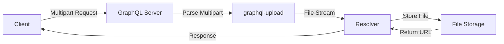
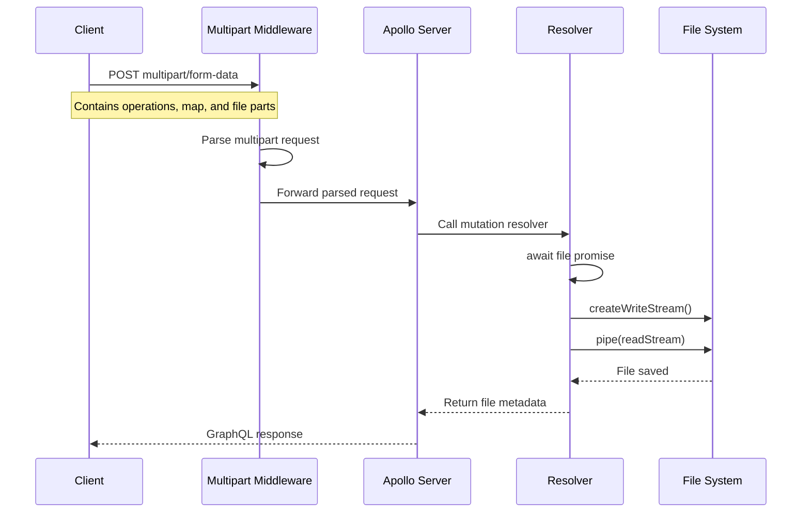

# How to Handle File Uploads in GraphQL

Author: [nawazdhandala](https://www.github.com/nawazdhandala)

Tags: GraphQL, File Upload, API Development, Node.js, Apollo Server

Description: Learn how to implement file uploads in GraphQL APIs using the graphql-upload package with Apollo Server, including single and multiple file handling.

---

File uploads are a common requirement in modern web applications, but GraphQL does not natively support file uploads in its specification. This guide will walk you through implementing file uploads in your GraphQL API using the popular `graphql-upload` package with Apollo Server.

## Understanding the Challenge

GraphQL uses JSON for request and response payloads, which cannot natively handle binary file data. To solve this, the community developed the GraphQL multipart request specification, which allows files to be uploaded alongside GraphQL operations.



## Setting Up the Dependencies

First, install the required packages for your Node.js GraphQL server.

```bash
# Install Apollo Server and graphql-upload packages
# graphql-upload handles multipart form data parsing
npm install @apollo/server graphql graphql-upload
npm install --save-dev @types/graphql-upload
```

## Configuring Apollo Server for File Uploads

You need to configure Apollo Server to handle multipart requests. Here is how to set it up with Express.

```javascript
// server.js - Main server configuration
import express from 'express';
import { ApolloServer } from '@apollo/server';
import { expressMiddleware } from '@apollo/server/express4';
import graphqlUploadExpress from 'graphql-upload/graphqlUploadExpress.mjs';
import { typeDefs, resolvers } from './schema.js';

// Create Express application
const app = express();

// Create Apollo Server instance
const server = new ApolloServer({
  typeDefs,
  resolvers,
});

// Start the Apollo Server
await server.start();

// Apply the graphql-upload middleware BEFORE Apollo middleware
// This middleware parses multipart form data and extracts files
// maxFileSize: Maximum file size in bytes (10 MB in this example)
// maxFiles: Maximum number of files per request
app.use(
  '/graphql',
  graphqlUploadExpress({ maxFileSize: 10000000, maxFiles: 10 }),
  express.json(),
  expressMiddleware(server)
);

// Start the Express server
app.listen(4000, () => {
  console.log('Server running at http://localhost:4000/graphql');
});
```

## Defining the GraphQL Schema

Create your schema with the Upload scalar type and mutations for file uploads.

```graphql
# schema.graphql - Type definitions for file uploads

# The Upload scalar is provided by graphql-upload
# It represents a file upload and resolves to a promise
scalar Upload

# Type representing the result of a file upload
type File {
  # The original filename from the client
  filename: String!
  # The MIME type of the uploaded file
  mimetype: String!
  # The file encoding (e.g., 7bit, utf-8)
  encoding: String!
  # The URL where the file can be accessed after upload
  url: String!
}

type Query {
  # Placeholder query - GraphQL requires at least one query
  files: [File]
}

type Mutation {
  # Upload a single file
  # Returns the uploaded file metadata
  singleUpload(file: Upload!): File!

  # Upload multiple files at once
  # Returns an array of uploaded file metadata
  multipleUpload(files: [Upload!]!): [File!]!

  # Upload a file with additional metadata
  # Useful when you need to associate files with other data
  uploadWithMetadata(
    file: Upload!
    description: String!
    category: String!
  ): File!
}
```

## Implementing the Resolvers

Here is how to implement resolvers that handle the file streams.

```javascript
// resolvers.js - File upload resolver implementations
import { createWriteStream, existsSync, mkdirSync } from 'fs';
import path from 'path';
import { finished } from 'stream/promises';
import GraphQLUpload from 'graphql-upload/GraphQLUpload.mjs';

// Ensure the uploads directory exists
const uploadDir = './uploads';
if (!existsSync(uploadDir)) {
  mkdirSync(uploadDir, { recursive: true });
}

// Helper function to process a single file upload
// This creates a unique filename and streams the file to disk
async function processUpload(upload) {
  // The upload argument is a promise that resolves to file data
  const { createReadStream, filename, mimetype, encoding } = await upload;

  // Generate a unique filename to prevent overwrites
  // Using timestamp prefix ensures uniqueness
  const uniqueFilename = `${Date.now()}-${filename}`;
  const filePath = path.join(uploadDir, uniqueFilename);

  // Create a write stream to save the file
  const writeStream = createWriteStream(filePath);

  // Pipe the upload stream to the file system
  // createReadStream() returns a Node.js readable stream
  const readStream = createReadStream();
  readStream.pipe(writeStream);

  // Wait for the stream to finish writing
  // This ensures the file is completely saved before returning
  await finished(writeStream);

  // Return file metadata including the access URL
  return {
    filename,
    mimetype,
    encoding,
    url: `/uploads/${uniqueFilename}`,
  };
}

export const resolvers = {
  // Map the Upload scalar to the graphql-upload implementation
  // This enables the Upload type in the schema
  Upload: GraphQLUpload,

  Query: {
    // Placeholder resolver
    files: () => [],
  },

  Mutation: {
    // Single file upload resolver
    // Receives the file from the Upload scalar
    singleUpload: async (_, { file }) => {
      return processUpload(file);
    },

    // Multiple file upload resolver
    // Processes all files concurrently using Promise.all
    multipleUpload: async (_, { files }) => {
      // Process all files in parallel for better performance
      const results = await Promise.all(
        files.map(file => processUpload(file))
      );
      return results;
    },

    // Upload with additional metadata
    // Demonstrates combining file upload with other input data
    uploadWithMetadata: async (_, { file, description, category }) => {
      const uploadedFile = await processUpload(file);

      // Here you could save metadata to a database
      // For example: await db.files.create({ ...uploadedFile, description, category })
      console.log(`Uploaded file in category: ${category}`);
      console.log(`Description: ${description}`);

      return uploadedFile;
    },
  },
};
```

## File Upload Flow Diagram

Understanding the complete flow helps debug issues when they arise.



## Client-Side Implementation

Here is how to send file uploads from the client using Apollo Client.

```javascript
// client.js - Apollo Client configuration for file uploads
import { ApolloClient, InMemoryCache } from '@apollo/client';
import { createUploadLink } from 'apollo-upload-client';

// Create an upload link instead of the standard HTTP link
// This link handles multipart form data for file uploads
const uploadLink = createUploadLink({
  uri: 'http://localhost:4000/graphql',
});

// Create the Apollo Client with the upload link
const client = new ApolloClient({
  link: uploadLink,
  cache: new InMemoryCache(),
});

export default client;
```

Here is a React component that handles file uploads.

```jsx
// FileUpload.jsx - React component for file uploads
import { useMutation, gql } from '@apollo/client';
import { useState } from 'react';

// Define the upload mutation
// The $file variable uses the Upload scalar type
const UPLOAD_FILE = gql`
  mutation SingleUpload($file: Upload!) {
    singleUpload(file: $file) {
      filename
      mimetype
      url
    }
  }
`;

function FileUpload() {
  const [selectedFile, setSelectedFile] = useState(null);

  // useMutation hook for the upload operation
  // loading: true while upload is in progress
  // error: contains any error that occurred
  const [uploadFile, { loading, error }] = useMutation(UPLOAD_FILE);

  // Handle file selection from input
  const handleFileChange = (event) => {
    // Get the first selected file
    const file = event.target.files[0];
    setSelectedFile(file);
  };

  // Handle the upload submission
  const handleUpload = async () => {
    if (!selectedFile) {
      alert('Please select a file first');
      return;
    }

    try {
      // Call the mutation with the file
      // Apollo Upload Client automatically handles the multipart encoding
      const { data } = await uploadFile({
        variables: { file: selectedFile },
      });

      console.log('Upload successful:', data.singleUpload);
      alert(`File uploaded: ${data.singleUpload.url}`);
    } catch (err) {
      console.error('Upload failed:', err);
    }
  };

  return (
    <div>
      <h2>Upload a File</h2>
      {/* File input for selecting files */}
      <input
        type="file"
        onChange={handleFileChange}
        disabled={loading}
      />

      {/* Upload button */}
      <button onClick={handleUpload} disabled={loading || !selectedFile}>
        {loading ? 'Uploading...' : 'Upload'}
      </button>

      {/* Display any errors */}
      {error && <p style={{ color: 'red' }}>Error: {error.message}</p>}
    </div>
  );
}

export default FileUpload;
```

## Uploading to Cloud Storage

In production, you typically want to upload files to cloud storage like AWS S3.

```javascript
// s3-upload.js - Upload files to AWS S3
import { S3Client, PutObjectCommand } from '@aws-sdk/client-s3';
import { v4 as uuidv4 } from 'uuid';

// Initialize the S3 client
// Credentials are loaded from environment variables or IAM role
const s3Client = new S3Client({
  region: process.env.AWS_REGION,
});

// Process upload and store in S3
async function uploadToS3(upload) {
  const { createReadStream, filename, mimetype, encoding } = await upload;

  // Generate a unique key for the S3 object
  // Using UUID prevents filename collisions
  const key = `uploads/${uuidv4()}-${filename}`;

  // Convert the stream to a buffer for S3 upload
  // S3 SDK v3 requires a buffer or stream
  const chunks = [];
  const stream = createReadStream();

  for await (const chunk of stream) {
    chunks.push(chunk);
  }
  const buffer = Buffer.concat(chunks);

  // Upload to S3
  const command = new PutObjectCommand({
    Bucket: process.env.S3_BUCKET,
    Key: key,
    Body: buffer,
    ContentType: mimetype,
    // Make the file publicly readable (optional)
    ACL: 'public-read',
  });

  await s3Client.send(command);

  // Construct the public URL for the uploaded file
  const url = `https://${process.env.S3_BUCKET}.s3.${process.env.AWS_REGION}.amazonaws.com/${key}`;

  return {
    filename,
    mimetype,
    encoding,
    url,
  };
}

export { uploadToS3 };
```

## Handling Upload Validation

Always validate uploads to ensure security and proper file handling.

```javascript
// validation.js - File upload validation utilities

// Allowed MIME types for image uploads
const ALLOWED_IMAGE_TYPES = [
  'image/jpeg',
  'image/png',
  'image/gif',
  'image/webp',
];

// Maximum file size in bytes (5 MB)
const MAX_FILE_SIZE = 5 * 1024 * 1024;

// Validate a file upload before processing
async function validateUpload(upload, options = {}) {
  const { createReadStream, filename, mimetype } = await upload;

  const {
    allowedTypes = ALLOWED_IMAGE_TYPES,
    maxSize = MAX_FILE_SIZE,
  } = options;

  // Check MIME type
  if (!allowedTypes.includes(mimetype)) {
    throw new Error(
      `Invalid file type: ${mimetype}. Allowed types: ${allowedTypes.join(', ')}`
    );
  }

  // Check file size by reading the stream
  // This is necessary because we do not know the size upfront
  const chunks = [];
  let totalSize = 0;

  for await (const chunk of createReadStream()) {
    totalSize += chunk.length;

    // Stop early if file exceeds maximum size
    if (totalSize > maxSize) {
      throw new Error(
        `File too large. Maximum size is ${maxSize / (1024 * 1024)} MB`
      );
    }

    chunks.push(chunk);
  }

  // Return the buffer for further processing
  return {
    filename,
    mimetype,
    buffer: Buffer.concat(chunks),
    size: totalSize,
  };
}

export { validateUpload, ALLOWED_IMAGE_TYPES, MAX_FILE_SIZE };
```

## Error Handling Best Practices

Implement proper error handling to provide meaningful feedback to clients.

```javascript
// error-handling.js - Upload error handling

// Custom error class for upload-related errors
class UploadError extends Error {
  constructor(message, code) {
    super(message);
    this.name = 'UploadError';
    this.code = code;
  }
}

// Error codes for different upload failures
const UPLOAD_ERROR_CODES = {
  FILE_TOO_LARGE: 'FILE_TOO_LARGE',
  INVALID_TYPE: 'INVALID_TYPE',
  UPLOAD_FAILED: 'UPLOAD_FAILED',
  STORAGE_ERROR: 'STORAGE_ERROR',
};

// Wrapper for upload operations with error handling
async function safeUpload(uploadFn, file) {
  try {
    return await uploadFn(file);
  } catch (error) {
    // Log the error for debugging
    console.error('Upload error:', error);

    // Transform errors into user-friendly messages
    if (error.message.includes('too large')) {
      throw new UploadError(
        'The file you selected is too large. Please choose a smaller file.',
        UPLOAD_ERROR_CODES.FILE_TOO_LARGE
      );
    }

    if (error.message.includes('Invalid file type')) {
      throw new UploadError(
        'This file type is not supported. Please upload an image file.',
        UPLOAD_ERROR_CODES.INVALID_TYPE
      );
    }

    // Generic error for unexpected failures
    throw new UploadError(
      'Failed to upload the file. Please try again.',
      UPLOAD_ERROR_CODES.UPLOAD_FAILED
    );
  }
}

export { UploadError, UPLOAD_ERROR_CODES, safeUpload };
```

## Summary

Implementing file uploads in GraphQL requires:

1. Using the `graphql-upload` package to handle multipart requests
2. Defining the Upload scalar in your schema
3. Creating resolvers that process file streams
4. Configuring clients with `apollo-upload-client`
5. Implementing proper validation and error handling

By following these patterns, you can build robust file upload functionality in your GraphQL API while maintaining security and performance.

**Related Reading:**

- [How to Fix "Maximum Query Depth" Errors in GraphQL](https://oneuptime.com/blog/post/2026-01-24-graphql-maximum-query-depth/view)
- [How to Configure GraphQL Subscriptions with WebSockets](https://oneuptime.com/blog/post/2026-01-24-graphql-subscriptions-websockets/view)
- [How to Handle Pagination in GraphQL APIs](https://oneuptime.com/blog/post/2026-01-24-graphql-pagination/view)
