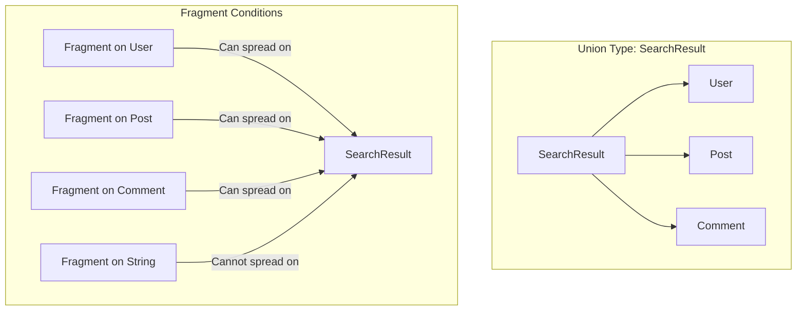
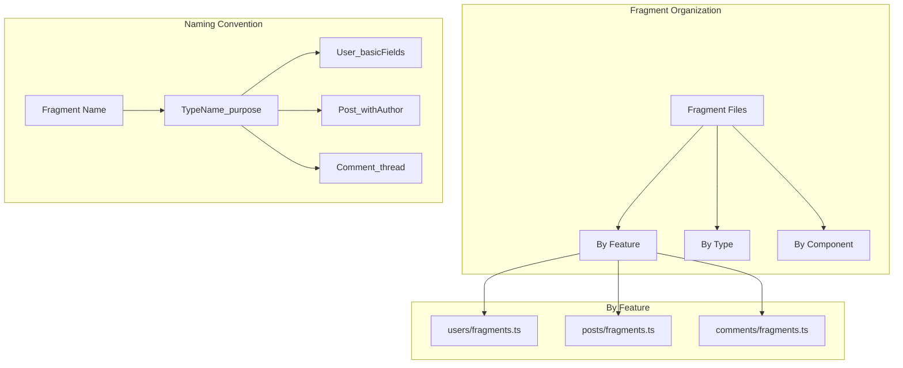

# How to Fix "Fragment Spread" Errors in GraphQL

Author: [nawazdhandala](https://www.github.com/nawazdhandala)

Tags: GraphQL, Fragments, Error Handling, Schema Design, Query Optimization, TypeScript

Description: Learn how to diagnose and fix common fragment spread errors in GraphQL including type mismatches, circular references, and undefined fragments.

---

Fragments in GraphQL provide a powerful way to share field selections across queries. However, they can lead to confusing errors when used incorrectly. Fragment spread errors occur when there are type mismatches, undefined references, circular dependencies, or invalid fragment conditions.

This guide covers the most common fragment spread errors and provides practical solutions for each scenario.

## Understanding Fragment Spread Flow

Fragments spread fields into selections based on type conditions. Here is how the spreading works.

```mermaid
flowchart TD
    subgraph "Fragment Definition"
        A[fragment UserFields on User] --> B[id, name, email]
    end

    subgraph "Query with Fragment Spread"
        C[query GetUsers] --> D[users]
        D --> E[...UserFields]
    end

    subgraph "Fragment Spreading"
        E --> F{Type Check}
        F -->|User type matches| G[Spread fields: id, name, email]
        F -->|Type mismatch| H[Error: Fragment cannot be spread]
    end

    subgraph "Final Selection"
        G --> I[users { id, name, email }]
    end
```

## Error 1: Fragment Cannot Be Spread Here

This error occurs when a fragment is spread on an incompatible type.

```graphql
# Schema
type User {
  id: ID!
  name: String!
  email: String!
}

type Post {
  id: ID!
  title: String!
  content: String!
  author: User!
}

type Query {
  posts: [Post!]!
}
```

```graphql
# BAD: Fragment defined on User but spread on Post
fragment UserFields on User {
  id
  name
  email
}

query GetPosts {
  posts {
    id
    title
    # ERROR: Fragment "UserFields" cannot be spread here as objects of type "Post"
    # can never be of type "User"
    ...UserFields
  }
}
```

```graphql
# GOOD: Spread fragment on correct type
fragment UserFields on User {
  id
  name
  email
}

query GetPosts {
  posts {
    id
    title
    author {
      # Fragment spread on User type - this works
      ...UserFields
    }
  }
}
```

## Error 2: Unknown Fragment

This error occurs when referencing a fragment that does not exist.

```graphql
# BAD: Fragment "UserDetails" is not defined
query GetUser($id: ID!) {
  user(id: $id) {
    # ERROR: Unknown fragment "UserDetails"
    ...UserDetails
  }
}
```

```typescript
// Common causes and solutions in Apollo Client

// BAD: Fragment defined in separate file but not imported
// queries/getUser.ts
import { gql } from '@apollo/client';

export const GET_USER = gql`
  query GetUser($id: ID!) {
    user(id: $id) {
      ...UserDetails  # Fragment not defined!
    }
  }
`;
```

```typescript
// GOOD: Import and include the fragment definition
// fragments/userFragments.ts
import { gql } from '@apollo/client';

export const USER_DETAILS_FRAGMENT = gql`
  fragment UserDetails on User {
    id
    name
    email
    avatarUrl
    createdAt
  }
`;

// queries/getUser.ts
import { gql } from '@apollo/client';
import { USER_DETAILS_FRAGMENT } from '../fragments/userFragments';

export const GET_USER = gql`
  ${USER_DETAILS_FRAGMENT}
  query GetUser($id: ID!) {
    user(id: $id) {
      ...UserDetails
    }
  }
`;
```

## Error 3: Fragment Spread on Union/Interface Types

When working with unions and interfaces, fragments need special handling.



```graphql
# Schema with union type
union SearchResult = User | Post | Comment

type Query {
  search(query: String!): [SearchResult!]!
}
```

```graphql
# BAD: Incomplete handling of union types
query Search($query: String!) {
  search(query: $query) {
    # ERROR: Cannot query field "title" on type "SearchResult"
    # SearchResult is a union and some members don't have "title"
    title
  }
}
```

```graphql
# GOOD: Use inline fragments or type-specific fragments for unions
fragment UserResult on User {
  id
  name
  email
}

fragment PostResult on Post {
  id
  title
  content
}

fragment CommentResult on Comment {
  id
  text
  createdAt
}

query Search($query: String!) {
  search(query: $query) {
    # Use __typename to identify the actual type
    __typename

    # Spread type-specific fragments
    ...UserResult
    ...PostResult
    ...CommentResult
  }
}
```

```graphql
# Alternative: Use inline fragments directly
query Search($query: String!) {
  search(query: $query) {
    __typename

    ... on User {
      id
      name
      email
    }

    ... on Post {
      id
      title
      content
    }

    ... on Comment {
      id
      text
      createdAt
    }
  }
}
```

## Error 4: Circular Fragment References

Circular references between fragments cause infinite expansion errors.

```graphql
# BAD: Circular fragment reference
fragment UserWithPosts on User {
  id
  name
  posts {
    # This fragment references PostWithAuthor
    ...PostWithAuthor
  }
}

fragment PostWithAuthor on Post {
  id
  title
  author {
    # This references UserWithPosts - CIRCULAR!
    # ERROR: Cannot spread fragment "UserWithPosts" within itself via "PostWithAuthor"
    ...UserWithPosts
  }
}

query GetUser($id: ID!) {
  user(id: $id) {
    ...UserWithPosts
  }
}
```

```graphql
# GOOD: Break the cycle with limited depth
fragment UserBasic on User {
  id
  name
  email
}

fragment PostBasic on Post {
  id
  title
  content
}

fragment UserWithPosts on User {
  ...UserBasic
  posts {
    ...PostBasic
    author {
      # Use basic fragment to prevent recursion
      ...UserBasic
    }
  }
}

query GetUser($id: ID!) {
  user(id: $id) {
    ...UserWithPosts
  }
}
```

```typescript
// For deeply nested data, implement manual depth control
// utils/fragmentBuilder.ts

// Build a fragment with controlled depth
export function buildUserFragment(depth: number): string {
  if (depth <= 0) {
    return `
      fragment UserLevel0 on User {
        id
        name
      }
    `;
  }

  const prevFragmentName = depth === 1 ? 'UserLevel0' : `UserLevel${depth - 1}`;

  return `
    ${buildUserFragment(depth - 1)}

    fragment UserLevel${depth} on User {
      id
      name
      email
      posts {
        id
        title
        author {
          ...${prevFragmentName}
        }
      }
    }
  `;
}

// Usage: Generate fragment with max depth of 2
const fragmentDef = buildUserFragment(2);
```

## Error 5: Fragment on Non-Composite Type

Fragments can only be defined on composite types (objects, interfaces, unions).

```graphql
# BAD: Fragment on scalar type
# ERROR: Fragment cannot condition on non-composite type "String"
fragment NameFields on String {
  length
}
```

```graphql
# BAD: Fragment on enum
enum UserRole {
  ADMIN
  USER
  GUEST
}

# ERROR: Fragment cannot condition on non-composite type "UserRole"
fragment RoleFields on UserRole {
  description
}
```

```graphql
# GOOD: Fragments work on object types
type UserRole {
  name: String!
  permissions: [String!]!
  description: String
}

fragment RoleFields on UserRole {
  name
  permissions
  description
}

type User {
  id: ID!
  name: String!
  role: UserRole!
}

query GetUser($id: ID!) {
  user(id: $id) {
    id
    name
    role {
      ...RoleFields
    }
  }
}
```

## Error 6: Duplicate Fragment Names

Each fragment must have a unique name within a document.

```graphql
# BAD: Duplicate fragment names
fragment UserFields on User {
  id
  name
}

# ERROR: There can be only one fragment named "UserFields"
fragment UserFields on User {
  id
  email
}
```

```typescript
// Common issue: Multiple files defining same fragment name

// file1.ts
export const USER_FRAGMENT = gql`
  fragment UserFields on User {
    id
    name
  }
`;

// file2.ts - Different definition with same name!
export const USER_FRAGMENT = gql`
  fragment UserFields on User {
    id
    email
    avatarUrl
  }
`;

// When both are imported, you get duplicate fragment errors
```

```typescript
// GOOD: Use unique, descriptive fragment names

// fragments/user/basicFields.ts
export const USER_BASIC_FIELDS = gql`
  fragment UserBasicFields on User {
    id
    name
  }
`;

// fragments/user/profileFields.ts
export const USER_PROFILE_FIELDS = gql`
  fragment UserProfileFields on User {
    id
    name
    email
    avatarUrl
    bio
    createdAt
  }
`;

// fragments/user/contactFields.ts
export const USER_CONTACT_FIELDS = gql`
  fragment UserContactFields on User {
    email
    phone
    address {
      city
      country
    }
  }
`;

// Compose fragments as needed
export const USER_FULL_FIELDS = gql`
  ${USER_BASIC_FIELDS}
  ${USER_CONTACT_FIELDS}

  fragment UserFullFields on User {
    ...UserBasicFields
    ...UserContactFields
    role
    lastLoginAt
  }
`;
```

## Fragment Type Checking with TypeScript

Use code generation to catch fragment errors at compile time.

```typescript
// codegen.yml configuration for GraphQL Code Generator
// schema: './schema.graphql'
// documents: './src/**/*.graphql'
// generates:
//   ./src/generated/graphql.ts:
//     plugins:
//       - typescript
//       - typescript-operations
//       - typescript-react-apollo
//     config:
//       withHooks: true
//       withComponent: false
```

```typescript
// Generated types ensure type safety
// src/generated/graphql.ts (auto-generated)

export type UserFieldsFragment = {
  __typename?: 'User';
  id: string;
  name: string;
  email: string;
};

export type PostFieldsFragment = {
  __typename?: 'Post';
  id: string;
  title: string;
  author: UserFieldsFragment;
};
```

```typescript
// Using generated fragment types in components
import { UserFieldsFragment, PostFieldsFragment } from '../generated/graphql';

interface UserCardProps {
  // TypeScript will catch if wrong fragment type is passed
  user: UserFieldsFragment;
}

function UserCard({ user }: UserCardProps) {
  return (
    <div>
      <h2>{user.name}</h2>
      <p>{user.email}</p>
    </div>
  );
}

interface PostListProps {
  posts: PostFieldsFragment[];
}

function PostList({ posts }: PostListProps) {
  return (
    <ul>
      {posts.map(post => (
        <li key={post.id}>
          <h3>{post.title}</h3>
          {/* Author is typed as UserFieldsFragment */}
          <UserCard user={post.author} />
        </li>
      ))}
    </ul>
  );
}
```

## Fragment Masking Pattern

Apollo Client 3 supports fragment masking to ensure components only access their declared fields.

```typescript
// Using fragment masking with useFragment hook
import { useFragment, gql } from '@apollo/client';

// Define the fragment
const USER_CARD_FRAGMENT = gql`
  fragment UserCard_user on User {
    id
    name
    avatarUrl
  }
`;

// Parent query that includes the fragment
const GET_USERS = gql`
  ${USER_CARD_FRAGMENT}
  query GetUsers {
    users {
      ...UserCard_user
      # Additional fields used by parent
      email
      createdAt
    }
  }
`;

// Child component uses useFragment to access only its declared fields
interface UserCardProps {
  user: { __typename: 'User'; id: string };
}

function UserCard({ user }: UserCardProps) {
  // Only fields from UserCard_user fragment are accessible
  const { data } = useFragment({
    fragment: USER_CARD_FRAGMENT,
    from: user
  });

  return (
    <div>
      
      <span>{data.name}</span>
      {/* data.email would be undefined - not in fragment */}
    </div>
  );
}

// Parent component has access to all fields
function UserList() {
  const { data } = useQuery(GET_USERS);

  return (
    <ul>
      {data?.users.map(user => (
        <li key={user.id}>
          {/* Pass user reference to child */}
          <UserCard user={user} />
          {/* Parent can access email */}
          <span>{user.email}</span>
        </li>
      ))}
    </ul>
  );
}
```

## Debugging Fragment Spread Errors

Here is a systematic approach to debugging fragment issues.

```typescript
// Debug utility for fragment validation
import { parse, validate, TypeInfo, visitWithTypeInfo, visit } from 'graphql';

function debugFragmentSpreads(schema: GraphQLSchema, query: string) {
  // Parse the query
  const document = parse(query);

  // Validate against schema
  const errors = validate(schema, document);

  if (errors.length > 0) {
    console.error('Validation errors:');
    errors.forEach(error => {
      console.error(`- ${error.message}`);
      // Show location information
      error.locations?.forEach(loc => {
        console.error(`  at line ${loc.line}, column ${loc.column}`);
      });
    });
    return;
  }

  // Analyze fragment spreads
  const typeInfo = new TypeInfo(schema);
  const fragmentSpreads: Array<{
    fragmentName: string;
    parentType: string;
    location: { line: number; column: number };
  }> = [];

  visit(
    document,
    visitWithTypeInfo(typeInfo, {
      FragmentSpread(node) {
        const parentType = typeInfo.getParentType();
        fragmentSpreads.push({
          fragmentName: node.name.value,
          parentType: parentType?.name || 'unknown',
          location: node.loc
            ? { line: node.loc.startToken.line, column: node.loc.startToken.column }
            : { line: 0, column: 0 }
        });
      }
    })
  );

  console.log('Fragment spreads in query:');
  fragmentSpreads.forEach(spread => {
    console.log(
      `- ...${spread.fragmentName} on ${spread.parentType} ` +
        `(line ${spread.location.line})`
    );
  });
}

// Usage
const query = `
  fragment UserFields on User {
    id
    name
  }

  query GetPosts {
    posts {
      id
      ...UserFields
    }
  }
`;

debugFragmentSpreads(schema, query);
// Output:
// Validation errors:
// - Fragment "UserFields" cannot be spread here as objects of type "Post"
//   can never be of type "User"
//   at line 10, column 7
```

## Best Practices for Fragment Organization

Follow these guidelines to prevent fragment errors.



```typescript
// Recommended fragment organization structure

// src/graphql/fragments/index.ts
// Re-export all fragments from a central location
export * from './user';
export * from './post';
export * from './comment';

// src/graphql/fragments/user.ts
import { gql } from '@apollo/client';

// Basic user fields - minimal data
export const USER_BASIC = gql`
  fragment User_basic on User {
    id
    name
  }
`;

// User card - display in lists
export const USER_CARD = gql`
  fragment User_card on User {
    id
    name
    avatarUrl
  }
`;

// Full user profile
export const USER_PROFILE = gql`
  ${USER_BASIC}

  fragment User_profile on User {
    ...User_basic
    email
    bio
    website
    createdAt
    followerCount
    followingCount
  }
`;

// src/graphql/fragments/post.ts
import { gql } from '@apollo/client';
import { USER_CARD } from './user';

export const POST_BASIC = gql`
  fragment Post_basic on Post {
    id
    title
    excerpt
  }
`;

export const POST_WITH_AUTHOR = gql`
  ${POST_BASIC}
  ${USER_CARD}

  fragment Post_withAuthor on Post {
    ...Post_basic
    author {
      ...User_card
    }
  }
`;
```

## Summary

Fragment spread errors in GraphQL stem from a few common causes:

1. **Type mismatches**: Spreading fragments on incompatible types
2. **Missing definitions**: Referencing fragments that are not imported
3. **Circular references**: Fragments that reference each other
4. **Non-composite types**: Defining fragments on scalars or enums
5. **Duplicate names**: Multiple fragments with the same name

To prevent these errors:

- Use TypeScript with GraphQL Code Generator for compile-time checking
- Follow consistent naming conventions for fragments
- Organize fragments by feature or type
- Use fragment masking to ensure proper data access
- Break circular references with limited-depth fragments
- Always include `__typename` when working with unions/interfaces

With proper fragment organization and tooling, you can leverage the power of GraphQL fragments while avoiding common pitfalls.
