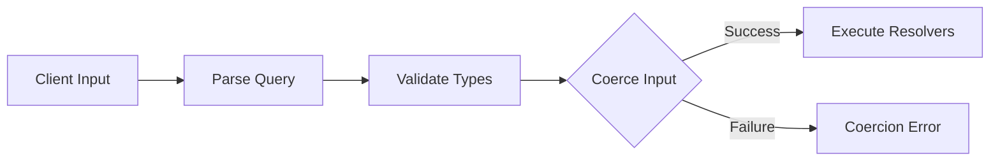
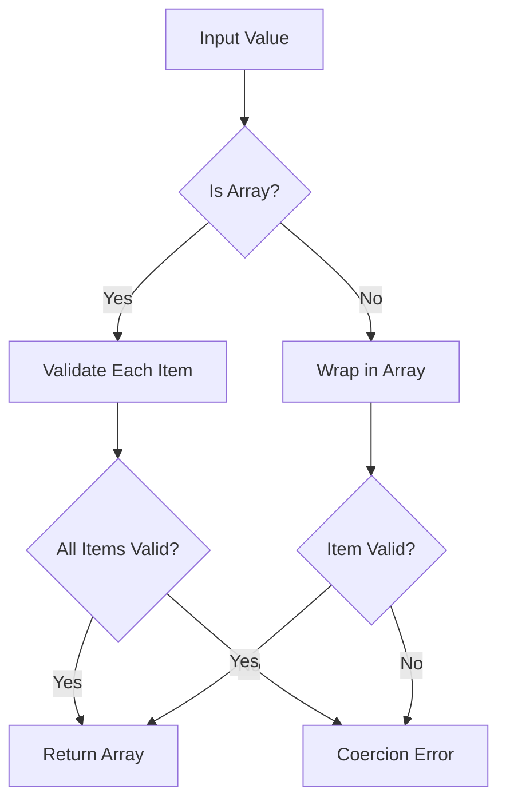
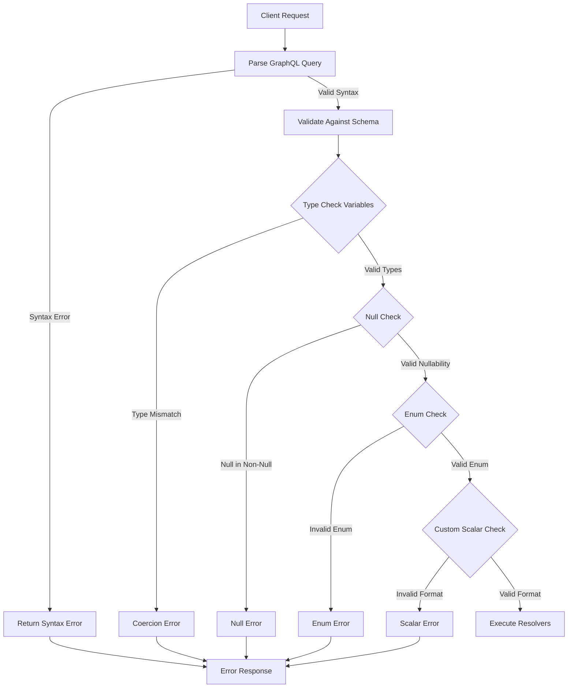

# How to Fix 'Input Coercion' Errors in GraphQL

Author: [nawazdhandala](https://www.github.com/nawazdhandala)

Tags: GraphQL, Error Handling, Input Validation, Schema Design, Backend, Node.js

Description: Learn how to diagnose and fix input coercion errors in GraphQL including type mismatches, null values, and custom scalar validation issues.

---

Input coercion errors in GraphQL occur when the data provided by a client does not match the expected type in your schema. These errors can be confusing because they happen during the parsing phase before your resolvers even execute. This guide explains why these errors occur and how to fix them.

## Understanding Input Coercion

GraphQL performs input coercion to convert client-provided values to the types expected by your schema. When this conversion fails, you get a coercion error.



Common coercion error messages:
- `Variable "$id" got invalid value`
- `Expected type "Int", found "string"`
- `Argument "input" of required type "CreateUserInput!" was not provided`
- `Expected type "DateTime", found "invalid date"`

## Error Type 1: Type Mismatch

The most common coercion error is sending the wrong type.

```graphql
# Schema expects Int
type Query {
  user(id: Int!): User
}

# Client sends a string instead of number
query {
  user(id: "123")  # Error: Expected type Int, found String
}
```

### Solution: Ensure Correct Types

```javascript
// BAD: Sending string when Int expected
const query = `
  query GetUser($id: Int!) {
    user(id: $id) { name }
  }
`;

// This will fail - "123" is a string
client.query({ query, variables: { id: "123" } });

// GOOD: Send correct type
client.query({ query, variables: { id: 123 } });

// Or parse on the client side
const userId = parseInt(userInput, 10);
if (isNaN(userId)) {
  throw new Error('User ID must be a number');
}
client.query({ query, variables: { id: userId } });
```

For IDs, consider using the `ID` scalar type which accepts both strings and integers:

```graphql
# Better: Use ID type for identifiers
type Query {
  user(id: ID!): User
}

# Now both work
query {
  user(id: "123")  # Works
  user(id: 123)    # Also works
}
```

## Error Type 2: Null in Non-Nullable Field

Providing null to a required field causes a coercion error.

```graphql
# Schema with required field
type Mutation {
  createUser(name: String!): User
}

# Client sends null
mutation {
  createUser(name: null)  # Error: Expected non-nullable type String!
}
```

### Solution: Validate Before Sending

```javascript
// Validate inputs before sending to GraphQL
function createUser(userData) {
  // Validate required fields
  if (!userData.name || userData.name.trim() === '') {
    throw new Error('Name is required');
  }

  return client.mutate({
    mutation: CREATE_USER,
    variables: {
      name: userData.name.trim(),
    },
  });
}

// On the server, handle optional fields properly
const typeDefs = gql`
  input CreateUserInput {
    name: String!           # Required
    email: String!          # Required
    nickname: String        # Optional (nullable)
    age: Int                # Optional (nullable)
  }

  type Mutation {
    createUser(input: CreateUserInput!): User
  }
`;

// Resolver handles optional fields
const resolvers = {
  Mutation: {
    createUser: async (_, { input }) => {
      return db.users.create({
        name: input.name,
        email: input.email,
        // Use nullish coalescing for optional fields
        nickname: input.nickname ?? null,
        age: input.age ?? null,
      });
    },
  },
};
```

## Error Type 3: Invalid Enum Value

Sending an undefined enum value causes a coercion error.

```graphql
# Schema with enum
enum UserRole {
  ADMIN
  USER
  MODERATOR
}

type Mutation {
  updateRole(userId: ID!, role: UserRole!): User
}

# Client sends invalid enum value
mutation {
  updateRole(userId: "1", role: "SUPERUSER")  # Error: Invalid enum value
}
```

### Solution: Validate Enum Values

```javascript
// Define valid enum values
const UserRole = {
  ADMIN: 'ADMIN',
  USER: 'USER',
  MODERATOR: 'MODERATOR',
};

// Validate before sending
function updateUserRole(userId, role) {
  const validRoles = Object.values(UserRole);

  if (!validRoles.includes(role)) {
    throw new Error(
      `Invalid role "${role}". Valid roles are: ${validRoles.join(', ')}`
    );
  }

  return client.mutate({
    mutation: UPDATE_ROLE,
    variables: { userId, role },
  });
}

// Server-side: Provide helpful error messages
const resolvers = {
  UserRole: {
    ADMIN: 'ADMIN',
    USER: 'USER',
    MODERATOR: 'MODERATOR',
  },
};
```

## Error Type 4: Custom Scalar Coercion

Custom scalars can fail coercion when values do not match the expected format.

```graphql
# Schema with custom scalar
scalar DateTime
scalar Email
scalar URL

type User {
  id: ID!
  email: Email!
  createdAt: DateTime!
  website: URL
}
```

### Solution: Implement Proper Scalar Coercion

```javascript
// datetime-scalar.js
import { GraphQLScalarType, Kind } from 'graphql';

// DateTime scalar with clear error messages
const DateTimeScalar = new GraphQLScalarType({
  name: 'DateTime',
  description: 'ISO-8601 formatted date-time string',

  // Convert outgoing value to string for response
  serialize(value) {
    if (value instanceof Date) {
      return value.toISOString();
    }
    if (typeof value === 'string') {
      const date = new Date(value);
      if (isNaN(date.getTime())) {
        throw new Error(`Invalid DateTime value: ${value}`);
      }
      return date.toISOString();
    }
    throw new Error(
      `DateTime cannot serialize non-date value: ${typeof value}`
    );
  },

  // Convert incoming value from variables
  parseValue(value) {
    if (typeof value !== 'string') {
      throw new Error(
        `DateTime must be a string, got: ${typeof value}`
      );
    }

    const date = new Date(value);
    if (isNaN(date.getTime())) {
      throw new Error(
        `Invalid DateTime format: "${value}". ` +
        `Expected ISO-8601 format like "2024-01-15T10:30:00Z"`
      );
    }

    return date;
  },

  // Convert incoming value from inline query
  parseLiteral(ast) {
    if (ast.kind !== Kind.STRING) {
      throw new Error(
        `DateTime must be a string literal, got: ${ast.kind}`
      );
    }

    const date = new Date(ast.value);
    if (isNaN(date.getTime())) {
      throw new Error(
        `Invalid DateTime format: "${ast.value}". ` +
        `Expected ISO-8601 format like "2024-01-15T10:30:00Z"`
      );
    }

    return date;
  },
});

// Email scalar with validation
const EmailScalar = new GraphQLScalarType({
  name: 'Email',
  description: 'Valid email address',

  serialize(value) {
    return String(value).toLowerCase();
  },

  parseValue(value) {
    if (typeof value !== 'string') {
      throw new Error(`Email must be a string, got: ${typeof value}`);
    }

    const emailRegex = /^[^\s@]+@[^\s@]+\.[^\s@]+$/;
    if (!emailRegex.test(value)) {
      throw new Error(
        `Invalid email format: "${value}". ` +
        `Expected format: user@example.com`
      );
    }

    return value.toLowerCase();
  },

  parseLiteral(ast) {
    if (ast.kind !== Kind.STRING) {
      throw new Error(`Email must be a string literal`);
    }
    return this.parseValue(ast.value);
  },
});

// URL scalar with validation
const URLScalar = new GraphQLScalarType({
  name: 'URL',
  description: 'Valid URL string',

  serialize(value) {
    return String(value);
  },

  parseValue(value) {
    if (typeof value !== 'string') {
      throw new Error(`URL must be a string, got: ${typeof value}`);
    }

    try {
      new URL(value);
      return value;
    } catch {
      throw new Error(
        `Invalid URL: "${value}". ` +
        `Expected format: https://example.com/path`
      );
    }
  },

  parseLiteral(ast) {
    if (ast.kind !== Kind.STRING) {
      throw new Error(`URL must be a string literal`);
    }
    return this.parseValue(ast.value);
  },
});

export { DateTimeScalar, EmailScalar, URLScalar };
```

Add custom scalars to your resolvers:

```javascript
// resolvers.js
import { DateTimeScalar, EmailScalar, URLScalar } from './scalars.js';

const resolvers = {
  // Register custom scalars
  DateTime: DateTimeScalar,
  Email: EmailScalar,
  URL: URLScalar,

  Query: {
    // ... your queries
  },
  Mutation: {
    // ... your mutations
  },
};
```

## Error Type 5: Input Object Validation

Input objects can have nested validation issues.

```graphql
# Complex input type
input CreatePostInput {
  title: String!
  content: String!
  tags: [String!]!
  publishAt: DateTime
  author: AuthorInput!
}

input AuthorInput {
  id: ID!
  name: String!
}
```

### Solution: Validate Nested Objects

```javascript
// input-validation.js

// Validate input object structure
function validateCreatePostInput(input) {
  const errors = [];

  // Required fields
  if (!input.title || typeof input.title !== 'string') {
    errors.push('title must be a non-empty string');
  } else if (input.title.length < 3) {
    errors.push('title must be at least 3 characters');
  }

  if (!input.content || typeof input.content !== 'string') {
    errors.push('content must be a non-empty string');
  }

  // Array validation
  if (!Array.isArray(input.tags)) {
    errors.push('tags must be an array');
  } else {
    input.tags.forEach((tag, index) => {
      if (typeof tag !== 'string' || tag.trim() === '') {
        errors.push(`tags[${index}] must be a non-empty string`);
      }
    });
  }

  // Nested object validation
  if (!input.author) {
    errors.push('author is required');
  } else {
    if (!input.author.id) {
      errors.push('author.id is required');
    }
    if (!input.author.name || typeof input.author.name !== 'string') {
      errors.push('author.name must be a non-empty string');
    }
  }

  // Optional field validation
  if (input.publishAt !== undefined && input.publishAt !== null) {
    const date = new Date(input.publishAt);
    if (isNaN(date.getTime())) {
      errors.push('publishAt must be a valid date');
    }
  }

  if (errors.length > 0) {
    throw new Error(`Invalid input: ${errors.join('; ')}`);
  }

  return input;
}

// Use in resolver
const resolvers = {
  Mutation: {
    createPost: async (_, { input }) => {
      // Additional validation beyond schema
      validateCreatePostInput(input);

      return db.posts.create(input);
    },
  },
};
```

## Error Type 6: List Coercion Issues

Lists have specific coercion rules that can cause errors.

```graphql
# Schema expecting list of IDs
type Query {
  users(ids: [ID!]!): [User!]!
}
```



### Solution: Handle List Inputs Properly

```javascript
// Client-side: Ensure arrays are properly formatted
function getUsers(ids) {
  // Handle single ID
  if (!Array.isArray(ids)) {
    ids = [ids];
  }

  // Filter out null/undefined values
  ids = ids.filter(id => id != null);

  if (ids.length === 0) {
    throw new Error('At least one ID is required');
  }

  // Ensure all IDs are strings
  ids = ids.map(id => String(id));

  return client.query({
    query: GET_USERS,
    variables: { ids },
  });
}

// Server-side: Handle edge cases
const resolvers = {
  Query: {
    users: async (_, { ids }) => {
      // GraphQL already coerced to array, but validate length
      if (ids.length === 0) {
        return [];
      }

      // Limit array size to prevent abuse
      if (ids.length > 100) {
        throw new Error('Maximum 100 IDs allowed per request');
      }

      return db.users.findByIds(ids);
    },
  },
};
```

## Debugging Coercion Errors

```javascript
// Enhanced error formatting for debugging
const server = new ApolloServer({
  typeDefs,
  resolvers,
  formatError: (error) => {
    // Log full error for debugging
    console.error('GraphQL Error:', {
      message: error.message,
      path: error.path,
      extensions: error.extensions,
      originalError: error.originalError,
    });

    // Check if it's a coercion error
    if (error.extensions?.code === 'BAD_USER_INPUT') {
      // Parse the error message to provide better feedback
      const match = error.message.match(
        /Variable "\$(\w+)" got invalid value (.+)/
      );

      if (match) {
        const [, variableName, invalidValue] = match;
        return {
          message: `Invalid value for ${variableName}`,
          extensions: {
            code: 'VALIDATION_ERROR',
            field: variableName,
            receivedValue: invalidValue,
            suggestion: getTypeSuggestion(variableName),
          },
        };
      }
    }

    // Return sanitized error for production
    return {
      message: error.message,
      path: error.path,
      extensions: {
        code: error.extensions?.code || 'INTERNAL_ERROR',
      },
    };
  },
});

// Provide helpful type suggestions
function getTypeSuggestion(fieldName) {
  const suggestions = {
    id: 'ID should be a string or integer',
    email: 'Email should be in format: user@example.com',
    date: 'Date should be in ISO-8601 format: 2024-01-15T10:30:00Z',
    role: 'Role should be one of: ADMIN, USER, MODERATOR',
  };

  return suggestions[fieldName.toLowerCase()] || 'Check the schema for expected type';
}
```

## Validation Flow Diagram



## Prevention Best Practices

### 1. Use TypeScript for Type Safety

```typescript
// types.ts
interface CreateUserInput {
  name: string;
  email: string;
  role: 'ADMIN' | 'USER' | 'MODERATOR';
  age?: number;
}

// Ensures type safety at compile time
function createUser(input: CreateUserInput) {
  return client.mutate({
    mutation: CREATE_USER,
    variables: { input },
  });
}
```

### 2. Implement Input Validation Directive

```javascript
// validation-directive.js
import { mapSchema, getDirective, MapperKind } from '@graphql-tools/utils';

const typeDefs = gql`
  directive @validate(
    min: Int
    max: Int
    pattern: String
    message: String
  ) on INPUT_FIELD_DEFINITION | ARGUMENT_DEFINITION

  input CreateUserInput {
    name: String! @validate(min: 2, max: 50, message: "Name must be 2-50 characters")
    email: String! @validate(pattern: "^[^@]+@[^@]+\\.[^@]+$", message: "Invalid email format")
    age: Int @validate(min: 0, max: 150, message: "Age must be between 0 and 150")
  }
`;

function validateDirective(schema) {
  return mapSchema(schema, {
    [MapperKind.INPUT_OBJECT_FIELD]: (fieldConfig) => {
      const directive = getDirective(schema, fieldConfig, 'validate')?.[0];
      if (!directive) return fieldConfig;

      const { min, max, pattern, message } = directive;

      // Store validation rules for runtime checking
      fieldConfig.extensions = {
        ...fieldConfig.extensions,
        validation: { min, max, pattern, message },
      };

      return fieldConfig;
    },
  });
}
```

### 3. Test Edge Cases

```javascript
// input-coercion.test.js
describe('Input Coercion', () => {
  it('should reject string for Int type', async () => {
    const result = await client.query({
      query: GET_USER,
      variables: { id: "not-a-number" },
    });

    expect(result.errors).toBeDefined();
    expect(result.errors[0].message).toContain('Expected type');
  });

  it('should reject null for non-nullable field', async () => {
    const result = await client.mutate({
      mutation: CREATE_USER,
      variables: { input: { name: null, email: 'test@example.com' } },
    });

    expect(result.errors).toBeDefined();
    expect(result.errors[0].message).toContain('non-nullable');
  });

  it('should reject invalid enum value', async () => {
    const result = await client.mutate({
      mutation: UPDATE_ROLE,
      variables: { userId: '1', role: 'INVALID_ROLE' },
    });

    expect(result.errors).toBeDefined();
    expect(result.errors[0].message).toContain('enum');
  });

  it('should accept valid custom scalar', async () => {
    const result = await client.query({
      query: GET_EVENTS,
      variables: { after: '2024-01-15T00:00:00Z' },
    });

    expect(result.errors).toBeUndefined();
  });
});
```

## Quick Reference: Common Fixes

| Error | Cause | Fix |
|-------|-------|-----|
| Expected Int, found String | Wrong variable type | Cast to number: `parseInt(value)` |
| Expected non-nullable | Null value provided | Add null check before sending |
| Invalid enum value | Undefined enum | Validate against allowed values |
| Invalid DateTime | Wrong date format | Use ISO-8601: `date.toISOString()` |
| Variable not provided | Missing required variable | Ensure all required vars are set |
| Expected list | Single value for array | Wrap in array: `[value]` |

---

Input coercion errors are GraphQL's way of enforcing type safety at the API boundary. By understanding how coercion works and implementing proper validation on both client and server, you can catch these errors early and provide helpful messages to API consumers. Use custom scalars with clear error messages, validate complex inputs before sending, and test edge cases to build robust GraphQL APIs.
