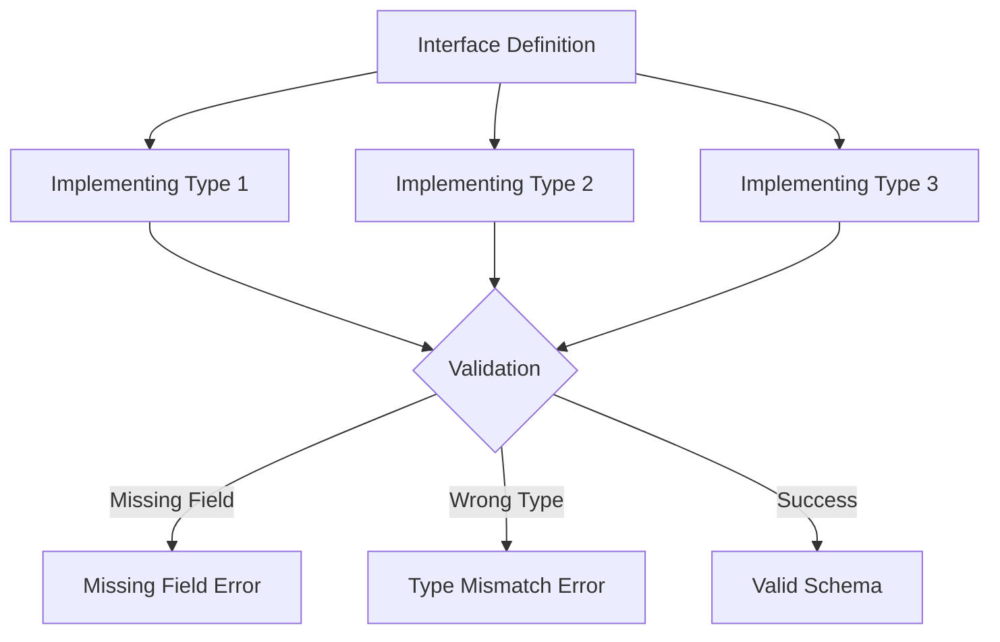
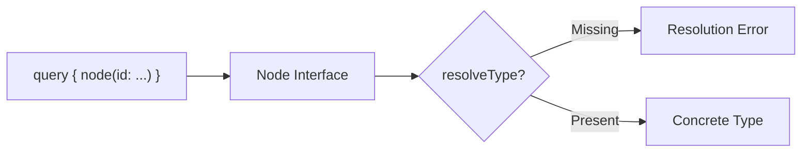
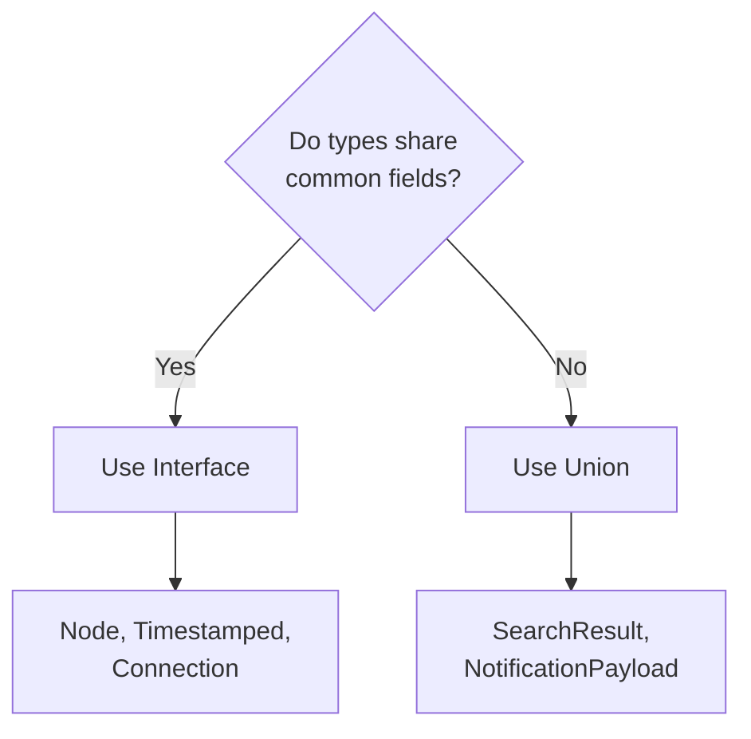

# How to Fix 'Interface Implementation' Errors in GraphQL

Author: [nawazdhandala](https://www.github.com/nawazdhandala)

Tags: GraphQL, Interfaces, Type System, API Development, Error Handling, Node.js, Backend Development

Description: Learn how to diagnose and fix common interface implementation errors in GraphQL, including missing fields, type mismatches, and resolver issues.

---

> GraphQL interfaces allow you to define shared fields across multiple types. However, improper implementation leads to confusing errors at schema build time or runtime. This guide covers common interface errors and their solutions.

Interfaces provide abstraction and type safety in GraphQL. Understanding how to implement them correctly is essential for building maintainable schemas.

---

## Overview



---

## Common Interface Errors

### Error 1: Missing Required Fields

**Error Message:**

```
Type "Post" must define field "createdAt" required by interface "Node".
```

**Problem Schema:**

```graphql
# Interface defines required fields
interface Node {
  id: ID!
  createdAt: DateTime!
  updatedAt: DateTime!
}

# Post is missing createdAt and updatedAt fields
type Post implements Node {
  id: ID!
  title: String!
  content: String!
  # Missing: createdAt and updatedAt
}
```

**Solution:**

```graphql
# GOOD: All interface fields are implemented
interface Node {
  id: ID!
  createdAt: DateTime!
  updatedAt: DateTime!
}

type Post implements Node {
  id: ID!
  createdAt: DateTime!
  updatedAt: DateTime!
  title: String!
  content: String!
  author: User!
}

type Comment implements Node {
  id: ID!
  createdAt: DateTime!
  updatedAt: DateTime!
  text: String!
  post: Post!
}
```

---

### Error 2: Field Type Mismatch

**Error Message:**

```
Interface field "Node.id" expects type "ID!" but "User.id" is type "String!".
```

**Problem:**

```graphql
interface Node {
  id: ID!
}

# Wrong: id is String! instead of ID!
type User implements Node {
  id: String!  # Should be ID!
  name: String!
}
```

**Solution:**

```graphql
interface Node {
  id: ID!
}

# GOOD: id type matches interface exactly
type User implements Node {
  id: ID!
  name: String!
  email: String!
}
```

---

### Error 3: Missing resolveType for Interface

**Error Message:**

```
Abstract type "Node" must resolve to an Object type at runtime.
Either the "Node" type should provide a "resolveType" function or
each possible type should provide an "isTypeOf" function.
```



**Problem Resolver:**

```javascript
// BAD: No type resolution
const resolvers = {
  Query: {
    node: async (_, { id }, { db }) => {
      // Returns data but GraphQL does not know the concrete type
      return db.findById(id);
    }
  }
  // Missing: Node.__resolveType
};
```

**Solution:**

```javascript
// GOOD: Provide resolveType for the interface
const resolvers = {
  Query: {
    node: async (_, { id }, { db }) => {
      // Parse the global ID to determine type
      const { type, localId } = parseGlobalId(id);

      const record = await db[type].findUnique({
        where: { id: localId }
      });

      // Add typename for resolution
      return record ? { ...record, __typename: type } : null;
    }
  },

  Node: {
    __resolveType(obj, context, info) {
      // Use the typename we added
      if (obj.__typename) {
        return obj.__typename;
      }

      // Fallback: determine type from object properties
      if ('email' in obj) return 'User';
      if ('title' in obj && 'content' in obj) return 'Post';
      if ('text' in obj) return 'Comment';

      throw new Error('Cannot resolve Node type');
    }
  }
};
```

---

### Error 4: Incompatible Field Arguments

**Error Message:**

```
Interface field argument "Searchable.search(query:)" expected
but "Post.search" does not provide argument "query".
```

**Problem:**

```graphql
interface Searchable {
  search(query: String!, limit: Int): [SearchResult!]!
}

# Missing required argument 'query'
type Post implements Searchable {
  search(limit: Int): [SearchResult!]!  # Wrong: missing 'query' argument
}
```

**Solution:**

```graphql
interface Searchable {
  search(query: String!, limit: Int): [SearchResult!]!
}

# GOOD: All arguments match the interface
type Post implements Searchable {
  search(query: String!, limit: Int): [SearchResult!]!

  # Additional fields specific to Post
  title: String!
  content: String!
}
```

---

### Error 5: Non-null Constraint Violation

**Error Message:**

```
Interface field "Timestamped.updatedAt" expects type "DateTime!"
but "Draft.updatedAt" is type "DateTime".
```

**Problem:**

```graphql
interface Timestamped {
  createdAt: DateTime!
  updatedAt: DateTime!  # Non-null in interface
}

type Draft implements Timestamped {
  createdAt: DateTime!
  updatedAt: DateTime   # Nullable - violates interface contract
}
```

**Solution:**

```graphql
# Option 1: Make implementing field non-null
type Draft implements Timestamped {
  createdAt: DateTime!
  updatedAt: DateTime!  # Must match interface
}

# Option 2: Make interface field nullable if nulls are valid
interface Timestamped {
  createdAt: DateTime!
  updatedAt: DateTime   # Nullable allows implementing types flexibility
}
```

---

## Implementing Multiple Interfaces

A type can implement multiple interfaces.

```graphql
# Define multiple interfaces
interface Node {
  id: ID!
}

interface Timestamped {
  createdAt: DateTime!
  updatedAt: DateTime!
}

interface Authored {
  author: User!
}

# Implement all three interfaces
type Post implements Node & Timestamped & Authored {
  # From Node
  id: ID!

  # From Timestamped
  createdAt: DateTime!
  updatedAt: DateTime!

  # From Authored
  author: User!

  # Post-specific fields
  title: String!
  content: String!
  published: Boolean!
}

type Comment implements Node & Timestamped & Authored {
  id: ID!
  createdAt: DateTime!
  updatedAt: DateTime!
  author: User!

  # Comment-specific fields
  text: String!
  post: Post!
}
```

```javascript
// Resolvers for multiple interfaces
const resolvers = {
  Node: {
    __resolveType(obj) {
      return obj.__typename;
    }
  },

  Timestamped: {
    __resolveType(obj) {
      return obj.__typename;
    }
  },

  Authored: {
    __resolveType(obj) {
      return obj.__typename;
    }
  }
};
```

---

## Interface Inheritance (GraphQL SDL Extensions)

```graphql
# Base interface
interface Node {
  id: ID!
}

# Extended interface that includes Node fields
interface Entity implements Node {
  id: ID!
  name: String!
  description: String
}

# Concrete types
type Organization implements Entity & Node {
  id: ID!
  name: String!
  description: String
  members: [User!]!
}

type Project implements Entity & Node {
  id: ID!
  name: String!
  description: String
  repository: String
}
```

---

## Complete Interface Example

Here is a complete example implementing a content management system with interfaces.

```graphql
# schema.graphql

# Base interface for all entities
interface Node {
  id: ID!
}

# Interface for timestamped entities
interface Timestamped {
  createdAt: DateTime!
  updatedAt: DateTime!
}

# Interface for publishable content
interface Publishable {
  published: Boolean!
  publishedAt: DateTime
  slug: String!
}

# Interface for content with versions
interface Versionable {
  version: Int!
  previousVersions: [ContentVersion!]!
}

# Union for content version snapshots
type ContentVersion {
  id: ID!
  version: Int!
  content: JSON!
  createdAt: DateTime!
  createdBy: User!
}

# Article implements multiple interfaces
type Article implements Node & Timestamped & Publishable & Versionable {
  # Node
  id: ID!

  # Timestamped
  createdAt: DateTime!
  updatedAt: DateTime!

  # Publishable
  published: Boolean!
  publishedAt: DateTime
  slug: String!

  # Versionable
  version: Int!
  previousVersions: [ContentVersion!]!

  # Article-specific
  title: String!
  body: String!
  excerpt: String
  author: User!
  tags: [Tag!]!
  category: Category!
}

# Page implements a subset of interfaces
type Page implements Node & Timestamped & Publishable {
  id: ID!
  createdAt: DateTime!
  updatedAt: DateTime!
  published: Boolean!
  publishedAt: DateTime
  slug: String!

  # Page-specific
  title: String!
  content: String!
  template: PageTemplate!
}

type Query {
  # Query by interface
  node(id: ID!): Node

  # Query all publishable content
  publishedContent(limit: Int): [Publishable!]!

  # Query by slug
  contentBySlug(slug: String!): Publishable
}
```

```javascript
// resolvers.js
const resolvers = {
  Query: {
    node: async (_, { id }, { db }) => {
      const { type, localId } = decodeGlobalId(id);

      const loaders = {
        Article: db.articles,
        Page: db.pages,
        User: db.users,
        Tag: db.tags,
        Category: db.categories
      };

      const loader = loaders[type];
      if (!loader) return null;

      const record = await loader.findUnique({ where: { id: localId } });
      return record ? { ...record, __typename: type } : null;
    },

    publishedContent: async (_, { limit = 20 }, { db }) => {
      // Query both articles and pages
      const [articles, pages] = await Promise.all([
        db.articles.findMany({
          where: { published: true },
          take: limit,
          orderBy: { publishedAt: 'desc' }
        }),
        db.pages.findMany({
          where: { published: true },
          take: limit,
          orderBy: { publishedAt: 'desc' }
        })
      ]);

      // Merge and sort by publishedAt
      const content = [
        ...articles.map(a => ({ ...a, __typename: 'Article' })),
        ...pages.map(p => ({ ...p, __typename: 'Page' }))
      ].sort((a, b) => b.publishedAt - a.publishedAt);

      return content.slice(0, limit);
    },

    contentBySlug: async (_, { slug }, { db }) => {
      // Try to find article first
      const article = await db.articles.findFirst({ where: { slug } });
      if (article) {
        return { ...article, __typename: 'Article' };
      }

      // Try to find page
      const page = await db.pages.findFirst({ where: { slug } });
      if (page) {
        return { ...page, __typename: 'Page' };
      }

      return null;
    }
  },

  // Interface resolvers
  Node: {
    __resolveType(obj) {
      return obj.__typename;
    }
  },

  Timestamped: {
    __resolveType(obj) {
      return obj.__typename;
    }
  },

  Publishable: {
    __resolveType(obj) {
      return obj.__typename;
    }
  },

  Versionable: {
    __resolveType(obj) {
      return obj.__typename;
    }
  },

  // Field resolvers for Article
  Article: {
    id: (article) => encodeGlobalId('Article', article.id),

    author: async (article, _, { loaders }) => {
      return loaders.users.load(article.authorId);
    },

    tags: async (article, _, { loaders }) => {
      return loaders.tagsByArticle.load(article.id);
    },

    category: async (article, _, { loaders }) => {
      return loaders.categories.load(article.categoryId);
    },

    previousVersions: async (article, _, { db }) => {
      return db.contentVersions.findMany({
        where: {
          entityType: 'Article',
          entityId: article.id
        },
        orderBy: { version: 'desc' }
      });
    }
  },

  // Field resolvers for Page
  Page: {
    id: (page) => encodeGlobalId('Page', page.id)
  }
};

// Global ID helpers
function encodeGlobalId(type, id) {
  return Buffer.from(`${type}:${id}`).toString('base64');
}

function decodeGlobalId(globalId) {
  const decoded = Buffer.from(globalId, 'base64').toString('utf8');
  const [type, localId] = decoded.split(':');
  return { type, localId };
}
```

---

## Querying Interfaces

```graphql
# Query using interface type
query GetPublishedContent {
  publishedContent(limit: 10) {
    # Common interface fields
    slug
    published
    publishedAt

    # Type-specific fields using inline fragments
    ... on Article {
      title
      excerpt
      author {
        name
      }
      tags {
        name
      }
    }

    ... on Page {
      title
      template
    }
  }
}

# Query node interface with fragment
query GetNode($id: ID!) {
  node(id: $id) {
    id

    # Timestamped interface fields
    ... on Timestamped {
      createdAt
      updatedAt
    }

    # Type-specific fields
    ... on Article {
      title
      body
      version
    }

    ... on Page {
      title
      content
    }

    ... on User {
      name
      email
    }
  }
}
```

---

## Testing Interface Implementation

```javascript
// __tests__/interfaces.test.js
const { makeExecutableSchema } = require('@graphql-tools/schema');
const { graphql } = require('graphql');

describe('Interface Implementation', () => {
  const typeDefs = `
    interface Node {
      id: ID!
    }

    interface Timestamped {
      createdAt: String!
    }

    type User implements Node & Timestamped {
      id: ID!
      createdAt: String!
      name: String!
    }

    type Post implements Node & Timestamped {
      id: ID!
      createdAt: String!
      title: String!
    }

    type Query {
      node(id: ID!): Node
      items: [Timestamped!]!
    }
  `;

  const resolvers = {
    Query: {
      node: (_, { id }) => {
        if (id.startsWith('user')) {
          return { id, createdAt: '2024-01-01', name: 'Test', __typename: 'User' };
        }
        return { id, createdAt: '2024-01-01', title: 'Test', __typename: 'Post' };
      },
      items: () => [
        { id: '1', createdAt: '2024-01-01', name: 'User 1', __typename: 'User' },
        { id: '2', createdAt: '2024-01-02', title: 'Post 1', __typename: 'Post' }
      ]
    },
    Node: {
      __resolveType: (obj) => obj.__typename
    },
    Timestamped: {
      __resolveType: (obj) => obj.__typename
    }
  };

  const schema = makeExecutableSchema({ typeDefs, resolvers });

  test('resolves User through Node interface', async () => {
    const result = await graphql({
      schema,
      source: `
        query {
          node(id: "user-1") {
            id
            ... on User {
              name
            }
          }
        }
      `
    });

    expect(result.errors).toBeUndefined();
    expect(result.data.node).toEqual({
      id: 'user-1',
      name: 'Test'
    });
  });

  test('resolves Post through Node interface', async () => {
    const result = await graphql({
      schema,
      source: `
        query {
          node(id: "post-1") {
            id
            ... on Post {
              title
            }
          }
        }
      `
    });

    expect(result.errors).toBeUndefined();
    expect(result.data.node).toEqual({
      id: 'post-1',
      title: 'Test'
    });
  });

  test('resolves mixed types through Timestamped interface', async () => {
    const result = await graphql({
      schema,
      source: `
        query {
          items {
            createdAt
            ... on User {
              name
            }
            ... on Post {
              title
            }
          }
        }
      `
    });

    expect(result.errors).toBeUndefined();
    expect(result.data.items).toHaveLength(2);
    expect(result.data.items[0].name).toBe('User 1');
    expect(result.data.items[1].title).toBe('Post 1');
  });
});
```

---

## Interface vs Union: When to Use Each



| Feature | Interface | Union |
|---------|-----------|-------|
| Shared fields | Required | Not supported |
| Type resolution | Required | Required |
| Query syntax | Direct field access | Fragments only |
| Use case | Shared behavior | Grouping unrelated types |

---

## Best Practices

1. **Define interfaces for shared behavior** not just shared data
2. **Keep interfaces focused** on a single responsibility
3. **Always implement resolveType** for abstract types
4. **Use meaningful interface names** that describe the capability
5. **Document interface contracts** with descriptions
6. **Test all implementing types** through interface queries
7. **Consider using both interfaces and unions** when appropriate

---

## Conclusion

Interface implementation errors in GraphQL occur when types fail to properly implement interface contracts. By ensuring all required fields are present with matching types and providing proper type resolution, you can build powerful, type-safe schemas that leverage polymorphism.

Key takeaways:

- Implement all interface fields with exact type matches
- Provide `__resolveType` for all interfaces
- Use multiple interfaces for composition
- Test interface queries with all implementing types
- Choose interfaces for shared behavior, unions for grouping

---

*Need to monitor your GraphQL API? [OneUptime](https://oneuptime.com) provides comprehensive monitoring with interface resolution tracking and error alerting.*
