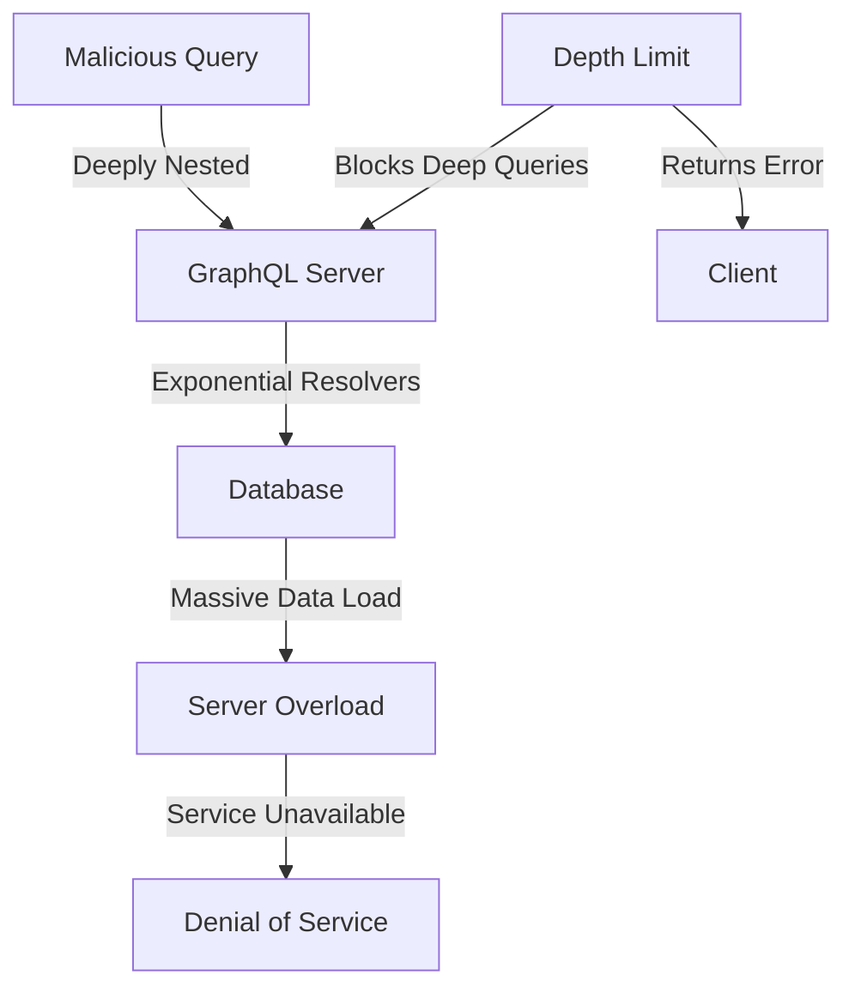
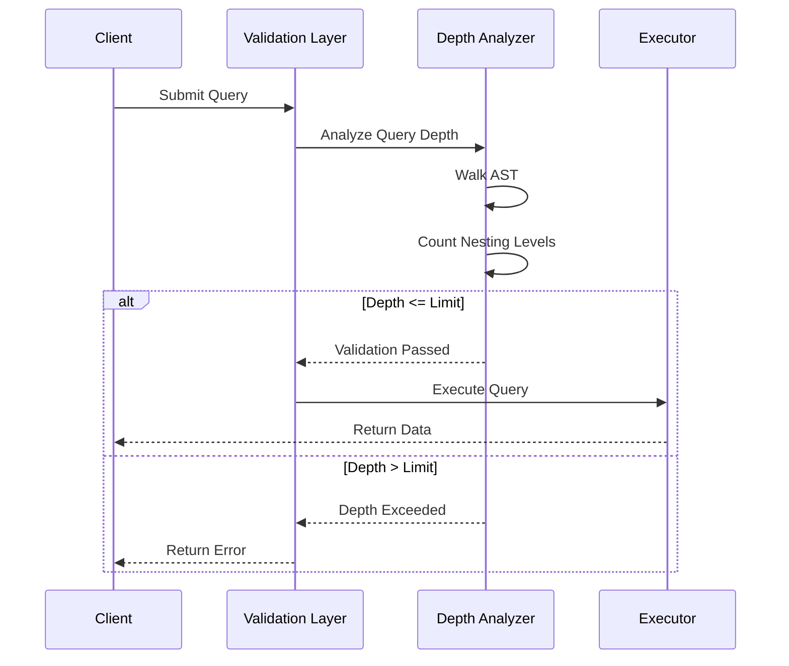
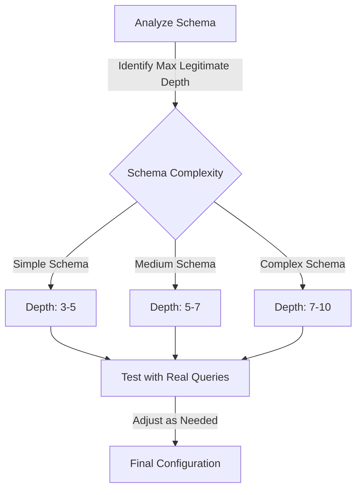

# How to Fix "Maximum Query Depth" Errors in GraphQL

Author: [nawazdhandala](https://www.github.com/nawazdhandala)

Tags: GraphQL, Security, API Development, Query Depth, Performance

Description: Learn how to diagnose and fix maximum query depth errors in GraphQL, and implement depth limiting to protect your API from malicious queries.

---

GraphQL's flexibility allows clients to request exactly the data they need, but this power can be exploited through deeply nested queries. The "Maximum Query Depth" error occurs when a query exceeds the configured depth limit, which is a security measure to prevent denial-of-service attacks. This guide explains how to understand, configure, and fix these errors.

## Understanding Query Depth

Query depth refers to how many levels of nesting exist in a GraphQL query. Each level of nested fields increases the depth by one.

```graphql
# Query Depth Example
# Depth 0: query root
query {
  # Depth 1: user field
  user(id: "123") {
    name
    # Depth 2: posts field
    posts {
      title
      # Depth 3: comments field
      comments {
        text
        # Depth 4: author field
        author {
          name
          # Depth 5: followers field
          followers {
            name
          }
        }
      }
    }
  }
}
# This query has a depth of 5
```

## Why Query Depth Limits Matter

Without depth limits, attackers can craft queries that overwhelm your server.



Consider this malicious query that could crash a server without protection:

```graphql
# Malicious deeply nested query
# Each level multiplies the number of database calls
query MaliciousQuery {
  users {
    friends {
      friends {
        friends {
          friends {
            friends {
              friends {
                friends {
                  # This continues indefinitely
                  name
                }
              }
            }
          }
        }
      }
    }
  }
}
```

## Implementing Query Depth Limiting

Here is how to implement depth limiting with popular GraphQL libraries.

### Using graphql-depth-limit

The most common approach is using the `graphql-depth-limit` package.

```bash
# Install the depth limit validation package
npm install graphql-depth-limit
```

```javascript
// server.js - Implementing depth limit with Apollo Server
import { ApolloServer } from '@apollo/server';
import depthLimit from 'graphql-depth-limit';
import { typeDefs, resolvers } from './schema.js';

// Create Apollo Server with depth limiting validation
const server = new ApolloServer({
  typeDefs,
  resolvers,
  // validationRules accepts an array of GraphQL validation rules
  // depthLimit(n) creates a rule that rejects queries deeper than n levels
  validationRules: [
    depthLimit(5), // Maximum depth of 5 levels
  ],
});

// Start the server
await server.start();
console.log('Server started with depth limit of 5');
```

### Configuring Depth Limit Options

The `graphql-depth-limit` package supports additional configuration options.

```javascript
// advanced-depth-limit.js - Advanced depth limit configuration
import depthLimit from 'graphql-depth-limit';

// Configure depth limit with options
const depthLimitRule = depthLimit(
  // Maximum allowed depth
  5,
  // Options object
  {
    // Callback function for logging or monitoring
    // Called whenever a query exceeds the depth limit
    callback: (depths) => {
      // depths is an object mapping field names to their depths
      console.log('Query depths:', depths);

      // Example: Log queries that are close to the limit
      const maxDepth = Math.max(...Object.values(depths));
      if (maxDepth >= 4) {
        console.warn(`Query approaching depth limit: ${maxDepth}/5`);
      }
    },
  }
);

// Export for use in server configuration
export { depthLimitRule };
```

### Ignoring Specific Fields

Sometimes you need to exclude certain fields from depth counting.

```javascript
// ignore-fields.js - Excluding fields from depth calculation
import depthLimit from 'graphql-depth-limit';

// Define fields to ignore in depth calculation
// These are typically metadata fields that don't cause performance issues
const ignoredFields = [
  // Introspection queries should be ignored
  '__schema',
  '__type',
  // Connection metadata fields (for pagination)
  'pageInfo',
  'edges',
  'node',
];

// Create a custom depth limit that ignores certain fields
const customDepthLimit = depthLimit(5, {
  // The ignore option accepts an array of field names to skip
  ignore: ignoredFields,
});

export { customDepthLimit };
```

## Error Messages and Responses

When a query exceeds the depth limit, the server returns a validation error.

```json
{
  "errors": [
    {
      "message": "'query' exceeds maximum operation depth of 5",
      "extensions": {
        "code": "GRAPHQL_VALIDATION_FAILED"
      }
    }
  ],
  "data": null
}
```

### Custom Error Messages

You can provide more helpful error messages for clients.

```javascript
// custom-error.js - Custom depth limit error handling
import { GraphQLError } from 'graphql';
import depthLimit from 'graphql-depth-limit';

// Create a wrapper that provides custom error messages
function createDepthLimitRule(maxDepth) {
  return (context) => {
    // Get the original depth limit rule
    const originalRule = depthLimit(maxDepth)(context);

    return {
      ...originalRule,
      // Override the error handling
      Document: {
        leave: (node) => {
          try {
            // Run original validation
            originalRule.Document?.leave?.(node);
          } catch (error) {
            // Throw a custom error with more context
            throw new GraphQLError(
              `Query is too complex. Maximum nesting depth is ${maxDepth} levels. ` +
              `Please simplify your query by reducing nested fields.`,
              {
                extensions: {
                  code: 'QUERY_TOO_DEEP',
                  maxDepth,
                  documentation: 'https://api.example.com/docs/query-limits',
                },
              }
            );
          }
        },
      },
    };
  };
}

export { createDepthLimitRule };
```

## Query Complexity Analysis Flow

Understanding how depth analysis works helps in debugging.



## Fixing Queries That Exceed Depth Limits

When you encounter depth limit errors, here are strategies to fix them.

### Strategy 1: Flatten the Query

Break a deep query into multiple shallower queries.

```javascript
// client-fix.js - Splitting deep queries into multiple requests

// BEFORE: Deep nested query (depth 6)
const DEEP_QUERY = gql`
  query GetUserData($userId: ID!) {
    user(id: $userId) {
      posts {
        comments {
          author {
            followers {
              posts {
                title
              }
            }
          }
        }
      }
    }
  }
`;

// AFTER: Split into two shallower queries (depth 3 each)
// First query: Get user posts and comments with author IDs
const QUERY_POSTS = gql`
  query GetUserPosts($userId: ID!) {
    user(id: $userId) {
      posts {
        id
        comments {
          text
          authorId
        }
      }
    }
  }
`;

// Second query: Get follower posts for specific authors
const QUERY_FOLLOWER_POSTS = gql`
  query GetFollowerPosts($authorIds: [ID!]!) {
    users(ids: $authorIds) {
      followers {
        posts {
          title
        }
      }
    }
  }
`;

// Execute queries sequentially
async function getUserData(userId) {
  // First, get posts and comments
  const { data: postsData } = await client.query({
    query: QUERY_POSTS,
    variables: { userId },
  });

  // Extract unique author IDs from comments
  const authorIds = [...new Set(
    postsData.user.posts
      .flatMap(post => post.comments)
      .map(comment => comment.authorId)
  )];

  // Then, get follower posts for those authors
  const { data: followersData } = await client.query({
    query: QUERY_FOLLOWER_POSTS,
    variables: { authorIds },
  });

  return { postsData, followersData };
}
```

### Strategy 2: Use DataLoader for Batching

Implement DataLoader to efficiently batch related queries.

```javascript
// dataloader-solution.js - Using DataLoader to reduce query depth
import DataLoader from 'dataloader';

// Create a DataLoader for batch loading users
// This allows fetching related data without deep nesting
const userLoader = new DataLoader(async (userIds) => {
  // Batch load all users in a single database query
  const users = await db.users.findMany({
    where: { id: { in: userIds } },
  });

  // Return users in the same order as the input IDs
  return userIds.map(id => users.find(user => user.id === id));
});

// Modified resolver that uses DataLoader
const resolvers = {
  Comment: {
    // Instead of deeply nested queries, load author separately
    author: async (comment, _, { loaders }) => {
      // DataLoader batches and caches these calls
      return loaders.userLoader.load(comment.authorId);
    },
  },
};
```

### Strategy 3: Create Dedicated Endpoints

For common deep query patterns, create dedicated query fields.

```graphql
# schema.graphql - Adding flattened query endpoints

type Query {
  # Original nested approach (may hit depth limits)
  user(id: ID!): User

  # Dedicated endpoint that returns flattened data
  # This keeps the query depth minimal while returning rich data
  userDashboard(userId: ID!): UserDashboard
}

# A flattened type that aggregates commonly needed data
type UserDashboard {
  user: User
  recentPosts: [Post]
  recentComments: [Comment]
  # Pre-aggregated follower data
  followerCount: Int
  topFollowers: [User]
}
```

```javascript
// dashboard-resolver.js - Resolver for flattened endpoint
const resolvers = {
  Query: {
    // Single resolver that fetches all needed data
    // Avoids deep nesting by aggregating at the server
    userDashboard: async (_, { userId }, { db }) => {
      // Parallel database queries for efficiency
      const [user, posts, comments, followers] = await Promise.all([
        db.users.findById(userId),
        db.posts.findByUserId(userId, { limit: 10 }),
        db.comments.findByUserId(userId, { limit: 10 }),
        db.followers.findByUserId(userId, { limit: 5 }),
      ]);

      return {
        user,
        recentPosts: posts,
        recentComments: comments,
        followerCount: followers.total,
        topFollowers: followers.items,
      };
    },
  },
};
```

## Configuring Appropriate Depth Limits

Choosing the right depth limit depends on your schema and use cases.



### Guidelines for Setting Depth Limits

```javascript
// depth-config.js - Configuration strategies for different scenarios

// Simple API with flat data structures
// Typical for blogs, simple CRUD apps
const SIMPLE_API_CONFIG = {
  maxDepth: 4,
  // Example valid query at max depth:
  // query { posts { author { profile { bio } } } }
};

// Medium complexity API with relationships
// Typical for e-commerce, social apps
const MEDIUM_API_CONFIG = {
  maxDepth: 6,
  // Example valid query at max depth:
  // query { user { orders { items { product { category { name } } } } } }
};

// Complex API with deep relationships
// Typical for enterprise, analytics platforms
const COMPLEX_API_CONFIG = {
  maxDepth: 8,
  // Use with additional safeguards like query cost analysis
  additionalRules: ['queryCostLimit'],
};

// Export configuration based on environment
export function getDepthConfig(apiComplexity) {
  switch (apiComplexity) {
    case 'simple':
      return SIMPLE_API_CONFIG;
    case 'medium':
      return MEDIUM_API_CONFIG;
    case 'complex':
      return COMPLEX_API_CONFIG;
    default:
      return MEDIUM_API_CONFIG;
  }
}
```

## Combining Depth Limit with Query Cost Analysis

For comprehensive protection, combine depth limiting with cost analysis.

```javascript
// combined-protection.js - Depth limit plus query cost analysis
import { ApolloServer } from '@apollo/server';
import depthLimit from 'graphql-depth-limit';
import { createComplexityLimitRule } from 'graphql-validation-complexity';

// Configure multiple validation rules for defense in depth
const server = new ApolloServer({
  typeDefs,
  resolvers,
  validationRules: [
    // Limit query depth to 7 levels
    depthLimit(7),

    // Also limit query complexity (cost)
    // This catches wide queries that might be shallow but expensive
    createComplexityLimitRule(1000, {
      // Configure cost per field type
      scalarCost: 1,
      objectCost: 2,
      listFactor: 10,
    }),
  ],
});
```

## Summary

Maximum query depth errors are security features that protect your GraphQL API. To handle them effectively:

1. Understand why depth limits exist and how they protect your server
2. Configure appropriate depth limits for your schema complexity
3. Refactor deep queries by flattening or splitting them
4. Create dedicated endpoints for common data aggregation patterns
5. Combine depth limits with query cost analysis for comprehensive protection

By following these practices, you can maintain API security while providing a good developer experience for legitimate API consumers.

**Related Reading:**

- [How to Handle File Uploads in GraphQL](https://oneuptime.com/blog/post/2026-01-24-graphql-file-uploads/view)
- [How to Fix "Null Value" Errors in GraphQL Resolvers](https://oneuptime.com/blog/post/2026-01-24-graphql-null-value-errors/view)
- [How to Handle Pagination in GraphQL APIs](https://oneuptime.com/blog/post/2026-01-24-graphql-pagination/view)
