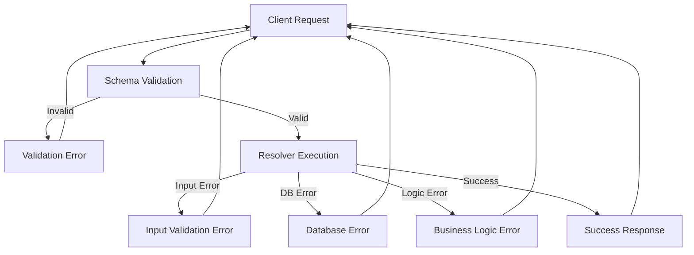
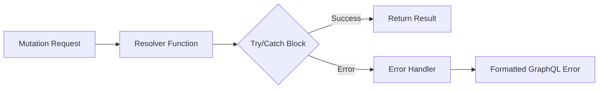
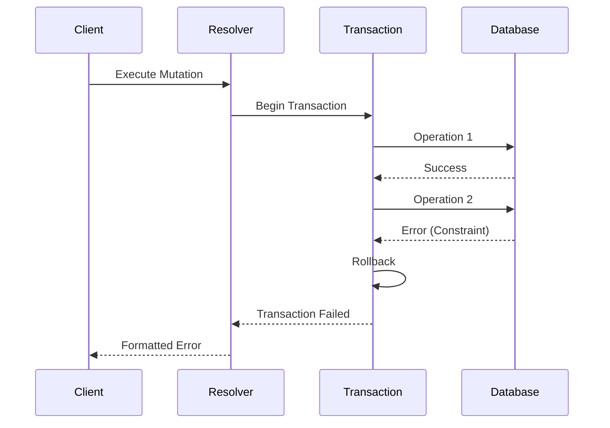

# How to Fix "Mutation Failed" Errors in GraphQL

Author: [nawazdhandala](https://www.github.com/nawazdhandala)

Tags: GraphQL, API Development, Mutations, Error Handling, Debugging, Backend Development, Node.js

Description: Learn how to diagnose and fix common "Mutation Failed" errors in GraphQL APIs, including validation issues, resolver problems, and database transaction failures.

---

> GraphQL mutations can fail silently or with cryptic error messages. Understanding the common causes and implementing proper error handling will help you build more reliable APIs and improve the developer experience for your API consumers.

Mutation failures are among the most frustrating issues to debug in GraphQL. This guide covers the most common causes and their solutions.

---

## Overview



---

## Common Mutation Failed Errors

### 1. Schema Validation Errors

These occur when the mutation input does not match the GraphQL schema definition.

**Error Example:**

```json
{
  "errors": [
    {
      "message": "Variable \"$input\" got invalid value { name: \"Test\" }; Field \"email\" of required type \"String!\" was not provided.",
      "locations": [{ "line": 1, "column": 10 }]
    }
  ]
}
```

**Solution:**

Ensure your mutation input matches the schema exactly. Here is a properly structured mutation:

```graphql
# Schema definition showing required fields
type Mutation {
  createUser(input: CreateUserInput!): User!
}

# Input type with required and optional fields
input CreateUserInput {
  name: String!      # Required - marked with !
  email: String!     # Required - marked with !
  bio: String        # Optional - no ! suffix
}
```

```javascript
// Client-side mutation with all required fields
const CREATE_USER = gql`
  mutation CreateUser($input: CreateUserInput!) {
    createUser(input: $input) {
      id
      name
      email
    }
  }
`;

// Ensure all required fields are provided
const variables = {
  input: {
    name: "John Doe",
    email: "john@example.com"  // Do not forget required fields
  }
};
```

---

### 2. Resolver Execution Errors

Resolver errors happen when the mutation handler throws an exception during execution.



**Problem Code:**

```javascript
// BAD: Unhandled errors cause cryptic "Mutation Failed" messages
const resolvers = {
  Mutation: {
    createUser: async (_, { input }, context) => {
      // This throws if user exists but error is not helpful
      const user = await db.users.create(input);
      return user;
    }
  }
};
```

**Solution: Implement Proper Error Handling**

```javascript
// GOOD: Wrap resolver logic in try-catch with meaningful errors
const resolvers = {
  Mutation: {
    createUser: async (_, { input }, context) => {
      try {
        // Validate input before database operation
        if (!isValidEmail(input.email)) {
          throw new UserInputError('Invalid email format', {
            invalidArgs: ['email']
          });
        }

        // Check for existing user
        const existingUser = await db.users.findOne({
          where: { email: input.email }
        });

        if (existingUser) {
          throw new UserInputError('User with this email already exists', {
            invalidArgs: ['email'],
            existingUserId: existingUser.id
          });
        }

        // Create the user
        const user = await db.users.create(input);
        return user;

      } catch (error) {
        // Re-throw GraphQL errors as-is
        if (error instanceof ApolloError) {
          throw error;
        }

        // Log unexpected errors and return a safe message
        console.error('createUser mutation failed:', error);
        throw new ApolloError(
          'Failed to create user. Please try again.',
          'USER_CREATION_FAILED',
          { originalError: error.message }
        );
      }
    }
  }
};
```

---

### 3. Input Validation Errors

Implement robust input validation to catch errors before they reach your database.

```javascript
// validation.js - Centralized validation functions
const Joi = require('joi');

// Define validation schema for user creation
const createUserSchema = Joi.object({
  name: Joi.string()
    .min(2)
    .max(100)
    .required()
    .messages({
      'string.min': 'Name must be at least 2 characters',
      'string.max': 'Name cannot exceed 100 characters',
      'any.required': 'Name is required'
    }),
  email: Joi.string()
    .email()
    .required()
    .messages({
      'string.email': 'Please provide a valid email address',
      'any.required': 'Email is required'
    }),
  password: Joi.string()
    .min(8)
    .pattern(/^(?=.*[a-z])(?=.*[A-Z])(?=.*\d)/)
    .required()
    .messages({
      'string.min': 'Password must be at least 8 characters',
      'string.pattern.base': 'Password must contain uppercase, lowercase, and number'
    })
});

// Validation helper function
function validateInput(schema, input) {
  const { error, value } = schema.validate(input, {
    abortEarly: false  // Collect all errors, not just the first
  });

  if (error) {
    const validationErrors = error.details.map(detail => ({
      field: detail.path.join('.'),
      message: detail.message
    }));

    throw new UserInputError('Validation failed', {
      validationErrors
    });
  }

  return value;  // Return sanitized value
}

module.exports = { createUserSchema, validateInput };
```

```javascript
// resolver using validation
const { createUserSchema, validateInput } = require('./validation');

const resolvers = {
  Mutation: {
    createUser: async (_, { input }, context) => {
      // Validate input - throws UserInputError if invalid
      const validatedInput = validateInput(createUserSchema, input);

      // Proceed with validated and sanitized data
      const user = await db.users.create(validatedInput);
      return user;
    }
  }
};
```

---

### 4. Database Transaction Errors

Handle database errors gracefully to provide meaningful feedback.



```javascript
// Handle database transactions with proper error handling
const resolvers = {
  Mutation: {
    createOrder: async (_, { input }, { db }) => {
      // Start a database transaction for atomic operations
      const transaction = await db.sequelize.transaction();

      try {
        // Create the order record
        const order = await db.orders.create({
          userId: input.userId,
          status: 'pending',
          total: 0
        }, { transaction });

        let total = 0;

        // Add each item to the order
        for (const item of input.items) {
          // Check product availability
          const product = await db.products.findByPk(item.productId, {
            transaction,
            lock: true  // Lock row to prevent race conditions
          });

          if (!product) {
            throw new UserInputError(`Product ${item.productId} not found`);
          }

          if (product.stock < item.quantity) {
            throw new UserInputError(
              `Insufficient stock for ${product.name}. Available: ${product.stock}`
            );
          }

          // Create order item
          await db.orderItems.create({
            orderId: order.id,
            productId: item.productId,
            quantity: item.quantity,
            price: product.price
          }, { transaction });

          // Update product stock
          await product.decrement('stock', {
            by: item.quantity,
            transaction
          });

          total += product.price * item.quantity;
        }

        // Update order total
        await order.update({ total }, { transaction });

        // Commit all changes
        await transaction.commit();

        // Return the complete order with items
        return db.orders.findByPk(order.id, {
          include: [{ model: db.orderItems, include: [db.products] }]
        });

      } catch (error) {
        // Rollback on any error
        await transaction.rollback();

        // Handle specific database errors
        if (error.name === 'SequelizeUniqueConstraintError') {
          throw new UserInputError('Duplicate entry detected', {
            field: error.errors[0]?.path
          });
        }

        if (error.name === 'SequelizeForeignKeyConstraintError') {
          throw new UserInputError('Referenced record does not exist');
        }

        // Re-throw GraphQL errors
        if (error instanceof ApolloError) {
          throw error;
        }

        // Log and wrap unexpected errors
        console.error('Order creation failed:', error);
        throw new ApolloError(
          'Failed to create order',
          'ORDER_CREATION_FAILED'
        );
      }
    }
  }
};
```

---

### 5. Authentication and Authorization Errors

Implement proper auth checks in your mutations.

```javascript
// auth.js - Authentication utilities
const { AuthenticationError, ForbiddenError } = require('apollo-server');

// Check if user is authenticated
function requireAuth(context) {
  if (!context.user) {
    throw new AuthenticationError(
      'You must be logged in to perform this action'
    );
  }
  return context.user;
}

// Check if user has required role
function requireRole(context, allowedRoles) {
  const user = requireAuth(context);

  if (!allowedRoles.includes(user.role)) {
    throw new ForbiddenError(
      `This action requires one of these roles: ${allowedRoles.join(', ')}`
    );
  }

  return user;
}

// Check if user owns the resource
function requireOwnership(context, resourceOwnerId) {
  const user = requireAuth(context);

  if (user.id !== resourceOwnerId && user.role !== 'admin') {
    throw new ForbiddenError('You do not have permission to modify this resource');
  }

  return user;
}

module.exports = { requireAuth, requireRole, requireOwnership };
```

```javascript
// Using auth utilities in resolvers
const { requireAuth, requireRole, requireOwnership } = require('./auth');

const resolvers = {
  Mutation: {
    // Requires authentication
    updateProfile: async (_, { input }, context) => {
      const user = requireAuth(context);
      return db.users.update(user.id, input);
    },

    // Requires specific role
    deleteUser: async (_, { userId }, context) => {
      requireRole(context, ['admin', 'moderator']);
      return db.users.delete(userId);
    },

    // Requires ownership or admin
    updatePost: async (_, { postId, input }, context) => {
      const post = await db.posts.findByPk(postId);

      if (!post) {
        throw new UserInputError('Post not found');
      }

      requireOwnership(context, post.authorId);
      return db.posts.update(postId, input);
    }
  }
};
```

---

## Custom Error Classes

Create custom error classes for consistent error handling.

```javascript
// errors.js - Custom GraphQL error classes
const { ApolloError } = require('apollo-server');

// Error for validation failures
class ValidationError extends ApolloError {
  constructor(message, validationErrors = []) {
    super(message, 'VALIDATION_ERROR', { validationErrors });
    this.name = 'ValidationError';
  }
}

// Error for resource not found
class NotFoundError extends ApolloError {
  constructor(resource, id) {
    super(
      `${resource} with ID ${id} not found`,
      'NOT_FOUND',
      { resource, id }
    );
    this.name = 'NotFoundError';
  }
}

// Error for business logic violations
class BusinessRuleError extends ApolloError {
  constructor(message, rule, details = {}) {
    super(message, 'BUSINESS_RULE_VIOLATION', { rule, ...details });
    this.name = 'BusinessRuleError';
  }
}

// Error for rate limiting
class RateLimitError extends ApolloError {
  constructor(retryAfter) {
    super(
      `Rate limit exceeded. Please try again in ${retryAfter} seconds.`,
      'RATE_LIMITED',
      { retryAfter }
    );
    this.name = 'RateLimitError';
  }
}

module.exports = {
  ValidationError,
  NotFoundError,
  BusinessRuleError,
  RateLimitError
};
```

---

## Error Formatting for Production

Configure Apollo Server to format errors appropriately for production.

```javascript
// server.js - Apollo Server configuration with error formatting
const { ApolloServer } = require('apollo-server');

const server = new ApolloServer({
  typeDefs,
  resolvers,

  // Format errors before sending to client
  formatError: (error) => {
    // Log all errors for debugging
    console.error('GraphQL Error:', {
      message: error.message,
      code: error.extensions?.code,
      path: error.path,
      stack: error.extensions?.exception?.stacktrace
    });

    // In production, hide internal error details
    if (process.env.NODE_ENV === 'production') {
      // Keep user-facing errors intact
      const safeErrors = [
        'BAD_USER_INPUT',
        'UNAUTHENTICATED',
        'FORBIDDEN',
        'VALIDATION_ERROR',
        'NOT_FOUND',
        'BUSINESS_RULE_VIOLATION',
        'RATE_LIMITED'
      ];

      if (safeErrors.includes(error.extensions?.code)) {
        return error;
      }

      // Hide internal server errors
      return new ApolloError(
        'An unexpected error occurred',
        'INTERNAL_SERVER_ERROR'
      );
    }

    // In development, return full error details
    return error;
  },

  // Add request context
  context: async ({ req }) => {
    const token = req.headers.authorization?.replace('Bearer ', '');
    const user = token ? await verifyToken(token) : null;

    return {
      user,
      db,
      loaders: createDataLoaders()
    };
  }
});
```

---

## Client-Side Error Handling

Handle mutation errors gracefully on the client.

```javascript
// React component with proper error handling
import { useMutation } from '@apollo/client';
import { useState } from 'react';

const CREATE_USER = gql`
  mutation CreateUser($input: CreateUserInput!) {
    createUser(input: $input) {
      id
      name
      email
    }
  }
`;

function CreateUserForm() {
  const [formErrors, setFormErrors] = useState({});
  const [generalError, setGeneralError] = useState(null);

  const [createUser, { loading }] = useMutation(CREATE_USER, {
    // Handle successful mutation
    onCompleted: (data) => {
      console.log('User created:', data.createUser);
      setFormErrors({});
      setGeneralError(null);
    },

    // Handle mutation errors
    onError: (error) => {
      // Reset previous errors
      setFormErrors({});
      setGeneralError(null);

      // Extract GraphQL errors
      const graphqlErrors = error.graphQLErrors || [];

      for (const err of graphqlErrors) {
        const code = err.extensions?.code;

        switch (code) {
          case 'VALIDATION_ERROR':
            // Map validation errors to form fields
            const validationErrors = err.extensions?.validationErrors || [];
            const fieldErrors = {};

            validationErrors.forEach(({ field, message }) => {
              fieldErrors[field] = message;
            });

            setFormErrors(fieldErrors);
            break;

          case 'BAD_USER_INPUT':
            // Handle input errors
            const invalidArgs = err.extensions?.invalidArgs || [];
            setGeneralError(err.message);
            break;

          case 'UNAUTHENTICATED':
            // Redirect to login
            window.location.href = '/login';
            break;

          default:
            setGeneralError(err.message || 'An error occurred');
        }
      }

      // Handle network errors
      if (error.networkError) {
        setGeneralError('Network error. Please check your connection.');
      }
    }
  });

  const handleSubmit = async (e) => {
    e.preventDefault();
    const formData = new FormData(e.target);

    await createUser({
      variables: {
        input: {
          name: formData.get('name'),
          email: formData.get('email'),
          password: formData.get('password')
        }
      }
    });
  };

  return (
    <form onSubmit={handleSubmit}>
      {generalError && (
        <div className="error-banner">{generalError}</div>
      )}

      <div>
        <input name="name" placeholder="Name" />
        {formErrors.name && (
          <span className="field-error">{formErrors.name}</span>
        )}
      </div>

      <div>
        <input name="email" type="email" placeholder="Email" />
        {formErrors.email && (
          <span className="field-error">{formErrors.email}</span>
        )}
      </div>

      <div>
        <input name="password" type="password" placeholder="Password" />
        {formErrors.password && (
          <span className="field-error">{formErrors.password}</span>
        )}
      </div>

      <button type="submit" disabled={loading}>
        {loading ? 'Creating...' : 'Create User'}
      </button>
    </form>
  );
}
```

---

## Debugging Mutation Failures

Use these techniques to debug mutation issues.

```javascript
// Enable detailed logging in development
const server = new ApolloServer({
  typeDefs,
  resolvers,
  plugins: [
    {
      // Log all requests and responses
      async requestDidStart(requestContext) {
        console.log('Request started:', {
          query: requestContext.request.query,
          variables: requestContext.request.variables
        });

        return {
          // Log when parsing fails
          async parsingDidStart() {
            return async (err) => {
              if (err) {
                console.error('Parsing error:', err);
              }
            };
          },

          // Log when validation fails
          async validationDidStart() {
            return async (errs) => {
              if (errs) {
                console.error('Validation errors:', errs);
              }
            };
          },

          // Log resolver errors
          async executionDidStart() {
            return {
              async executionDidEnd(err) {
                if (err) {
                  console.error('Execution error:', err);
                }
              }
            };
          },

          // Log the final response
          async willSendResponse(requestContext) {
            console.log('Response:', {
              data: requestContext.response.data,
              errors: requestContext.response.errors
            });
          }
        };
      }
    }
  ]
});
```

---

## Best Practices

1. **Always validate input** before database operations
2. **Use transactions** for multi-step mutations
3. **Create custom error classes** for consistent error handling
4. **Log errors** with context for debugging
5. **Hide internal details** in production
6. **Return specific error codes** for client-side handling
7. **Test error scenarios** in your mutation tests

---

## Conclusion

Mutation failures in GraphQL can stem from various sources including schema validation, resolver logic, database operations, and authentication. By implementing proper error handling, input validation, and transaction management, you can build robust GraphQL APIs that provide clear feedback when things go wrong.

Key takeaways:

- Wrap resolver logic in try-catch blocks
- Use custom error classes for different failure types
- Validate input before processing
- Handle database errors gracefully
- Format errors appropriately for production

---

*Need to monitor your GraphQL API health? [OneUptime](https://oneuptime.com) provides comprehensive monitoring for GraphQL endpoints with mutation tracking and error alerting.*
