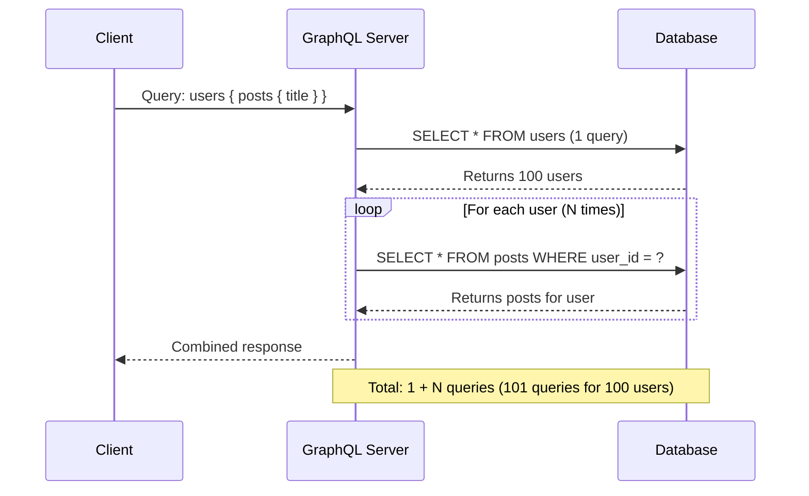
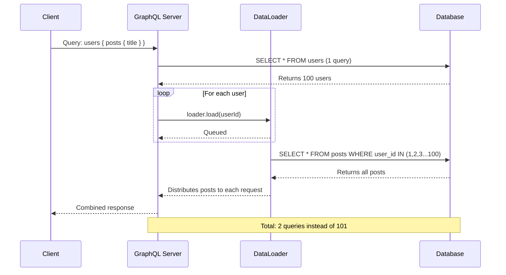
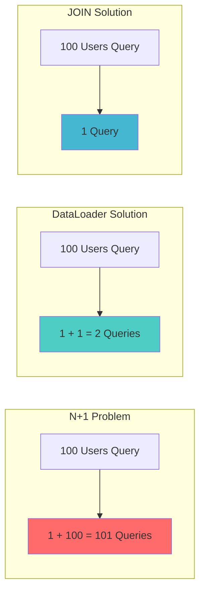

# How to Fix N+1 Query Problem in GraphQL

Author: [nawazdhandala](https://www.github.com/nawazdhandala)

Tags: GraphQL, Performance, Database, API Development, Optimization

Description: Learn how to identify and fix the N+1 query problem in GraphQL APIs using DataLoader and other optimization techniques.

---

The N+1 query problem is one of the most common performance issues in GraphQL APIs. It occurs when your application makes one query to fetch a list of items, and then N additional queries to fetch related data for each item. This guide will help you understand, identify, and fix this problem.

## Understanding the N+1 Problem

When you have nested relationships in GraphQL, each resolver might trigger a separate database query. For a list of N items, this results in 1 initial query plus N additional queries for related data.



## Example of the N+1 Problem

Here is a typical GraphQL schema that can cause the N+1 problem:

```graphql
# GraphQL schema with nested relationships
type User {
  id: ID!
  name: String!
  email: String!
  posts: [Post!]!  # This field triggers N additional queries
}

type Post {
  id: ID!
  title: String!
  content: String!
  author: User!
}

type Query {
  users: [User!]!
  posts: [Post!]!
}
```

The problematic resolver implementation:

```javascript
// Naive resolver implementation that causes N+1 queries
const resolvers = {
  Query: {
    // This query fetches all users with a single database call
    users: async () => {
      // 1 query to fetch all users
      return await db.query('SELECT * FROM users');
    }
  },
  User: {
    // This resolver is called for EACH user returned by the parent query
    // If we have 100 users, this runs 100 times = 100 additional queries
    posts: async (parent) => {
      // N queries - one for each user
      return await db.query(
        'SELECT * FROM posts WHERE user_id = ?',
        [parent.id]
      );
    }
  }
};
```

## Solution 1: DataLoader for Batching

DataLoader is the standard solution for the N+1 problem in GraphQL. It batches and caches database requests within a single request.

```javascript
// Install DataLoader: npm install dataloader
const DataLoader = require('dataloader');

// Create a batch loading function
// This function receives an array of keys and returns corresponding values
const createPostsLoader = () => {
  return new DataLoader(async (userIds) => {
    // Single query to fetch posts for ALL users at once
    const posts = await db.query(
      'SELECT * FROM posts WHERE user_id IN (?)',
      [userIds]
    );

    // Group posts by user_id to return in the same order as userIds
    const postsByUserId = userIds.map(userId =>
      posts.filter(post => post.user_id === userId)
    );

    return postsByUserId;
  });
};

// Create loader instance per request (important for caching isolation)
const createLoaders = () => ({
  postsLoader: createPostsLoader(),
});

// Updated resolver using DataLoader
const resolvers = {
  Query: {
    users: async () => {
      return await db.query('SELECT * FROM users');
    }
  },
  User: {
    // Now uses DataLoader instead of direct database query
    posts: async (parent, args, context) => {
      // DataLoader batches all calls made during this tick
      // and executes a single database query
      return context.loaders.postsLoader.load(parent.id);
    }
  }
};
```

The DataLoader optimization flow:



## Solution 2: Join Queries at the Database Level

For simpler cases, you can use SQL JOINs to fetch related data in a single query:

```javascript
// Fetch users with their posts in a single query using JOIN
const resolvers = {
  Query: {
    users: async () => {
      // Single query with JOIN to fetch users and posts together
      const rows = await db.query(`
        SELECT
          u.id as user_id,
          u.name,
          u.email,
          p.id as post_id,
          p.title,
          p.content
        FROM users u
        LEFT JOIN posts p ON p.user_id = u.id
        ORDER BY u.id
      `);

      // Transform flat rows into nested structure
      const usersMap = new Map();

      rows.forEach(row => {
        if (!usersMap.has(row.user_id)) {
          usersMap.set(row.user_id, {
            id: row.user_id,
            name: row.name,
            email: row.email,
            posts: []
          });
        }

        // Add post if it exists (handles LEFT JOIN nulls)
        if (row.post_id) {
          usersMap.get(row.user_id).posts.push({
            id: row.post_id,
            title: row.title,
            content: row.content
          });
        }
      });

      return Array.from(usersMap.values());
    }
  }
};
```

## Solution 3: Using ORM Features

Most ORMs provide eager loading features to prevent N+1 queries:

### Prisma Example

```javascript
// Prisma resolver with eager loading using 'include'
const resolvers = {
  Query: {
    users: async (parent, args, context) => {
      // Prisma's include option fetches related data in optimized queries
      return await context.prisma.user.findMany({
        include: {
          posts: true  // Eagerly load posts for all users
        }
      });
    }
  }
};
```

### Sequelize Example

```javascript
// Sequelize resolver with eager loading
const resolvers = {
  Query: {
    users: async () => {
      // Sequelize's include option performs a JOIN or separate optimized query
      return await User.findAll({
        include: [{
          model: Post,
          as: 'posts'  // Include related posts
        }]
      });
    }
  }
};
```

### TypeORM Example

```javascript
// TypeORM resolver with eager loading using relations
const resolvers = {
  Query: {
    users: async () => {
      // TypeORM's relations option loads related entities
      return await userRepository.find({
        relations: ['posts']  // Load posts relation
      });
    }
  }
};
```

## Solution 4: GraphQL Query Analysis

You can analyze the incoming query to determine what fields are requested and only load what is needed:

```javascript
// Using graphql-fields to analyze query selection
const graphqlFields = require('graphql-fields');

const resolvers = {
  Query: {
    users: async (parent, args, context, info) => {
      // Parse the GraphQL query to see what fields are requested
      const requestedFields = graphqlFields(info);

      // Check if posts are requested in the query
      const includePosts = 'posts' in requestedFields;

      if (includePosts) {
        // If posts are requested, use eager loading
        return await context.prisma.user.findMany({
          include: { posts: true }
        });
      }

      // If posts are not requested, simple query without JOIN
      return await context.prisma.user.findMany();
    }
  }
};
```

## Detecting N+1 Problems

Use query logging to identify N+1 issues:

```javascript
// Enable query logging in your database client
const knex = require('knex')({
  client: 'pg',
  connection: process.env.DATABASE_URL,
  debug: true,  // Enable logging in development

  // Custom log function to track queries
  log: {
    warn(message) { console.warn(message); },
    error(message) { console.error(message); },
    debug(message) {
      console.log('SQL Query:', message);
      // You can also count queries here
    }
  }
});

// Middleware to count queries per request
const queryCounter = {
  count: 0,
  reset() { this.count = 0; },
  increment() { this.count++; }
};

// Log query count after each GraphQL request
const server = new ApolloServer({
  typeDefs,
  resolvers,
  plugins: [{
    requestDidStart() {
      queryCounter.reset();
      return {
        willSendResponse() {
          console.log(`Total queries for this request: ${queryCounter.count}`);
          // Alert if too many queries (potential N+1)
          if (queryCounter.count > 10) {
            console.warn('Warning: Potential N+1 query detected!');
          }
        }
      };
    }
  }]
});
```

## Performance Comparison

Here is a comparison of query counts with different approaches:



## Best Practices

1. **Always use DataLoader** for resolving relationships in GraphQL
2. **Create new DataLoader instances per request** to avoid caching issues between users
3. **Use ORM eager loading** when you know relationships will always be needed
4. **Monitor query counts** in development to catch N+1 issues early
5. **Consider pagination** for large datasets to limit the scope of batched queries

```javascript
// Complete example with best practices
const DataLoader = require('dataloader');
const { ApolloServer } = require('apollo-server');

// Factory function to create loaders - called per request
const createLoaders = (db) => ({
  // Batch loader for user posts
  postsLoader: new DataLoader(async (userIds) => {
    const posts = await db.query(
      'SELECT * FROM posts WHERE user_id = ANY($1)',
      [userIds]
    );
    return userIds.map(id => posts.filter(p => p.user_id === id));
  }),

  // Batch loader for post authors
  usersLoader: new DataLoader(async (userIds) => {
    const users = await db.query(
      'SELECT * FROM users WHERE id = ANY($1)',
      [userIds]
    );
    // Return in same order as input keys
    return userIds.map(id => users.find(u => u.id === id));
  })
});

// Apollo Server setup with context containing loaders
const server = new ApolloServer({
  typeDefs,
  resolvers,
  context: ({ req }) => ({
    // Create fresh loaders for each request
    loaders: createLoaders(db),
    user: req.user
  })
});
```

## Conclusion

The N+1 query problem can severely impact your GraphQL API performance, but it is straightforward to fix once you understand it. DataLoader is the recommended solution for most cases, providing automatic batching and caching. Combine it with query logging and monitoring to ensure your API remains performant as it scales.

**Related Reading:**

- [How to Configure DataLoader for Batching in GraphQL](https://oneuptime.com/blog/post/2026-01-24-graphql-dataloader-batching/view)
- [How to Handle Authentication in GraphQL APIs](https://oneuptime.com/blog/post/2026-01-24-graphql-authentication/view)
