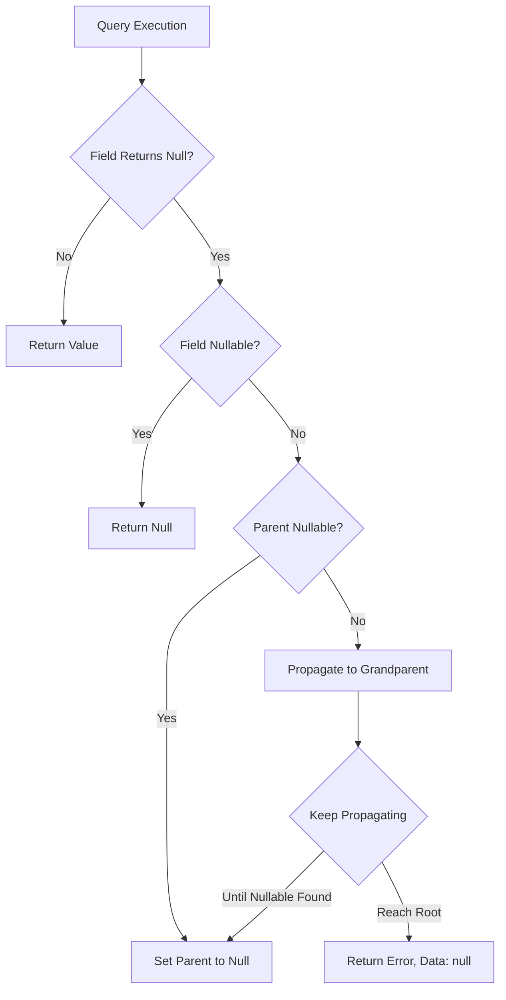
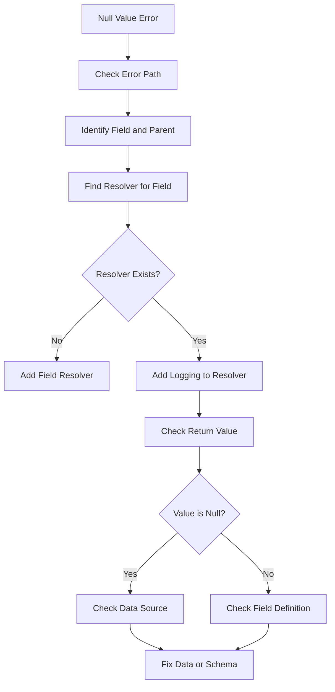
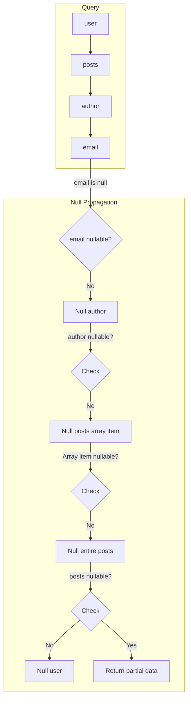

# How to Fix 'Null Value' Errors in GraphQL Resolvers

Author: [nawazdhandala](https://www.github.com/nawazdhandala)

Tags: GraphQL, Error Handling, Resolvers, Debugging, Node.js

Description: Learn how to diagnose and fix null value errors in GraphQL resolvers, understand nullable vs non-nullable fields, and implement proper error handling.

---

Null value errors are among the most common issues in GraphQL APIs. They occur when a non-nullable field returns null, causing the entire query to fail. This guide explains why these errors happen and how to fix them systematically.

## Understanding Null Value Errors

In GraphQL, fields can be nullable or non-nullable. When a non-nullable field returns null, GraphQL propagates the null up to the nearest nullable parent, which can cause unexpected data loss.



### The Error Message

A typical null value error looks like this:

```json
{
  "errors": [
    {
      "message": "Cannot return null for non-nullable field User.email.",
      "locations": [{ "line": 4, "column": 5 }],
      "path": ["user", "email"],
      "extensions": {
        "code": "INTERNAL_SERVER_ERROR"
      }
    }
  ],
  "data": null
}
```

## Common Causes of Null Value Errors

Let us examine the most frequent causes and their solutions.

### Cause 1: Database Returns Null

The most common cause is when the database returns null for a field marked as non-nullable.

```graphql
# schema.graphql - The problematic schema
type User {
  id: ID!
  email: String!     # Non-nullable, but might be null in database
  name: String!      # Non-nullable, but might be null in database
  phone: String!     # Non-nullable, but might be null in database
}
```

```javascript
// resolver.js - Resolver that might return null
const resolvers = {
  Query: {
    user: async (_, { id }, { db }) => {
      // This might return a user with null email
      const user = await db.users.findById(id);
      return user; // If user.email is null, GraphQL will error
    },
  },
};
```

**Solution: Update schema to match reality**

```graphql
# schema.graphql - Fixed schema with appropriate nullability
type User {
  id: ID!
  email: String!     # Keep non-nullable if always required
  name: String       # Make nullable if optional
  phone: String      # Make nullable if optional
}
```

**Solution: Provide default values**

```javascript
// resolver.js - Resolver with default values
const resolvers = {
  Query: {
    user: async (_, { id }, { db }) => {
      const user = await db.users.findById(id);

      if (!user) {
        return null; // Return null for the whole user if not found
      }

      // Provide default values for optional fields
      return {
        ...user,
        name: user.name || 'Unknown',
        phone: user.phone || 'Not provided',
      };
    },
  },
};
```

### Cause 2: Related Data Not Found

When resolving relationships, the related record might not exist.

```graphql
# schema.graphql
type Post {
  id: ID!
  title: String!
  author: User!  # Non-nullable, expects a User to always exist
}
```

```javascript
// resolver.js - Problem: author might not exist
const resolvers = {
  Post: {
    author: async (post, _, { db }) => {
      // If the author was deleted, this returns null
      return db.users.findById(post.authorId);
    },
  },
};
```

**Solution: Handle missing relationships**

```javascript
// resolver.js - Solution with proper error handling
const resolvers = {
  Post: {
    author: async (post, _, { db }) => {
      const author = await db.users.findById(post.authorId);

      if (!author) {
        // Option 1: Return a placeholder user
        return {
          id: post.authorId,
          name: 'Deleted User',
          email: 'deleted@example.com',
        };

        // Option 2: Throw a meaningful error
        // throw new GraphQLError('Author not found', {
        //   extensions: { code: 'AUTHOR_NOT_FOUND', authorId: post.authorId }
        // });
      }

      return author;
    },
  },
};
```

### Cause 3: Resolver Not Returning a Value

Forgetting to return a value from an async resolver is a common mistake.

```javascript
// resolver.js - Problem: missing return statement
const resolvers = {
  Mutation: {
    createUser: async (_, { input }, { db }) => {
      const user = await db.users.create(input);
      // Missing return statement - returns undefined (which becomes null)
    },
  },
};
```

**Solution: Always return a value**

```javascript
// resolver.js - Solution: explicit return
const resolvers = {
  Mutation: {
    createUser: async (_, { input }, { db }) => {
      const user = await db.users.create(input);
      return user; // Always return the result
    },
  },
};
```

### Cause 4: Unhandled Promise Rejection

When a promise rejects but is not properly caught, it may result in null.

```javascript
// resolver.js - Problem: unhandled promise rejection
const resolvers = {
  Query: {
    user: async (_, { id }, { db }) => {
      // If this throws, the error might not propagate correctly
      const user = await db.users.findById(id);
      return user;
    },
  },
};
```

**Solution: Proper error handling**

```javascript
// resolver.js - Solution: explicit error handling
import { GraphQLError } from 'graphql';

const resolvers = {
  Query: {
    user: async (_, { id }, { db }) => {
      try {
        const user = await db.users.findById(id);

        if (!user) {
          throw new GraphQLError(`User with ID ${id} not found`, {
            extensions: {
              code: 'USER_NOT_FOUND',
              userId: id,
            },
          });
        }

        return user;
      } catch (error) {
        // Log the error for debugging
        console.error('Error fetching user:', error);

        // Re-throw GraphQL errors as-is
        if (error instanceof GraphQLError) {
          throw error;
        }

        // Wrap other errors
        throw new GraphQLError('Failed to fetch user', {
          extensions: {
            code: 'DATABASE_ERROR',
            originalError: error.message,
          },
        });
      }
    },
  },
};
```

## Debugging Null Value Errors

Here is a systematic approach to finding the source of null errors.



### Adding Debug Logging

Add logging to track down where nulls originate.

```javascript
// debug-resolver.js - Resolver with debug logging
const resolvers = {
  User: {
    // Add a resolver for each potentially problematic field
    email: (user, _, __, info) => {
      // Log the parent object and field being resolved
      console.log('Resolving User.email');
      console.log('Parent user object:', JSON.stringify(user, null, 2));
      console.log('Email value:', user.email);

      // Check if the value would cause an error
      if (user.email === null || user.email === undefined) {
        console.warn('WARNING: User.email is null/undefined');
        console.warn('User ID:', user.id);
      }

      return user.email;
    },
  },
};
```

### Creating a Debug Plugin

Use an Apollo Server plugin for comprehensive debugging.

```javascript
// debug-plugin.js - Apollo Server plugin for null debugging
const nullDebugPlugin = {
  requestDidStart() {
    return {
      // Log errors as they occur
      didEncounterErrors({ errors }) {
        errors.forEach((error) => {
          if (error.message.includes('Cannot return null')) {
            console.error('Null value error detected:');
            console.error('  Message:', error.message);
            console.error('  Path:', error.path?.join('.'));
            console.error('  Locations:', JSON.stringify(error.locations));
          }
        });
      },

      // Log the response to see what data was returned
      willSendResponse({ response }) {
        if (response.errors) {
          console.log('Response with errors:', JSON.stringify(response, null, 2));
        }
      },
    };
  },
};

// Use the plugin in Apollo Server
const server = new ApolloServer({
  typeDefs,
  resolvers,
  plugins: [nullDebugPlugin],
});
```

## Designing Schemas to Avoid Null Errors

Good schema design prevents many null errors.

### Use Nullable Fields Appropriately

```graphql
# schema.graphql - Well-designed schema with appropriate nullability

type User {
  # Always present - use non-nullable
  id: ID!
  createdAt: String!

  # Required at creation - use non-nullable
  email: String!

  # Optional fields - use nullable
  name: String
  bio: String
  avatarUrl: String

  # Relationships that might not exist - use nullable
  manager: User
  department: Department
}

type Query {
  # Single item queries should be nullable (item might not exist)
  user(id: ID!): User
  post(id: ID!): Post

  # List queries should return non-nullable arrays with non-nullable items
  # Empty array is returned if no items found
  users: [User!]!
  posts: [Post!]!

  # Lists with optional items (if some items might fail to load)
  usersByIds(ids: [ID!]!): [User]!
}
```

### Use Result Types for Operations

```graphql
# schema.graphql - Using result types for better error handling

# Define a union type for operation results
union CreateUserResult = User | CreateUserError

type CreateUserError {
  message: String!
  code: String!
  field: String
}

type Mutation {
  # Return a result type instead of just User
  createUser(input: CreateUserInput!): CreateUserResult!
}
```

```javascript
// resolver.js - Resolver using result types
const resolvers = {
  Mutation: {
    createUser: async (_, { input }, { db }) => {
      try {
        // Validate input
        if (!input.email.includes('@')) {
          return {
            __typename: 'CreateUserError',
            message: 'Invalid email format',
            code: 'INVALID_EMAIL',
            field: 'email',
          };
        }

        // Check for duplicate
        const existing = await db.users.findByEmail(input.email);
        if (existing) {
          return {
            __typename: 'CreateUserError',
            message: 'Email already in use',
            code: 'DUPLICATE_EMAIL',
            field: 'email',
          };
        }

        // Create user
        const user = await db.users.create(input);
        return { __typename: 'User', ...user };

      } catch (error) {
        return {
          __typename: 'CreateUserError',
          message: 'Failed to create user',
          code: 'INTERNAL_ERROR',
          field: null,
        };
      }
    },
  },

  // Resolver to determine which type was returned
  CreateUserResult: {
    __resolveType(obj) {
      return obj.__typename;
    },
  },
};
```

## Implementing Null-Safe Resolvers

Create utility functions for null-safe resolving.

```javascript
// null-safe.js - Utilities for null-safe resolving

// Wrapper that provides a default value when null
function withDefault(resolver, defaultValue) {
  return async (...args) => {
    const result = await resolver(...args);
    return result ?? defaultValue;
  };
}

// Wrapper that throws a clear error when null
function requireNonNull(resolver, fieldName) {
  return async (...args) => {
    const result = await resolver(...args);

    if (result === null || result === undefined) {
      throw new GraphQLError(`${fieldName} cannot be null`, {
        extensions: { code: 'NULL_VALUE_ERROR' },
      });
    }

    return result;
  };
}

// Usage in resolvers
const resolvers = {
  User: {
    // Provide a default value for name
    name: withDefault(
      (user) => user.name,
      'Anonymous'
    ),

    // Ensure email is never null
    email: requireNonNull(
      (user) => user.email,
      'User.email'
    ),
  },
};
```

### Batch Resolver with Null Handling

```javascript
// batch-resolver.js - DataLoader with null handling
import DataLoader from 'dataloader';

// Create a DataLoader that handles missing records
const createUserLoader = (db) => {
  return new DataLoader(async (userIds) => {
    // Fetch all users in one query
    const users = await db.users.findByIds(userIds);

    // Create a map for easy lookup
    const userMap = new Map(users.map((user) => [user.id, user]));

    // Return users in the same order as input IDs
    // Use null for missing users (or a placeholder)
    return userIds.map((id) => {
      const user = userMap.get(id);

      if (!user) {
        // Option 1: Return null and make field nullable
        return null;

        // Option 2: Return a placeholder
        // return { id, name: 'Unknown User', email: 'unknown@example.com' };
      }

      return user;
    });
  });
};

// Use in context
const server = new ApolloServer({
  typeDefs,
  resolvers,
  context: ({ req }) => ({
    loaders: {
      userLoader: createUserLoader(db),
    },
  }),
});
```

## Error Propagation Visualization

Understanding how errors propagate helps design better schemas.



## Summary

Fixing null value errors in GraphQL requires understanding:

1. The difference between nullable and non-nullable fields
2. How null values propagate through the response tree
3. Common causes: missing data, unhandled errors, missing returns
4. Debugging techniques: logging, plugins, systematic tracing
5. Schema design patterns: appropriate nullability, result types
6. Utility functions for null-safe resolving

By following these practices, you can build robust GraphQL APIs that handle null values gracefully and provide meaningful error messages to clients.

**Related Reading:**

- [How to Handle File Uploads in GraphQL](https://oneuptime.com/blog/post/2026-01-24-graphql-file-uploads/view)
- [How to Fix "Maximum Query Depth" Errors in GraphQL](https://oneuptime.com/blog/post/2026-01-24-graphql-maximum-query-depth/view)
- [How to Handle Pagination in GraphQL APIs](https://oneuptime.com/blog/post/2026-01-24-graphql-pagination/view)
