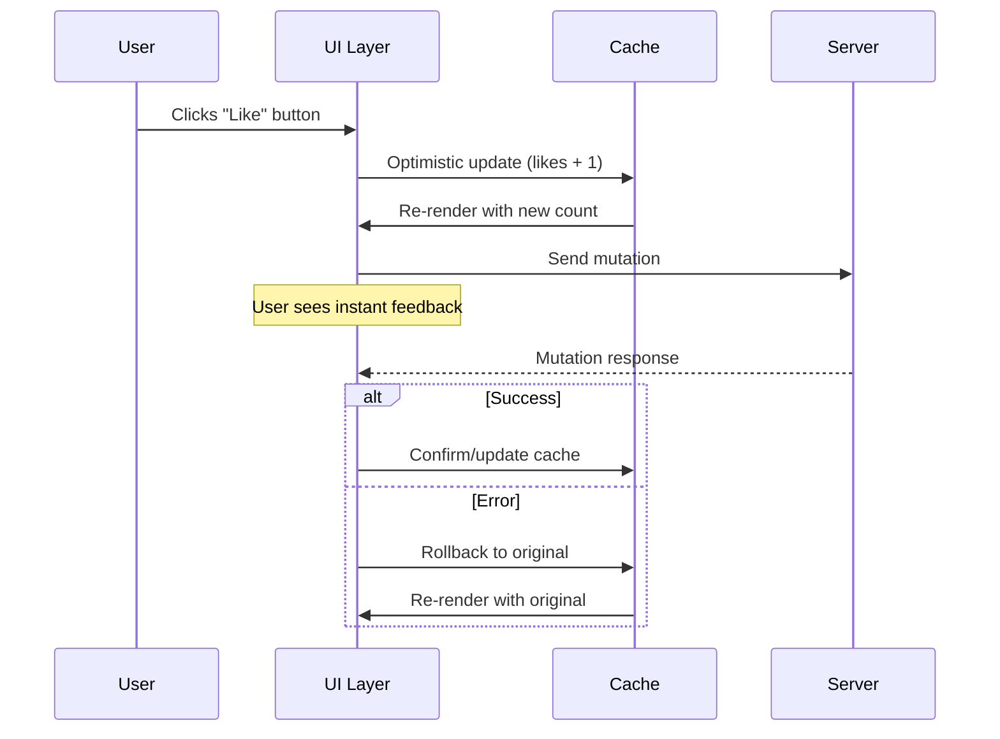
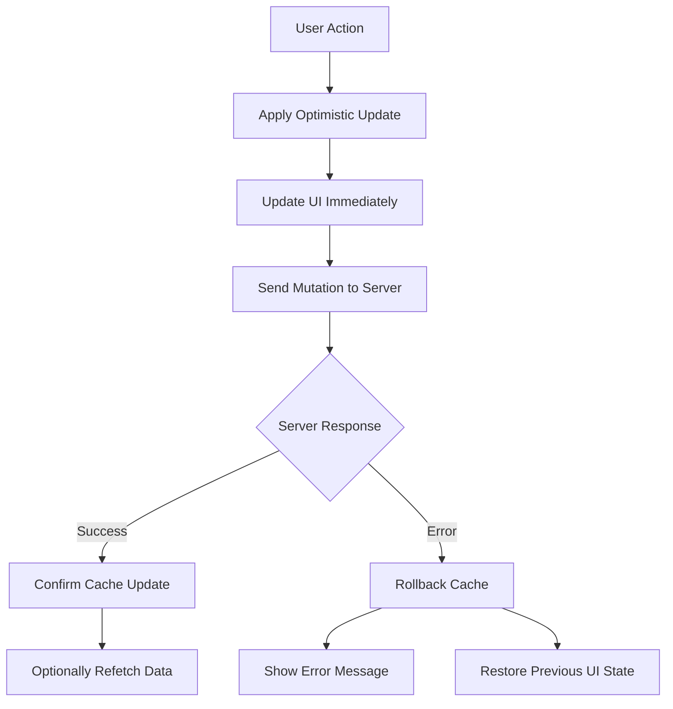

# How to Handle Optimistic UI Updates with GraphQL

Author: [nawazdhandala](https://www.github.com/nawazdhandala)

Tags: GraphQL, Apollo Client, React, Frontend, Performance, User Experience

Description: Learn how to implement optimistic UI updates in GraphQL applications to create responsive user experiences by predicting mutation outcomes before server confirmation.

---

Optimistic UI updates are a powerful technique that makes your application feel instant by immediately reflecting changes in the UI before the server responds. When combined with GraphQL mutations, this pattern creates fluid user experiences that rival native applications.

## Understanding Optimistic Updates

When a user performs an action like adding an item to a cart or liking a post, there is typically a network round-trip delay before the UI updates. Optimistic updates bypass this delay by predicting the outcome and updating the UI immediately.



## Basic Optimistic Response in Apollo Client

Apollo Client provides built-in support for optimistic responses through the `optimisticResponse` option in mutations.

```typescript
// Define the mutation for toggling a like on a post
const TOGGLE_LIKE_MUTATION = gql`
  mutation ToggleLike($postId: ID!) {
    toggleLike(postId: $postId) {
      id
      liked
      likesCount
    }
  }
`;

// Component implementing the optimistic like feature
function LikeButton({ post }) {
  const [toggleLike] = useMutation(TOGGLE_LIKE_MUTATION, {
    // optimisticResponse predicts what the server will return
    // This allows the UI to update immediately without waiting
    optimisticResponse: {
      toggleLike: {
        __typename: 'Post',
        id: post.id,
        // Toggle the current liked state
        liked: !post.liked,
        // Increment or decrement based on current state
        likesCount: post.liked ? post.likesCount - 1 : post.likesCount + 1,
      },
    },
  });

  return (
    <button onClick={() => toggleLike({ variables: { postId: post.id } })}>
      {post.liked ? 'Unlike' : 'Like'} ({post.likesCount})
    </button>
  );
}
```

## Cache Updates for Complex Mutations

When mutations affect multiple parts of your cache, use the `update` function alongside optimistic responses.

```typescript
// Mutation for adding a new comment to a post
const ADD_COMMENT_MUTATION = gql`
  mutation AddComment($postId: ID!, $content: String!) {
    addComment(postId: $postId, content: $content) {
      id
      content
      createdAt
      author {
        id
        name
        avatar
      }
    }
  }
`;

// Query fragment to read/write comments from the cache
const POST_COMMENTS_FRAGMENT = gql`
  fragment PostComments on Post {
    id
    commentsCount
    comments {
      id
      content
      createdAt
      author {
        id
        name
        avatar
      }
    }
  }
`;

function CommentForm({ postId, currentUser }) {
  const [content, setContent] = useState('');

  const [addComment, { loading }] = useMutation(ADD_COMMENT_MUTATION, {
    // Generate a temporary ID for the optimistic comment
    // Using a negative number helps identify optimistic entries
    optimisticResponse: {
      addComment: {
        __typename: 'Comment',
        // Temporary ID - will be replaced when server responds
        id: `temp-${Date.now()}`,
        content,
        createdAt: new Date().toISOString(),
        author: {
          __typename: 'User',
          id: currentUser.id,
          name: currentUser.name,
          avatar: currentUser.avatar,
        },
      },
    },

    // update function modifies the cache after mutation
    // It runs twice: once with optimistic data, once with real data
    update(cache, { data: { addComment } }) {
      // Read the current post data from cache
      const existingPost = cache.readFragment({
        id: `Post:${postId}`,
        fragment: POST_COMMENTS_FRAGMENT,
      });

      if (existingPost) {
        // Write the updated data back to cache
        cache.writeFragment({
          id: `Post:${postId}`,
          fragment: POST_COMMENTS_FRAGMENT,
          data: {
            ...existingPost,
            // Add the new comment to the beginning of the list
            comments: [addComment, ...existingPost.comments],
            // Increment the comment count
            commentsCount: existingPost.commentsCount + 1,
          },
        });
      }
    },
  });

  const handleSubmit = (e) => {
    e.preventDefault();
    addComment({ variables: { postId, content } });
    setContent('');
  };

  return (
    <form onSubmit={handleSubmit}>
      <textarea
        value={content}
        onChange={(e) => setContent(e.target.value)}
        placeholder="Write a comment..."
        disabled={loading}
      />
      <button type="submit" disabled={loading || !content.trim()}>
        {loading ? 'Posting...' : 'Post Comment'}
      </button>
    </form>
  );
}
```

## Handling List Additions and Removals

Managing optimistic updates for lists requires careful cache manipulation.

```typescript
// Mutation for creating a new todo item
const CREATE_TODO_MUTATION = gql`
  mutation CreateTodo($input: CreateTodoInput!) {
    createTodo(input: $input) {
      id
      title
      completed
      createdAt
      position
    }
  }
`;

// Query for fetching the list of todos
const GET_TODOS_QUERY = gql`
  query GetTodos($listId: ID!) {
    todoList(id: $listId) {
      id
      todos {
        id
        title
        completed
        position
      }
    }
  }
`;

function CreateTodoForm({ listId }) {
  const [title, setTitle] = useState('');

  const [createTodo] = useMutation(CREATE_TODO_MUTATION, {
    optimisticResponse: ({ input }) => ({
      createTodo: {
        __typename: 'Todo',
        // Temporary ID until server assigns the real one
        id: `temp-${Date.now()}`,
        title: input.title,
        completed: false,
        createdAt: new Date().toISOString(),
        // Position at the end of the list
        position: Date.now(),
      },
    }),

    update(cache, { data: { createTodo } }) {
      // Read the current todos from the cache
      const existingData = cache.readQuery({
        query: GET_TODOS_QUERY,
        variables: { listId },
      });

      if (existingData) {
        // Write back with the new todo appended
        cache.writeQuery({
          query: GET_TODOS_QUERY,
          variables: { listId },
          data: {
            todoList: {
              ...existingData.todoList,
              todos: [...existingData.todoList.todos, createTodo],
            },
          },
        });
      }
    },
  });

  const handleSubmit = (e) => {
    e.preventDefault();
    if (title.trim()) {
      createTodo({
        variables: {
          input: { listId, title: title.trim() },
        },
      });
      setTitle('');
    }
  };

  return (
    <form onSubmit={handleSubmit}>
      <input
        type="text"
        value={title}
        onChange={(e) => setTitle(e.target.value)}
        placeholder="Add a new todo..."
      />
      <button type="submit">Add</button>
    </form>
  );
}
```

## Optimistic Deletions

Deletions require removing items from the cache optimistically.

```typescript
// Mutation for deleting a todo item
const DELETE_TODO_MUTATION = gql`
  mutation DeleteTodo($id: ID!) {
    deleteTodo(id: $id) {
      id
    }
  }
`;

function TodoItem({ todo, listId }) {
  const [deleteTodo] = useMutation(DELETE_TODO_MUTATION, {
    // For deletions, we just need to return the ID
    optimisticResponse: {
      deleteTodo: {
        __typename: 'Todo',
        id: todo.id,
      },
    },

    update(cache, { data: { deleteTodo } }) {
      // Read current todos
      const existingData = cache.readQuery({
        query: GET_TODOS_QUERY,
        variables: { listId },
      });

      if (existingData) {
        // Filter out the deleted todo
        cache.writeQuery({
          query: GET_TODOS_QUERY,
          variables: { listId },
          data: {
            todoList: {
              ...existingData.todoList,
              todos: existingData.todoList.todos.filter(
                (t) => t.id !== deleteTodo.id
              ),
            },
          },
        });
      }
    },

    // onError is called if the mutation fails
    // At this point, Apollo has already rolled back the optimistic update
    onError(error) {
      console.error('Failed to delete todo:', error.message);
      // Show user-friendly error notification
      toast.error('Could not delete item. Please try again.');
    },
  });

  return (
    <li>
      <span>{todo.title}</span>
      <button onClick={() => deleteTodo({ variables: { id: todo.id } })}>
        Delete
      </button>
    </li>
  );
}
```

## Error Handling and Rollbacks

Proper error handling ensures users know when optimistic updates fail.



```typescript
// Custom hook for mutations with comprehensive error handling
function useOptimisticMutation(mutation, options = {}) {
  const [error, setError] = useState(null);
  const [isRolledBack, setIsRolledBack] = useState(false);

  const [mutate, result] = useMutation(mutation, {
    ...options,

    // Called when the optimistic response is applied
    onCompleted(data) {
      setError(null);
      setIsRolledBack(false);
      options.onCompleted?.(data);
    },

    // Called when the mutation fails
    // Apollo automatically rolls back the optimistic update
    onError(err) {
      setError(err);
      setIsRolledBack(true);

      // Log for debugging
      console.error('Mutation failed, rolled back optimistic update:', err);

      // Call custom error handler if provided
      options.onError?.(err);
    },
  });

  return [
    mutate,
    {
      ...result,
      error,
      isRolledBack,
      // Helper to clear error state
      clearError: () => {
        setError(null);
        setIsRolledBack(false);
      },
    },
  ];
}

// Usage with error feedback
function EditableTitle({ item }) {
  const [title, setTitle] = useState(item.title);
  const [isEditing, setIsEditing] = useState(false);

  const [updateTitle, { error, isRolledBack }] = useOptimisticMutation(
    UPDATE_TITLE_MUTATION,
    {
      optimisticResponse: {
        updateItem: {
          __typename: 'Item',
          id: item.id,
          title,
        },
      },
    }
  );

  const handleSave = () => {
    updateTitle({ variables: { id: item.id, title } });
    setIsEditing(false);
  };

  return (
    <div>
      {isEditing ? (
        <input
          value={title}
          onChange={(e) => setTitle(e.target.value)}
          onBlur={handleSave}
        />
      ) : (
        <span onClick={() => setIsEditing(true)}>{item.title}</span>
      )}
      {/* Show error indicator if the update was rolled back */}
      {isRolledBack && (
        <span className="error-indicator" title={error?.message}>
          Failed to save
        </span>
      )}
    </div>
  );
}
```

## Optimistic Updates with Pagination

Handling optimistic updates with paginated queries requires extra care.

```typescript
// Paginated query for loading posts
const GET_POSTS_QUERY = gql`
  query GetPosts($cursor: String, $limit: Int!) {
    posts(cursor: $cursor, limit: $limit) {
      edges {
        node {
          id
          title
          content
          createdAt
        }
        cursor
      }
      pageInfo {
        hasNextPage
        endCursor
      }
    }
  }
`;

// Mutation for creating a new post
const CREATE_POST_MUTATION = gql`
  mutation CreatePost($input: CreatePostInput!) {
    createPost(input: $input) {
      id
      title
      content
      createdAt
    }
  }
`;

function CreatePostForm() {
  const [createPost] = useMutation(CREATE_POST_MUTATION, {
    optimisticResponse: ({ input }) => ({
      createPost: {
        __typename: 'Post',
        id: `temp-${Date.now()}`,
        title: input.title,
        content: input.content,
        createdAt: new Date().toISOString(),
      },
    }),

    update(cache, { data: { createPost } }) {
      // Modify the cache directly for paginated queries
      // This approach modifies the ROOT_QUERY
      cache.modify({
        fields: {
          // The field name matches your query
          posts(existingPosts = { edges: [], pageInfo: {} }) {
            // Create a reference to the new post
            const newPostRef = cache.writeFragment({
              data: createPost,
              fragment: gql`
                fragment NewPost on Post {
                  id
                  title
                  content
                  createdAt
                }
              `,
            });

            // Create a new edge for the post
            const newEdge = {
              __typename: 'PostEdge',
              node: newPostRef,
              cursor: createPost.id,
            };

            // Prepend the new edge to existing edges
            return {
              ...existingPosts,
              edges: [newEdge, ...existingPosts.edges],
            };
          },
        },
      });
    },
  });

  // ... form implementation
}
```

## Concurrent Optimistic Updates

Handle multiple simultaneous optimistic updates safely.

```typescript
// Hook for managing concurrent optimistic updates
function useConcurrentOptimisticUpdates() {
  // Track pending optimistic updates
  const pendingUpdatesRef = useRef(new Map());

  const addPendingUpdate = (id, originalData) => {
    pendingUpdatesRef.current.set(id, {
      originalData,
      timestamp: Date.now(),
    });
  };

  const removePendingUpdate = (id) => {
    pendingUpdatesRef.current.delete(id);
  };

  const getPendingUpdate = (id) => {
    return pendingUpdatesRef.current.get(id);
  };

  // Clean up old pending updates after timeout
  useEffect(() => {
    const interval = setInterval(() => {
      const now = Date.now();
      const timeout = 30000; // 30 seconds

      pendingUpdatesRef.current.forEach((value, key) => {
        if (now - value.timestamp > timeout) {
          console.warn(`Pending update ${key} timed out`);
          pendingUpdatesRef.current.delete(key);
        }
      });
    }, 10000);

    return () => clearInterval(interval);
  }, []);

  return {
    addPendingUpdate,
    removePendingUpdate,
    getPendingUpdate,
    hasPendingUpdates: () => pendingUpdatesRef.current.size > 0,
  };
}

// Component using concurrent updates
function BulkActions({ items }) {
  const { addPendingUpdate, removePendingUpdate } =
    useConcurrentOptimisticUpdates();

  const [updateItems] = useMutation(BULK_UPDATE_MUTATION, {
    optimisticResponse: ({ ids, updates }) => ({
      bulkUpdate: ids.map((id) => ({
        __typename: 'Item',
        id,
        ...updates,
      })),
    }),

    onCompleted(data) {
      // Clear pending updates on success
      data.bulkUpdate.forEach((item) => {
        removePendingUpdate(item.id);
      });
    },

    onError(error, { variables }) {
      // Handle rollback for failed items
      variables.ids.forEach((id) => {
        const pending = getPendingUpdate(id);
        if (pending) {
          console.error(`Failed to update item ${id}:`, error);
          removePendingUpdate(id);
        }
      });
    },
  });

  const handleBulkComplete = (ids) => {
    // Store original state before optimistic update
    ids.forEach((id) => {
      const item = items.find((i) => i.id === id);
      addPendingUpdate(id, item);
    });

    updateItems({
      variables: {
        ids,
        updates: { completed: true },
      },
    });
  };

  return (
    <button onClick={() => handleBulkComplete(items.map((i) => i.id))}>
      Complete All
    </button>
  );
}
```

## Visual Feedback for Optimistic States

Provide visual cues to users about optimistic updates.

```typescript
// Component with visual feedback for optimistic state
function OptimisticTodoItem({ todo }) {
  // Check if this is a temporary/optimistic item
  const isOptimistic = todo.id.startsWith('temp-');

  const [toggleComplete] = useMutation(TOGGLE_TODO_MUTATION, {
    optimisticResponse: {
      toggleTodo: {
        __typename: 'Todo',
        id: todo.id,
        completed: !todo.completed,
      },
    },
  });

  return (
    <li
      className={`
        todo-item
        ${todo.completed ? 'completed' : ''}
        ${isOptimistic ? 'optimistic' : ''}
      `}
      // Reduce opacity for optimistic items to indicate pending state
      style={{ opacity: isOptimistic ? 0.7 : 1 }}
    >
      <input
        type="checkbox"
        checked={todo.completed}
        onChange={() => toggleComplete({ variables: { id: todo.id } })}
        // Disable interaction for optimistic items
        disabled={isOptimistic}
      />
      <span>{todo.title}</span>
      {/* Show spinner for optimistic items */}
      {isOptimistic && <span className="spinner" />}
    </li>
  );
}
```

## Summary

| Aspect | Implementation |
|--------|----------------|
| **Basic Updates** | Use `optimisticResponse` with predicted data |
| **Cache Updates** | Use `update` function for complex mutations |
| **List Operations** | Modify cache queries for adds/removes |
| **Error Handling** | Leverage automatic rollbacks, show user feedback |
| **Pagination** | Use `cache.modify` for paginated queries |
| **Visual Feedback** | Indicate optimistic state with styling |
| **Concurrent Updates** | Track pending updates with refs |

Optimistic UI updates transform the user experience by eliminating perceived latency. The key is predicting server responses accurately and providing clear visual feedback when predictions fail. Combined with proper error handling and rollback mechanisms, optimistic updates make GraphQL applications feel responsive and native.
