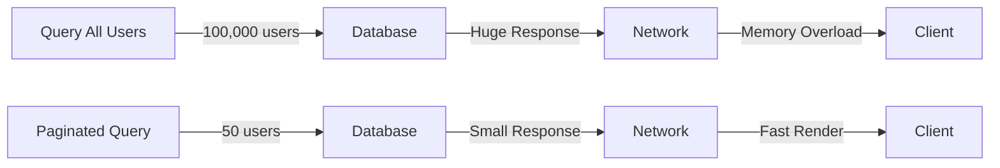
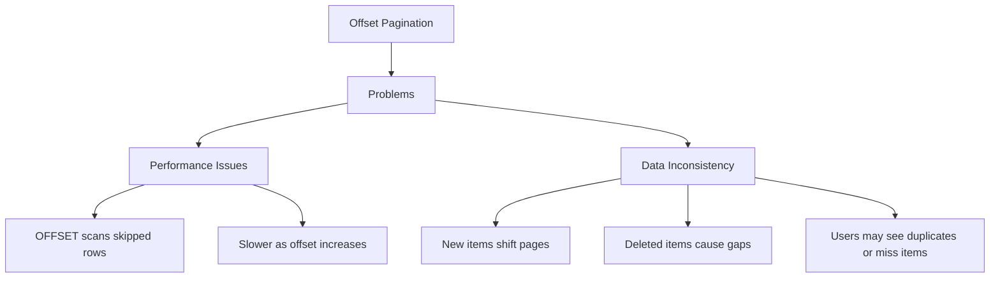
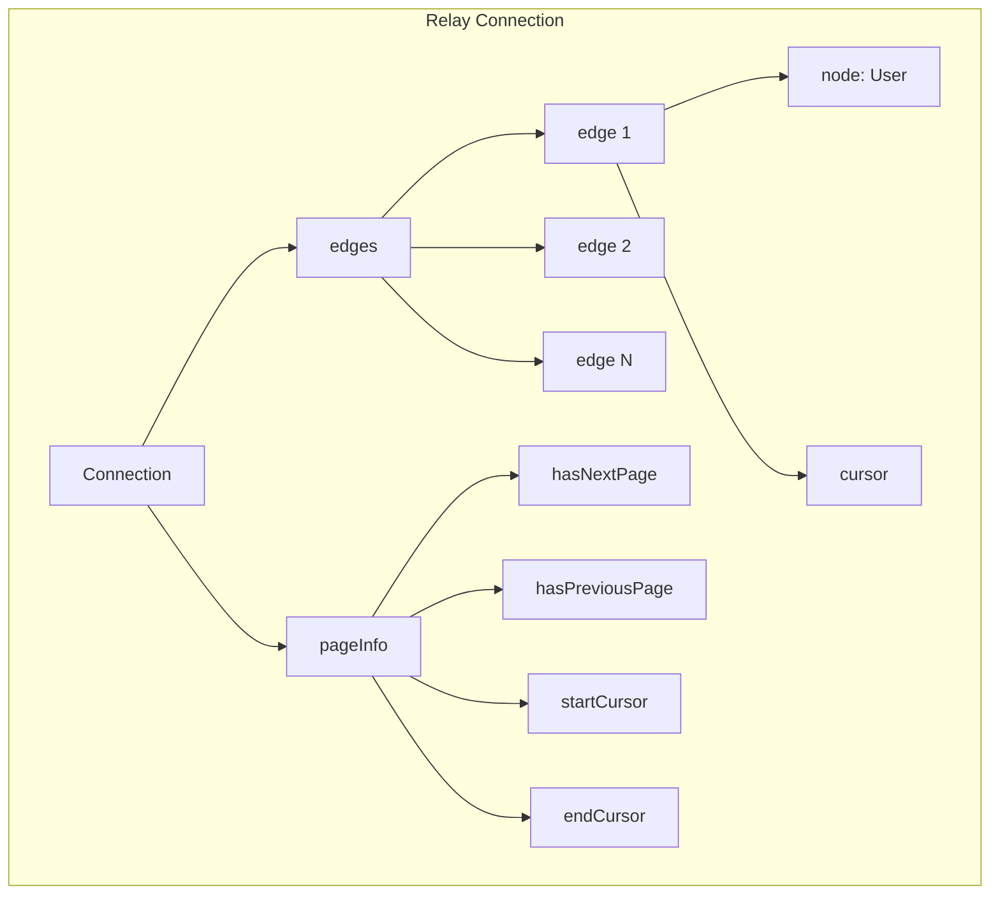
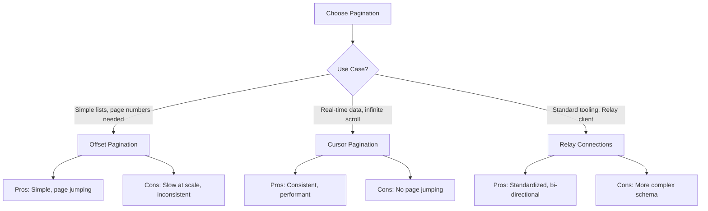

# How to Handle Pagination in GraphQL APIs

Author: [nawazdhandala](https://www.github.com/nawazdhandala)

Tags: GraphQL, Pagination, API Development, Performance, Cursor, Relay

Description: Learn how to implement pagination in GraphQL APIs using offset-based, cursor-based, and Relay-style connections for efficient data fetching.

---

Pagination is essential for GraphQL APIs that return large datasets. Without pagination, queries can return thousands of records, causing performance issues and poor user experience. This guide covers the three main pagination approaches: offset-based, cursor-based, and Relay-style connections.

## Why Pagination Matters

Returning all records at once creates several problems:



## Offset-Based Pagination

Offset pagination uses `skip` and `limit` parameters, similar to SQL OFFSET/LIMIT.

### Schema Definition

```graphql
# schema.graphql - Offset-based pagination schema
type Query {
  # Simple offset pagination
  # skip: Number of items to skip
  # limit: Maximum items to return
  users(skip: Int = 0, limit: Int = 10): UsersResult!

  # With sorting options
  posts(
    skip: Int = 0
    limit: Int = 10
    sortBy: PostSortField = CREATED_AT
    sortOrder: SortOrder = DESC
  ): PostsResult!
}

# Result type includes pagination metadata
type UsersResult {
  items: [User!]!
  totalCount: Int!
  hasMore: Boolean!
}

type PostsResult {
  items: [Post!]!
  totalCount: Int!
  hasMore: Boolean!
}

enum PostSortField {
  CREATED_AT
  UPDATED_AT
  TITLE
}

enum SortOrder {
  ASC
  DESC
}
```

### Resolver Implementation

```javascript
// resolvers.js - Offset pagination resolvers
const resolvers = {
  Query: {
    users: async (_, { skip, limit }, { db }) => {
      // Validate pagination parameters
      // Prevent negative values and excessive limits
      const validSkip = Math.max(0, skip);
      const validLimit = Math.min(Math.max(1, limit), 100); // Cap at 100

      // Execute parallel queries for items and count
      const [items, totalCount] = await Promise.all([
        db.users.findMany({
          skip: validSkip,
          take: validLimit,
          orderBy: { createdAt: 'desc' },
        }),
        db.users.count(),
      ]);

      return {
        items,
        totalCount,
        // Calculate if there are more items after this page
        hasMore: validSkip + items.length < totalCount,
      };
    },

    posts: async (_, { skip, limit, sortBy, sortOrder }, { db }) => {
      const validSkip = Math.max(0, skip);
      const validLimit = Math.min(Math.max(1, limit), 100);

      // Map enum values to database field names
      const sortFieldMap = {
        CREATED_AT: 'createdAt',
        UPDATED_AT: 'updatedAt',
        TITLE: 'title',
      };

      const [items, totalCount] = await Promise.all([
        db.posts.findMany({
          skip: validSkip,
          take: validLimit,
          orderBy: {
            [sortFieldMap[sortBy]]: sortOrder.toLowerCase(),
          },
        }),
        db.posts.count(),
      ]);

      return {
        items,
        totalCount,
        hasMore: validSkip + items.length < totalCount,
      };
    },
  },
};
```

### Client Usage

```javascript
// client.js - Using offset pagination
import { gql, useQuery } from '@apollo/client';
import { useState } from 'react';

const GET_USERS = gql`
  query GetUsers($skip: Int!, $limit: Int!) {
    users(skip: $skip, limit: $limit) {
      items {
        id
        name
        email
      }
      totalCount
      hasMore
    }
  }
`;

function UserList() {
  const [page, setPage] = useState(0);
  const limit = 10;

  const { data, loading, error } = useQuery(GET_USERS, {
    variables: {
      skip: page * limit,
      limit,
    },
  });

  if (loading) return <p>Loading...</p>;
  if (error) return <p>Error: {error.message}</p>;

  const { items, totalCount, hasMore } = data.users;
  const totalPages = Math.ceil(totalCount / limit);

  return (
    <div>
      <ul>
        {items.map((user) => (
          <li key={user.id}>{user.name}</li>
        ))}
      </ul>

      <div className="pagination">
        <button
          disabled={page === 0}
          onClick={() => setPage(page - 1)}
        >
          Previous
        </button>

        <span>
          Page {page + 1} of {totalPages}
        </span>

        <button
          disabled={!hasMore}
          onClick={() => setPage(page + 1)}
        >
          Next
        </button>
      </div>
    </div>
  );
}
```

### Offset Pagination Limitations



## Cursor-Based Pagination

Cursor pagination uses a unique identifier to mark the position in the dataset.

### Schema Definition

```graphql
# schema.graphql - Cursor-based pagination
type Query {
  users(
    # Cursor of the last item from previous page
    after: String
    # Number of items to return
    first: Int = 10
  ): UserConnection!

  # Backward pagination
  usersBackward(
    before: String
    last: Int = 10
  ): UserConnection!
}

# Connection type contains edges and page info
type UserConnection {
  edges: [UserEdge!]!
  pageInfo: PageInfo!
  totalCount: Int!
}

# Edge wraps each item with its cursor
type UserEdge {
  node: User!
  cursor: String!
}

# Page info for navigation
type PageInfo {
  hasNextPage: Boolean!
  hasPreviousPage: Boolean!
  startCursor: String
  endCursor: String
}
```

### Resolver Implementation

```javascript
// cursor-resolvers.js - Cursor pagination implementation
import { Buffer } from 'buffer';

// Encode a cursor from an ID
// Using base64 makes cursors opaque to clients
function encodeCursor(id) {
  return Buffer.from(`cursor:${id}`).toString('base64');
}

// Decode a cursor back to an ID
function decodeCursor(cursor) {
  const decoded = Buffer.from(cursor, 'base64').toString('utf-8');
  return decoded.replace('cursor:', '');
}

const resolvers = {
  Query: {
    users: async (_, { after, first }, { db }) => {
      // Validate the limit
      const limit = Math.min(Math.max(1, first), 100);

      // Build the query conditions
      const where = {};

      if (after) {
        // Decode the cursor to get the ID
        const afterId = decodeCursor(after);

        // Find items after this cursor
        // Assuming ID-based ordering (adjust for your use case)
        where.id = { gt: afterId };
      }

      // Fetch one extra item to determine if there are more pages
      const items = await db.users.findMany({
        where,
        take: limit + 1,
        orderBy: { id: 'asc' },
      });

      // Check if there are more items
      const hasNextPage = items.length > limit;

      // Remove the extra item if it exists
      const edges = items.slice(0, limit).map((user) => ({
        node: user,
        cursor: encodeCursor(user.id),
      }));

      // Get total count for UI display
      const totalCount = await db.users.count();

      return {
        edges,
        totalCount,
        pageInfo: {
          hasNextPage,
          hasPreviousPage: !!after, // Has previous if cursor was provided
          startCursor: edges[0]?.cursor || null,
          endCursor: edges[edges.length - 1]?.cursor || null,
        },
      };
    },
  },
};
```

### Cursor Pagination with Timestamps

For time-based ordering, use timestamps in cursors.

```javascript
// timestamp-cursor.js - Cursor with timestamp and ID for stable ordering
import { Buffer } from 'buffer';

// Compound cursor with timestamp and ID
// This ensures stable ordering even with same timestamps
function encodeTimestampCursor(timestamp, id) {
  const data = JSON.stringify({ t: timestamp.toISOString(), i: id });
  return Buffer.from(data).toString('base64');
}

function decodeTimestampCursor(cursor) {
  const data = JSON.parse(Buffer.from(cursor, 'base64').toString('utf-8'));
  return {
    timestamp: new Date(data.t),
    id: data.i,
  };
}

const resolvers = {
  Query: {
    posts: async (_, { after, first }, { db }) => {
      const limit = Math.min(Math.max(1, first), 100);

      // Build WHERE clause for cursor pagination
      let whereClause = {};

      if (after) {
        const { timestamp, id } = decodeTimestampCursor(after);

        // Get items with either:
        // 1. Same timestamp but greater ID, or
        // 2. Earlier timestamp
        whereClause = {
          OR: [
            {
              createdAt: timestamp,
              id: { gt: id },
            },
            {
              createdAt: { lt: timestamp },
            },
          ],
        };
      }

      const items = await db.posts.findMany({
        where: whereClause,
        take: limit + 1,
        orderBy: [
          { createdAt: 'desc' },
          { id: 'asc' },
        ],
      });

      const hasNextPage = items.length > limit;
      const pageItems = items.slice(0, limit);

      const edges = pageItems.map((post) => ({
        node: post,
        cursor: encodeTimestampCursor(post.createdAt, post.id),
      }));

      return {
        edges,
        pageInfo: {
          hasNextPage,
          hasPreviousPage: !!after,
          startCursor: edges[0]?.cursor || null,
          endCursor: edges[edges.length - 1]?.cursor || null,
        },
      };
    },
  },
};
```

## Relay-Style Connections

The Relay specification defines a standard for cursor pagination that many tools support.



### Full Relay Implementation

```graphql
# schema.graphql - Full Relay-compliant schema
interface Node {
  id: ID!
}

type User implements Node {
  id: ID!
  name: String!
  email: String!
  posts(first: Int, after: String, last: Int, before: String): PostConnection!
}

type Post implements Node {
  id: ID!
  title: String!
  content: String!
  author: User!
  comments(first: Int, after: String): CommentConnection!
}

type Comment implements Node {
  id: ID!
  text: String!
  author: User!
}

# Generic connection types
type UserConnection {
  edges: [UserEdge!]!
  pageInfo: PageInfo!
  totalCount: Int!
}

type UserEdge {
  node: User!
  cursor: String!
}

type PostConnection {
  edges: [PostEdge!]!
  pageInfo: PageInfo!
  totalCount: Int!
}

type PostEdge {
  node: Post!
  cursor: String!
}

type CommentConnection {
  edges: [CommentEdge!]!
  pageInfo: PageInfo!
  totalCount: Int!
}

type CommentEdge {
  node: Comment!
  cursor: String!
}

type PageInfo {
  hasNextPage: Boolean!
  hasPreviousPage: Boolean!
  startCursor: String
  endCursor: String
}

type Query {
  node(id: ID!): Node
  users(first: Int, after: String, last: Int, before: String): UserConnection!
}
```

### Reusable Connection Builder

```javascript
// connection-builder.js - Reusable pagination utilities

// Build a connection response from items
function buildConnection(items, args, totalCount, getCursor) {
  const { first, after, last, before } = args;

  // Determine if we're paginating forward or backward
  const isForward = first !== undefined;
  const limit = isForward ? first : last;

  // Check for extra items (to determine hasMore)
  const hasExtraItem = items.length > limit;
  const pageItems = items.slice(0, limit);

  // For backward pagination, reverse the items
  if (!isForward) {
    pageItems.reverse();
  }

  // Build edges with cursors
  const edges = pageItems.map((item) => ({
    node: item,
    cursor: getCursor(item),
  }));

  return {
    edges,
    totalCount,
    pageInfo: {
      hasNextPage: isForward ? hasExtraItem : !!before,
      hasPreviousPage: isForward ? !!after : hasExtraItem,
      startCursor: edges[0]?.cursor || null,
      endCursor: edges[edges.length - 1]?.cursor || null,
    },
  };
}

// Build query parameters from connection args
function buildPaginationQuery(args, cursorField = 'id') {
  const { first, after, last, before } = args;
  const query = { where: {}, orderBy: {}, take: 0 };

  if (first !== undefined) {
    // Forward pagination
    query.take = Math.min(first, 100) + 1;
    query.orderBy[cursorField] = 'asc';

    if (after) {
      const afterValue = decodeCursor(after);
      query.where[cursorField] = { gt: afterValue };
    }
  } else if (last !== undefined) {
    // Backward pagination
    query.take = Math.min(last, 100) + 1;
    query.orderBy[cursorField] = 'desc';

    if (before) {
      const beforeValue = decodeCursor(before);
      query.where[cursorField] = { lt: beforeValue };
    }
  }

  return query;
}

export { buildConnection, buildPaginationQuery };
```

### Using the Connection Builder

```javascript
// resolvers.js - Using the connection builder
import { buildConnection, buildPaginationQuery } from './connection-builder.js';

const resolvers = {
  Query: {
    users: async (_, args, { db }) => {
      const paginationQuery = buildPaginationQuery(args);

      const [items, totalCount] = await Promise.all([
        db.users.findMany(paginationQuery),
        db.users.count(),
      ]);

      return buildConnection(
        items,
        args,
        totalCount,
        (user) => encodeCursor(user.id)
      );
    },
  },

  User: {
    posts: async (user, args, { db }) => {
      const paginationQuery = buildPaginationQuery(args);
      paginationQuery.where.authorId = user.id;

      const [items, totalCount] = await Promise.all([
        db.posts.findMany(paginationQuery),
        db.posts.count({ where: { authorId: user.id } }),
      ]);

      return buildConnection(
        items,
        args,
        totalCount,
        (post) => encodeCursor(post.id)
      );
    },
  },
};
```

## Client Implementation with Infinite Scroll

```jsx
// InfiniteUserList.jsx - Infinite scroll with cursor pagination
import { gql, useQuery } from '@apollo/client';
import { useCallback, useRef } from 'react';

const GET_USERS = gql`
  query GetUsers($first: Int!, $after: String) {
    users(first: $first, after: $after) {
      edges {
        node {
          id
          name
          email
        }
        cursor
      }
      pageInfo {
        hasNextPage
        endCursor
      }
      totalCount
    }
  }
`;

function InfiniteUserList() {
  const observerRef = useRef();

  const { data, loading, error, fetchMore } = useQuery(GET_USERS, {
    variables: { first: 20 },
    notifyOnNetworkStatusChange: true,
  });

  // Callback ref for the last item (intersection observer)
  const lastItemRef = useCallback(
    (node) => {
      if (loading) return;

      // Disconnect previous observer
      if (observerRef.current) {
        observerRef.current.disconnect();
      }

      // Create new observer
      observerRef.current = new IntersectionObserver((entries) => {
        if (entries[0].isIntersecting && data?.users.pageInfo.hasNextPage) {
          // Fetch more when last item becomes visible
          fetchMore({
            variables: {
              first: 20,
              after: data.users.pageInfo.endCursor,
            },
            // Merge new results with existing
            updateQuery: (prev, { fetchMoreResult }) => {
              if (!fetchMoreResult) return prev;

              return {
                users: {
                  ...fetchMoreResult.users,
                  edges: [
                    ...prev.users.edges,
                    ...fetchMoreResult.users.edges,
                  ],
                },
              };
            },
          });
        }
      });

      if (node) {
        observerRef.current.observe(node);
      }
    },
    [loading, data, fetchMore]
  );

  if (error) return <p>Error: {error.message}</p>;

  return (
    <div>
      <p>Total users: {data?.users.totalCount}</p>

      <ul>
        {data?.users.edges.map(({ node }, index) => {
          const isLast = index === data.users.edges.length - 1;

          return (
            <li
              key={node.id}
              ref={isLast ? lastItemRef : null}
            >
              {node.name} - {node.email}
            </li>
          );
        })}
      </ul>

      {loading && <p>Loading more...</p>}
    </div>
  );
}

export default InfiniteUserList;
```

## Comparison of Pagination Approaches



| Feature | Offset | Cursor | Relay |
|---------|--------|--------|-------|
| Jump to page | Yes | No | No |
| Performance | O(n) | O(1) | O(1) |
| Consistent results | No | Yes | Yes |
| Real-time friendly | No | Yes | Yes |
| Implementation complexity | Low | Medium | High |
| Client tooling support | Good | Good | Excellent |

## Summary

Implementing pagination in GraphQL APIs requires choosing the right approach:

1. **Offset pagination** is simple but has performance and consistency issues
2. **Cursor pagination** provides stable results and better performance
3. **Relay connections** offer a standardized approach with excellent tooling

Choose based on your requirements:
- Use offset for admin panels with page navigation
- Use cursor for user-facing feeds and real-time data
- Use Relay connections for maximum compatibility and bidirectional pagination

**Related Reading:**

- [How to Handle File Uploads in GraphQL](https://oneuptime.com/blog/post/2026-01-24-graphql-file-uploads/view)
- [How to Fix "Maximum Query Depth" Errors in GraphQL](https://oneuptime.com/blog/post/2026-01-24-graphql-maximum-query-depth/view)
- [How to Configure GraphQL Subscriptions with WebSockets](https://oneuptime.com/blog/post/2026-01-24-graphql-subscriptions-websockets/view)
