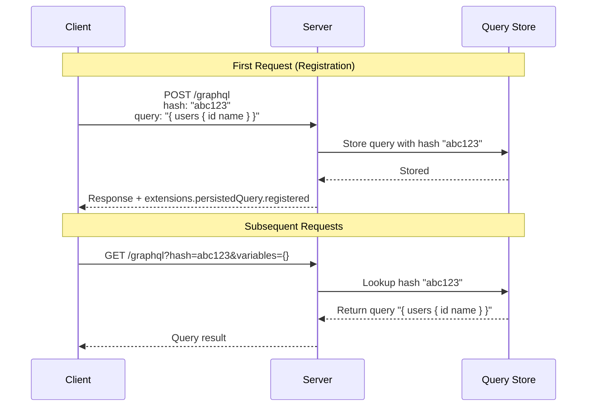
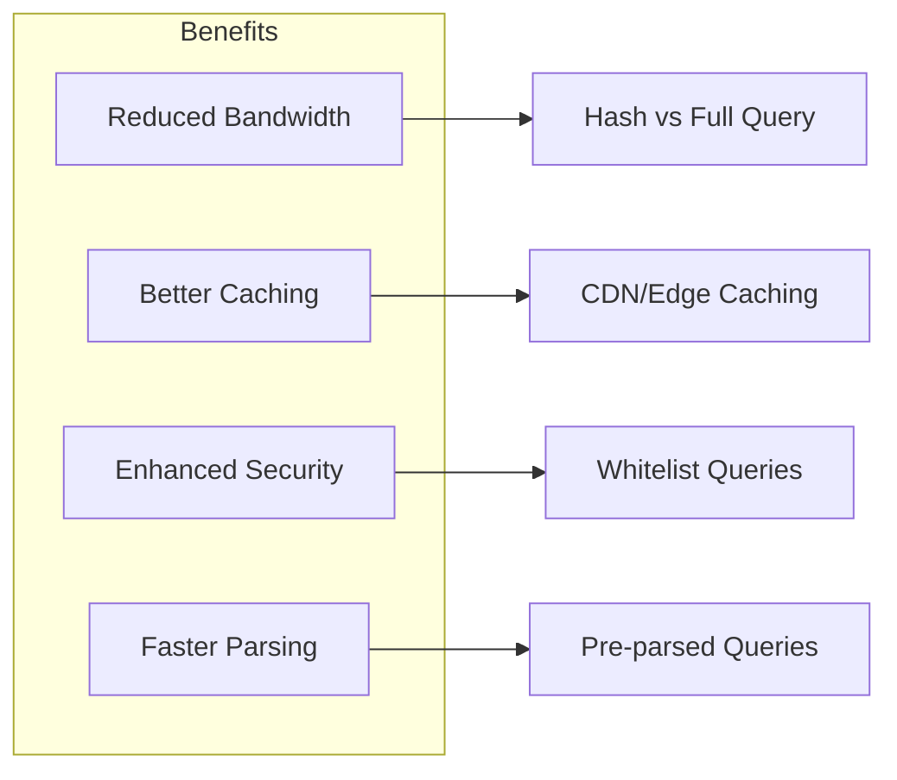
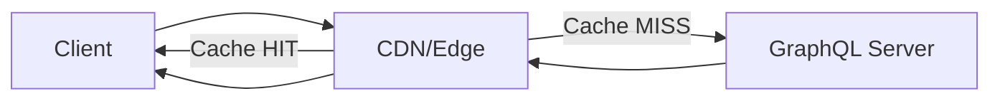

# How to Configure GraphQL Persisted Queries

Author: [nawazdhandala](https://www.github.com/nawazdhandala)

Tags: GraphQL, Performance, Security, Apollo, Caching, API Optimization

Description: Learn how to configure persisted queries in GraphQL to improve performance, enhance security, and reduce bandwidth by replacing query strings with unique identifiers.

---

Persisted queries replace full GraphQL query strings with unique identifiers, dramatically reducing payload sizes and enabling advanced caching strategies. This technique is essential for production GraphQL applications that prioritize performance and security.

## How Persisted Queries Work

Instead of sending the full query text with every request, clients send a hash identifier that the server maps to the actual query.



## Benefits of Persisted Queries



## Apollo Client Configuration

### Automatic Persisted Queries (APQ)

Apollo Client supports automatic persisted queries out of the box, which dynamically registers queries on first use.

```javascript
// apollo-client.js
import { ApolloClient, InMemoryCache, HttpLink } from '@apollo/client';
import { createPersistedQueryLink } from '@apollo/client/link/persisted-queries';
import { sha256 } from 'crypto-hash';

// Create the persisted query link
// This link intercepts queries and adds hash identifiers
const persistedQueryLink = createPersistedQueryLink({
  // Function to generate the hash for each query
  sha256,

  // Use GET requests for persisted queries (enables CDN caching)
  useGETForHashedQueries: true,
});

// Standard HTTP link for making requests
const httpLink = new HttpLink({
  uri: 'https://api.example.com/graphql',
});

// Create the Apollo Client with persisted queries enabled
const client = new ApolloClient({
  // Chain the links: persisted queries -> http
  link: persistedQueryLink.concat(httpLink),
  cache: new InMemoryCache(),
});

export default client;
```

### Custom Hash Generation

```javascript
// custom-hash.js
import { createPersistedQueryLink } from '@apollo/client/link/persisted-queries';

// Use a custom hashing function for specific requirements
const persistedQueryLink = createPersistedQueryLink({
  // Custom hash function that returns a Promise<string>
  sha256: async (query) => {
    // Use Web Crypto API for browser compatibility
    const encoder = new TextEncoder();
    const data = encoder.encode(query);
    const hashBuffer = await crypto.subtle.digest('SHA-256', data);

    // Convert ArrayBuffer to hex string
    const hashArray = Array.from(new Uint8Array(hashBuffer));
    const hashHex = hashArray.map(b => b.toString(16).padStart(2, '0')).join('');

    return hashHex;
  },

  // Disable automatic GET requests if needed
  useGETForHashedQueries: false,
});

export default persistedQueryLink;
```

## Apollo Server Configuration

### Basic APQ Setup

```javascript
// server.js
const { ApolloServer } = require('@apollo/server');
const { expressMiddleware } = require('@apollo/server/express4');
const { KeyvAdapter } = require('@apollo/utils.keyvadapter');
const Keyv = require('keyv');

// Create a Keyv instance for storing persisted queries
// This can use Redis, Memcached, or any Keyv adapter
const queryCache = new Keyv('redis://localhost:6379', {
  namespace: 'persisted-queries',
  ttl: 86400000, // 24 hours in milliseconds
});

// Create the Apollo Server with APQ enabled
const server = new ApolloServer({
  typeDefs,
  resolvers,

  // Configure persisted queries
  persistedQueries: {
    // Use the KeyvAdapter for Apollo Server 4+
    cache: new KeyvAdapter(queryCache),

    // Time-to-live for cached queries
    ttl: 86400, // 24 hours in seconds
  },
});

await server.start();

// Apply middleware with Express
app.use(
  '/graphql',
  cors(),
  express.json(),
  expressMiddleware(server, {
    context: async ({ req }) => ({
      user: req.user,
    }),
  })
);
```

### Strict Persisted Queries (Security Mode)

For maximum security, only allow pre-registered queries.

```javascript
// strict-persisted-queries.js
const { ApolloServer } = require('@apollo/server');
const fs = require('fs');
const path = require('path');

// Load pre-generated query manifest
// This file contains all allowed queries and their hashes
const queryManifest = JSON.parse(
  fs.readFileSync(path.join(__dirname, 'persisted-queries.json'), 'utf-8')
);

// Create a map for fast lookups
const queryStore = new Map(
  Object.entries(queryManifest.operations).map(([hash, operation]) => [
    hash,
    operation.body,
  ])
);

// Custom persisted queries implementation
const strictPersistedQueries = {
  // Called when a persisted query hash is received
  async get(hash) {
    return queryStore.get(hash);
  },

  // Disable registration of new queries in production
  async set(hash, query) {
    if (process.env.NODE_ENV === 'production') {
      // In production, reject unknown queries
      throw new Error('Query not found in manifest');
    }
    // In development, allow dynamic registration
    queryStore.set(hash, query);
  },
};

const server = new ApolloServer({
  typeDefs,
  resolvers,

  // Use strict persisted queries
  persistedQueries: {
    cache: strictPersistedQueries,
  },

  // Reject queries that are not persisted in production
  allowBatchedHttpRequests: false,

  plugins: [
    {
      async requestDidStart() {
        return {
          async didResolveOperation(requestContext) {
            // In production, only allow persisted queries
            if (process.env.NODE_ENV === 'production') {
              const { request } = requestContext;

              // Check if this is a persisted query
              if (!request.extensions?.persistedQuery) {
                throw new Error(
                  'Only persisted queries are allowed in production'
                );
              }
            }
          },
        };
      },
    },
  ],
});
```

## Generating Query Manifests

### Build-time Query Extraction

```javascript
// scripts/extract-queries.js
const { parse, print } = require('graphql');
const { createHash } = require('crypto');
const glob = require('glob');
const fs = require('fs');
const path = require('path');

// Configuration for query extraction
const config = {
  // Glob pattern to find all GraphQL files
  queryFiles: 'src/**/*.graphql',
  // Output file for the manifest
  outputFile: 'persisted-queries.json',
};

async function extractQueries() {
  const queries = {};

  // Find all GraphQL files
  const files = glob.sync(config.queryFiles);

  for (const file of files) {
    const content = fs.readFileSync(file, 'utf-8');

    try {
      // Parse the GraphQL document
      const document = parse(content);

      // Process each operation in the file
      document.definitions.forEach((definition) => {
        if (
          definition.kind === 'OperationDefinition' &&
          definition.name
        ) {
          // Normalize the query (removes whitespace variations)
          const normalizedQuery = print(definition);

          // Generate SHA-256 hash
          const hash = createHash('sha256')
            .update(normalizedQuery)
            .digest('hex');

          // Store in manifest
          queries[hash] = {
            name: definition.name.value,
            type: definition.operation,
            body: normalizedQuery,
            source: file,
          };

          console.log(`Extracted: ${definition.name.value} -> ${hash.slice(0, 8)}...`);
        }
      });
    } catch (error) {
      console.error(`Error parsing ${file}: ${error.message}`);
    }
  }

  // Write manifest
  const manifest = {
    version: 1,
    generatedAt: new Date().toISOString(),
    operations: queries,
  };

  fs.writeFileSync(
    config.outputFile,
    JSON.stringify(manifest, null, 2)
  );

  console.log(`\nGenerated manifest with ${Object.keys(queries).length} queries`);
}

extractQueries().catch(console.error);
```

### Using Apollo CLI for Extraction

```bash
# Install Apollo CLI
npm install -g @apollo/rover

# Extract queries from your codebase
rover persisted-queries publish \
  --graph-ref my-graph@production \
  --manifest ./persisted-query-manifest.json
```

## CDN and Edge Caching

Persisted queries enable powerful caching at the CDN level.



### Cloudflare Configuration

```javascript
// cloudflare-worker.js
// Cloudflare Worker for GraphQL persisted query caching

addEventListener('fetch', (event) => {
  event.respondWith(handleRequest(event.request));
});

async function handleRequest(request) {
  const url = new URL(request.url);

  // Only cache GET requests with persisted query hash
  if (request.method === 'GET' && url.searchParams.has('extensions')) {
    const extensions = JSON.parse(url.searchParams.get('extensions'));

    if (extensions.persistedQuery?.sha256Hash) {
      const hash = extensions.persistedQuery.sha256Hash;
      const variables = url.searchParams.get('variables') || '{}';

      // Create cache key from hash and variables
      const cacheKey = `graphql:${hash}:${variables}`;

      // Check cache
      const cache = caches.default;
      let response = await cache.match(request);

      if (response) {
        // Add cache status header
        response = new Response(response.body, response);
        response.headers.set('X-Cache-Status', 'HIT');
        return response;
      }

      // Cache miss - fetch from origin
      response = await fetch(request);

      // Only cache successful responses
      if (response.ok) {
        const responseClone = response.clone();

        // Cache for 5 minutes (adjust based on your data freshness needs)
        const cacheResponse = new Response(responseClone.body, {
          headers: {
            ...Object.fromEntries(response.headers),
            'Cache-Control': 'public, max-age=300',
          },
        });

        event.waitUntil(cache.put(request, cacheResponse));
      }

      response.headers.set('X-Cache-Status', 'MISS');
      return response;
    }
  }

  // Non-persisted queries go directly to origin
  return fetch(request);
}
```

### Nginx Caching Configuration

```nginx
# nginx.conf
http {
    # Cache zone for GraphQL persisted queries
    proxy_cache_path /var/cache/nginx/graphql
        levels=1:2
        keys_zone=graphql_cache:10m
        max_size=1g
        inactive=60m
        use_temp_path=off;

    server {
        listen 80;
        server_name api.example.com;

        location /graphql {
            # Only cache GET requests (persisted queries)
            proxy_cache graphql_cache;
            proxy_cache_methods GET;

            # Cache key includes the full query string
            proxy_cache_key "$scheme$request_method$host$request_uri";

            # Cache successful responses for 5 minutes
            proxy_cache_valid 200 5m;

            # Add cache status header for debugging
            add_header X-Cache-Status $upstream_cache_status;

            # Bypass cache for requests with Authorization header changes
            proxy_cache_bypass $http_authorization;

            proxy_pass http://graphql_server;
            proxy_set_header Host $host;
            proxy_set_header X-Real-IP $remote_addr;
        }
    }
}
```

## Client-side Implementation Patterns

### React Hook with Persisted Queries

```typescript
// hooks/usePersistedQuery.ts
import { useQuery, DocumentNode, QueryHookOptions } from '@apollo/client';
import { useMemo } from 'react';

interface PersistedQueryOptions<TData, TVariables>
  extends QueryHookOptions<TData, TVariables> {
  // Force using GET for this query
  preferGetForPersistedQueries?: boolean;
}

export function usePersistedQuery<TData = any, TVariables = any>(
  query: DocumentNode,
  options?: PersistedQueryOptions<TData, TVariables>
) {
  // Determine the fetch policy based on whether this is a persisted query
  const fetchPolicy = useMemo(() => {
    // Use cache-first for persisted queries to maximize caching benefits
    if (options?.preferGetForPersistedQueries !== false) {
      return options?.fetchPolicy || 'cache-first';
    }
    return options?.fetchPolicy;
  }, [options?.fetchPolicy, options?.preferGetForPersistedQueries]);

  const result = useQuery<TData, TVariables>(query, {
    ...options,
    fetchPolicy,
    // Enable persisted queries context
    context: {
      ...options?.context,
      // Force GET method for CDN caching
      fetchOptions: {
        method: options?.preferGetForPersistedQueries !== false ? 'GET' : 'POST',
      },
    },
  });

  return result;
}

// Usage
const GET_USER = gql`
  query GetUser($id: ID!) {
    user(id: $id) {
      id
      name
      email
    }
  }
`;

function UserProfile({ userId }: { userId: string }) {
  const { data, loading, error } = usePersistedQuery(GET_USER, {
    variables: { id: userId },
    preferGetForPersistedQueries: true,
  });

  if (loading) return <Spinner />;
  if (error) return <Error message={error.message} />;

  return <ProfileCard user={data.user} />;
}
```

### Retry Logic for APQ Registration

```javascript
// apollo-retry-link.js
import { ApolloLink, Observable } from '@apollo/client';

// Custom link to handle APQ registration failures gracefully
const apqRetryLink = new ApolloLink((operation, forward) => {
  return new Observable((observer) => {
    let retried = false;

    const subscription = forward(operation).subscribe({
      next: (result) => {
        // Check if the persisted query was not found
        const errors = result.errors || [];
        const notFoundError = errors.find(
          (err) => err.message === 'PersistedQueryNotFound'
        );

        if (notFoundError && !retried) {
          retried = true;

          // Remove the persistedQuery extension to send full query
          const { persistedQuery, ...rest } = operation.extensions;
          operation.extensions = rest;

          // Retry the operation with the full query
          forward(operation).subscribe({
            next: observer.next.bind(observer),
            error: observer.error.bind(observer),
            complete: observer.complete.bind(observer),
          });
        } else {
          observer.next(result);
        }
      },
      error: observer.error.bind(observer),
      complete: observer.complete.bind(observer),
    });

    return () => subscription.unsubscribe();
  });
});

export default apqRetryLink;
```

## Monitoring and Debugging

### Logging Persisted Query Metrics

```javascript
// plugins/persisted-query-metrics.js
const persistedQueryMetricsPlugin = {
  async requestDidStart(requestContext) {
    const startTime = Date.now();
    const { request } = requestContext;

    // Check if this is a persisted query
    const isPersistedQuery = !!request.extensions?.persistedQuery;
    const hash = request.extensions?.persistedQuery?.sha256Hash;

    return {
      async willSendResponse(context) {
        const duration = Date.now() - startTime;

        // Log metrics
        const metrics = {
          timestamp: new Date().toISOString(),
          operationName: context.operationName,
          isPersistedQuery,
          hash: hash ? hash.slice(0, 8) : null,
          duration,
          cacheHit: context.metrics?.persistedQueryHit || false,
          errors: context.errors?.length || 0,
        };

        // Send to your metrics system
        console.log('GraphQL Request:', JSON.stringify(metrics));

        // Example: Send to StatsD/Prometheus
        // statsd.timing('graphql.request.duration', duration, {
        //   persisted: isPersistedQuery,
        //   operation: context.operationName,
        // });
      },

      async didEncounterErrors(context) {
        // Log persisted query errors specifically
        if (isPersistedQuery) {
          const persistedQueryErrors = context.errors.filter(
            (err) => err.message.includes('PersistedQuery')
          );

          if (persistedQueryErrors.length > 0) {
            console.error('Persisted Query Errors:', {
              hash,
              errors: persistedQueryErrors.map((e) => e.message),
            });
          }
        }
      },
    };
  },
};

// Add to Apollo Server
const server = new ApolloServer({
  typeDefs,
  resolvers,
  plugins: [persistedQueryMetricsPlugin],
});
```

## Summary

| Feature | Implementation |
|---------|----------------|
| **Client Setup** | `createPersistedQueryLink` with SHA-256 |
| **Server Setup** | Configure `persistedQueries` cache |
| **Strict Mode** | Pre-generated manifest, reject unknown queries |
| **CDN Caching** | GET requests with proper cache headers |
| **Manifest Generation** | Build-time query extraction |
| **Monitoring** | Custom plugin for metrics |

Persisted queries are essential for production GraphQL applications. They reduce bandwidth, enable CDN caching, improve security by whitelisting queries, and speed up request processing. Start with automatic persisted queries for development convenience, then consider strict mode for production security requirements.
