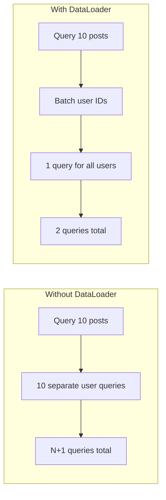

# How to Configure GraphQL with Prisma

Author: [nawazdhandala](https://github.com/nawazdhandala)

Tags: GraphQL, Prisma, Database, ORM, Node.js, TypeScript, API Development

Description: Learn how to configure and integrate Prisma with GraphQL for type-safe database access, including schema design, resolver patterns, and performance optimization.

---

Prisma provides a type-safe database client that pairs excellently with GraphQL. The combination gives you end-to-end type safety from your database through your API layer. This guide covers setting up Prisma with GraphQL and implementing common patterns.

## Project Setup

### Installation

```bash
# Initialize a new project
npm init -y

# Install dependencies
npm install @apollo/server graphql express
npm install prisma @prisma/client
npm install typescript ts-node @types/node @types/express --save-dev

# Initialize Prisma
npx prisma init
```

### Project Structure

```
src/
  generated/
    prisma-client/     # Prisma client (auto-generated)
  graphql/
    schema.graphql     # GraphQL schema
    resolvers/
      index.ts
      user.ts
      post.ts
    context.ts
  prisma/
    schema.prisma      # Prisma schema
    seed.ts            # Database seeding
  index.ts             # Server entry point
```

## Prisma Schema Definition

```prisma
// prisma/schema.prisma
datasource db {
  provider = "postgresql"
  url      = env("DATABASE_URL")
}

generator client {
  provider = "prisma-client-js"
}

// User model
model User {
  id        String   @id @default(cuid())
  email     String   @unique
  name      String?
  password  String
  role      Role     @default(USER)
  createdAt DateTime @default(now())
  updatedAt DateTime @updatedAt

  // Relations
  posts     Post[]
  comments  Comment[]
  profile   Profile?

  @@map("users")
}

model Profile {
  id       String  @id @default(cuid())
  bio      String?
  avatar   String?
  userId   String  @unique
  user     User    @relation(fields: [userId], references: [id], onDelete: Cascade)

  @@map("profiles")
}

model Post {
  id          String    @id @default(cuid())
  title       String
  content     String?
  published   Boolean   @default(false)
  publishedAt DateTime?
  createdAt   DateTime  @default(now())
  updatedAt   DateTime  @updatedAt

  // Relations
  authorId    String
  author      User      @relation(fields: [authorId], references: [id], onDelete: Cascade)
  comments    Comment[]
  tags        Tag[]

  @@index([authorId])
  @@index([published])
  @@map("posts")
}

model Comment {
  id        String   @id @default(cuid())
  content   String
  createdAt DateTime @default(now())

  // Relations
  authorId  String
  author    User     @relation(fields: [authorId], references: [id], onDelete: Cascade)
  postId    String
  post      Post     @relation(fields: [postId], references: [id], onDelete: Cascade)

  @@index([postId])
  @@map("comments")
}

model Tag {
  id    String @id @default(cuid())
  name  String @unique
  posts Post[]

  @@map("tags")
}

enum Role {
  USER
  ADMIN
  MODERATOR
}
```

Run migrations to create the database schema:

```bash
# Generate migration and apply it
npx prisma migrate dev --name init

# Generate Prisma Client
npx prisma generate
```

## GraphQL Schema

```graphql
# src/graphql/schema.graphql
scalar DateTime

type Query {
  # User queries
  me: User
  user(id: ID!): User
  users(skip: Int, take: Int, where: UserWhereInput): [User!]!

  # Post queries
  post(id: ID!): Post
  posts(
    skip: Int
    take: Int
    where: PostWhereInput
    orderBy: PostOrderByInput
  ): [Post!]!

  # Feed - published posts only
  feed(skip: Int, take: Int): [Post!]!
}

type Mutation {
  # User mutations
  createUser(data: CreateUserInput!): User!
  updateUser(id: ID!, data: UpdateUserInput!): User
  deleteUser(id: ID!): User

  # Post mutations
  createPost(data: CreatePostInput!): Post!
  updatePost(id: ID!, data: UpdatePostInput!): Post
  deletePost(id: ID!): Post
  publishPost(id: ID!): Post

  # Comment mutations
  createComment(data: CreateCommentInput!): Comment!
  deleteComment(id: ID!): Comment
}

# Types
type User {
  id: ID!
  email: String!
  name: String
  role: Role!
  createdAt: DateTime!
  posts(published: Boolean): [Post!]!
  comments: [Comment!]!
  profile: Profile
  postCount: Int!
}

type Profile {
  id: ID!
  bio: String
  avatar: String
}

type Post {
  id: ID!
  title: String!
  content: String
  published: Boolean!
  publishedAt: DateTime
  createdAt: DateTime!
  updatedAt: DateTime!
  author: User!
  comments: [Comment!]!
  tags: [Tag!]!
  commentCount: Int!
}

type Comment {
  id: ID!
  content: String!
  createdAt: DateTime!
  author: User!
  post: Post!
}

type Tag {
  id: ID!
  name: String!
  posts: [Post!]!
}

# Enums
enum Role {
  USER
  ADMIN
  MODERATOR
}

enum SortOrder {
  asc
  desc
}

# Input types
input CreateUserInput {
  email: String!
  name: String
  password: String!
}

input UpdateUserInput {
  email: String
  name: String
}

input CreatePostInput {
  title: String!
  content: String
  tags: [String!]
}

input UpdatePostInput {
  title: String
  content: String
  published: Boolean
}

input CreateCommentInput {
  content: String!
  postId: ID!
}

input UserWhereInput {
  email: StringFilter
  name: StringFilter
  role: Role
}

input PostWhereInput {
  title: StringFilter
  published: Boolean
  authorId: ID
}

input PostOrderByInput {
  createdAt: SortOrder
  title: SortOrder
  publishedAt: SortOrder
}

input StringFilter {
  equals: String
  contains: String
  startsWith: String
  endsWith: String
}
```

## Context Setup

```typescript
// src/graphql/context.ts
import { PrismaClient, User } from '@prisma/client';
import { Request } from 'express';

// Single Prisma instance - reuse across requests
const prisma = new PrismaClient({
  log: process.env.NODE_ENV === 'development'
    ? ['query', 'info', 'warn', 'error']
    : ['error'],
});

export interface Context {
  prisma: PrismaClient;
  user: User | null;
}

export async function createContext({ req }: { req: Request }): Promise<Context> {
  // Extract and verify user from token (simplified)
  const token = req.headers.authorization?.replace('Bearer ', '');
  let user: User | null = null;

  if (token) {
    try {
      // Verify token and get user ID
      const decoded = verifyToken(token);
      user = await prisma.user.findUnique({
        where: { id: decoded.userId },
      });
    } catch (error) {
      // Invalid token - user remains null
    }
  }

  return { prisma, user };
}

// Export prisma for use in scripts
export { prisma };
```

## Resolvers

### User Resolvers

```typescript
// src/graphql/resolvers/user.ts
import { Context } from '../context';
import { Prisma } from '@prisma/client';
import bcrypt from 'bcrypt';

export const userResolvers = {
  Query: {
    me: async (_: unknown, __: unknown, context: Context) => {
      if (!context.user) {
        return null;
      }
      return context.prisma.user.findUnique({
        where: { id: context.user.id },
      });
    },

    user: async (_: unknown, args: { id: string }, context: Context) => {
      return context.prisma.user.findUnique({
        where: { id: args.id },
      });
    },

    users: async (
      _: unknown,
      args: {
        skip?: number;
        take?: number;
        where?: {
          email?: { equals?: string; contains?: string };
          name?: { contains?: string };
          role?: string;
        };
      },
      context: Context
    ) => {
      // Build Prisma where clause from GraphQL input
      const where: Prisma.UserWhereInput = {};

      if (args.where?.email) {
        where.email = args.where.email;
      }
      if (args.where?.name) {
        where.name = args.where.name;
      }
      if (args.where?.role) {
        where.role = args.where.role as any;
      }

      return context.prisma.user.findMany({
        skip: args.skip,
        take: args.take || 20,
        where,
        orderBy: { createdAt: 'desc' },
      });
    },
  },

  Mutation: {
    createUser: async (
      _: unknown,
      args: { data: { email: string; name?: string; password: string } },
      context: Context
    ) => {
      // Hash password before storing
      const hashedPassword = await bcrypt.hash(args.data.password, 10);

      return context.prisma.user.create({
        data: {
          email: args.data.email,
          name: args.data.name,
          password: hashedPassword,
        },
      });
    },

    updateUser: async (
      _: unknown,
      args: { id: string; data: { email?: string; name?: string } },
      context: Context
    ) => {
      return context.prisma.user.update({
        where: { id: args.id },
        data: args.data,
      });
    },

    deleteUser: async (_: unknown, args: { id: string }, context: Context) => {
      return context.prisma.user.delete({
        where: { id: args.id },
      });
    },
  },

  // Field resolvers for User type
  User: {
    posts: async (
      parent: { id: string },
      args: { published?: boolean },
      context: Context
    ) => {
      return context.prisma.post.findMany({
        where: {
          authorId: parent.id,
          ...(args.published !== undefined && { published: args.published }),
        },
      });
    },

    comments: async (parent: { id: string }, _: unknown, context: Context) => {
      return context.prisma.comment.findMany({
        where: { authorId: parent.id },
        orderBy: { createdAt: 'desc' },
      });
    },

    profile: async (parent: { id: string }, _: unknown, context: Context) => {
      return context.prisma.profile.findUnique({
        where: { userId: parent.id },
      });
    },

    postCount: async (parent: { id: string }, _: unknown, context: Context) => {
      return context.prisma.post.count({
        where: { authorId: parent.id },
      });
    },
  },
};
```

### Post Resolvers

```typescript
// src/graphql/resolvers/post.ts
import { Context } from '../context';
import { Prisma } from '@prisma/client';

export const postResolvers = {
  Query: {
    post: async (_: unknown, args: { id: string }, context: Context) => {
      return context.prisma.post.findUnique({
        where: { id: args.id },
      });
    },

    posts: async (
      _: unknown,
      args: {
        skip?: number;
        take?: number;
        where?: {
          title?: { contains?: string };
          published?: boolean;
          authorId?: string;
        };
        orderBy?: {
          createdAt?: 'asc' | 'desc';
          title?: 'asc' | 'desc';
        };
      },
      context: Context
    ) => {
      const where: Prisma.PostWhereInput = {};
      const orderBy: Prisma.PostOrderByWithRelationInput = {};

      // Build where clause
      if (args.where?.title?.contains) {
        where.title = { contains: args.where.title.contains, mode: 'insensitive' };
      }
      if (args.where?.published !== undefined) {
        where.published = args.where.published;
      }
      if (args.where?.authorId) {
        where.authorId = args.where.authorId;
      }

      // Build order by
      if (args.orderBy?.createdAt) {
        orderBy.createdAt = args.orderBy.createdAt;
      }
      if (args.orderBy?.title) {
        orderBy.title = args.orderBy.title;
      }

      return context.prisma.post.findMany({
        skip: args.skip,
        take: args.take || 20,
        where,
        orderBy: Object.keys(orderBy).length > 0 ? orderBy : { createdAt: 'desc' },
      });
    },

    feed: async (
      _: unknown,
      args: { skip?: number; take?: number },
      context: Context
    ) => {
      return context.prisma.post.findMany({
        skip: args.skip,
        take: args.take || 20,
        where: { published: true },
        orderBy: { publishedAt: 'desc' },
      });
    },
  },

  Mutation: {
    createPost: async (
      _: unknown,
      args: { data: { title: string; content?: string; tags?: string[] } },
      context: Context
    ) => {
      if (!context.user) {
        throw new Error('Not authenticated');
      }

      return context.prisma.post.create({
        data: {
          title: args.data.title,
          content: args.data.content,
          authorId: context.user.id,
          // Connect or create tags
          tags: args.data.tags
            ? {
                connectOrCreate: args.data.tags.map((name) => ({
                  where: { name },
                  create: { name },
                })),
              }
            : undefined,
        },
      });
    },

    updatePost: async (
      _: unknown,
      args: { id: string; data: { title?: string; content?: string; published?: boolean } },
      context: Context
    ) => {
      const updateData: Prisma.PostUpdateInput = { ...args.data };

      // Set publishedAt when publishing
      if (args.data.published === true) {
        updateData.publishedAt = new Date();
      }

      return context.prisma.post.update({
        where: { id: args.id },
        data: updateData,
      });
    },

    publishPost: async (_: unknown, args: { id: string }, context: Context) => {
      return context.prisma.post.update({
        where: { id: args.id },
        data: {
          published: true,
          publishedAt: new Date(),
        },
      });
    },

    deletePost: async (_: unknown, args: { id: string }, context: Context) => {
      return context.prisma.post.delete({
        where: { id: args.id },
      });
    },
  },

  // Field resolvers
  Post: {
    author: async (parent: { authorId: string }, _: unknown, context: Context) => {
      return context.prisma.user.findUnique({
        where: { id: parent.authorId },
      });
    },

    comments: async (parent: { id: string }, _: unknown, context: Context) => {
      return context.prisma.comment.findMany({
        where: { postId: parent.id },
        orderBy: { createdAt: 'asc' },
      });
    },

    tags: async (parent: { id: string }, _: unknown, context: Context) => {
      const post = await context.prisma.post.findUnique({
        where: { id: parent.id },
        include: { tags: true },
      });
      return post?.tags || [];
    },

    commentCount: async (parent: { id: string }, _: unknown, context: Context) => {
      return context.prisma.comment.count({
        where: { postId: parent.id },
      });
    },
  },
};
```

## Solving the N+1 Problem with DataLoader



### DataLoader Setup

```typescript
// src/graphql/loaders.ts
import DataLoader from 'dataloader';
import { PrismaClient, User, Post, Comment } from '@prisma/client';

export function createLoaders(prisma: PrismaClient) {
  return {
    // Batch load users by ID
    userLoader: new DataLoader<string, User | null>(async (ids) => {
      const users = await prisma.user.findMany({
        where: { id: { in: [...ids] } },
      });

      // Map results back to input order
      const userMap = new Map(users.map((user) => [user.id, user]));
      return ids.map((id) => userMap.get(id) || null);
    }),

    // Batch load posts by author ID
    postsByAuthorLoader: new DataLoader<string, Post[]>(async (authorIds) => {
      const posts = await prisma.post.findMany({
        where: { authorId: { in: [...authorIds] } },
      });

      // Group posts by author ID
      const postsByAuthor = new Map<string, Post[]>();
      for (const post of posts) {
        const authorPosts = postsByAuthor.get(post.authorId) || [];
        authorPosts.push(post);
        postsByAuthor.set(post.authorId, authorPosts);
      }

      return authorIds.map((id) => postsByAuthor.get(id) || []);
    }),

    // Batch load comments by post ID
    commentsByPostLoader: new DataLoader<string, Comment[]>(async (postIds) => {
      const comments = await prisma.comment.findMany({
        where: { postId: { in: [...postIds] } },
        orderBy: { createdAt: 'asc' },
      });

      const commentsByPost = new Map<string, Comment[]>();
      for (const comment of comments) {
        const postComments = commentsByPost.get(comment.postId) || [];
        postComments.push(comment);
        commentsByPost.set(comment.postId, postComments);
      }

      return postIds.map((id) => commentsByPost.get(id) || []);
    }),

    // Batch count posts by author
    postCountByAuthorLoader: new DataLoader<string, number>(async (authorIds) => {
      const counts = await prisma.post.groupBy({
        by: ['authorId'],
        where: { authorId: { in: [...authorIds] } },
        _count: true,
      });

      const countMap = new Map(counts.map((c) => [c.authorId, c._count]));
      return authorIds.map((id) => countMap.get(id) || 0);
    }),
  };
}

export type Loaders = ReturnType<typeof createLoaders>;
```

### Updated Context with Loaders

```typescript
// src/graphql/context.ts
import { PrismaClient, User } from '@prisma/client';
import { createLoaders, Loaders } from './loaders';

const prisma = new PrismaClient();

export interface Context {
  prisma: PrismaClient;
  user: User | null;
  loaders: Loaders;
}

export async function createContext({ req }): Promise<Context> {
  // ... authentication logic ...

  return {
    prisma,
    user,
    // Create new loaders per request (DataLoader caches per request)
    loaders: createLoaders(prisma),
  };
}
```

### Using DataLoaders in Resolvers

```typescript
// src/graphql/resolvers/post.ts
export const postResolvers = {
  Post: {
    // Use DataLoader instead of direct query
    author: async (parent: { authorId: string }, _: unknown, context: Context) => {
      return context.loaders.userLoader.load(parent.authorId);
    },

    comments: async (parent: { id: string }, _: unknown, context: Context) => {
      return context.loaders.commentsByPostLoader.load(parent.id);
    },
  },
};

// src/graphql/resolvers/user.ts
export const userResolvers = {
  User: {
    posts: async (parent: { id: string }, _: unknown, context: Context) => {
      return context.loaders.postsByAuthorLoader.load(parent.id);
    },

    postCount: async (parent: { id: string }, _: unknown, context: Context) => {
      return context.loaders.postCountByAuthorLoader.load(parent.id);
    },
  },
};
```

## Using Prisma with Nexus (Code-First)

```typescript
// src/schema/types/User.ts
import { objectType, extendType, inputObjectType, nonNull, stringArg } from 'nexus';

export const User = objectType({
  name: 'User',
  definition(t) {
    t.nonNull.id('id');
    t.nonNull.string('email');
    t.string('name');
    t.nonNull.field('role', { type: 'Role' });
    t.nonNull.dateTime('createdAt');

    t.nonNull.list.nonNull.field('posts', {
      type: 'Post',
      args: {
        published: 'Boolean',
      },
      resolve: (parent, args, ctx) => {
        return ctx.prisma.post.findMany({
          where: {
            authorId: parent.id,
            ...(args.published !== undefined && { published: args.published }),
          },
        });
      },
    });

    t.nonNull.int('postCount', {
      resolve: (parent, _, ctx) => {
        return ctx.loaders.postCountByAuthorLoader.load(parent.id);
      },
    });
  },
});

export const UserQueries = extendType({
  type: 'Query',
  definition(t) {
    t.field('me', {
      type: 'User',
      resolve: (_, __, ctx) => {
        if (!ctx.user) return null;
        return ctx.prisma.user.findUnique({
          where: { id: ctx.user.id },
        });
      },
    });

    t.nonNull.list.nonNull.field('users', {
      type: 'User',
      args: {
        skip: 'Int',
        take: 'Int',
      },
      resolve: (_, args, ctx) => {
        return ctx.prisma.user.findMany({
          skip: args.skip || undefined,
          take: args.take || 20,
        });
      },
    });
  },
});

export const UserMutations = extendType({
  type: 'Mutation',
  definition(t) {
    t.nonNull.field('createUser', {
      type: 'User',
      args: {
        data: nonNull('CreateUserInput'),
      },
      resolve: async (_, args, ctx) => {
        const hashedPassword = await bcrypt.hash(args.data.password, 10);
        return ctx.prisma.user.create({
          data: {
            email: args.data.email,
            name: args.data.name,
            password: hashedPassword,
          },
        });
      },
    });
  },
});

export const CreateUserInput = inputObjectType({
  name: 'CreateUserInput',
  definition(t) {
    t.nonNull.string('email');
    t.string('name');
    t.nonNull.string('password');
  },
});
```

## Server Entry Point

```typescript
// src/index.ts
import { ApolloServer } from '@apollo/server';
import { expressMiddleware } from '@apollo/server/express4';
import express from 'express';
import { readFileSync } from 'fs';
import { makeExecutableSchema } from '@graphql-tools/schema';
import { createContext } from './graphql/context';
import { resolvers } from './graphql/resolvers';

const app = express();

// Load GraphQL schema
const typeDefs = readFileSync('./src/graphql/schema.graphql', 'utf-8');

// Create executable schema
const schema = makeExecutableSchema({
  typeDefs,
  resolvers,
});

// Create Apollo Server
const server = new ApolloServer({
  schema,
});

async function main() {
  await server.start();

  app.use(express.json());

  app.use(
    '/graphql',
    expressMiddleware(server, {
      context: createContext,
    })
  );

  const PORT = process.env.PORT || 4000;
  app.listen(PORT, () => {
    console.log(`Server running at http://localhost:${PORT}/graphql`);
  });
}

main();
```

## Best Practices Summary

| Practice | Description |
|----------|-------------|
| **Single Prisma instance** | Reuse one client across requests |
| **Use DataLoader** | Batch and cache database queries |
| **Type-safe inputs** | Map GraphQL inputs to Prisma types |
| **Optimize includes** | Only include relations when needed |
| **Handle errors** | Catch Prisma errors and return GraphQL errors |
| **Use transactions** | Wrap multi-step operations in transactions |

Prisma and GraphQL work together seamlessly when properly configured. The type safety from Prisma flows through to your resolvers, and DataLoader ensures efficient database access. This combination provides a robust foundation for building scalable GraphQL APIs.
