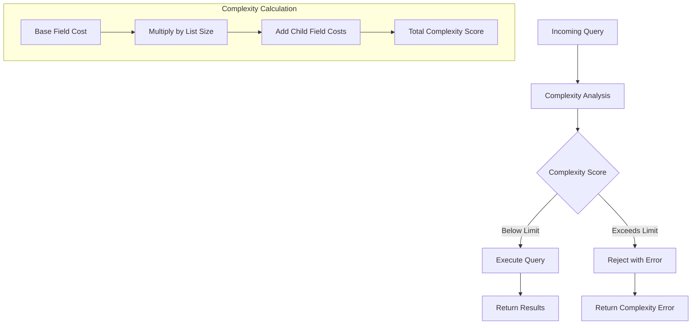
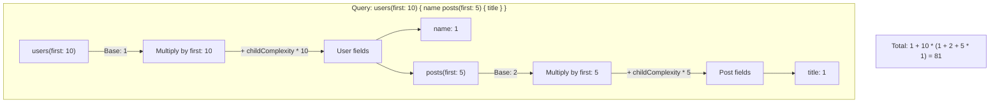

# How to Fix "Query Complexity" Limit Errors

Author: [nawazdhandala](https://github.com/nawazdhandala)

Tags: GraphQL, Performance, Security, API Development, Rate Limiting, Node.js

Description: Learn how to understand, configure, and resolve query complexity limit errors in GraphQL to protect your API from expensive queries while maintaining usability.

---

Query complexity limits protect your GraphQL API from expensive operations that could overwhelm your server. When clients exceed these limits, they receive errors like "Query complexity limit exceeded." This guide explains how to configure complexity analysis and resolve these errors.

## Understanding Query Complexity

GraphQL allows clients to request deeply nested data in a single query. Without limits, a malicious or poorly written query can bring down your server:

```graphql
# This query could return millions of records
query DangerousQuery {
  users(first: 1000) {
    posts(first: 100) {
      comments(first: 100) {
        author {
          posts(first: 100) {
            comments(first: 100) {
              # ... and so on
            }
          }
        }
      }
    }
  }
}
```



## Setting Up Query Complexity Analysis

### Installation

```bash
npm install graphql-query-complexity
```

### Basic Configuration

```typescript
// complexity.ts
import {
  getComplexity,
  simpleEstimator,
  fieldExtensionsEstimator,
} from 'graphql-query-complexity';
import { GraphQLSchema, separateOperations } from 'graphql';

const MAX_COMPLEXITY = 1000;

export function createComplexityPlugin(schema: GraphQLSchema) {
  return {
    requestDidStart: () => ({
      didResolveOperation({ request, document }) {
        // Calculate complexity for the query
        const complexity = getComplexity({
          schema,
          operationName: request.operationName,
          query: document,
          variables: request.variables,
          estimators: [
            // Use field extensions first (custom complexity values)
            fieldExtensionsEstimator(),
            // Fall back to simple estimator (1 point per field)
            simpleEstimator({ defaultComplexity: 1 }),
          ],
        });

        if (complexity > MAX_COMPLEXITY) {
          throw new Error(
            `Query complexity ${complexity} exceeds maximum allowed complexity ${MAX_COMPLEXITY}`
          );
        }

        // Optional: Log complexity for monitoring
        console.log(`Query complexity: ${complexity}/${MAX_COMPLEXITY}`);
      },
    }),
  };
}
```

### Apollo Server Integration

```typescript
// server.ts
import { ApolloServer } from '@apollo/server';
import { createComplexityPlugin } from './complexity';
import { schema } from './schema';

const server = new ApolloServer({
  schema,
  plugins: [createComplexityPlugin(schema)],
});
```

## Configuring Field Complexity

### Schema-Level Configuration

Define complexity in your schema using directives:

```graphql
# schema.graphql
directive @complexity(
  value: Int!
  multipliers: [String!]
) on FIELD_DEFINITION

type Query {
  # Simple field - complexity of 1
  me: User @complexity(value: 1)

  # Expensive field - higher base complexity
  analytics: Analytics @complexity(value: 10)

  # List with pagination - complexity multiplied by 'first' argument
  users(first: Int = 10): [User!]! @complexity(value: 1, multipliers: ["first"])

  # Complex search - expensive operation
  search(query: String!, first: Int = 20): SearchResults
    @complexity(value: 5, multipliers: ["first"])
}

type User {
  id: ID!
  name: String!
  email: String!

  # Relationship that can return many items
  posts(first: Int = 10): [Post!]! @complexity(value: 2, multipliers: ["first"])

  # Expensive computed field
  recommendations: [User!]! @complexity(value: 20)
}

type Post {
  id: ID!
  title: String!
  content: String!

  # Nested relationship
  comments(first: Int = 10): [Comment!]! @complexity(value: 1, multipliers: ["first"])

  # Author lookup
  author: User @complexity(value: 1)
}
```

### Code-First Configuration (TypeGraphQL)

```typescript
// types/User.ts
import { ObjectType, Field, ID, Int } from 'type-graphql';

@ObjectType()
export class User {
  @Field(() => ID)
  id: string;

  @Field()
  name: string;

  @Field(() => [Post], { complexity: ({ childComplexity, args }) =>
    (args.first || 10) * childComplexity + 2
  })
  posts(@Arg('first', () => Int, { defaultValue: 10 }) first: number): Post[] {
    return [];
  }

  @Field(() => [User], { complexity: 20 })
  recommendations: User[] {
    return [];
  }
}
```

### Field Extensions Approach

```typescript
// resolvers.ts
export const resolvers = {
  Query: {
    users: {
      resolve: (_, args) => db.users.findMany({ take: args.first }),
      extensions: {
        complexity: ({ args, childComplexity }) => {
          // Base cost + (items * child complexity)
          return 1 + (args.first || 10) * childComplexity;
        },
      },
    },

    search: {
      resolve: (_, args) => searchService.search(args.query, args.first),
      extensions: {
        complexity: ({ args, childComplexity }) => {
          // Search is expensive - high base cost
          return 10 + (args.first || 20) * childComplexity;
        },
      },
    },
  },

  User: {
    posts: {
      resolve: (user, args) => db.posts.findMany({
        where: { authorId: user.id },
        take: args.first,
      }),
      extensions: {
        complexity: ({ args, childComplexity }) => {
          return 2 + (args.first || 10) * childComplexity;
        },
      },
    },

    recommendations: {
      resolve: (user) => recommendationService.getForUser(user.id),
      extensions: {
        // Fixed high cost - expensive ML operation
        complexity: 25,
      },
    },
  },
};
```

## Custom Complexity Estimator

Create a sophisticated estimator that handles your specific needs:

```typescript
// customEstimator.ts
import { ComplexityEstimator, ComplexityEstimatorArgs } from 'graphql-query-complexity';

// Define complexity costs for different field types
const FIELD_COSTS = {
  // Expensive operations
  'Query.search': 10,
  'Query.analytics': 15,
  'User.recommendations': 25,
  'Post.relatedPosts': 10,

  // Database lookups
  'Query.user': 2,
  'Query.post': 2,

  // Relationships
  'User.posts': 2,
  'Post.comments': 1,
  'Comment.replies': 1,
};

// List fields that multiply by argument
const LIST_MULTIPLIERS = {
  'Query.users': 'first',
  'Query.posts': 'first',
  'User.posts': 'first',
  'Post.comments': 'first',
  'Comment.replies': 'first',
};

export const customEstimator: ComplexityEstimator = (
  options: ComplexityEstimatorArgs
) => {
  const { type, field, args, childComplexity } = options;

  // Build field path for lookup
  const fieldPath = `${type.name}.${field.name}`;

  // Get base cost (default to 1)
  const baseCost = FIELD_COSTS[fieldPath] ?? 1;

  // Check if this is a list field with multiplier
  const multiplierArg = LIST_MULTIPLIERS[fieldPath];
  if (multiplierArg && args[multiplierArg]) {
    const listSize = args[multiplierArg];
    // Base cost + (list size * child complexity)
    return baseCost + listSize * childComplexity;
  }

  // For non-list fields, just add base cost and child complexity
  return baseCost + childComplexity;
};
```

```typescript
// Usage
import { getComplexity } from 'graphql-query-complexity';
import { customEstimator } from './customEstimator';

const complexity = getComplexity({
  schema,
  query: document,
  variables,
  estimators: [
    fieldExtensionsEstimator(),  // Check field extensions first
    customEstimator,             // Then custom rules
    simpleEstimator({ defaultComplexity: 1 }),  // Fallback
  ],
});
```

## Query Depth Limiting

Combine complexity with depth limits for additional protection:

```typescript
// depthLimit.ts
import depthLimit from 'graphql-depth-limit';

const MAX_DEPTH = 10;

// Apply as validation rule
const server = new ApolloServer({
  schema,
  validationRules: [depthLimit(MAX_DEPTH)],
  plugins: [createComplexityPlugin(schema)],
});
```

## Handling Complexity Errors

### Error Response Format

```typescript
// complexity.ts
import { GraphQLError } from 'graphql';

export class QueryComplexityError extends GraphQLError {
  constructor(complexity: number, maxComplexity: number) {
    super(
      `Query complexity of ${complexity} exceeds the maximum allowed complexity of ${maxComplexity}. ` +
      `Please reduce the query scope by requesting fewer fields or reducing pagination limits.`,
      {
        extensions: {
          code: 'QUERY_COMPLEXITY_EXCEEDED',
          complexity,
          maxComplexity,
          suggestions: [
            'Reduce pagination limits (e.g., first: 10 instead of first: 100)',
            'Request fewer nested relationships',
            'Split into multiple smaller queries',
          ],
        },
      }
    );
  }
}
```

### Client-Side Handling

```typescript
// client.ts
import { ApolloClient, ApolloError } from '@apollo/client';

async function executeQuery(query, variables) {
  try {
    const result = await client.query({ query, variables });
    return result.data;
  } catch (error) {
    if (error instanceof ApolloError) {
      const complexityError = error.graphQLErrors.find(
        (e) => e.extensions?.code === 'QUERY_COMPLEXITY_EXCEEDED'
      );

      if (complexityError) {
        console.error('Query too complex:', complexityError.message);
        console.log('Current complexity:', complexityError.extensions.complexity);
        console.log('Maximum allowed:', complexityError.extensions.maxComplexity);
        console.log('Suggestions:', complexityError.extensions.suggestions);

        // Implement automatic retry with reduced scope
        return retryWithReducedScope(query, variables);
      }
    }
    throw error;
  }
}

async function retryWithReducedScope(query, variables) {
  // Reduce pagination limits
  const reducedVariables = { ...variables };
  if (reducedVariables.first > 10) {
    reducedVariables.first = Math.floor(reducedVariables.first / 2);
  }

  // Retry with reduced scope
  return client.query({ query, variables: reducedVariables });
}
```

## Per-User Complexity Limits

Different users may have different complexity allowances:

```typescript
// complexity.ts
interface ComplexityLimits {
  anonymous: number;
  authenticated: number;
  premium: number;
  admin: number;
}

const COMPLEXITY_LIMITS: ComplexityLimits = {
  anonymous: 100,
  authenticated: 500,
  premium: 2000,
  admin: 10000,
};

export function createComplexityPlugin(schema: GraphQLSchema) {
  return {
    requestDidStart: () => ({
      async didResolveOperation({ request, document, contextValue }) {
        const complexity = getComplexity({
          schema,
          operationName: request.operationName,
          query: document,
          variables: request.variables,
          estimators: [
            fieldExtensionsEstimator(),
            customEstimator,
            simpleEstimator({ defaultComplexity: 1 }),
          ],
        });

        // Determine user tier
        const user = contextValue.user;
        let maxComplexity: number;

        if (!user) {
          maxComplexity = COMPLEXITY_LIMITS.anonymous;
        } else if (user.roles.includes('admin')) {
          maxComplexity = COMPLEXITY_LIMITS.admin;
        } else if (user.subscription === 'premium') {
          maxComplexity = COMPLEXITY_LIMITS.premium;
        } else {
          maxComplexity = COMPLEXITY_LIMITS.authenticated;
        }

        if (complexity > maxComplexity) {
          throw new QueryComplexityError(complexity, maxComplexity);
        }

        // Add complexity to response headers for debugging
        contextValue.queryComplexity = complexity;
        contextValue.maxComplexity = maxComplexity;
      },
    }),
  };
}
```

## Complexity Monitoring

Track complexity metrics to understand usage patterns:

```typescript
// monitoring.ts
import { metrics } from '@opentelemetry/api';

const meter = metrics.getMeter('graphql-complexity');

const complexityHistogram = meter.createHistogram('graphql_query_complexity', {
  description: 'Distribution of GraphQL query complexity scores',
  unit: 'points',
});

const complexityExceeded = meter.createCounter('graphql_complexity_exceeded', {
  description: 'Number of queries rejected for exceeding complexity limits',
});

export function recordComplexity(
  complexity: number,
  maxComplexity: number,
  operationName: string,
  exceeded: boolean
) {
  const labels = {
    operation: operationName || 'anonymous',
    exceeded: exceeded.toString(),
  };

  complexityHistogram.record(complexity, labels);

  if (exceeded) {
    complexityExceeded.add(1, labels);
  }
}
```

## Complexity Calculation Examples



### Calculation Breakdown

```typescript
// Example query
const query = `
  query GetUsers {
    users(first: 10) {
      name
      posts(first: 5) {
        title
        comments(first: 3) {
          text
        }
      }
    }
  }
`;

// Complexity calculation:
// users(first: 10):
//   base = 1
//   childComplexity = name(1) + posts(first: 5)
//
// posts(first: 5):
//   base = 2
//   childComplexity = title(1) + comments(first: 3)
//
// comments(first: 3):
//   base = 1
//   childComplexity = text(1)
//   total = 1 + 3 * 1 = 4
//
// posts total = 2 + 5 * (1 + 4) = 27
// users total = 1 + 10 * (1 + 27) = 281
```

## Best Practices

| Practice | Description |
|----------|-------------|
| **Start conservative** | Begin with low limits and increase based on real usage |
| **Document limits** | Tell clients about complexity limits in your API docs |
| **Return complexity in headers** | Help clients optimize their queries |
| **Different tiers** | Give premium users higher limits |
| **Monitor patterns** | Track which queries approach limits |
| **Test with real queries** | Validate limits with production query patterns |

## Common Fixes for Clients

When clients receive complexity errors, they can:

1. **Reduce pagination limits**: Change `first: 100` to `first: 20`
2. **Remove unnecessary fields**: Only request fields you actually use
3. **Limit nesting depth**: Avoid deep relationship traversal
4. **Split queries**: Make multiple smaller queries instead of one large one
5. **Use fragments wisely**: Reuse fragments but be aware they add complexity

```graphql
# Before - High complexity
query HighComplexity {
  users(first: 100) {
    posts(first: 50) {
      comments(first: 50) {
        author {
          posts(first: 50) {
            title
          }
        }
      }
    }
  }
}

# After - Reduced complexity
query LowComplexity {
  users(first: 20) {
    posts(first: 10) {
      title
      commentCount  # Use a count instead of fetching all comments
    }
  }
}
```

Query complexity limits are essential for protecting your GraphQL API. Configure them thoughtfully, provide clear error messages, and help your clients write efficient queries.
