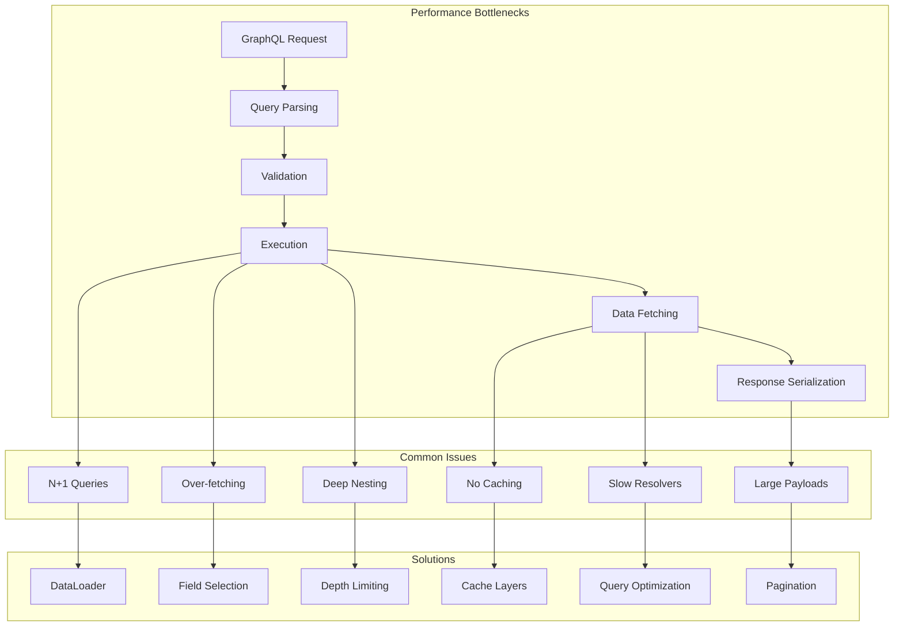
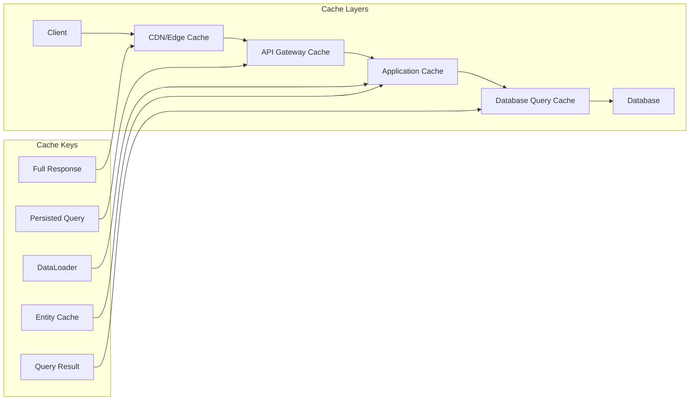

# How to Optimize GraphQL Query Performance

Author: [nawazdhandala](https://www.github.com/nawazdhandala)

Tags: GraphQL, Performance, Optimization, DataLoader, Caching, N+1 Problem, Query Complexity

Description: Learn practical techniques to optimize GraphQL query performance including solving the N+1 problem, implementing caching, query complexity analysis, and field-level optimizations.

---

GraphQL's flexibility comes with performance challenges. Clients can request deeply nested data in a single query, potentially triggering expensive database operations. Without proper optimization, GraphQL APIs can suffer from the N+1 query problem, excessive memory usage, and slow response times.

This guide covers practical techniques to identify and fix performance issues in GraphQL APIs, from solving the N+1 problem to implementing effective caching strategies.

## Understanding GraphQL Performance Bottlenecks

Before optimizing, you need to understand where performance issues typically occur.



## Solving the N+1 Query Problem

The N+1 problem is the most common GraphQL performance issue. It occurs when resolving a list requires an additional query for each item.

```typescript
// BAD: N+1 query problem demonstration
// This resolver triggers one query per user in the list

const resolvers = {
  Query: {
    // First query: Get all posts
    posts: async () => {
      // 1 query to get posts
      return db.query('SELECT * FROM posts LIMIT 100');
    }
  },
  Post: {
    // N additional queries: One per post to get author
    author: async (post) => {
      // This runs for EACH post - 100 posts = 100 queries!
      return db.query('SELECT * FROM users WHERE id = ?', [post.authorId]);
    }
  }
};

// Query that triggers N+1:
// query {
//   posts {
//     id
//     title
//     author {   <- This triggers a separate query for each post
//       name
//     }
//   }
// }
// Result: 1 + 100 = 101 database queries
```

```typescript
// GOOD: Use DataLoader to batch and cache requests
import DataLoader from 'dataloader';

// Create a batch loading function
async function batchLoadUsers(userIds: readonly string[]): Promise<User[]> {
  // Single query fetches all users at once
  const users = await db.query(
    'SELECT * FROM users WHERE id IN (?)',
    [userIds]
  );

  // Create a map for O(1) lookups
  const userMap = new Map(users.map(user => [user.id, user]));

  // Return users in the same order as input IDs
  // DataLoader requires this ordering
  return userIds.map(id => userMap.get(id) || null);
}

// Create DataLoader in request context
function createContext() {
  return {
    loaders: {
      // New DataLoader instance per request for proper caching
      userLoader: new DataLoader(batchLoadUsers)
    }
  };
}

// Updated resolvers using DataLoader
const resolvers = {
  Query: {
    posts: async () => {
      return db.query('SELECT * FROM posts LIMIT 100');
    }
  },
  Post: {
    author: async (post, _args, context) => {
      // DataLoader batches these calls automatically
      // All 100 author requests become 1 batched query
      return context.loaders.userLoader.load(post.authorId);
    }
  }
};

// Result: 1 + 1 = 2 database queries (posts + batched users)
```

## Implementing Multiple DataLoaders

Real applications need multiple loaders for different entity types and relationships.

```typescript
// loaders/index.ts
import DataLoader from 'dataloader';
import { PrismaClient } from '@prisma/client';

const prisma = new PrismaClient();

export interface DataLoaders {
  userById: DataLoader<string, User | null>;
  postsByUserId: DataLoader<string, Post[]>;
  commentsByPostId: DataLoader<string, Comment[]>;
  likesCountByPostId: DataLoader<string, number>;
}

export function createLoaders(): DataLoaders {
  return {
    // Load users by ID
    userById: new DataLoader(async (ids) => {
      const users = await prisma.user.findMany({
        where: { id: { in: ids as string[] } }
      });
      const userMap = new Map(users.map(u => [u.id, u]));
      return ids.map(id => userMap.get(id) || null);
    }),

    // Load posts by user ID (one-to-many relationship)
    postsByUserId: new DataLoader(async (userIds) => {
      const posts = await prisma.post.findMany({
        where: { authorId: { in: userIds as string[] } }
      });

      // Group posts by author ID
      const postsByUser = new Map<string, Post[]>();
      posts.forEach(post => {
        const existing = postsByUser.get(post.authorId) || [];
        existing.push(post);
        postsByUser.set(post.authorId, existing);
      });

      return userIds.map(id => postsByUser.get(id) || []);
    }),

    // Load comments by post ID
    commentsByPostId: new DataLoader(async (postIds) => {
      const comments = await prisma.comment.findMany({
        where: { postId: { in: postIds as string[] } },
        orderBy: { createdAt: 'desc' }
      });

      const commentsByPost = new Map<string, Comment[]>();
      comments.forEach(comment => {
        const existing = commentsByPost.get(comment.postId) || [];
        existing.push(comment);
        commentsByPost.set(comment.postId, existing);
      });

      return postIds.map(id => commentsByPost.get(id) || []);
    }),

    // Load aggregated counts
    likesCountByPostId: new DataLoader(async (postIds) => {
      // Use raw query for efficient counting
      const counts = await prisma.$queryRaw<Array<{ postId: string; count: bigint }>>`
        SELECT "postId", COUNT(*) as count
        FROM likes
        WHERE "postId" IN (${postIds.join(',')})
        GROUP BY "postId"
      `;

      const countMap = new Map(counts.map(c => [c.postId, Number(c.count)]));
      return postIds.map(id => countMap.get(id) || 0);
    })
  };
}

// Using loaders in resolvers
const resolvers = {
  User: {
    posts: (user, _args, { loaders }) => loaders.postsByUserId.load(user.id)
  },
  Post: {
    author: (post, _args, { loaders }) => loaders.userById.load(post.authorId),
    comments: (post, _args, { loaders }) => loaders.commentsByPostId.load(post.id),
    likesCount: (post, _args, { loaders }) => loaders.likesCountByPostId.load(post.id)
  },
  Comment: {
    author: (comment, _args, { loaders }) => loaders.userById.load(comment.authorId)
  }
};
```

## Implementing Query Complexity Analysis

Prevent expensive queries by analyzing and limiting complexity.

```typescript
// complexity/analyzer.ts
import {
  getComplexity,
  simpleEstimator,
  fieldExtensionsEstimator
} from 'graphql-query-complexity';
import { GraphQLSchema } from 'graphql';

interface ComplexityConfig {
  maxComplexity: number;
  maxDepth: number;
  defaultFieldComplexity: number;
}

const defaultConfig: ComplexityConfig = {
  maxComplexity: 1000,
  maxDepth: 10,
  defaultFieldComplexity: 1
};

// Create a validation rule for complexity checking
export function createComplexityRule(
  schema: GraphQLSchema,
  config: ComplexityConfig = defaultConfig
) {
  return (context) => {
    return {
      // Check complexity after document is fully parsed
      Document: {
        leave: () => {
          const complexity = getComplexity({
            schema,
            query: context.getDocument(),
            variables: context.variableValues || {},
            estimators: [
              // Use field-level complexity from schema extensions
              fieldExtensionsEstimator(),
              // Fallback to simple estimation
              simpleEstimator({ defaultComplexity: config.defaultFieldComplexity })
            ]
          });

          if (complexity > config.maxComplexity) {
            context.reportError(
              new GraphQLError(
                `Query complexity ${complexity} exceeds maximum allowed ${config.maxComplexity}`
              )
            );
          }
        }
      }
    };
  };
}
```

```typescript
// Define complexity in schema using directives
const typeDefs = `
  directive @complexity(
    value: Int!
    multipliers: [String!]
  ) on FIELD_DEFINITION

  type Query {
    # Simple field - default complexity of 1
    user(id: ID!): User

    # List with pagination - complexity multiplied by limit
    users(
      first: Int = 10
      after: String
    ): UserConnection! @complexity(value: 1, multipliers: ["first"])

    # Expensive search operation
    search(
      query: String!
      first: Int = 10
    ): [SearchResult!]! @complexity(value: 10, multipliers: ["first"])
  }

  type User {
    id: ID!
    name: String!
    email: String!

    # Nested list - higher complexity
    posts(first: Int = 10): [Post!]! @complexity(value: 5, multipliers: ["first"])

    # Very expensive - full-text search on user's posts
    searchPosts(
      query: String!
      first: Int = 10
    ): [Post!]! @complexity(value: 20, multipliers: ["first"])
  }

  type Post {
    id: ID!
    title: String!
    content: String!
    author: User! @complexity(value: 2)
    comments(first: Int = 10): [Comment!]! @complexity(value: 3, multipliers: ["first"])
  }
`;

// Calculate complexity for a sample query
// query {
//   users(first: 20) {           # 1 * 20 = 20
//     id
//     name
//     posts(first: 5) {          # 5 * 5 * 20 = 500
//       id
//       title
//       author {                  # 2 * 5 * 20 = 200
//         id
//         name
//       }
//     }
//   }
// }
// Total complexity: 20 + 500 + 200 = 720
```

## Implementing Response Caching

Add caching at multiple levels to reduce database load.



```typescript
// Implementing response caching with Redis
import Redis from 'ioredis';
import { createHash } from 'crypto';

const redis = new Redis(process.env.REDIS_URL);

// Generate cache key from query and variables
function generateCacheKey(query: string, variables: Record<string, any>): string {
  const content = JSON.stringify({ query, variables });
  return `graphql:${createHash('sha256').update(content).digest('hex')}`;
}

// Caching plugin for Apollo Server
const cachingPlugin = {
  async requestDidStart(requestContext) {
    // Skip mutations and subscriptions
    const operation = requestContext.request.operationName;

    return {
      async responseForOperation(context) {
        // Only cache queries
        if (context.operation.operation !== 'query') {
          return null;
        }

        const cacheKey = generateCacheKey(
          context.request.query,
          context.request.variables || {}
        );

        // Check cache
        const cached = await redis.get(cacheKey);
        if (cached) {
          return {
            body: { kind: 'single', singleResult: JSON.parse(cached) }
          };
        }

        return null;
      },

      async willSendResponse(context) {
        // Only cache successful query responses
        if (
          context.operation?.operation !== 'query' ||
          context.errors?.length > 0
        ) {
          return;
        }

        const cacheKey = generateCacheKey(
          context.request.query,
          context.request.variables || {}
        );

        // Cache for 5 minutes by default
        const ttl = getCacheTTL(context);
        if (ttl > 0) {
          await redis.setex(
            cacheKey,
            ttl,
            JSON.stringify(context.response.body.singleResult)
          );
        }
      }
    };
  }
};

// Determine TTL based on query analysis
function getCacheTTL(context): number {
  // Check for cache control hints in the response
  const cacheHint = context.response.extensions?.cacheControl;

  if (cacheHint?.maxAge !== undefined) {
    return cacheHint.maxAge;
  }

  // Default TTLs based on operation
  const operationName = context.request.operationName || '';

  if (operationName.includes('Static') || operationName.includes('Config')) {
    return 3600; // 1 hour for static data
  }

  if (operationName.includes('List') || operationName.includes('Search')) {
    return 60; // 1 minute for lists
  }

  return 300; // 5 minutes default
}
```

## Field-Level Optimization with Info Object

Use the GraphQL info object to optimize database queries based on requested fields.

```typescript
// utils/fieldSelection.ts
import { GraphQLResolveInfo } from 'graphql';
import graphqlFields from 'graphql-fields';

// Extract requested fields from info object
function getRequestedFields(info: GraphQLResolveInfo): Set<string> {
  const fields = graphqlFields(info);
  return new Set(Object.keys(fields));
}

// Optimized resolver that only fetches requested fields
const resolvers = {
  Query: {
    user: async (_parent, { id }, context, info) => {
      // Get only the fields the client requested
      const requestedFields = getRequestedFields(info);

      // Build SELECT clause dynamically
      const columns = ['id']; // Always include ID

      if (requestedFields.has('name')) columns.push('name');
      if (requestedFields.has('email')) columns.push('email');
      if (requestedFields.has('bio')) columns.push('bio');
      if (requestedFields.has('avatarUrl')) columns.push('avatar_url');
      if (requestedFields.has('createdAt')) columns.push('created_at');

      // Only fetch needed columns
      const user = await context.db.query(
        `SELECT ${columns.join(', ')} FROM users WHERE id = ?`,
        [id]
      );

      return user;
    },

    users: async (_parent, { first, after }, context, info) => {
      const requestedFields = getRequestedFields(info);

      // Check if nested relations are requested
      const needsPosts = requestedFields.has('posts');
      const needsFollowers = requestedFields.has('followers');

      // Base query
      let query = context.db
        .select('users')
        .limit(first);

      // Only join if needed
      if (needsPosts) {
        // Use lateral join for efficient loading
        query = query.leftJoinLateral('posts', 'posts.author_id = users.id');
      }

      return query.execute();
    }
  }
};
```

## Implementing Cursor-Based Pagination

Efficient pagination is essential for list performance.

```typescript
// pagination/cursor.ts

interface PaginationArgs {
  first?: number;
  after?: string;
  last?: number;
  before?: string;
}

interface Edge<T> {
  cursor: string;
  node: T;
}

interface PageInfo {
  hasNextPage: boolean;
  hasPreviousPage: boolean;
  startCursor: string | null;
  endCursor: string | null;
}

interface Connection<T> {
  edges: Edge<T>[];
  pageInfo: PageInfo;
  totalCount: number;
}

// Encode cursor from ID and timestamp
function encodeCursor(id: string, createdAt: Date): string {
  const data = `${id}:${createdAt.toISOString()}`;
  return Buffer.from(data).toString('base64');
}

// Decode cursor back to ID and timestamp
function decodeCursor(cursor: string): { id: string; createdAt: Date } {
  const data = Buffer.from(cursor, 'base64').toString('utf-8');
  const [id, timestamp] = data.split(':');
  return { id, createdAt: new Date(timestamp) };
}

// Paginated resolver
const resolvers = {
  Query: {
    posts: async (
      _parent,
      args: PaginationArgs,
      context
    ): Promise<Connection<Post>> => {
      const { first = 10, after, last, before } = args;

      // Limit maximum page size
      const limit = Math.min(first || last || 10, 100);

      // Build query based on cursor
      let query = context.db
        .select('posts')
        .orderBy('created_at', 'DESC')
        .orderBy('id', 'DESC');

      if (after) {
        const { createdAt, id } = decodeCursor(after);
        // Fetch items after the cursor
        query = query.where(
          `(created_at, id) < (?, ?)`,
          [createdAt, id]
        );
      }

      if (before) {
        const { createdAt, id } = decodeCursor(before);
        query = query.where(
          `(created_at, id) > (?, ?)`,
          [createdAt, id]
        );
      }

      // Fetch one extra to check if there are more pages
      const posts = await query.limit(limit + 1).execute();

      // Check if there are more results
      const hasMore = posts.length > limit;
      if (hasMore) {
        posts.pop(); // Remove the extra item
      }

      // Build edges with cursors
      const edges: Edge<Post>[] = posts.map(post => ({
        cursor: encodeCursor(post.id, post.createdAt),
        node: post
      }));

      // Get total count (can be expensive - consider caching)
      const [{ count }] = await context.db.query(
        'SELECT COUNT(*) as count FROM posts'
      );

      return {
        edges,
        pageInfo: {
          hasNextPage: after ? hasMore : hasMore,
          hasPreviousPage: after ? true : false,
          startCursor: edges[0]?.cursor || null,
          endCursor: edges[edges.length - 1]?.cursor || null
        },
        totalCount: Number(count)
      };
    }
  }
};
```

## Query Depth Limiting

Prevent deeply nested queries that can cause performance issues.

```typescript
// validation/depthLimit.ts
import { GraphQLError, ValidationContext, ASTVisitor } from 'graphql';

export function depthLimitRule(maxDepth: number) {
  return (context: ValidationContext): ASTVisitor => {
    return {
      // Track depth as we traverse the query
      Field: {
        enter(node, _key, _parent, path) {
          // Calculate current depth from path
          const depth = path.filter(
            (p): p is number => typeof p === 'number'
          ).length;

          if (depth > maxDepth) {
            context.reportError(
              new GraphQLError(
                `Query depth ${depth} exceeds maximum allowed depth of ${maxDepth}`,
                { nodes: [node] }
              )
            );
          }
        }
      }
    };
  };
}

// Apply depth limiting to Apollo Server
const server = new ApolloServer({
  typeDefs,
  resolvers,
  validationRules: [depthLimitRule(10)]
});
```

## Performance Monitoring Dashboard

Track key metrics to identify optimization opportunities.

```typescript
// monitoring/metrics.ts
import { Histogram, Counter, Gauge } from 'prom-client';

// Resolver execution time
const resolverDuration = new Histogram({
  name: 'graphql_resolver_duration_seconds',
  help: 'Duration of GraphQL resolver execution',
  labelNames: ['parent_type', 'field_name', 'return_type'],
  buckets: [0.001, 0.005, 0.01, 0.05, 0.1, 0.5, 1, 5]
});

// DataLoader batch size
const dataloaderBatchSize = new Histogram({
  name: 'graphql_dataloader_batch_size',
  help: 'Size of DataLoader batches',
  labelNames: ['loader_name'],
  buckets: [1, 5, 10, 25, 50, 100, 250, 500]
});

// Cache hit rate
const cacheHits = new Counter({
  name: 'graphql_cache_hits_total',
  help: 'Total GraphQL cache hits',
  labelNames: ['cache_type']
});

const cacheMisses = new Counter({
  name: 'graphql_cache_misses_total',
  help: 'Total GraphQL cache misses',
  labelNames: ['cache_type']
});

// Active query count
const activeQueries = new Gauge({
  name: 'graphql_active_queries',
  help: 'Number of currently executing GraphQL queries'
});

// Instrumented DataLoader
function createInstrumentedLoader<K, V>(
  name: string,
  batchFn: (keys: readonly K[]) => Promise<V[]>
): DataLoader<K, V> {
  return new DataLoader(async (keys) => {
    // Record batch size
    dataloaderBatchSize.observe({ loader_name: name }, keys.length);

    // Execute batch function
    return batchFn(keys);
  });
}
```

## Summary

Optimizing GraphQL performance requires attention to multiple areas:

1. **Solve N+1 with DataLoader**: Batch and cache database requests per request
2. **Implement query complexity**: Prevent expensive queries before execution
3. **Add response caching**: Cache at multiple levels based on data freshness needs
4. **Use cursor pagination**: Avoid offset-based pagination for large datasets
5. **Limit query depth**: Prevent deeply nested queries
6. **Optimize field selection**: Only fetch requested fields from the database
7. **Monitor continuously**: Track resolver times, cache rates, and query patterns

With these optimizations in place, your GraphQL API can handle complex queries efficiently while maintaining responsive performance under load.
