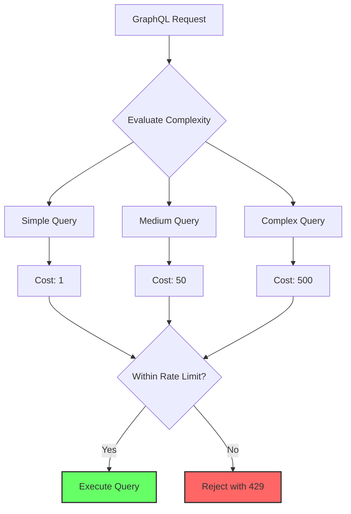
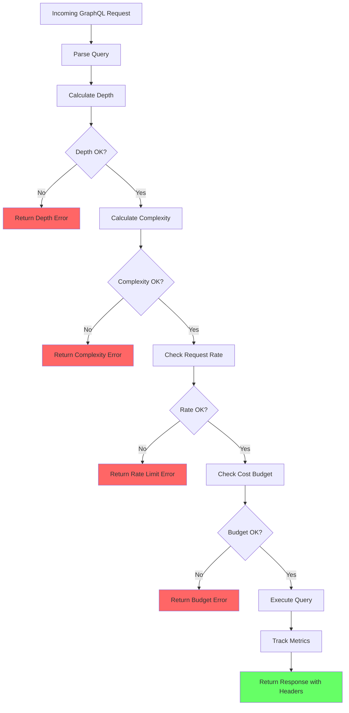

# How to Configure Rate Limiting for GraphQL

Author: [nawazdhandala](https://github.com/nawazdhandala)

Tags: GraphQL, Rate Limiting, API Security, Performance, Node.js, Apollo Server, Express

Description: Learn how to implement effective rate limiting strategies for GraphQL APIs including query complexity analysis and depth limiting.

---

Rate limiting is essential for protecting your GraphQL API from abuse, ensuring fair resource usage, and maintaining system stability. However, rate limiting GraphQL is more complex than REST APIs because a single GraphQL query can request vastly different amounts of data. In this guide, we will explore multiple rate limiting strategies specifically designed for GraphQL's unique characteristics.

## Why GraphQL Rate Limiting is Different

Unlike REST APIs where each endpoint has predictable resource usage, GraphQL allows clients to construct arbitrary queries. A simple query might request one field, while a complex query could fetch thousands of nested objects.



## Rate Limiting Strategies

### 1. Request-Based Rate Limiting

The simplest approach limits the number of requests per time window regardless of query complexity.

```javascript
// rate-limiter.js
// Basic request-based rate limiting using in-memory storage
const rateLimit = require("express-rate-limit");
const RedisStore = require("rate-limit-redis");
const Redis = require("ioredis");

// Create Redis client for distributed rate limiting
const redisClient = new Redis({
  host: process.env.REDIS_HOST || "localhost",
  port: process.env.REDIS_PORT || 6379,
  password: process.env.REDIS_PASSWORD
});

// Basic request rate limiter
const requestRateLimiter = rateLimit({
  // Use Redis for distributed environments
  store: new RedisStore({
    sendCommand: (...args) => redisClient.call(...args)
  }),

  // Configuration
  windowMs: 60 * 1000, // 1 minute window
  max: 100, // 100 requests per minute
  message: {
    errors: [
      {
        message: "Too many requests, please try again later.",
        extensions: {
          code: "RATE_LIMITED",
          retryAfter: 60
        }
      }
    ]
  },

  // Custom key generator based on user or IP
  keyGenerator: (req) => {
    // Use authenticated user ID if available
    if (req.user && req.user.id) {
      return `user:${req.user.id}`;
    }
    // Fall back to IP address
    return `ip:${req.ip}`;
  },

  // Skip rate limiting for certain requests
  skip: (req) => {
    // Allow introspection queries in development
    if (process.env.NODE_ENV === "development") {
      const query = req.body?.query || "";
      if (query.includes("__schema") || query.includes("__type")) {
        return true;
      }
    }
    return false;
  }
});

module.exports = { requestRateLimiter };
```

### 2. Query Complexity Analysis

A more sophisticated approach calculates the cost of each query based on its complexity.

```javascript
// complexity-analyzer.js
const {
  getComplexity,
  simpleEstimator,
  fieldExtensionsEstimator
} = require("graphql-query-complexity");

// Define complexity configuration
const complexityConfig = {
  // Maximum allowed complexity per query
  maximumComplexity: 1000,

  // Estimators determine the cost of each field
  estimators: [
    // Use @complexity directive values if present
    fieldExtensionsEstimator(),

    // Default estimator for fields without directives
    simpleEstimator({ defaultComplexity: 1 })
  ],

  // Callback when complexity is calculated
  onComplete: (complexity) => {
    console.log(`Query complexity: ${complexity}`);
  },

  // Custom error formatter
  createError: (max, actual) => {
    return new Error(
      `Query complexity of ${actual} exceeds maximum allowed complexity of ${max}`
    );
  }
};

// Middleware to enforce complexity limits
function complexityLimitMiddleware(schema) {
  return async (req, res, next) => {
    const query = req.body?.query;

    if (!query) {
      return next();
    }

    try {
      const complexity = getComplexity({
        schema,
        query,
        variables: req.body?.variables || {},
        estimators: complexityConfig.estimators
      });

      // Store complexity for logging/monitoring
      req.queryComplexity = complexity;

      if (complexity > complexityConfig.maximumComplexity) {
        return res.status(400).json({
          errors: [
            {
              message: `Query complexity ${complexity} exceeds maximum ${complexityConfig.maximumComplexity}`,
              extensions: {
                code: "QUERY_COMPLEXITY_EXCEEDED",
                complexity,
                maxComplexity: complexityConfig.maximumComplexity
              }
            }
          ]
        });
      }

      next();
    } catch (error) {
      // If complexity calculation fails, allow the query but log the error
      console.error("Complexity calculation error:", error);
      next();
    }
  };
}

module.exports = { complexityLimitMiddleware, complexityConfig };
```

### 3. Field-Level Cost Directives

Define complexity costs directly in your schema using directives.

```graphql
# schema.graphql
# Define the complexity directive
directive @complexity(
  value: Int!
  multipliers: [String!]
) on FIELD_DEFINITION

type Query {
  # Simple field with default cost of 1
  currentUser: User @complexity(value: 1)

  # Field with higher base cost
  searchUsers(query: String!, limit: Int = 10): [User!]!
    @complexity(value: 10, multipliers: ["limit"])

  # Expensive operation
  generateReport(startDate: String!, endDate: String!): Report
    @complexity(value: 100)
}

type User {
  id: ID!
  name: String!
  email: String!

  # Nested queries multiply complexity
  posts(first: Int = 10): [Post!]!
    @complexity(value: 5, multipliers: ["first"])

  friends(first: Int = 10): [User!]!
    @complexity(value: 10, multipliers: ["first"])
}

type Post {
  id: ID!
  title: String!
  content: String!

  # Comments can be expensive
  comments(first: Int = 20): [Comment!]!
    @complexity(value: 3, multipliers: ["first"])
}

type Comment {
  id: ID!
  text: String!
  author: User @complexity(value: 2)
}

type Report {
  id: ID!
  data: JSON!
  generatedAt: DateTime!
}
```

```javascript
// complexity-directive.js
const { mapSchema, getDirective, MapperKind } = require("@graphql-tools/utils");

// Custom estimator that reads @complexity directives
function complexityDirectiveEstimator(schema) {
  return (options) => {
    const { field, args } = options;

    // Get complexity directive from field
    const directive = getDirective(schema, field, "complexity")?.[0];

    if (!directive) {
      // Default complexity of 1
      return 1;
    }

    let complexity = directive.value;

    // Apply multipliers from arguments
    if (directive.multipliers) {
      for (const multiplierField of directive.multipliers) {
        const multiplierValue = args[multiplierField];
        if (typeof multiplierValue === "number") {
          complexity *= multiplierValue;
        }
      }
    }

    return complexity;
  };
}

module.exports = { complexityDirectiveEstimator };
```

### 4. Query Depth Limiting

Prevent deeply nested queries that could cause performance issues.

```javascript
// depth-limiter.js
const depthLimit = require("graphql-depth-limit");

// Configure maximum query depth
const MAX_DEPTH = 7;

// Create depth limit validation rule
const depthLimitRule = depthLimit(MAX_DEPTH, { ignore: [] }, (depths) => {
  // Log queries that approach the limit
  const maxDepth = Math.max(...Object.values(depths));
  if (maxDepth >= MAX_DEPTH - 2) {
    console.warn(`Query approaching depth limit: ${maxDepth}/${MAX_DEPTH}`);
  }
});

// Example of a query that would be rejected
// This query has a depth of 8, exceeding the limit
/*
query DeeplyNested {
  users {              # depth 1
    posts {            # depth 2
      comments {       # depth 3
        author {       # depth 4
          posts {      # depth 5
            comments { # depth 6
              author { # depth 7
                name   # depth 8 - REJECTED
              }
            }
          }
        }
      }
    }
  }
}
*/

module.exports = { depthLimitRule, MAX_DEPTH };
```

### 5. Cost-Based Rate Limiting

Combine complexity analysis with rate limiting for sophisticated protection.

```javascript
// cost-rate-limiter.js
const Redis = require("ioredis");

class CostBasedRateLimiter {
  constructor(options = {}) {
    this.redis = new Redis(options.redisUrl || "redis://localhost:6379");
    this.windowMs = options.windowMs || 60000; // 1 minute
    this.maxCost = options.maxCost || 10000; // Maximum cost per window
    this.keyPrefix = options.keyPrefix || "gql:cost:";
  }

  // Get the rate limit key for a user or IP
  getKey(identifier) {
    return `${this.keyPrefix}${identifier}`;
  }

  // Check if request is allowed and track cost
  async checkAndTrack(identifier, cost) {
    const key = this.getKey(identifier);
    const now = Date.now();
    const windowStart = now - this.windowMs;

    // Use Redis transaction for atomic operations
    const results = await this.redis
      .multi()
      // Remove entries outside the current window
      .zremrangebyscore(key, 0, windowStart)
      // Get current total cost in window
      .zrange(key, 0, -1, "WITHSCORES")
      // Add current request cost
      .zadd(key, now, `${now}:${cost}`)
      // Set expiry on the key
      .pexpire(key, this.windowMs)
      .exec();

    // Calculate current cost from results
    const entries = results[1][1];
    let currentCost = 0;

    for (let i = 0; i < entries.length; i += 2) {
      const entry = entries[i];
      const entryCost = parseInt(entry.split(":")[1], 10);
      currentCost += entryCost;
    }

    // Check if adding this request would exceed limit
    if (currentCost + cost > this.maxCost) {
      // Remove the entry we just added
      await this.redis.zrem(key, `${now}:${cost}`);

      return {
        allowed: false,
        currentCost,
        remainingCost: Math.max(0, this.maxCost - currentCost),
        resetAt: new Date(windowStart + this.windowMs)
      };
    }

    return {
      allowed: true,
      currentCost: currentCost + cost,
      remainingCost: this.maxCost - currentCost - cost,
      resetAt: new Date(windowStart + this.windowMs)
    };
  }

  // Get current usage without tracking
  async getCurrentUsage(identifier) {
    const key = this.getKey(identifier);
    const now = Date.now();
    const windowStart = now - this.windowMs;

    // Clean old entries and get current
    await this.redis.zremrangebyscore(key, 0, windowStart);
    const entries = await this.redis.zrange(key, 0, -1);

    let currentCost = 0;
    for (const entry of entries) {
      const entryCost = parseInt(entry.split(":")[1], 10);
      currentCost += entryCost;
    }

    return {
      currentCost,
      remainingCost: Math.max(0, this.maxCost - currentCost),
      maxCost: this.maxCost
    };
  }
}

module.exports = { CostBasedRateLimiter };
```

### 6. Apollo Server Plugin for Rate Limiting

Integrate rate limiting directly into Apollo Server.

```javascript
// apollo-rate-limit-plugin.js
const { CostBasedRateLimiter } = require("./cost-rate-limiter");
const {
  getComplexity,
  simpleEstimator,
  fieldExtensionsEstimator
} = require("graphql-query-complexity");

function createRateLimitPlugin(options = {}) {
  const rateLimiter = new CostBasedRateLimiter(options);

  return {
    async requestDidStart({ request, context }) {
      // Skip introspection queries
      if (request.operationName === "IntrospectionQuery") {
        return {};
      }

      return {
        async didResolveOperation({ request, document, schema, context }) {
          // Calculate query complexity
          const complexity = getComplexity({
            schema,
            query: document,
            variables: request.variables || {},
            estimators: [
              fieldExtensionsEstimator(),
              simpleEstimator({ defaultComplexity: 1 })
            ]
          });

          // Get identifier from context (user ID or IP)
          const identifier = context.user?.id || context.clientIp || "anonymous";

          // Check rate limit
          const result = await rateLimiter.checkAndTrack(identifier, complexity);

          // Store result in context for response headers
          context.rateLimitResult = result;
          context.queryComplexity = complexity;

          if (!result.allowed) {
            throw new Error(
              `Rate limit exceeded. Cost: ${complexity}, ` +
              `Current usage: ${result.currentCost}/${options.maxCost || 10000}. ` +
              `Retry after: ${result.resetAt.toISOString()}`
            );
          }
        },

        async willSendResponse({ response, context }) {
          // Add rate limit headers to response
          if (context.rateLimitResult) {
            const headers = response.http?.headers;
            if (headers) {
              headers.set("X-RateLimit-Limit", String(options.maxCost || 10000));
              headers.set(
                "X-RateLimit-Remaining",
                String(context.rateLimitResult.remainingCost)
              );
              headers.set(
                "X-RateLimit-Reset",
                context.rateLimitResult.resetAt.toISOString()
              );
              headers.set(
                "X-Query-Complexity",
                String(context.queryComplexity)
              );
            }
          }
        }
      };
    }
  };
}

module.exports = { createRateLimitPlugin };
```

## Complete Implementation Example

Here is a complete Apollo Server setup with all rate limiting strategies.

```javascript
// server.js
const { ApolloServer } = require("@apollo/server");
const { expressMiddleware } = require("@apollo/server/express4");
const express = require("express");
const cors = require("cors");
const { json } = require("body-parser");
const depthLimit = require("graphql-depth-limit");

const { typeDefs } = require("./schema");
const { resolvers } = require("./resolvers");
const { requestRateLimiter } = require("./rate-limiter");
const { complexityLimitMiddleware } = require("./complexity-analyzer");
const { createRateLimitPlugin } = require("./apollo-rate-limit-plugin");

async function startServer() {
  const app = express();

  // Create Apollo Server with rate limiting plugin
  const server = new ApolloServer({
    typeDefs,
    resolvers,

    // Validation rules including depth limiting
    validationRules: [
      depthLimit(7, { ignore: ["__schema", "__type"] })
    ],

    // Plugins for complexity-based rate limiting
    plugins: [
      createRateLimitPlugin({
        redisUrl: process.env.REDIS_URL,
        windowMs: 60000, // 1 minute
        maxCost: 10000   // Maximum complexity cost per window
      })
    ],

    // Format errors to include rate limit info
    formatError: (error) => {
      // Check if it is a rate limit error
      if (error.message.includes("Rate limit exceeded")) {
        return {
          message: error.message,
          extensions: {
            code: "RATE_LIMITED",
            ...error.extensions
          }
        };
      }
      return error;
    }
  });

  await server.start();

  // Apply middleware
  app.use(
    "/graphql",
    cors(),
    json(),
    // Basic request rate limiting
    requestRateLimiter,
    // Complexity limiting middleware
    complexityLimitMiddleware(server.schema),
    // Apollo Server middleware
    expressMiddleware(server, {
      context: async ({ req }) => ({
        user: req.user, // From authentication middleware
        clientIp: req.ip
      })
    })
  );

  const PORT = process.env.PORT || 4000;
  app.listen(PORT, () => {
    console.log(`Server running at http://localhost:${PORT}/graphql`);
  });
}

startServer().catch(console.error);
```

## Rate Limiting by User Tier

Implement different rate limits for different user tiers.

```javascript
// tiered-rate-limiter.js
class TieredRateLimiter {
  constructor(redis) {
    this.redis = redis;

    // Define tier limits
    this.tiers = {
      anonymous: {
        requestsPerMinute: 20,
        maxComplexity: 100,
        maxDepth: 5,
        costPerMinute: 1000
      },
      free: {
        requestsPerMinute: 100,
        maxComplexity: 500,
        maxDepth: 7,
        costPerMinute: 5000
      },
      pro: {
        requestsPerMinute: 1000,
        maxComplexity: 2000,
        maxDepth: 10,
        costPerMinute: 50000
      },
      enterprise: {
        requestsPerMinute: 10000,
        maxComplexity: 10000,
        maxDepth: 15,
        costPerMinute: 500000
      }
    };
  }

  // Get limits for a user
  getLimits(user) {
    if (!user) {
      return this.tiers.anonymous;
    }
    return this.tiers[user.tier] || this.tiers.free;
  }

  // Check all limits for a request
  async checkLimits(user, queryComplexity, queryDepth) {
    const limits = this.getLimits(user);
    const identifier = user?.id || "anonymous";
    const errors = [];

    // Check complexity limit
    if (queryComplexity > limits.maxComplexity) {
      errors.push({
        type: "COMPLEXITY_EXCEEDED",
        message: `Query complexity ${queryComplexity} exceeds your tier limit of ${limits.maxComplexity}`,
        limit: limits.maxComplexity,
        actual: queryComplexity
      });
    }

    // Check depth limit
    if (queryDepth > limits.maxDepth) {
      errors.push({
        type: "DEPTH_EXCEEDED",
        message: `Query depth ${queryDepth} exceeds your tier limit of ${limits.maxDepth}`,
        limit: limits.maxDepth,
        actual: queryDepth
      });
    }

    // Check request rate
    const requestKey = `rate:requests:${identifier}`;
    const requestCount = await this.redis.incr(requestKey);
    if (requestCount === 1) {
      await this.redis.expire(requestKey, 60);
    }
    if (requestCount > limits.requestsPerMinute) {
      errors.push({
        type: "REQUEST_RATE_EXCEEDED",
        message: `Request rate ${requestCount}/min exceeds limit of ${limits.requestsPerMinute}/min`,
        limit: limits.requestsPerMinute,
        actual: requestCount
      });
    }

    // Check cost rate
    const costKey = `rate:cost:${identifier}`;
    const currentCost = parseInt(await this.redis.get(costKey) || "0", 10);
    if (currentCost + queryComplexity > limits.costPerMinute) {
      errors.push({
        type: "COST_RATE_EXCEEDED",
        message: `Cost rate would exceed limit of ${limits.costPerMinute}/min`,
        limit: limits.costPerMinute,
        current: currentCost,
        requested: queryComplexity
      });
    } else {
      // Track cost
      await this.redis.incrby(costKey, queryComplexity);
      const ttl = await this.redis.ttl(costKey);
      if (ttl === -1) {
        await this.redis.expire(costKey, 60);
      }
    }

    return {
      allowed: errors.length === 0,
      errors,
      limits,
      usage: {
        requests: requestCount,
        cost: currentCost + queryComplexity
      }
    };
  }
}

module.exports = { TieredRateLimiter };
```

## Monitoring and Metrics

Track rate limiting metrics for analysis and alerting.

```javascript
// rate-limit-metrics.js
const promClient = require("prom-client");

// Create metrics
const rateLimitCounter = new promClient.Counter({
  name: "graphql_rate_limit_total",
  help: "Total number of rate limited requests",
  labelNames: ["tier", "limit_type"]
});

const queryComplexityHistogram = new promClient.Histogram({
  name: "graphql_query_complexity",
  help: "Distribution of query complexity values",
  labelNames: ["operation_name"],
  buckets: [1, 10, 50, 100, 500, 1000, 5000, 10000]
});

const rateLimitUsageGauge = new promClient.Gauge({
  name: "graphql_rate_limit_usage_ratio",
  help: "Current rate limit usage as a ratio of max",
  labelNames: ["identifier", "limit_type"]
});

// Metrics collection plugin
function metricsPlugin() {
  return {
    async requestDidStart() {
      return {
        async didResolveOperation({ context, operationName }) {
          // Record complexity
          if (context.queryComplexity) {
            queryComplexityHistogram
              .labels(operationName || "anonymous")
              .observe(context.queryComplexity);
          }
        },

        async willSendResponse({ context }) {
          // Record rate limit events
          if (context.rateLimitResult) {
            const result = context.rateLimitResult;
            const tier = context.user?.tier || "anonymous";

            if (!result.allowed) {
              rateLimitCounter.labels(tier, "cost").inc();
            }

            // Track usage ratio
            if (result.maxCost) {
              const usageRatio = result.currentCost / result.maxCost;
              rateLimitUsageGauge
                .labels(context.user?.id || "anonymous", "cost")
                .set(usageRatio);
            }
          }
        }
      };
    }
  };
}

module.exports = {
  metricsPlugin,
  rateLimitCounter,
  queryComplexityHistogram,
  rateLimitUsageGauge
};
```

## Rate Limiting Flow Diagram



## Best Practices

1. **Layer your protections**: Use multiple rate limiting strategies together for defense in depth.

2. **Set appropriate limits**: Start conservative and adjust based on real usage patterns.

3. **Provide clear error messages**: Help clients understand why they were rate limited and when to retry.

4. **Include rate limit headers**: Always return X-RateLimit headers so clients can track their usage.

5. **Monitor and alert**: Track rate limiting metrics and alert on unusual patterns.

6. **Document your limits**: Clearly communicate rate limits in your API documentation.

7. **Offer tier upgrades**: Provide a path for legitimate users who need higher limits.

## Conclusion

Effective rate limiting for GraphQL requires more than simple request counting. By implementing query complexity analysis, depth limiting, and cost-based rate limiting, you can protect your API while still providing a great experience for legitimate users. The key is to measure the actual cost of each query and enforce limits accordingly.

Remember to monitor your rate limiting metrics over time and adjust limits based on real usage patterns. What works at launch may need adjustment as your API grows and usage patterns evolve.
